# Step 1: Import dependencies
```python PYTHON
from cohere.compass.clients.compass import CompassClient
from cohere.compass.clients.parser import CompassParserClient
from cohere.compass.clients import ParserConfig, scan_folder
```

# Step 2: Create Clients

We are going to create two parsers: 

1. One using the default pdf parsing pipeline 
2. One enforcing high quality pipeline over all pdfs

The `ImageToMarkdown` strategy enforces all PDFs be converted into markdown whereas the default parsing pipeline, only a subset of pages within a PDF are converted into markdown
```python PYTHON
# Create Clients
api_url = "http://compass-api-stg-compass:8080"
parser_url = "http://compass-parser-stg-compass:8083"

# Your bearer token
user_token = "{Your API Token}"

co_compass = CompassClient(index_url=api_url, bearer_token=user_token)

# Here we are not setting the parser to have a default configuration - it will use a default parsing strategy for PDFs
co_fast_parser = CompassParserClient(parser_url=parser_url)

# Here we are going to instatiate a second parser where we set the parsing strategy to the high-quality pipeline
parserConfig = ParserConfig(pdf_parsing_strategy="ImageToMarkdown")
co_high_quality_parser = CompassParserClient(parser_url=parser_url, parser_config=parserConfig)
```

# Step 3: Create your Indexes:
```python PYTHON
# Create the fast pdf parsing index
fast_index = 'fast_parsed_index'

res = co_compass.create_index(index_name=fast_index)

# Create the high quality parsing index
high_quality_index = 'high_quality_pdf_index'

res=co_compass.create_index(index_name=high_quality_index)
```

# Step 4: Index your PDFs

For this example, we are going to be indexing a mixed-modality PDF. This PDF has a variety of slides where images and texts elements are interleaved together. Download the PDF attached to this guide and insert it into a local directory.

<div style="display: flex; justify-content: space-between;">
  <div style="width: 50%; text-align: center;">
    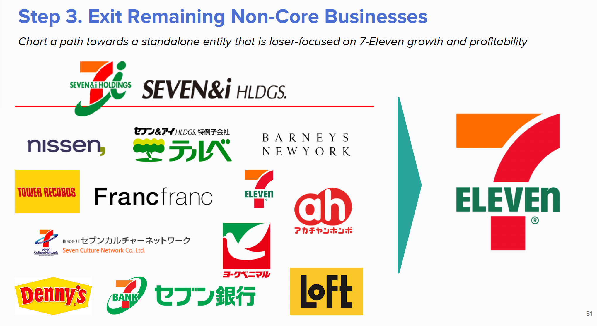
    <p>Sample PDF Page 1</p>
  </div>
  <div style="width: 50%; text-align: center;">
    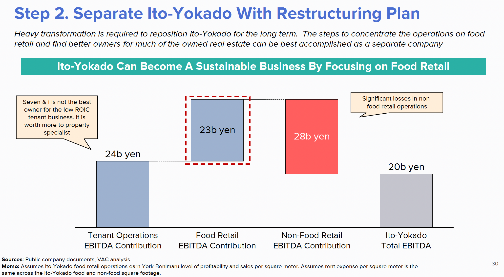
    <p>Sample PDF Page 2</p>
  </div>
</div>

As a result, the two parsing methods will showcase the trade off between using the high quality pipeline vs the fast pipeline. 
```python PYTHON
######################## Parsing using the Fast Parse Method ########################
# Index the PDF document
index_data = '{Path to the Folder holding PDF}'

# Grabbing the file paths to each file in our local folder
files = scan_folder(folder_path=index_data, recursive=True)

for file in files:
    # Each file should call the parser 
    parsed_chunks = co_fast_parser.process_file(filename=file)
    # Each file is pre-processed into Compass Chunks which are then inserted into the Index
    res = co_compass.insert_docs(
        index_name=fast_index,
        docs=parsed_chunks
    )
    
 ######################## Parsing using the High Quality Parse Method ########################
 
for file in files:
    # Each file should call the parser 
    parsed_chunks = co_high_quality_parser.process_file(filename=file)
    # Each file is pre-processed into Compass Chunks which are then inserted into the Index
    res = co_compass.insert_docs(
        index_name=high_quality_index,
        docs=parsed_chunks
    )
```

# Step 5: Search Comparison
To illustrate the trade off between parsing pipelines, we’ll use some illustrative queries

## Example One: 
```python PYTHON
query="Does 7-eleven own Dennys?"

# Search each respective index
results_fast = co_compass.search_chunks(query=query,index_name=fast_index,top_k=3)
results_high_quality = co_compass.search_chunks(query=query,index_name=high_quality_index,top_k=3)

# Visualize the outputs of each respective index
print(f"######## The Results of Default PDF Parsing ########")
for i, hit in enumerate (results_fast.hits):
    print (f"Position: {i} | File Name: {hit.origin['filename']} | Page Number: {hit.origin['page_number']}")
    print(f"Assets: {hit.assets_info[0].presigned_url}")
    
print(f"\n######## The Results of High Quality PDF Parsing ########")
for i, hit in enumerate (results_high_quality.hits):
    print (f"Position: {i} | File Name: {hit.origin['filename']} | Page Number: {hit.origin['page_number']}")
    print(f"Assets: {hit.assets_info[0].presigned_url}")
```
### Results:
#### Fast Index: 
<div style="display: flex; justify-content: space-between;">
  <div style="width: 30%; text-align: center;">
    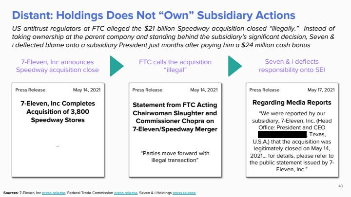
    <p>Result 1</p>
  </div>
  <div style="width: 30%; text-align: center;">
    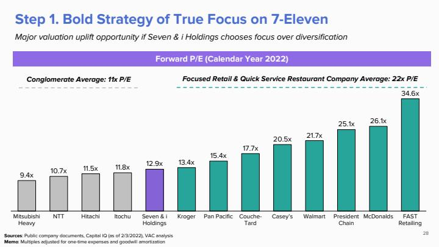
    <p>Result 2</p>
  </div>
    <div style="width: 30%; text-align: center;">
    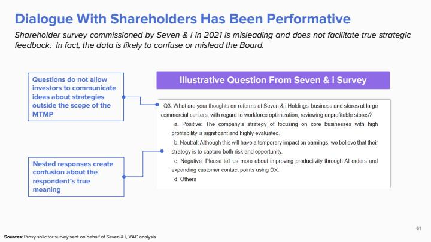
    <p>Result 3</p>
  </div>
</div>

#### High Quality Index: 
<div style="display: flex; justify-content: space-between;">
  <div style="width: 30%; text-align: center;">
    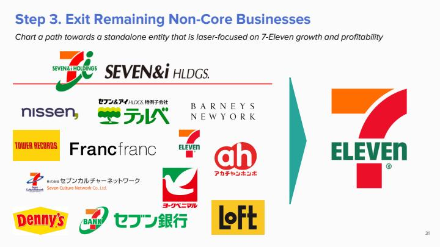
    <p>Result 1</p>
  </div>
  <div style="width: 30%; text-align: center;">
    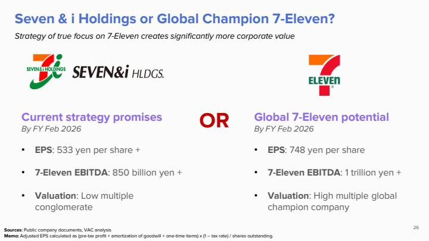
    <p>Result 2</p>
  </div>
    <div style="width: 30%; text-align: center;">
    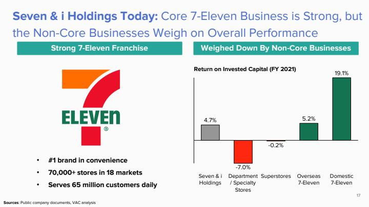
    <p>Result 3</p>
  </div>
</div>

### Commentary: 
The only time Denny’s is mentioned in the PDF is through a logo on a particular slide. In the default parsing pipeline, that level of granularity is not captured whereas when every page is converted to an intermediate representation for search, that granularity is captured

## Example Two: 
```python PYTHON
query = "Profitability to Overhead Cost Matrix"

# Search each respective index
results_fast = co_compass.search_chunks(query=query,index_name=fast_index,top_k=3)
results_high_quality = co_compass.search_chunks(query=query,index_name=high_quality_index,top_k=3)

# Visualize the outputs of each respective index
print(f"######## The Results of Default PDF Parsing ########")
for i, hit in enumerate (results_fast.hits):
    print (f"Position: {i} | File Name: {hit.origin['filename']} | Page Number: {hit.origin['page_number']}")
    print(f"Assets: {hit.assets_info[0].presigned_url}")
    
print(f"\n######## The Results of High Quality PDF Parsing ########")
for i, hit in enumerate (results_high_quality.hits):
    print (f"Position: {i} | File Name: {hit.origin['filename']} | Page Number: {hit.origin['page_number']}")
    print(f"Assets: {hit.assets_info[0].presigned_url}")
```

### Results:
#### Fast Index: 
<div style="display: flex; justify-content: space-between;">
  <div style="width: 30%; text-align: center;">
    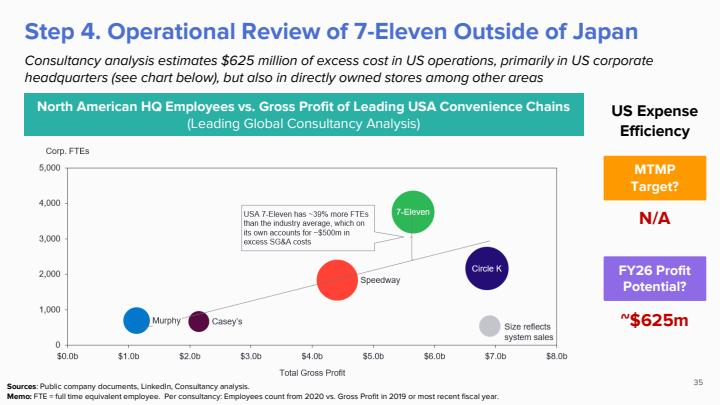
    <p>Result 1</p>
  </div>
  <div style="width: 30%; text-align: center;">
    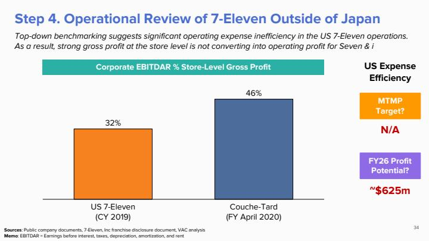
    <p>Result 2</p>
  </div>
    <div style="width: 30%; text-align: center;">
    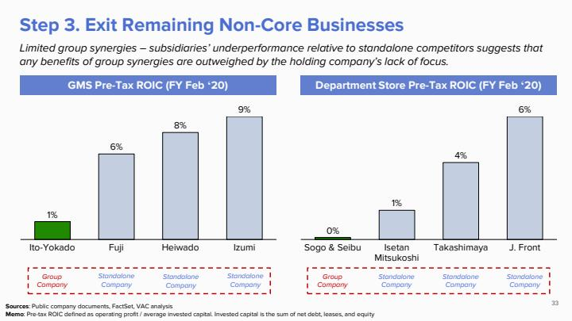
    <p>Result 3</p>
  </div>
</div>

#### High Quality Index: 
<div style="display: flex; justify-content: space-between;">
  <div style="width: 30%; text-align: center;">
    
    <p>Result 1</p>
  </div>
  <div style="width: 30%; text-align: center;">
    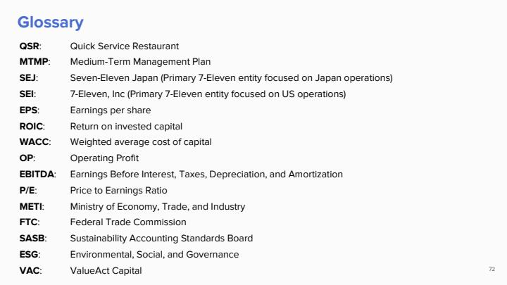
    <p>Result 2</p>
  </div>
    <div style="width: 30%; text-align: center;">
    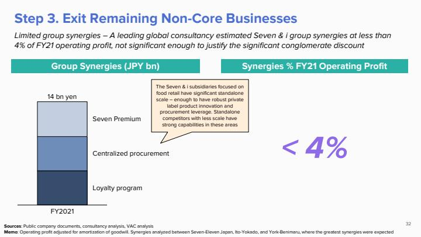
    <p>Result 3</p>
  </div>
</div>

### Commentary
The High Quality Parsing Pipeline helps capture edge cases, but the default parsing pipeline itself is quite strong. The more complex your data is, the more likely that the High Quality Parsing Pipeline will result in a richer representation. 