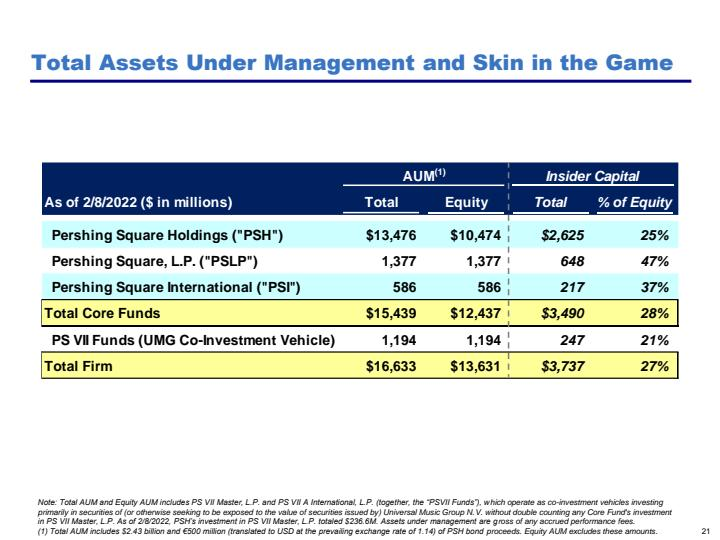

# Step 1: Import Dependencies
```python PYTHON
from cohere.compass.clients.compass import CompassClient
from cohere.compass.clients.parser import CompassParserClient
from cohere.compass.clients import ParserConfig, scan_folder
```

# Step 2: Create Clients

```python PYTHON
# Create Clients
api_url = "<Compass API URL>"
parser_url = "<Compass Parser URL>"

# Your bearer token
user_token = "{Your API Token}"

co_compass = CompassClient(index_url=api_url, bearer_token=user_token)

# Here we are going to instatiate a second parser where we set the parsing strategy to the high-quality pipeline
parserConfig=ParserConfig(pdf_parsing_strategy="ImageToMarkdown")
co_parser = CompassParserClient(parser_url=parser_url, parser_config=parserConfig)
```

# Step 3: Create your Index and Index your PDFs

```python PYTHON
# Create the index
index="mixed_modality_index"

res=co_compass.create_index(index_name=index)

index_data='{Path to the Folder holding PDF}'


for file in files:
    # Each file should call the parser 
    parsed_chunks=co_parser.process_file(filename=file)
    # Each file is pre-processed into Compass Chunks which are then inserted into the Index
    res=co_compass.insert_docs(
        index_name=index,
        docs=parsed_chunks
    )
```

Now that you’ve created your index, you should check that index exists

```python PYTHON
# Check to see if your index has been created
res = co_compass.list_indexes()

result = next((d for d in res.result['indexes'] if d['name'] == index), None)

result
```

# Step 4: Search by Documents

Document-level search is meant for more explorative level-search. Search Documents is defined as a way to aggregate document level scores for more explorative queries. For explorative queries where users may be seeking a general topic rather than a specific chunk of information, Search Documents can be exceptionally useful. The `top_k` defined here will bound the total number of chunks used for scoring. The number of `documents` returned will be equal to the number of distinct parent documents from the set of chunks ranked. 

```python PYTHON
# This is an explorative query
query="Hedge Fund Annual Performance Summaries"

# Perform a Document Level Search 
k=300
doc_level_search_res=co_compass.search_documents(query=query, top_k=k, index_name=index)

# Detailed Response
for i,hit in enumerate (doc_level_search_res.hits):
    data=json.loads(hit.content['meta'])
    print(f"Position {i} | File Name: {data[0]['filename']} | Document Score: {hit.score:.2f}")
    print(f"This document score had {len(hit.chunks)/k*100:.1f}% of the total possible chunks")
    for x in range(0, len(hit.chunks)):
        print(f"Page Number: {hit.chunks[x].origin['page_number']}| Chunk Score: {hit.chunks[x].score:.2f} | Visual Asset: {hit.chunks[x].assets_info[0].presigned_url}")
    print(f"\n")
```
For the above code, you should get a response as such: 
```
Position 0 | File Name: Pershing-Square-Multiple-General-Pershing-Square-Annual-Investor-Presentation-Feb-2022.pdf | Document Score: 0.93
This document score had 19.7% of the total possible chunks
Page Number: 8| Chunk Score: 3.00 | Visual Asset: <Some URL>
Page Number: 14| Chunk Score: 2.58 | Visual Asset: <Some URL>
.......
Page Number: 58| Chunk Score: 0.60 | Visual Asset: <Some URL>
Page Number: 60| Chunk Score: 0.59 | Visual Asset: <Some URL>


Position 1 | File Name: Pershing-Square-Annual-Update-Presentation-Feb-2020.pdf | Document Score: 0.19
This document score had 19.0% of the total possible chunks
Page Number: 14| Chunk Score: 2.63 | Visual Asset: <Some URL>
Page Number: 15| Chunk Score: 1.94 | Visual Asset: <Some URL>
Page Number: 56| Chunk Score: 1.71 | Visual Asset: <Some URL>
.......
Page Number: 9| Chunk Score: 0.62 | Visual Asset: <Some URL>
Page Number: 34| Chunk Score: 0.61 | Visual Asset: <Some URL>
Page Number: 60| Chunk Score: 0.60 | Visual Asset: <Some URL>
Page Number: 4| Chunk Score: 0.60 | Visual Asset: <Some URL>
Page Number: 38| Chunk Score: 0.60 | Visual Asset: <Some URL>
Page Number: 33| Chunk Score: 0.56 | Visual Asset: <Some URL>

.
.
.


Position 14 | File Name: ValueAct-7-Eleven-Consumer-ValueAct-7-Elevent-Presentation-Feb-2022.pdf | Document Score: 0.00
This document score had 5.0% of the total possible chunks
Page Number: 73| Chunk Score: 1.16 | Visual Asset: <Some URL>
Page Number: 74| Chunk Score: 0.99 | Visual Asset: <Some URL>
......
Page Number: 61| Chunk Score: 0.61 | Visual Asset: <Some URL>
Page Number: 19| Chunk Score: 0.60 | Visual Asset: <Some URL>
Page Number: 8| Chunk Score: 0.59 | Visual Asset: <Some URL>
Page Number: 25| Chunk Score: 0.57 | Visual Asset: <Some URL>
```
While we set `top_k=300`, the best 300 chunks in the index mapped to 15 distinct documents and as a result,  only 15 documents were returned. Every document will have a score which is bound between `[0,1]` and for each chunk respective to a document it also will have a score which is bound between `[0,4]`. The chunk scores are not meant to be interpretable across documents, rather they should be used for relative comparison for intra-document chunk comparison. 

## Document Result Deep-dive:
Looking at the first document returned: `Pershing-Square-Multiple-General-Pershing-Square-Annual-Investor-Presentation-Feb-2022.pdf`

It has a score of `0.93` which is determined through a scoring algorithm which considers all (300) chunks retrieved. From the total chunks used in ranking, 59 chunks were from this document. 

Looking at the second document returned: `Pershing-Square-Annual-Update-Presentation-Feb-2020.pdf` 

it has a score of `0.19` which is determined which is determined through a scoring algorithm which considers all (300) chunks retrieved. From the total chunks used in ranking, 57 chunks were from this document. 

As seen between the first and second document, the respective number of chunks retrieved does factor into document score but it is not the single determinant in document score.

### Document-Level Search Explained
<div style="display: flex; justify-content: space-between;">
  <div style="width: 22%; text-align: center;">
    <p style="font-size: 14px;">For the query: <code>Hedge Fund Annual Performance Summaries</code>, the "Best" document has the following chunks returned. As you can see, the <code>chunk</code> scores within each document are relative to each other.</p>
  </div>
  <div style="width: 22%; text-align: center;">
    
    <p style="font-size: 16px;"><b>Document 1, Chunk 1 - Score: 3.00</b></p>
  </div>
  <div style="width: 22%; text-align: center;">
    
    <p style="font-size: 16px;"><b>Document 1, Chunk 2 - Score: 2.58</b></p>
  </div>
    <div style="width: 22%; text-align: center;">
    
    <p style="font-size: 16px;"><b>Document 1, Chunk 3 - Score: 1.53</b></p>
  </div>
</div>

# Step 5: Search by Chunks
Chunk-level search is meant for specific targeted search. Search Chunks will only evaluate the goodness of a chunk to resolve a query rather than aggregate scores across relevant chunks of a parent document. For targeted queries or RAG, searching by chunks should be the preferred solution. The `top_k` defined here will be the total distinct ranked chunks returned to the user. 
```python PYTHON
# This is an explorative query
query="How much cheaper is tacobell to build than starbucks?"
index="mixed_modality_index"
k=10

chunk_level_search_res=co_compass.search_chunks(query=query, top_k=k, index_name=index)

for i,hit in enumerate (chunk_level_search_res.hits):
    print(f"Position {i} | File Name: {hit.origin['filename']} | Page Number: {hit.origin['page_number']} | Chunk Score: {hit.score:.2f} | Visual Asset: {hit.assets_info[0].presigned_url}")
```
### Output
```
Position 0 | File Name: Pershing-Square-Starbucks-Presentation-Oct-2018.pdf | Page Number: 8 | Chunk Score: 0.62 | Visual Asset: <Some URL>
Position 1 | File Name: Pershing-Square-Starbucks-Presentation-Oct-2018.pdf | Page Number: 9 | Chunk Score: 0.00 | Visual Asset: <Some URL>
Position 2 | File Name: Pershing-Square-Starbucks-Presentation-Oct-2018.pdf | Page Number: 6 | Chunk Score: 0.00 | Visual Asset: <Some URL>
Position 3 | File Name: Pershing-Square-Starbucks-Presentation-Oct-2018.pdf | Page Number: 32 | Chunk Score: 0.00 | Visual Asset: <Some URL>
Position 4 | File Name: Pershing-Square-Starbucks-Presentation-Oct-2018.pdf | Page Number: 27 | Chunk Score: 0.00 | Visual Asset: <Some URL>
Position 5 | File Name: Pershing-Square-Annual-Update-Presentation-Feb-2020.pdf | Page Number: 53 | Chunk Score: 0.00 | Visual Asset: <Some URL>
Position 6 | File Name: Pershing-Square-Starbucks-Presentation-Oct-2018.pdf | Page Number: 43 | Chunk Score: 0.00 | Visual Asset: <Some URL>
Position 7 | File Name: Pershing-Square-Starbucks-Presentation-Oct-2018.pdf | Page Number: 35 | Chunk Score: 0.00 | Visual Asset: <Some URL>
Position 8 | File Name: Pershing-Square-Starbucks-Presentation-Oct-2018.pdf | Page Number: 16 | Chunk Score: 0.00 | Visual Asset: <Some URL>
Position 9 | File Name: Carl-Icahn-McDonalds-Consumer-Carl-Icahn-McDonalds-Presentation-May-2022.pdf | Page Number: 27 | Chunk Score: 0.00 | Visual Asset: <Some URL>
```
## Chunk Result Deep-dive:
In comparison to search documents, where the individual document chunks scores are only comparable within the parent document, the scores returned for each chunk in `search_chunks` is comparable across all chunks returned. Essentially, the order of relevance scores of chunks returned is monotonically decreasing. 

### Document-Level Search Explained
<div style="display: flex; justify-content: space-evenly; align-items: center;">
  <div style="width: 22%; text-align: center;">
    <p style="font-size: 14px;">For the query: <code>How much cheaper is tacobell to build than starbucks?”</code>, you can see that <code>Chunk One >> Chunk Two > Chunk 10</code> in terms of semantic relevancy to the query</p>
  </div>
  <div style="width: 22%; text-align: center;">
      
      <p style="font-size: 16px;"><b>Chunk 1 - Score: 0.62</b></p>
  </div>
  <div style="width: 22%; text-align: center;">
      
      <p style="font-size: 16px;"><b>Chunk 2 - Score: 0.00</b></p>
  </div>
  <div style="width: 22%; text-align: center;">
      
      <p style="font-size: 16px;"><b>Chunk 10 - Score: 0.00</b></p>
  </div>
</div>
