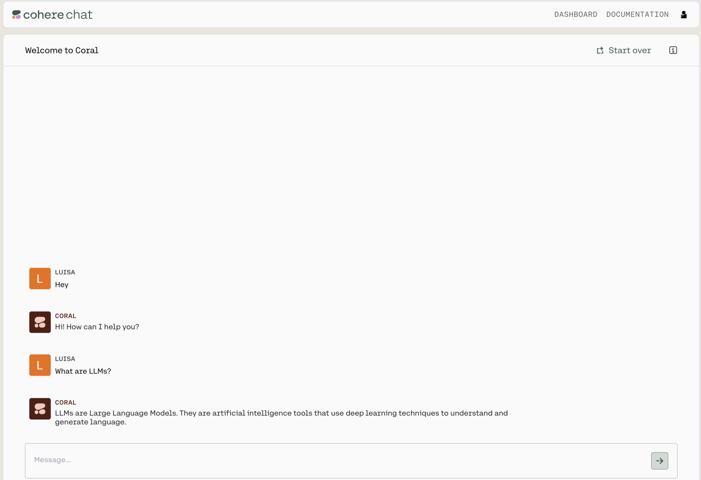

Co.chat allows users to chat with the model, without worrying about prompt engineering. This endpoint is used to create conversational experiences with AI. This guide provides a starting point for using the endpoint. 

You can use it by joining the Coral waitlist [here](https://dashboard.cohere.ai/chat).

Or, you can read below to learn how to call the chat endpoint with our API.

## Co.Chat

You can generate the next turn of a conversation using this endpoint. The new turn takes into account the previous messages and the specified parameters.

### Parameters

The endpoint has a number of settings you can use to control the kind of output it generates:

- `message`: (String, Required) The message that the user is sending to the chat endpoint.
- `model`: (String) The name of the model to generate with.
- `preamble_override`: (String) The text to replace the default preamble for each response
- `chat_history`: (Object) This JSON object contains the previous messages in a conversation, formatted as an array of objects.
- `user_name`: (String) The name of the user.
- `stream`: (Boolean) Whether to stream the response.
- `temperature`: (Number) The degree of randomness of the response.
- `max_tokens`: (Integer) The maximum amount of tokens to generate. This parameter is optional, and not specified by default.
- `return_preamble`: (Boolean) Whether to return the preamble.
- `return_prompt`: (Boolean) Whether to return the prompt.

For more details refer to the API Reference.

## Example Requests

Starting a conversation
