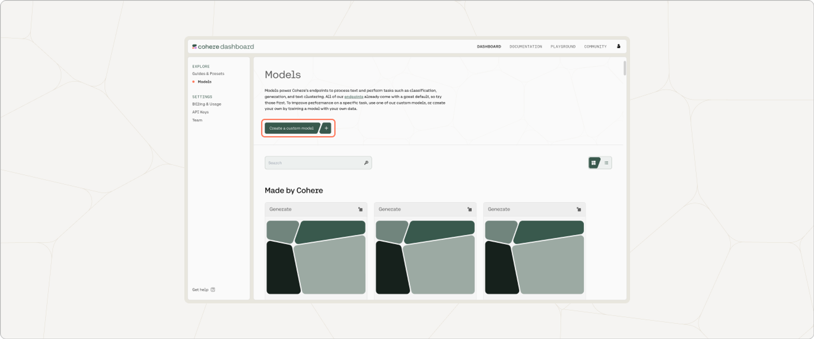
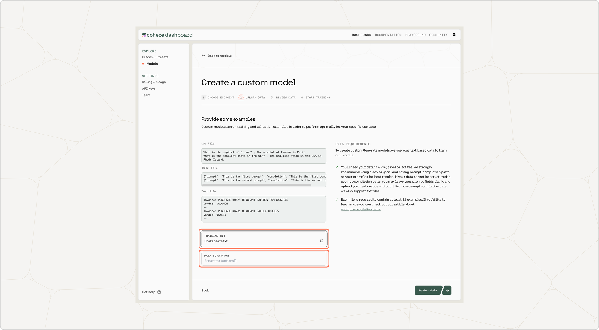
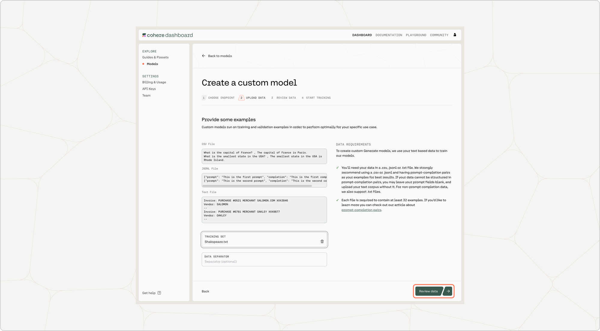
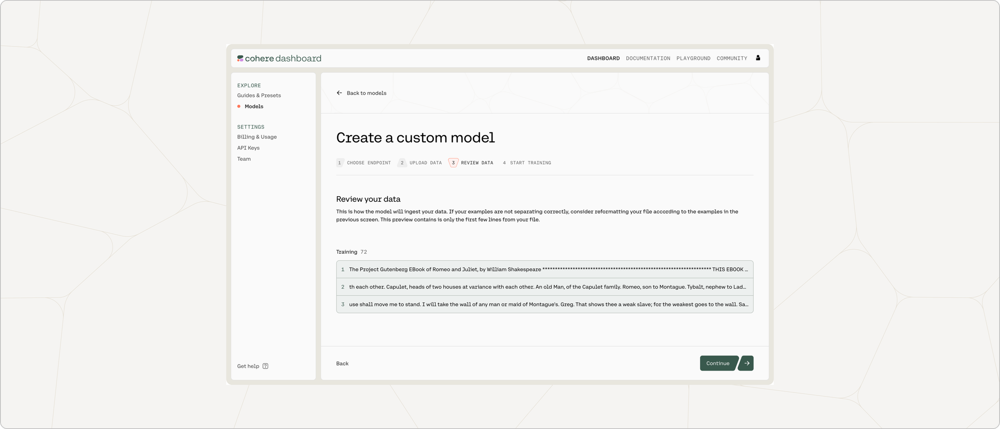
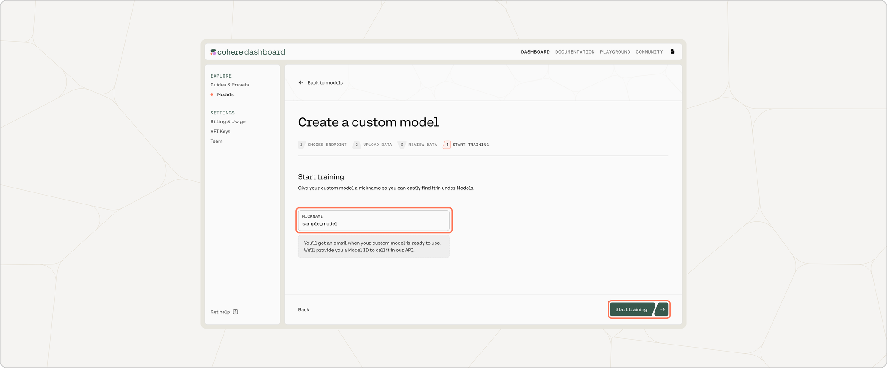
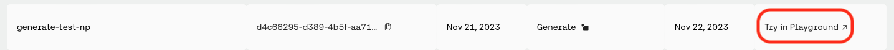
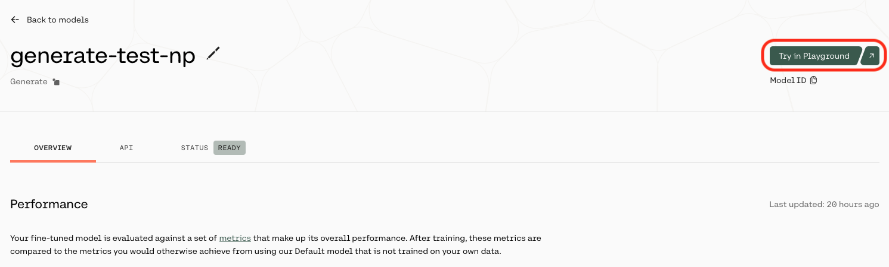

Creating a fine-tuned generative model via the Dashboard consists of a few simple steps, which we'll walk through now.

### Choose the Generate Option

On the Cohere dashboard, go to the Fine-tuning page and click on "Create a generate model".




### Upload Your Data

Your data should be in a `.csv` or `.jsonl` file with prompt completion examples, and you can upload it by going to 'Training data' and clicking on the upload file button. 

For context, here's an example of a prompt completion datapoint:

```
What is the biggest mountain in the solar system?, Olympus Mons
```




You also have the option of uploading a validation dataset. This will not be used during training, but will be used for evaluating the model’s performance post-training. To upload a validation set, go to 'Upload validation set (optional)' and repeat the same steps you just went through with the training dataset. If you don’t upload a validation dataset, the platform will automatically set aside part of the training dataset to use for validation.

At this point in time, if there are labels in the training set with less than five unique examples, those labels will be removed.




Once done, click on ‘Review data’.

### Preview Data

The preview window will show a few samples of your custom training dataset, and your validation dataset (if you uploaded it).

Toggle between the 'Training' and 'Validation' tabs to see a sample of your respective datasets.

If you are happy with how the samples look, click on ‘Continue’ at the bottom of the page.




### Start Training

One you give your model a nickname, everything will be set for fine-tuning to begin! Just press 'Start training'.




We can’t wait to see what you start building! Share your projects or find support on our [Discord](https://discord.com/invite/co-mmunity).

### Calling the Fine-tuned Model

Once your model completes training, you can call it by selecting 'Try in Playground' from the [model list view](https://dashboard.cohere.com/fine-tuning?tab=models):




or by selecting 'Try in Playground' from the model overview page:


