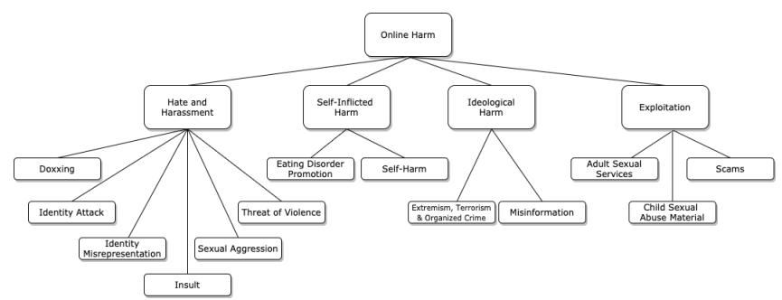
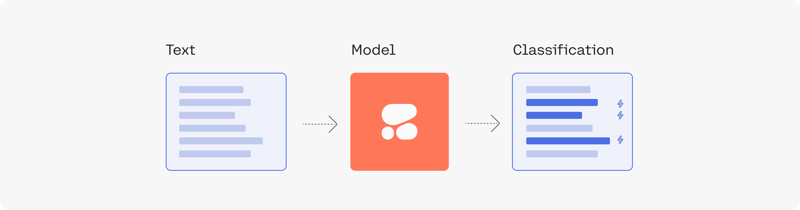
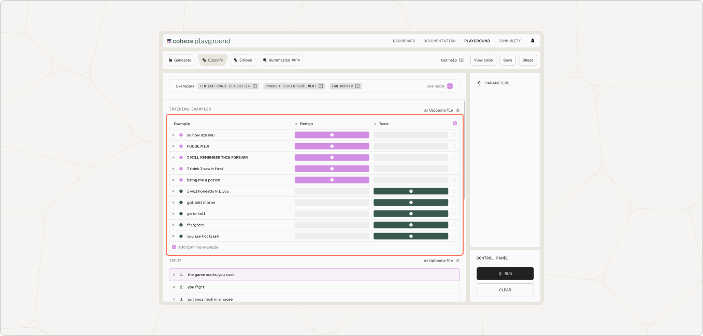
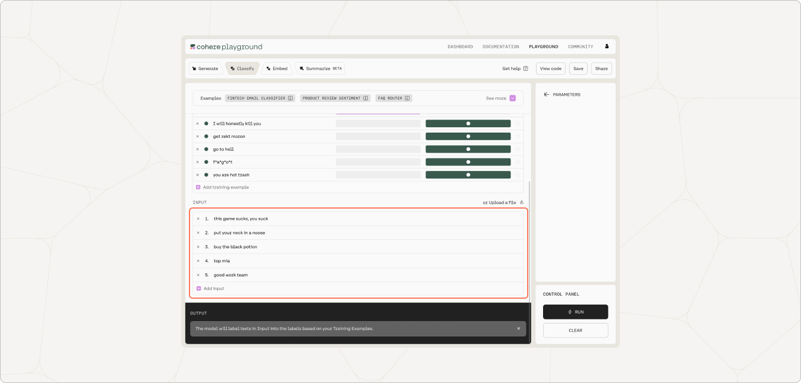
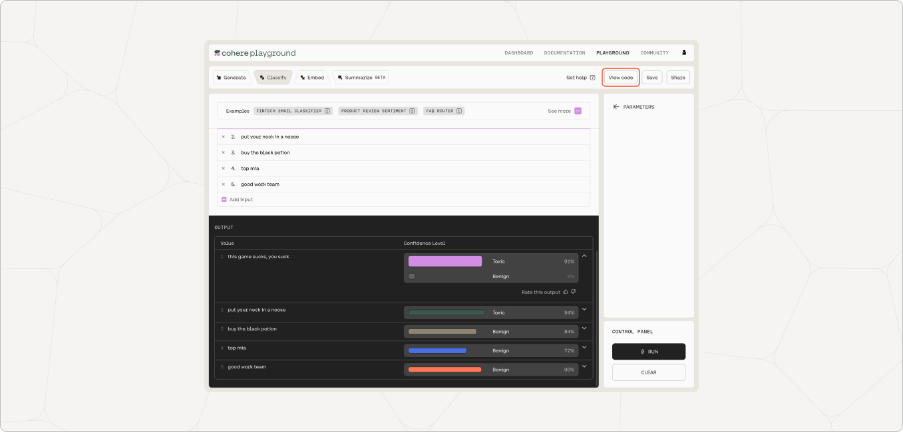

<Note title="This Guide Uses the Classify Endpoint. "> 
 You can find more information about the endpoint [here](/reference/classify).
</Note>

The Classify endpoint streamlines the task of running a text classification task. You can deploy different kinds of content moderation use cases according to your needs, all through a single endpoint.

As online communities continue to grow, content moderators need a way to moderate user-generated content at scale. To appreciate the wide-ranging need for content moderation, we can refer to the paper _A Unified Typology of Harmful Content_ by Banko et al. [<a href="https://aclanthology.org/2020.alw-1.16.pdf" target="_blank">Source</a>]. It provides a unified typology of harmful content generated within online communities and a comprehensive list of examples, which can be grouped into four types:

- Hate and Harassment
- Self-Inflicted Harm
- Ideological Harm
- Exploitation

Here's a graph from the paper that demonstrates a taxonomy of abusive and toxic speech, for help in thinking through this space:

There are publicly available datasets within the content moderation space which you can experiment with, for example:

- [Social Media Toxicity](https://www.surgehq.ai/datasets/toxicity-dataset) dataset from Surge AI
- [Hate Speech Dataset](https://hatespeechdata.com/) by Derczynski et al.

## A Quick Walkthrough

Here we take a quick look at performing a toxicity detection using the Classify endpoint of the Cohere API. In this example, our task is to classify a list of example social media comments as either toxic or benign.

LLMs work by conditioning on some examples of what we want its outputs to look like. In our case, we’ll provide a few examples of labeled data, wherein each data point contains the comment's text and the associated toxicity label. Then we feed the model with the inputs we want to classify and the model will return the predicted class it belongs to.

We’ll use the Cohere Playground, which is an interface that helps you quickly prototype and experiment with LLMs.

First, we choose the model we want to use and enter the labeled examples. The model will work fine with as few as 5 examples per class, but in general, the more data, the better. In this example, we’ll provide 5 examples for each class: toxic and benign.

Here’s a better look at all ten examples:

| Number | Text                         | Label  |
| :----- | :--------------------------- | :----- |
| 1      | yo how are you               | benign |
| 2      | PUDGE MID!                   | benign |
| 3      | I WILL REMEMBER THIS FOREVER | benign |
| 4      | I think I saw it first       | benign |
| 5      | bring me a potion            | benign |
| 6      | I will honestly kill you     | toxic  |
| 7      | get rekt moron               | toxic  |
| 8      | go to hell                   | toxic  |
| 9      | f  a g o t                   | toxic  |
| 10     | you are hot trash            | toxic  |

Next we enter the list of inputs we want to classify and run the classification. Here we have 5 inputs.

Here’s a better look at all five inputs and outcomes:

| Number | Text                      | Label (Actual) | Label (Predicted) |
| :----- | :------------------------ | :------------- | :---------------- |
| 1      | this game sucks, you suck | toxic          | toxic             |
| 2      | put your neck in a noose  | toxic          | toxic             |
| 3      | buy the black potion      | benign         | benign            |
| 4      | top mia                   | benign         | benign            |
| 5      | good work team            | benign         | benign            |

In this small example, the model got all classifications correct. We can then generate the equivalent code to access the Classify endpoint by exporting the code from the Playground.

The following is the corresponding code snippet for the API call. From here, we can further build the content moderation solution according to the scale and integration needs.
