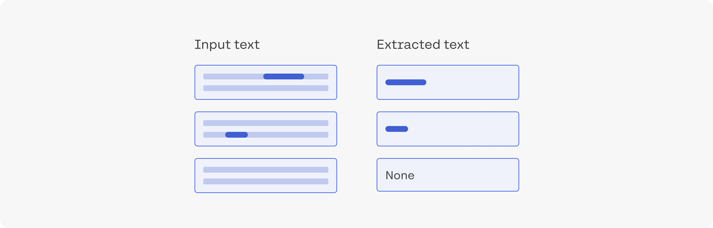
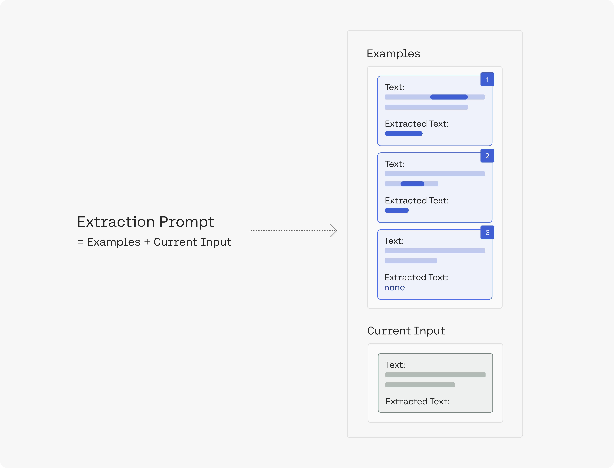

<Note title="This Guide Uses the Generate API.">  
 You can find more information about the API endpoint [here](/reference/generate).
</Note>

Extracting a piece of information from text is a common need in language processing systems. LLMs can at times extract entities which are harder to extract using other NLP methods (and where pre-training provides the model with some context on these entities). This is an overview of using generative LLMs to extract entities.

## Extracting movie names from text

This example uses Cohere's generative models to extract the name of a film from the title of an article. We'll use post titles from the r/Movies subreddit. For each title, we'll extract which movie the post is about. If the model is unable to detect the name of a movie being mentioned, it will return "none".

The full code example is in the <a href="https://github.com/cohere-ai/notebooks/blob/main/notebooks/Entity_Extrcation_with_Generative_Language_Models.ipynb" target="_blank">notebook</a> and .

## Preparing examples for the prompt

In our prompt, we'll present the model with examples for the type of output we're after. We basically get a set of subreddit article titles, and label them ourselves. The label here is the name of the movie mentioned in the title (and "none" if no movie is mentioned).

## Creating the extraction prompt

We'll create a prompt that demonstrates the task to the model. The prompt contains the examples above, and then presents the input text and asks the model to extract the movie name.

So let's get a few example titles from the movies subreddit, label them, and make an extraction prompt out of them:

      Deadpool 2 | Official HD Deadpool's "Wet on Wet" Teaser | 2018          extract the movie title from the post: Deadpool 2      ---            Jordan Peele Just Became the First Black Writer-Director With a $100M Movie Debut             extract the movie title from the post: none      ---      Joker Officially Rated “R”          extract the movie title from the post: Joker      ---            Ryan Reynolds’ 'Free Guy' Receives July 3, 2020 Release Date - About a bank teller stuck in his routine that      discovers he’s an NPC character in brutal open world game.             extract the movie title from the post: Free Guy      ---      James Cameron congratulates Kevin Feige and Marvel!          extract the movie title from the post: none      ---      The Cast of Guardians of the Galaxy release statement on James Gunn          extract the movie title from the post: Guardians of the Galaxy      ---      INSERT INPUT TEXT HERE         extract the movie title from the post:  

Let's point out a few ideas in this prompt:

- The prompt is made up of six examples that demonstrate the task to the model before it encounters the input text we want to extract from.
- Each example demonstrates the task by showing an example input text and an example output text. Between the two is a task description explaining in what needs to be done (e.g. "extract the movie title from the post:").
- The notebook provides a class that constructs the prompt and makes the string manipulation easier.
- See [prompt engineering](/docs/prompt-engineering) for more details on creating prompts.

## Getting the data

Let's get the top ten posts in r/movies of 2021. We can preview the top three:

- Hayao Miyazaki Got So Bored with Retirement He Started Directing Again ‘in Order to Live’,
- First poster for Pixar's Luca,
- New images from Space Jam: A New Legacy'

We can then proceed with the extraction. We basically plug each post title into the input text part of the prompt, and retrieve the output of the model.

These are the model's results:

<table border="1" className="dataframe" style={{ fontSize: '14px' }}>  <thead>    <tr style={{ textAlign: 'right' }}>      <th></th>      <th>text</th>      <th>extracted_text</th>    </tr>  </thead>  <tbody>    <tr>      <th>0</th>      <td>Hayao Miyazaki Got So Bored with Retirement He Started Directing Again ‘in Order to Live’</td>      <td>none</td>    </tr>    <tr>      <th>1</th>      <td>First poster for Pixar's Luca</td>      <td>Pixar's Luca</td>    </tr>    <tr>      <th>2</th>      <td>New images from Space Jam: A New Legacy</td>      <td>Space Jam: A New Legacy</td>    </tr>    <tr>      <th>3</th>      <td>Official Poster for "Sonic the Hedgehog 2"</td>      <td>Sonic the Hedgehog 2</td>    </tr>    <tr>      <th>4</th>      <td>        Ng Man Tat, legendary HK actor and frequent collborator of Stephen Chow (Shaolin Soccer, God of Gambler) died at        70      </td>      <td>none</td>    </tr>    <tr>      <th>5</th>      <td>Zack Snyder’s Justice League has officially been Rated R for for violence and some language</td>      <td>Justice League</td>    </tr>    <tr>      <th>6</th>      <td>HBOMax and Disney+ NEED to improve their apps if they want to compete with Netflix.</td>      <td>none</td>    </tr>    <tr>      <th>7</th>      <td>        I want a sequel to Rat Race where John Cleese’s character dies and invites everyone from the first film to his        funeral, BUT, he’s secretly set up a Rat Maze to trap them all in. A sort of post-mortem revenge on them for        donating all his wealth to charity.      </td>      <td>Rat Race</td>    </tr>    <tr>      <th>8</th>      <td>'Trainspotting' at 25: How an Indie Film About Heroin Became a Feel-Good Classic</td>      <td>Trainspotting</td>    </tr>    <tr>      <th>9</th>      <td>        ‘Avatar: The Last Airbender’ Franchise To Expand With Launch Of Nickelodeon’s Avatar Studios, Animated        Theatrical Film To Start Production Later This Year      </td>      <td>Avatar: The Last Airbender</td>    </tr>  </tbody></table>

The model got 9/10 correctly. It didn't pick up on Shaolin Soccer and God of Gambler in example #4. It also called the second example "Pixar's Luca" instead of "Luca".

## Summary

Find the full code in the <a href="https://github.com/cohere-ai/notebooks/blob/main/notebooks/Entity_Extrcation_with_Generative_Language_Models.ipynb" target="_blank">notebook</a>/. It proceeds to evaluate performance on a small test set.

This type of extraction is interesting because it doesn't just blindly look at the text. The model has picked up on movie information during its pretraining process and that helps it understand the task from only a few examples.

You can think about extending this to other subreddits, to extract other kinds of entities and information. Join our[ Discord Community](https://discord.com/invite/co-mmunity) to share ideas and ask questions about NLP and ML and let us know what you are experimenting with and what kind of results you see! 

Happy building!
