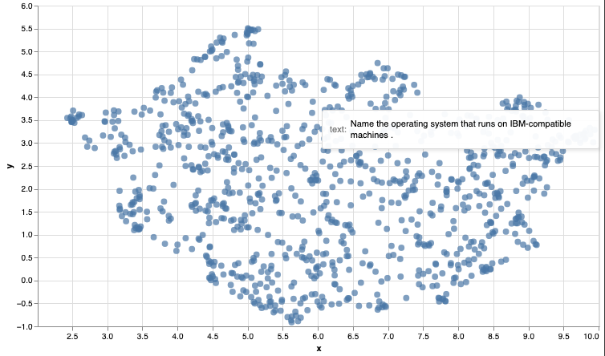

<Note title="This Guide Uses the Embed Endpoint.">  
 You can find more information about the endpoint <a target="_blank" href="/reference/embed">here</a>.
</Note>

Language models give computers the ability to search by meaning and go beyond searching by matching keywords. This capability is called semantic search.


In this article, we'll build a simple semantic search engine. The applications of semantic search go beyond building a web search engine. They can empower a private search engine for internal documents or records. It can be used to power features like StackOverflow's "similar questions" feature.

You can find the code in the <a target="_blank" href="https://github.com/cohere-ai/cohere-developer-experience/blob/main/notebooks/Basic_Semantic_Search.ipynb">notebook</a> and <a target="_blank" href="https://colab.research.google.com/github/cohere-ai/cohere-developer-experience/blob/main/notebooks/Basic_Semantic_Search.ipynb">colab</a>.

### Contents

- Getting set up
- Get the archive of questions
- <a target="_blank" href="/reference/embed">Embed</a> the archive
- Search using an index and nearest neighbour search
- Visualize the archive based on the embeddings.

<Note title="New to Cohere? "> 
 Get Started now and get unprecedented access to world-class Generation and  
 Representation models with billions of parameters.
</Note>

### 1. Download the Dependencies

```python PYTHON
# Install Cohere for embeddings, Umap to reduce embeddings to 2 dimensions,
# Altair for visualization, Annoy for approximate nearest neighbor search
!pip install cohere umap-learn altair annoy datasets tqdm
```

And if you're running an older version of the SDK, you might need to upgrade it like so:

```
pip install --upgrade cohere
```

If you're running this in a jupyter notebook, you'll need to prepend a `!` to the `pip install` statement:

```
!pip install cohere umap-learn altair annoy datasets tqdm scikit-learn
```

```
!pip install --upgrade cohere
```

Get your Cohere API key by [signing up here](https://dashboard.cohere.ai/register). Paste it in `api_key` below.

#### 1a. Import the Necessary Dependencies to Run this Example

```python PYTHON
# title Import libraries (Run this cell to execute required code) {display-mode: "form"}

import cohere
import numpy as np
import re
import pandas as pd
from tqdm import tqdm
from datasets import load_dataset
import umap
import altair as alt
from sklearn.metrics.pairwise import cosine_similarity
from annoy import AnnoyIndex
import warnings

warnings.filterwarnings("ignore")
pd.set_option("display.max_colwidth", None)
```

### 2. Get the Archive of Questions

We'll use the <a target="_blank" href="https://www.tensorflow.org/datasets/catalog/trec">trec</a> dataset which is made up of questions and their categories.

```python PYTHON
# Get dataset
dataset = load_dataset("trec", split="train")

# Import into a pandas dataframe, take only the first 1000 rows
df = pd.DataFrame(dataset)[:1000]

# Preview the data to ensure it has loaded correctly
print(df.head(10))
```

|    | label-coarse | label-fine | text                                                                 |
| :- | :----------- | :--------- | :------------------------------------------------------------------- |
| 0  | 0            | 0          | How did serfdom develop in and then leave Russia ?                   |
| 1  | 1            | 1          | What films featured the character Popeye Doyle ?                     |
| 2  | 2            | 2          | How can I find a list of celebrities ' real names ?                  |
| 3  | 3            | 3          | What fowl grabs the spotlight after the Chinese Year of the Monkey ? |
| 4  | 4            | 4          | What is the full form of .com ?                                      |
| 5  | 5            | 5          | What contemptible scoundrel stole the cork from my lunch ?           |
| 6  | 6            | 6          | What team did baseball 's St. Louis Browns become ?                  |
| 7  | 7            | 7          | What is the oldest profession ?                                      |
| 8  | 8            | 8          | What are liver enzymes ?                                             |
| 9  | 9            | 9          | Name the scar-faced bounty hunter of The Old West .                  |

### 3. Embed the Archive


Let's now embed the text of the questions.

To get a thousand embeddings of this length should take a few seconds.

```python PYTHON
# We'll set up the name of the model we want to use, the API key, and the input type.
# Create and retrieve a Cohere API key from dashboard.cohere.ai/welcome/register
# Paste your API key here. Remember to not share publicly
model_name = "embed-english-v3.0"
api_key = ""
input_type_embed = "search_document"

# Now we'll set up the cohere client.
co = cohere.Client(api_key)

# Get the embeddings
embeds = co.embed(
    texts=list(df["text"]),
    model=model_name,
    input_type=input_type_embed,
).embeddings
```

### 4. Build the Index, search Using an Index and Conduct Nearest Neighbour Search


Let's build an index using the library called annoy. Annoy is a library created by Spotify to do <a target="_blank" href="https://en.wikipedia.org/wiki/nearest_neighbor_search">nearest neighbour search</a>. Nearest neighbour search is an optimization problem that involves finding the point in a given set that is closest (or most similar) to a given point.

```python PYTHON
# Create the search index, pass the size of embedding
search_index = AnnoyIndex(np.array(embeds).shape[1], "angular")

# Add all the vectors to the search index
for i in range(len(embeds)):
    search_index.add_item(i, embeds[i])
search_index.build(10)  # 10 trees
search_index.save("test.ann")
```

After building the index, we can use it to retrieve the nearest neighbours either of existing questions (section 3.1), or of new questions that we embed (section 3.2).

#### 4a. Find the Neighbours of an Example from the Dataset

If we're only interested in measuring the similarities between the questions in the dataset (no outside queries), a simple way is to calculate the similarities between every pair of embeddings we have.

```python PYTHON
# Choose an example (we'll retrieve others similar to it)
example_id = 92

# Retrieve nearest neighbors
similar_item_ids = search_index.get_nns_by_item(
    example_id, 10, include_distances=True
)

# Format and print the text and distances
results = pd.DataFrame(
    data={
        "texts": df.iloc[similar_item_ids[0]]["text"],
        "distance": similar_item_ids[1],
    }
).drop(example_id)

# NOTE: Your results might look slightly different to ours.
print(f"Question:'{df.iloc[example_id]['text']}'\nNearest neighbors:")
print(results)
```

```
# Output:
Question:"What are bear and bull markets ?"
Nearest neighbors:
```

|     | texts                                          | distance |
| :-- | :--------------------------------------------- | :------- |
| 614 | What animals do you find in the stock market ? | 0.896121 |
| 137 | What are equity securities ?                   | 0.970260 |
| 601 | What is \`\` the bear of beers '' ?            | 0.978348 |
| 307 | What does NASDAQ stand for ?                   | 0.997819 |
| 683 | What is the rarest coin ?                      | 1.027727 |
| 112 | What are the world 's four oceans ?            | 1.049661 |
| 864 | When did the Dow first reach ?                 | 1.050362 |
| 547 | Where can stocks be traded on-line ?           | 1.053685 |
| 871 | What are the Benelux countries ?               | 1.054899 |

#### 4b. Find the Neighbours of a User Query

We're not limited to searching using existing items. If we get a query, we can embed it and find its nearest neighbours from the dataset.

```python PYTHON
query = "What is the tallest mountain in the world?"
input_type_query = "search_query"

# Get the query's embedding
query_embed = co.embed(
    texts=[query], model=model_name, input_type=input_type_query
).embeddings

# Retrieve the nearest neighbors
similar_item_ids = search_index.get_nns_by_vector(
    query_embed[0], 10, include_distances=True
)
# Format the results
query_results = pd.DataFrame(
    data={
        "texts": df.iloc[similar_item_ids[0]]["text"],
        "distance": similar_item_ids[1],
    }
)


# NOTE: Your results might look slightly different to ours.
print(f"Query:'{query}'\nNearest neighbors:")
print(query_results)
```

|     | texts                                                                        | distance |
| :-- | :--------------------------------------------------------------------------- | :------- |
| 236 | What is the name of the tallest mountain in the world ?                      | 0.431913 |
| 670 | What is the highest mountain in the world ?                                  | 0.436290 |
| 907 | What mountain range is traversed by the highest railroad in the world ?      | 0.715265 |
| 435 | What is the highest peak in Africa ?                                         | 0.717943 |
| 354 | What ocean is the largest in the world ?                                     | 0.762917 |
| 412 | What was the highest mountain on earth before Mount Everest was discovered ? | 0.767649 |
| 109 | Where is the highest point in Japan ?                                        | 0.784319 |
| 114 | What is the largest snake in the world ?                                     | 0.789743 |
| 656 | What 's the tallest building in New York City ?                              | 0.793982 |
| 901 | What 's the longest river in the world ?                                     | 0.794352 |

### 5. Visualize the Archive

Use the code below to create a visualization of the embedded archive. As written, this code will only run in a jupyter notebook.

```python PYTHON
# @title Plot the archive {display-mode: "form"}

# UMAP reduces the dimensions from 1024 to 2 dimensions that we can plot
reducer = umap.UMAP(n_neighbors=20)
umap_embeds = reducer.fit_transform(embeds)

# Prepare the data to plot and interactive visualization
# using Altair
df_explore = pd.DataFrame(data={"text": df["text"]})
df_explore["x"] = umap_embeds[:, 0]
df_explore["y"] = umap_embeds[:, 1]

# Plot
chart = (
    alt.Chart(df_explore)
    .mark_circle(size=60)
    .encode(
        x=alt.X("x", scale=alt.Scale(zero=False)),  #'x',
        y=alt.Y("y", scale=alt.Scale(zero=False)),
        tooltip=["text"],
    )
    .properties(width=700, height=400)
)
chart.interactive()
```




This concludes this introductory guide to semantic search using sentence embeddings. As you continue the path of building a search product additional considerations arise, such as dealing with long texts, or training to better improve the embeddings for a specific use case.

We can’t wait to see what you start building! Share your projects or find support on our <a target="_blank" href="https://discord.com/invite/co-mmunity">community discord</a>.
