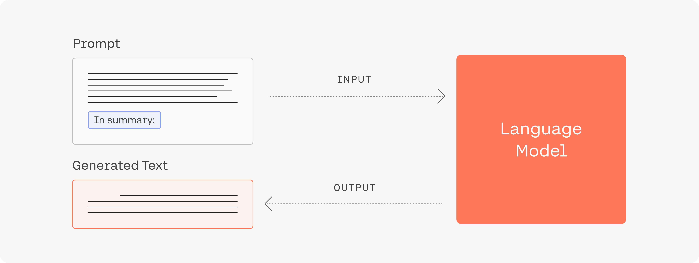
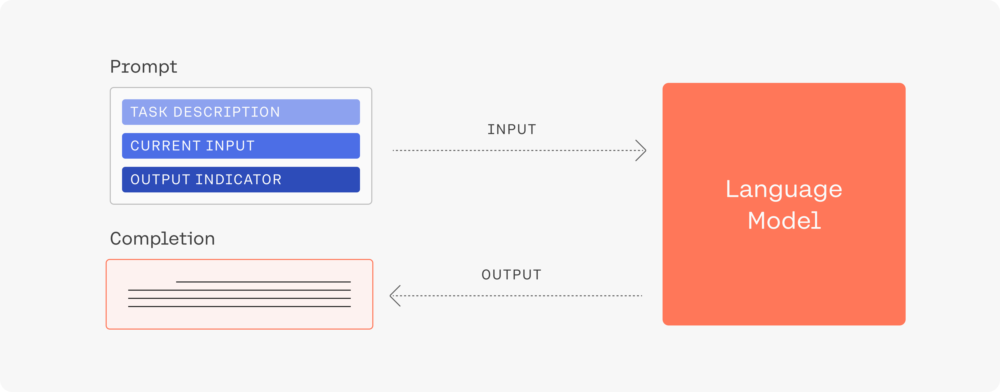
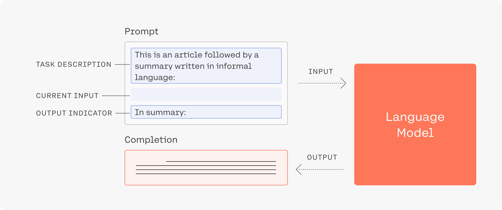
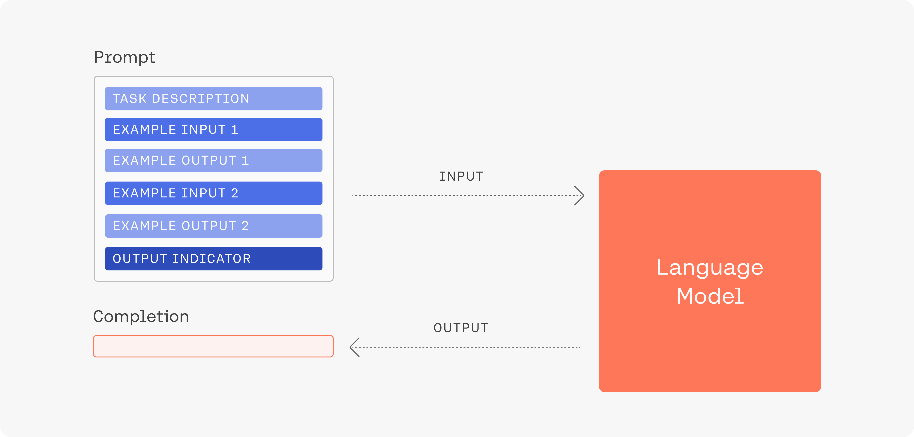
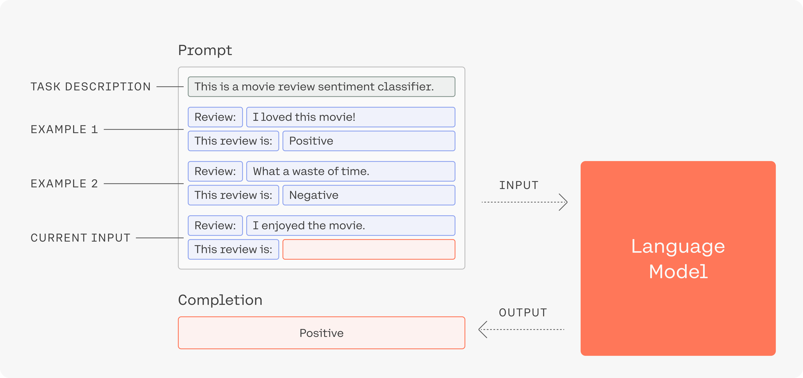

Here, we discuss a few principles and techniques for writing prompts (inputs for our models) that will help you get the best generations for your task. Choosing the right temperature can also have a big influence on generation quality. We discuss temperature separately [here](temperature).


## Main Principles

We find that there are two main ideas to keep in mind while designing prompts for our models.

### 1. A prompt guides the model to generate useful output

If you need a summary of an article, for example, a large language model trained on enough data can generate a summary if you guide it like this:



### 2. Try multiple formulations of your prompt to get the best generations

When using generate, it is useful to try a range of different prompts for the problem you are trying to solve. Different formulations of the same prompt which might sound similar to humans can lead to generations that are quite different from each other. This might happen, for instance, because our models have learned that the different formulations are actually used in very different contexts and for different purposes. Below we give a number of examples that we've found to work particularly well for different tasks.

In the summarization example, if including the phrase “In summary” doesn’t lead to a good generation, we may want to try alternatives like “To summarize in plain language,“ or “The main point to take from this article is that”.

Additionally, you can also use the likelihood feature in the playground to see if there are particular words, phrases, or structures that the model has trouble understanding. However, keep in mind that the average likelihood of tokens will always be high at the beginning of the sequence. The model might assign low likelihood to the first time you introduce a novel concept or name, but after it has seen a new term it can readily use it in the generation. You can also use the likelihood capability to see if there is any spelling or punctuation that is creating issues for tokenization.

### 3. Describe the task and the general setting



Provide the model with enough context. For example, we can describe the summarization task in more detail before we include the article we want the model to summarize.



Let's consider a few more aspects of this by looking at a different example. Suppose that you would like to use our models to assist your customer satisfaction department by automatically generating plausible responses to customer requests (note: the generations are not to be sent to the customers, this is only a simulation).

A customer contacts your company with the following question:

```
Hi, I'd like a refund for the coffee maker I ordered. Would that be possible?
```

How do we design a prompt around this to get useful generations for the agent interacting with the customer? Let's begin with telling our model what the general setting is and what the remainder of the prompt is going to contain:

```
This is a conversation between a customer and a polite, helpful customer service agent.
Question of the customer: Hi, I'd like a refund for the coffee maker I ordered. Would that be possible?
```

Great, we've told our model what to expect and have made it clear that our query is a customer question. Next, let's show the model the beginning of the response we would like to give the customer.

```
Response by the customer service agent: Hello, thank you for reaching out to us. Yes,
```

Note how we've stated clearly that the next sentence is a response to the question, that it comes from a customer service agent, and that we want to give a positive answer. Putting this all together, we obtain the following prompt:

```
This is a conversation between a customer and a polite, helpful customer service agent.
Question of the customer: Hi, I'd like a refund for the coffee maker I ordered. Would that be possible?
Response by the customer service agent: Hello, thank you for reaching out to us. Yes,
```


Feeding this into our Medium model multiple times yields the following completions:

- Yes, we are able to accept returns if the product is unused and unopened.
- Yes, we are happy to refund your purchase. However, we do require you to return the item to our store for a full refund.
- Yes, we can do that. Please send us a message with your name, phone number, and the reason for the refund. We will get back to you as soon as possible.

Note that even though this is a simplified example we get plausible completions from the baseline model using only a small number of customer service interactions! This could be further improved by finetuning it on examples of how you would like the model to handle specific questions and requests.

### 4. Show the model what you would like to see


Give a few examples of the types of generations you want. This is called few-shot learning. Let's look at an example. Say you'd like to use our models to classify whether a movie review is positive, negative or neutral. Imagine that you feed the following prompt into our model:

```
Review: "I really enjoyed this movie!"
This sentiment of this review is
```

An actual generation based on this prompt by our Medium model reads:

```
This sentiment of this review is apt, considering the movie's plot,
```

Clearly, this is not what we're looking for.



If we put this all together into a new prompt, the Medium Generation model reliably generates `positive`.

```
This is a movie review sentiment classifier.
Review: "I loved this movie!"
This review is positive.
Review: "I don't know, it was ok I guess.."
This review is neutral.
Review: "What a waste of time, would not recommend this movie."
This review is negative.
Review: "I really enjoyed this movie!"
This review is
```

A simpler version of this prompt can be visualized like this:



Few-shot generations will generally work better with our larger models. You can use the likelihood endpoint to see how uncertain the model is about the correct answers given in the examples.

If this command format does not work, try a more prose-based structure. An intuitive way to interact with the generate models is to give it commands related to the type of generation that you want, e.g. `Give a list of artistic professions:`. However, since much of the text that our models have seen is internet articles, sometimes this way of writing will be misunderstood. Rephrasing the command into prose produces the desired output:

```
The table lists the following professions as artistic careers:
1. Painter
2.
```

In general, you may want to experiment with different styles of writing until you get something that works. Examples include writing in the style of a news article, a blog post, or a dialogue.

## Examples

Here we showcase how we can apply the principles above by looking at two specific tasks: generating keywords based on a given passage and generating additional examples given a few existing examples.

**Keyword generation**: Let's imagine that we have text passages that we'd like to automatically tag with the most relevant concepts appearing in the text.

By combining a number of the techniques discussed above, we can `generate` just that! First, we state what the setting for this prompt is at the beginning. Then we show the model two examples of what we want it to do: label a passage from [John von Neumann](https://en.wikipedia.org/wiki/John_von_Neumann)'s Wikipedia page with the label "John von Neumann", and label a paragraph from the Wikipedia page on [Feminism](https://en.wikipedia.org/wiki/Feminism) with the label "Feminism". Lastly, we give the model a passage from the Wikipedia page on [Python](<https://en.wikipedia.org/wiki/Python_(programming_language)>).

```
This is a bot that automatically finds the most important keyword for a given text passage.

Text: "John von Neumann (/vɒn ˈnɔɪmən/; Hungarian: Neumann János Lajos, pronounced [ˈnɒjmɒn ˈjaːnoʃ ˈlɒjoʃ]; December 28, 1903 – February 8, 1957) was a Hungarian-American mathematician, physicist, computer scientist, engineer and polymath. Von Neumann was generally regarded as the foremost mathematician of his time[2] and said to be "the last representative of the great mathematicians".[3] He integrated pure and applied sciences."

Most important key word: "John von Neumann"

Text: "Some scholars consider feminist campaigns to be a main force behind major historical societal changes for women's rights, particularly in the West, where they are near-universally credited with achieving women's suffrage, gender-neutral language, reproductive rights for women (including access to contraceptives and abortion), and the right to enter into contracts and own property.[9] Although feminist advocacy is, and has been, mainly focused on women's rights, some feminists argue for the inclusion of men's liberation within its aims, because they believe that men are also harmed by traditional gender roles.[10] Feminist theory, which emerged from feminist movements, aims to understand the nature of gender inequality by examining women's social roles and lived experience; feminist theorists have developed theories in a variety of disciplines in order to respond to issues concerning gender."

Most important key word:  "Feminism"

Text: "Guido van Rossum began working on Python in the late 1980s, as a successor to the ABC programming language, and first released it in 1991 as Python 0.9.0.[31] Python 2.0 was released in 2000 and introduced new features, such as list comprehensions and a garbage collection system using reference counting and was discontinued with version 2.7.18 in 2020.[32] Python 3.0 was released in 2008 and was a major revision of the language that is not completely backward-compatible and much Python 2 code does not run unmodified on Python 3."

Most important key word:
```

This prompt reliably generates "Python" as an answer – while sometimes also returning "Guido van Rossum", another plausible option.

**Example generation.** A common task is to try to get the model to generate examples according to some description. Formulating the prompt as a list in the following style tends to work well.

```
This is a list of ideas for blog posts for tourists visiting Toronto:

1. The best sights to see in Toronto
2. My favourite walks in Toronto
```

This then gives us generations such as:

```
3. An overview of Toronto
4. Toronto events
5. Restaurants in Toronto
6. Shopping in Toronto
7. Travel tips for Toronto
8. Sightseeing in Toronto
9. What to do in Toronto
```
