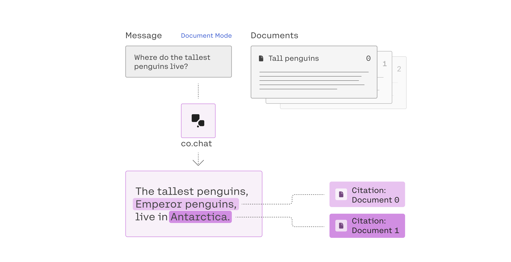
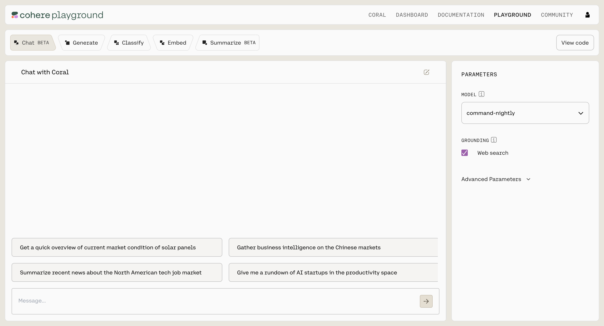
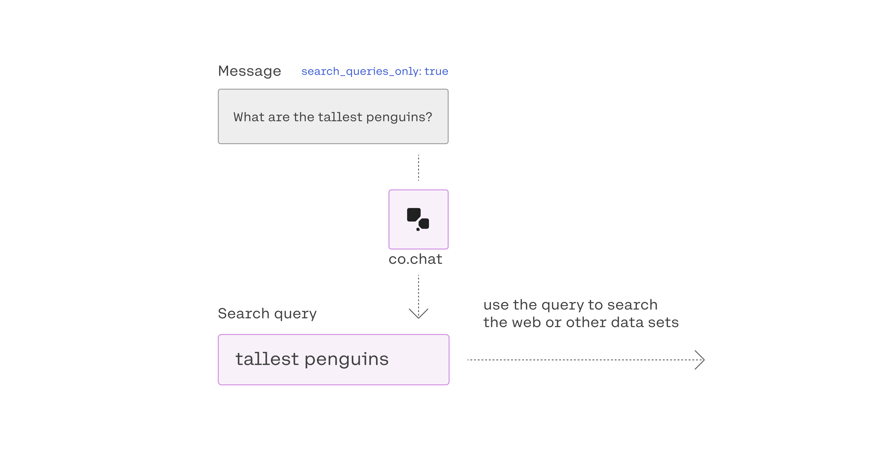
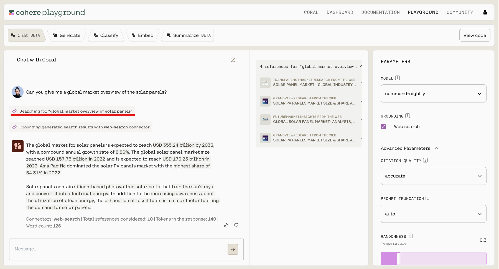

The [Chat API](/reference/chat) in combination with the [Command model](/docs/models#command) make it easy to generate text that is grounded on factual information. For example, the code snippet below will result in a generation that cites the provided documents:

