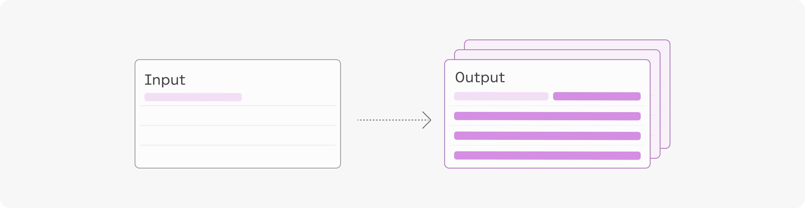

When you call the Generate endpoint, you have the option to generate multiple generations in a single call. This is done by setting the `num_generations` [parameter](/reference/generate-1).

The model’s outputs will vary depending on the generation settings you have specified, such as `temperature`, `top-k`, and `top-p`.

Each generation comes with its set of log [likelihood](/docs/likelihood) values, which consists of:

- The log likelihood of each generated token.
- The average log likelihood of all generated tokens. 

NOTE: log likelihoods are not returned by default because the `return_likelihoods` argument defaults to `“NONE”`. You can change this to get back the model's log likelihood values.

### Example

This example uses the input: “_This curved gaming monitor delivers ..._”

The output generated with a maximum token set of 4 and sorted by average token log likelihood are:

| Likelihood | Text                            |
| ---------- | ------------------------------- |
| -0.96      | a truly immersive experience    |
| -1.11      | a virtually seamless view       |
| -1.70      | the ultimate viewing experience |
| -2.15      | a 144Hz rapid                   |
| -2.44      | a comfortable and stylish       |

You can use these outputs in a number of ways, by selecting the one with the highest log likelihood as the final output, for example, or by presenting them as options in your application.
