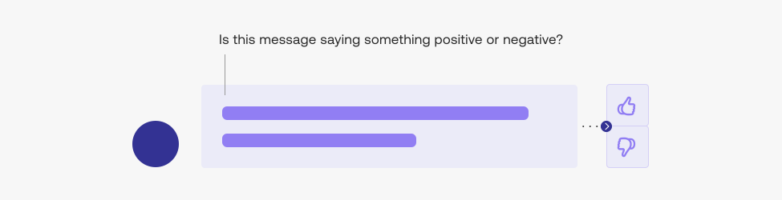
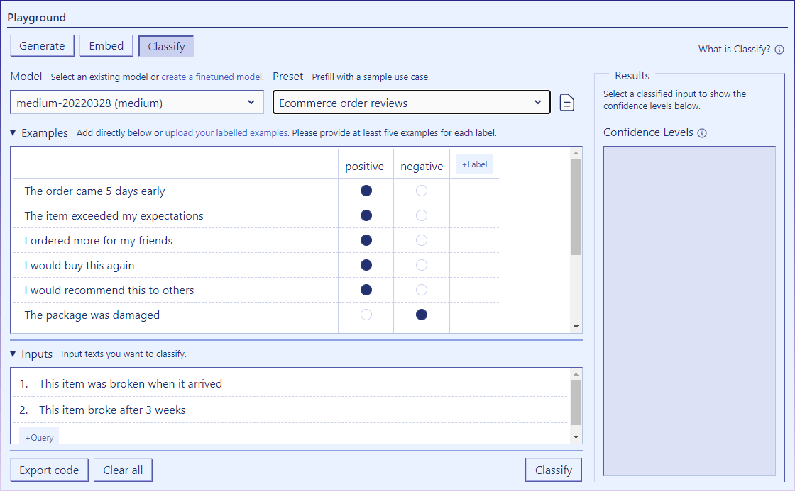

Human collaboration runs on language. The firehose of documents, emails, and messages is how people and businesses operate both internally and externally. Recent advancements in language AI allow software systems to understand language better than ever before. Text classification is a cornerstone of language understanding which enables software systems to support human efforts in use cases including:

- Content moderation (e.g. toxicity and abusive language filters)
- Customer support (e.g. chatbots, email routing by topic)
- Machine understanding of news and social media
- Analysis of financial filings and reports

The Cohere platform aims to help you build classifiers for these and other use cases. You can [start trying Cohere for free when you sign up](https://dashboard.cohere.ai/) and automatically receive $75 in free credits.

## Training classifiers with Cohere’s language models

### Training your first classifier with Co.Classify

If you know what classifier you'd like to build, meet Cohere’s Classify endpoint. You are one API call away from classifying text:

If this is your first classifier, then chances are you don’t have a large dataset to train it on. This is where Classify leverages a key capability of large language models. By drawing on the vast amounts of data these massive models are trained on, they are able to create capable classifiers for many use cases using only a few examples.

This [guide will walk you through the process of building your classifier](content-moderation-with-classify) in the Cohere Playground.

### Train a world-class classifier with finetuning

If you have over 250 training examples, then you are in luck. Cohere will enable you to train a world-class classifier for your dataset. The process of finetuning creates a custom version of Cohere’s massive models and trains it specifically for your dataset. Finetuning leads to the best performing classifiers on a wide variety of language processing tasks.

Follow [this guide to finetune your classifier](training-a-representation-model) and create your own custom language model.
