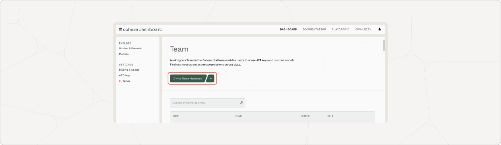
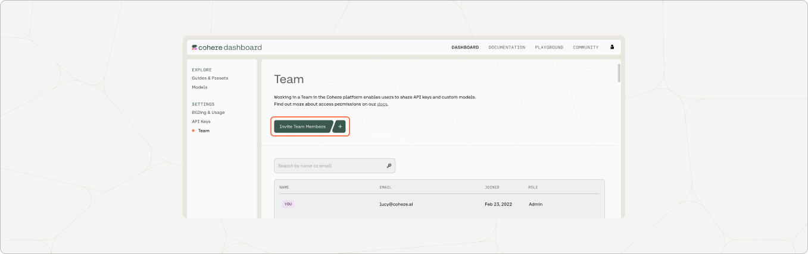

Working in Teams in the Cohere platform enables users to share API keys and custom models. Access to the platform is managed via two role types, **Owner** and **User**. Below, we outline the process for inviting others to your Team and discuss the difference in access permissions between the two roles. 

## Inviting others to your Team

If you sign up with Cohere without being invited to a Team, you automatically become the “Owner” of a Team. To invite others to your team, navigate to the Cohere Dashboard, then click on the “Team” page in the sidebar. 

### If your teammates do not have existing Cohere accounts

Clicking “+ Invite Teammates” will open a modal where you can send email invites and specify the role that best suits your teammates. 

### If your teammates have existing Cohere accounts

Users that already have a Cohere account and are not part of your team cannot be invited to join via the dashboard, but we can migrate them over. 

Please reach out to us at [support@cohere.com](mailto:support@cohere.com), letting us know the email address associated with your teammate's account and the email address associated with your Cohere account. We can help from there.

## Role Types

### User

Users have permissions to: 

- View all other Team members
- Create and delete custom models
- View, create, copy, and rename Trial API keys
- Make Production API keys (NOTE: Production API keys can only be created after an owner has completed the "Go to Production" form)
- View Production API keys (NOTE: you can *always* see which keys exist, but production keys are only viewable in their entirety when they’re created)
- View Usage history

### Owner

In addition to the above, Owners have permissions to:

- Invite, remove, and change role type of other Team members
- Generate, rename, and delete production API keys
- Complete the “Go to Production” form for your team to receive a production API key. After your team has been approved, you (or users on your team) can create any number of production keys
- View and download invoices
- View and update payment information
