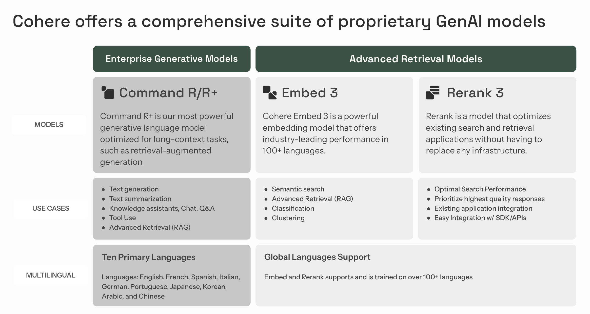
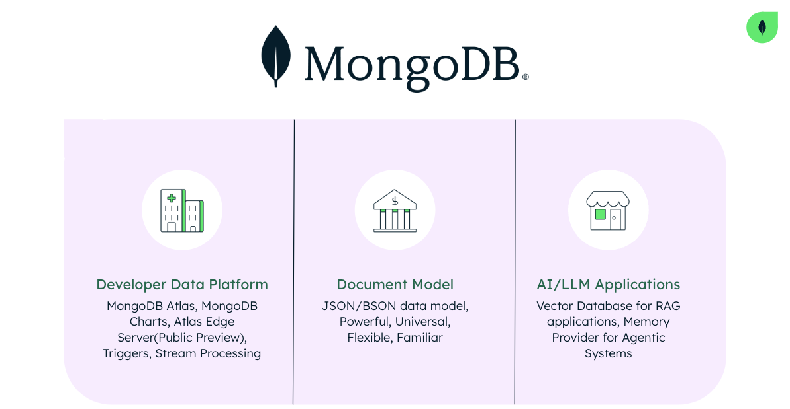
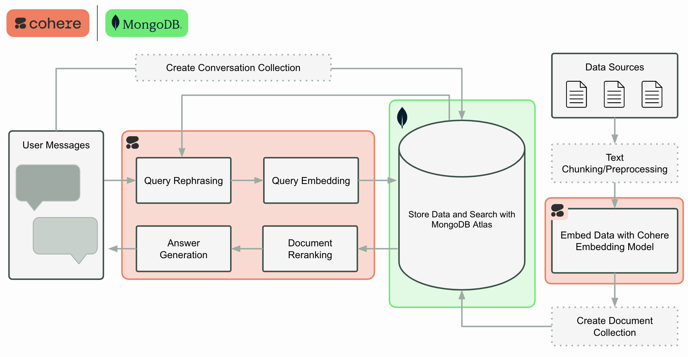
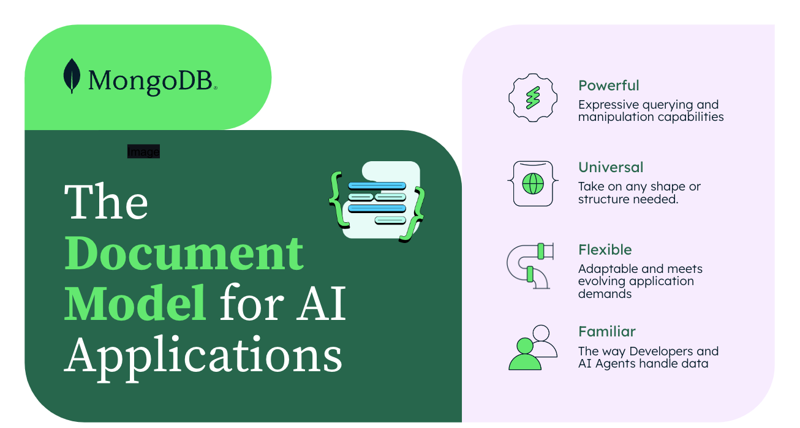
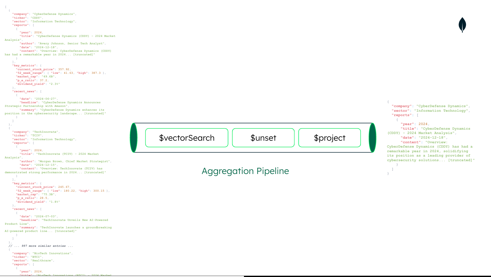
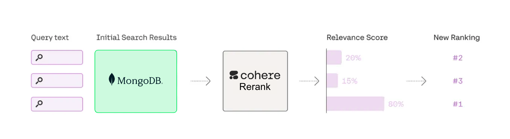

import { AuthorsContainer } from "../../components/authors-container";
import { CookbookHeader } from "../../components/cookbook-header";

<CookbookHeader href="https://github.com/cohere-ai/notebooks/blob/main/notebooks/guides/rag_chatbot_with_cohere_and_mongodb.ipynb" />

 **What you will learn:**
 * How to empower leverage semantic search on customer or operational data in MongoDB Atlas.
 * Pass retrieved data to Cohere’s Command R+ generative model for retrieval-augmented generation (RAG).
 * Develop and deploy a RAG-optimized user interface for your app.
 * Create a conversation data store for your RAG chatbot using MongoDB

**Use Case**: Develop an advanced chatbot assistant that provides asset managers with information and actionable insights on technology company market reports.


## Introduction

- What is Cohere?
- What is MongoDB?
- How Cohere and MongoDB work together?

### What is Cohere?




### What is MongoDB?



### What exactly are we showing today?



## Step 1: Install libaries and Set Environment Variables

Critical Security Reminder: Safeguard your production environment by never committing sensitive information, such as environment variable values, to public repositories. This practice is essential for maintaining the security and integrity of your systems.

Libraries:
* `cohere`: A Python library for accessing Cohere's large language models, enabling natural language processing tasks like text generation, classification, and embedding.
* `pymongo`: The recommended Python driver for MongoDB, allowing Python applications to interact with MongoDB databases for data storage and retrieval.
* `datasets`: A library by Hugging Face that provides easy access to a wide range of datasets for machine learning and natural language processing tasks.
*`tqdm`: A fast, extensible progress bar library for Python, useful for displaying progress in long-running operations or loops.


```sh
pip install --quiet datasets tqdm cohere pymongo
```


```python
import os
import cohere

os.environ["COHERE_API_KEY"] = ""
co = cohere.Client(os.environ.get("COHERE_API_KEY"))

os.environ["HF_TOKEN"] = ""
```

## Step 2: Data Loading and Preparation
**Dataset Information**

This dataset contains detailed information about multiple technology companies in the Information Technology sector. For each company, the dataset includes:

1. Company name and stock ticker symbol
2. Market analysis reports for recent years (typically 2023 and 2024), which include:
  - Title and author of the report
  - Date of publication
  - Detailed content covering financial performance, product innovations, market position, challenges, and future outlook
  - Stock recommendations and price targets

3. Key financial metrics such as:
  - Current stock price
  - 52-week price range
  - Market capitalization
  - Price-to-earnings (P/E) ratio
  - Dividend yield


4. Recent news items, typically including:
  - Date of the news
  - Headline
  - Brief summary

The market analysis reports provide in-depth information about each company's performance, innovations, challenges, and future prospects. They offer insights into the companies' strategies, market positions, and potential for growth.


```python
import pandas as pd
from datasets import load_dataset

# Make sure you have an Hugging Face token(HF_TOKEN) in your development environemnt before running the code below
# How to get a token: https://huggingface.co/docs/hub/en/security-tokens
# https://huggingface.co/datasets/MongoDB/fake_tech_companies_market_reports
dataset = load_dataset(
    "MongoDB/fake_tech_companies_market_reports",
    split="train",
    streaming=True,
)
dataset_df = dataset.take(100)

# Convert the dataset to a pandas dataframe
dataset_df = pd.DataFrame(dataset_df)
dataset_df.head(5)
```

<div>
  <table border="1" class="dataframe fern-table">
    <thead>
      <tr style={{ textAlign: "right" }}>
      <th></th>
      <th>recent_news</th>
      <th>reports</th>
      <th>company</th>
      <th>ticker</th>
      <th>key_metrics</th>
      <th>sector</th>
    </tr>
  </thead>
  <tbody>
    <tr>
      <th>0</th>
      <td>[\{'date': '2024-06-09', 'headline': 'CyberDefe...</td>
      <td>[\{'author': 'Taylor Smith, Technology Sector L...</td>
      <td>CyberDefense Dynamics</td>
      <td>CDDY</td>
      <td>\{'52_week_range': \{'high': 387.3, 'low': 41.63...</td>
      <td>Information Technology</td>
    </tr>
    <tr>
      <th>1</th>
      <td>[\{'date': '2024-07-04', 'headline': 'CloudComp...</td>
      <td>[\{'author': 'Casey Jones, Chief Market Strateg...</td>
      <td>CloudCompute Pro</td>
      <td>CCPR</td>
      <td>\{'52_week_range': \{'high': 524.23, 'low': 171....</td>
      <td>Information Technology</td>
    </tr>
    <tr>
      <th>2</th>
      <td>[\{'date': '2024-06-27', 'headline': 'VirtualRe...</td>
      <td>[\{'author': 'Sam Brown, Head of Equity Researc...</td>
      <td>VirtualReality Systems</td>
      <td>VRSY</td>
      <td>\{'52_week_range': \{'high': 530.59, 'low': 56.4...</td>
      <td>Information Technology</td>
    </tr>
    <tr>
      <th>3</th>
      <td>[\{'date': '2024-07-06', 'headline': 'BioTech I...</td>
      <td>[\{'author': 'Riley Smith, Senior Tech Analyst...</td>
      <td>BioTech Innovations</td>
      <td>BTCI</td>
      <td>\{'52_week_range': \{'high': 366.55, 'low': 124...</td>
      <td>Information Technology</td>
    </tr>
    <tr>
      <th>4</th>
      <td>[\{'date': '2024-06-26', 'headline': 'QuantumCo...</td>
      <td>[\{'author': 'Riley Garcia, Senior Tech Analyst...</td>
      <td>QuantumComputing Inc</td>
      <td>QCMP</td>
      <td>\{'52_week_range': \{'high': 231.91, 'low': 159...</td>
      <td>Information Technology</td>
    </tr>
  </tbody>
</table>
</div>

```python
# Data Preparation
def combine_attributes(row):
    combined = f"{row['company']} {row['sector']} "

    # Add reports information
    for report in row["reports"]:
        combined += f"{report['year']} {report['title']} {report['author']} {report['content']} "

    # Add recent news information
    for news in row["recent_news"]:
        combined += f"{news['headline']} {news['summary']} "

    return combined.strip()
```


```python
# Add the new column 'combined_attributes'
dataset_df["combined_attributes"] = dataset_df.apply(
    combine_attributes, axis=1
)
```


```python
# Display the first few rows of the updated dataframe
dataset_df[["company", "ticker", "combined_attributes"]].head()
```

<div>
  <table border="1" class="dataframe fern-table">
    <thead>
      <tr style={{ textAlign: "right" }}>
      <th></th>
      <th>company</th>
      <th>ticker</th>
      <th>combined_attributes</th>
    </tr>
  </thead>
  <tbody>
    <tr>
      <th>0</th>
      <td>CyberDefense Dynamics</td>
      <td>CDDY</td>
      <td>CyberDefense Dynamics Information Technology 2...</td>
    </tr>
    <tr>
      <th>1</th>
      <td>CloudCompute Pro</td>
      <td>CCPR</td>
      <td>CloudCompute Pro Information Technology 2023 C...</td>
    </tr>
    <tr>
      <th>2</th>
      <td>VirtualReality Systems</td>
      <td>VRSY</td>
      <td>VirtualReality Systems Information Technology ...</td>
    </tr>
    <tr>
      <th>3</th>
      <td>BioTech Innovations</td>
      <td>BTCI</td>
      <td>BioTech Innovations Information Technology 202...</td>
    </tr>
    <tr>
      <th>4</th>
      <td>QuantumComputing Inc</td>
      <td>QCMP</td>
      <td>QuantumComputing Inc Information Technology 20...</td>
    </tr>
  </tbody>
</table>
</div>
## Step 3: Embedding Generation with Cohere


```python
from tqdm import tqdm


def get_embedding(
    text: str, input_type: str = "search_document"
) -> list[float]:
    if not text.strip():
        print("Attempted to get embedding for empty text.")
        return []

    model = "embed-english-v3.0"
    response = co.embed(
        texts=[text],
        model=model,
        input_type=input_type,  # Used for embeddings of search queries run against a vector DB to find relevant documents
        embedding_types=["float"],
    )

    return response.embeddings.float[0]


# Apply the embedding function with a progress bar
tqdm.pandas(desc="Generating embeddings")
dataset_df["embedding"] = dataset_df[
    "combined_attributes"
].progress_apply(get_embedding)

print(f"We just computed {len(dataset_df['embedding'])} embeddings.")
```
    We just computed 63 embeddings.


  


```python
dataset_df.head()
```

<div>
  <table border="1" class="dataframe fern-table">
    <thead>
      <tr style={{ textAlign: "right" }}>
      <th></th>
      <th>recent_news</th>
      <th>reports</th>
      <th>company</th>
      <th>ticker</th>
      <th>key_metrics</th>
      <th>sector</th>
      <th>combined_attributes</th>
      <th>embedding</th>
    </tr>
  </thead>
  <tbody>
    <tr>
      <th>0</th>
      <td>[\{'date': '2024-06-09', 'headline': 'CyberDefe...</td>
      <td>[\{'author': 'Taylor Smith, Technology Sector L...</td>
      <td>CyberDefense Dynamics</td>
      <td>CDDY</td>
      <td>\{'52_week_range': \{'high': 387.3, 'low': 41.63...</td>
      <td>Information Technology</td>
      <td>CyberDefense Dynamics Information Technology 2...</td>
      <td>[0.01210022, -0.03466797, -0.017562866, -0.025...</td>
    </tr>
    <tr>
      <th>1</th>
      <td>[\{'date': '2024-07-04', 'headline': 'CloudComp...</td>
      <td>[\{'author': 'Casey Jones, Chief Market Strateg...</td>
      <td>CloudCompute Pro</td>
      <td>CCPR</td>
      <td>\{'52_week_range': \{'high': 524.23, 'low': 171....</td>
      <td>Information Technology</td>
      <td>CloudCompute Pro Information Technology 2023 C...</td>
      <td>[-0.058563232, -0.06323242, -0.037139893, -0.0...</td>
    </tr>
    <tr>
      <th>2</th>
      <td>[\{'date': '2024-06-27', 'headline': 'VirtualRe...</td>
      <td>[\{'author': 'Sam Brown, Head of Equity Researc...</td>
      <td>VirtualReality Systems</td>
      <td>VRSY</td>
      <td>\{'52_week_range': \{'high': 530.59, 'low': 56.4...</td>
      <td>Information Technology</td>
      <td>VirtualReality Systems Information Technology ...</td>
      <td>[0.024154663, -0.022872925, -0.01751709, -0.05...</td>
    </tr>
    <tr>
      <th>3</th>
      <td>[\{'date': '2024-07-06', 'headline': 'BioTech I...</td>
      <td>[\{'author': 'Riley Smith, Senior Tech Analyst'...</td>
      <td>BioTech Innovations</td>
      <td>BTCI</td>
      <td>\{'52_week_range': \{'high': 366.55, 'low': 124....</td>
      <td>Information Technology</td>
      <td>BioTech Innovations Information Technology 202...</td>
      <td>[0.020736694, -0.041046143, -0.0029773712, -0....</td>
    </tr>
    <tr>
      <th>4</th>
      <td>[\{'date': '2024-06-26', 'headline': 'QuantumCo...</td>
      <td>[\{'author': 'Riley Garcia, Senior Tech Analyst...</td>
      <td>QuantumComputing Inc</td>
      <td>QCMP</td>
      <td>\{'52_week_range': \{'high': 231.91, 'low': 159....</td>
      <td>Information Technology</td>
      <td>QuantumComputing Inc Information Technology 20...</td>
      <td>[-0.009757996, -0.04815674, 0.039611816, 0.023...</td>
    </tr>
  </tbody>
</table>
</div>

## Step 4: MongoDB Vector Database and Connection Setup


MongoDB acts as both an operational and a vector database for the RAG system.
MongoDB Atlas specifically provides a database solution that efficiently stores, queries and retrieves vector embeddings.

Creating a database and collection within MongoDB is made simple with MongoDB Atlas.

1. First, register for a [MongoDB Atlas account](https://www.mongodb.com/cloud/atlas/register). For existing users, sign into MongoDB Atlas.
2. [Follow the instructions](https://www.mongodb.com/docs/atlas/tutorial/deploy-free-tier-cluster/). Select Atlas UI as the procedure to deploy your first cluster.
3. Create the database: `asset_management_use_case`.
4. Within the database ` asset_management_use_case`, create the collection `market_reports`.
5. Create a [vector search index](https://www.mongodb.com/docs/atlas/atlas-vector-search/create-index/#procedure/) named vector_index for the ‘listings_reviews’ collection. This index enables the RAG application to retrieve records as additional context to supplement user queries via vector search. Below is the JSON definition of the data collection vector search index.

Your vector search index created on MongoDB Atlas should look like below:

```
{
  "fields": [
    {
      "numDimensions": 1024,
      "path": "embedding",
      "similarity": "cosine",
      "type": "vector"
    }
  ]
}

```

Follow MongoDB’s [steps to get the connection](https://www.mongodb.com/docs/manual/reference/connection-string/) string from the Atlas UI. After setting up the database and obtaining the Atlas cluster connection URI, securely store the URI within your development environment.


```python
import os

os.environ["MONGO_URI"] = ""
```


```python
import pymongo


def get_mongo_client(mongo_uri):
    """Establish and validate connection to the MongoDB."""

    client = pymongo.MongoClient(
        mongo_uri, appname="devrel.showcase.rag.cohere_mongodb.python"
    )

    # Validate the connection
    ping_result = client.admin.command("ping")
    if ping_result.get("ok") == 1.0:
        # Connection successful
        print("Connection to MongoDB successful")
        return client
    else:
        print("Connection to MongoDB failed")
    return None


MONGO_URI = os.environ["MONGO_URI"]

if not MONGO_URI:
    print("MONGO_URI not set in environment variables")

mongo_client = get_mongo_client(MONGO_URI)

DB_NAME = "asset_management_use_case"
COLLECTION_NAME = "market_reports"

db = mongo_client.get_database(DB_NAME)
collection = db.get_collection(COLLECTION_NAME)
```

    Connection to MongoDB successful


```python
# Delete any existing records in the collection
collection.delete_many({})
```


```

DeleteResult({'n': 63, 'electionId': ObjectId('7fffffff000000000000002b'), 'opTime': {'ts': Timestamp(1721913981, 63), 't': 43}, 'ok': 1.0, '$clusterTime': {'clusterTime': Timestamp(1721913981, 63), 'signature': {'hash': b'cU;+\xe3\xbdRc\t\x80\xad\x03\x16\x11\x18\xe6s\xebF\x01', 'keyId': 7353740577831124994}}, 'operationTime': Timestamp(1721913981, 63)}, acknowledged=True)

```

## Step 5: Data Ingestion

MongoDB's Document model and its compatibility with Python dictionaries offer several benefits for data ingestion.

* Document-oriented structure:
  * MongoDB stores data in JSON-like documents: BSON(Binary JSON).
  * This aligns naturally with Python dictionaries, allowing for seamless data representation using key value pair data structures.
* Schema flexibility:
  * MongoDB is schema-less, meaning each document in a collection can have a different structure.
  * This flexibility matches Python's dynamic nature, allowing you to ingest varied data structures without predefined schemas.
* Efficient ingestion:
  * The similarity between Python dictionaries and MongoDB documents allows for direct ingestion without complex transformations.
  * This leads to faster data insertion and reduced processing overhead.



```python
documents = dataset_df.to_dict("records")
collection.insert_many(documents)

print("Data ingestion into MongoDB completed")
```

    Data ingestion into MongoDB completed


## Step 6: MongoDB Query language and Vector Search

**Query flexibility**

MongoDB's query language is designed to work well with document structures, making it easy to query and manipulate ingested data using familiar Python-like syntax.


**Aggregation Pipeline**

MongoDB's aggregation pipelines is a powerful feature of the MongoDB Database that allows for complex data processing and analysis within the database.
Aggregation pipeline can be thought of similarly to pipelines in data engineering or machine learning, where processes operate sequentially, each stage taking an input, performing operations, and providing an output for the next stage.

**Stages**

Stages are the building blocks of an aggregation pipeline.
Each stage represents a specific data transformation or analysis operation.
Common stages include:
  - `$match`: Filters documents (similar to WHERE in SQL)
  - `$group`: Groups documents by specified fields
  - `$sort`: Sorts the documents
  - `$project`: Reshapes documents (select, rename, compute fields)
  - `$limit`: Limits the number of documents
  - `$unwind`: Deconstructs array fields
  - `$lookup`: Performs left outer joins with other collections



```python
def vector_search(user_query, collection):
    """
    Perform a vector search in the MongoDB collection based on the user query.

    Args:
    user_query (str): The user's query string.
    collection (MongoCollection): The MongoDB collection to search.

    Returns:
    list: A list of matching documents.
    """

    # Generate embedding for the user query
    query_embedding = get_embedding(
        user_query, input_type="search_query"
    )

    if query_embedding is None:
        return "Invalid query or embedding generation failed."

    # Define the vector search pipeline
    vector_search_stage = {
        "$vectorSearch": {
            "index": "vector_index",
            "queryVector": query_embedding,
            "path": "embedding",
            "numCandidates": 150,  # Number of candidate matches to consider
            "limit": 5,  # Return top 4 matches
        }
    }

    unset_stage = {
        "$unset": "embedding"  # Exclude the 'embedding' field from the results
    }

    project_stage = {
        "$project": {
            "_id": 0,  # Exclude the _id field
            "company": 1,  # Include the plot field
            "reports": 1,  # Include the title field
            "combined_attributes": 1,  # Include the genres field
            "score": {
                "$meta": "vectorSearchScore"  # Include the search score
            },
        }
    }

    pipeline = [vector_search_stage, unset_stage, project_stage]

    # Execute the search
    results = collection.aggregate(pipeline)
    return list(results)
```

## Step 7:  Add the Cohere Reranker
Cohere rerank functions as a second stage search that can improve the precision of your first stage search results



```python
def rerank_documents(query: str, documents, top_n: int = 3):
    # Perform reranking with Cohere ReRank Model
    try:
        response = co.rerank(
            model="rerank-english-v3.0",
            query=query,
            documents=documents,
            top_n=top_n,
            rank_fields=["company", "reports", "combined_attributes"],
        )

        # Extract the top reranked documents
        top_documents_after_rerank = []
        for result in response.results:
            original_doc = documents[result.index]
            top_documents_after_rerank.append(
                {
                    "company": original_doc["company"],
                    "combined_attributes": original_doc[
                        "combined_attributes"
                    ],
                    "reports": original_doc["reports"],
                    "vector_search_score": original_doc["score"],
                    "relevance_score": result.relevance_score,
                }
            )

        return top_documents_after_rerank

    except Exception as e:
        print(f"An error occurred during reranking: {e}")
        # Return top N documents without reranking
        return documents[:top_n]
```


```python
import pprint

query = "What companies have negative market reports or negative sentiment that might deter from investment in the long term"

get_knowledge = vector_search(query, collection)
pd.DataFrame(get_knowledge).head()
```

<div>
  <table border="1" class="dataframe fern-table">
    <thead>
      <tr style={{ textAlign: "right" }}>
      <th></th>
      <th>reports</th>
      <th>company</th>
      <th>combined_attributes</th>
      <th>score</th>
    </tr>
  </thead>
  <tbody>
    <tr>
      <th>0</th>
      <td>[\{'author': 'Jordan Garcia, Senior Tech Analys...</td>
      <td>GreenEnergy Corp</td>
      <td>GreenEnergy Corp Information Technology 2023 G...</td>
      <td>0.659524</td>
    </tr>
    <tr>
      <th>1</th>
      <td>[\{'author': 'Morgan Smith, Technology Sector L...</td>
      <td>BioTech Therapeutics</td>
      <td>BioTech Therapeutics Information Technology 20...</td>
      <td>0.646300</td>
    </tr>
    <tr>
      <th>2</th>
      <td>[\{'author': 'Casey Davis, Technology Sector Le...</td>
      <td>RenewableEnergy Innovations</td>
      <td>RenewableEnergy Innovations Information Techno...</td>
      <td>0.645224</td>
    </tr>
    <tr>
      <th>3</th>
      <td>[\{'author': 'Morgan Johnson, Technology Sector...</td>
      <td>QuantumSensor Corp</td>
      <td>QuantumSensor Corp Information Technology 2023...</td>
      <td>0.644383</td>
    </tr>
    <tr>
      <th>4</th>
      <td>[\{'author': 'Morgan Williams, Senior Tech Anal...`</td>
      <td>BioEngineering Corp</td>
      <td>BioEngineering Corp Information Technology 202...</td>
      <td>0.643690</td>
    </tr>
  </tbody>
</table>
</div>

```python
reranked_documents = rerank_documents(query, get_knowledge)
pd.DataFrame(reranked_documents).head()
```

<div>
  <table border="1" class="dataframe fern-table">
    <thead>
      <tr style={{ textAlign: "right" }}>
      <th></th>
      <th>company</th>
      <th>combined_attributes</th>
      <th>reports</th>
      <th>vector_search_score</th>
      <th>relevance_score</th>
    </tr>
  </thead>
  <tbody>
    <tr>
      <th>0</th>
      <td>GreenEnergy Corp</td>
      <td>GreenEnergy Corp Information Technology 2023 G...</td>
      <td>[\{'author': 'Jordan Garcia, Senior Tech Analys...</td>
      <td>0.659524</td>
      <td>0.000147</td>
    </tr>
    <tr>
      <th>1</th>
      <td>BioEngineering Corp</td>
      <td>BioEngineering Corp Information Technology 202...</td>
      <td>[\{'author': 'Morgan Williams, Senior Tech Anal...</td>
      <td>0.643690</td>
      <td>0.000065</td>
    </tr>
    <tr>
      <th>2</th>
      <td>QuantumSensor Corp</td>
      <td>QuantumSensor Corp Information Technology 2023...</td>
      <td>[\{'author': 'Morgan Johnson, Technology Sector...</td>
      <td>0.644383</td>
      <td>0.000054</td>
    </tr>
  </tbody>
</table>
</div>

## Step 8: Handling User Queries


```python
def format_documents_for_chat(documents):
    return [
        {
            "company": doc["company"],
            # "reports": doc['reports'],
            "combined_attributes": doc["combined_attributes"],
        }
        for doc in documents
    ]


# Generating response with Cohere Command R
response = co.chat(
    message=query,
    documents=format_documents_for_chat(reranked_documents),
    model="command-r-plus",
    temperature=0.3,
)

print("Final answer:")
print(response.text)
```

    Final answer:
    Here is an overview of the companies with negative market reports or sentiment that might deter long-term investment:
    
    ## GreenEnergy Corp (GRNE):
    - **Challenges**: Despite solid financial performance and a positive market position, GRNE faces challenges due to the volatile political environment and rising trade tensions, resulting in increased tariffs and supply chain disruptions. 
    - **Regulatory Scrutiny**: The company is under scrutiny for its data handling practices, raising concerns about potential privacy breaches and ethical dilemmas.
    
    ## BioEngineering Corp (BENC):
    - **Regulatory Hurdles**: BENC faces delays in obtaining approvals for certain products due to stringent healthcare regulations, impacting their time-to-market.
    - **Reimbursement and Pricing Pressures**: As healthcare costs rise, the company must carefully navigate pricing strategies to balance accessibility and profitability.
    - **Research and Development Expenses**: BENC has experienced a significant increase in R&D expenses, which may impact its ability to maintain a competitive pricing strategy.
    
    ## QuantumSensor Corp (QSCP):
    - **Supply Chain Disruptions**: QSCP has faced supply chain issues due to global logistics problems and geopolitical tensions, impacting production and delivery.
    - **Regulatory Scrutiny**: The company is under scrutiny for its data collection and handling practices, with potential privacy and ethical concerns.
    - **Technical Workforce Challenges**: Attracting and retaining skilled talent in a competitive market has been challenging for QSCP.


```python
for cite in response.citations:
    print(cite)
```

```
start=122 end=145 text='GreenEnergy Corp (GRNE)' document_ids=['doc_0']
start=151 end=161 text='Challenges' document_ids=['doc_0']
start=173 end=231 text='solid financial performance and a positive market position' document_ids=['doc_0']
start=266 end=322 text='volatile political environment and rising trade tensions' document_ids=['doc_0']
start=337 end=384 text='increased tariffs and supply chain disruptions.' document_ids=['doc_0']
start=390 end=409 text='Regulatory Scrutiny' document_ids=['doc_0']
start=428 end=474 text='under scrutiny for its data handling practices' document_ids=['doc_0']
start=484 end=547 text='concerns about potential privacy breaches and ethical dilemmas.' document_ids=['doc_0']
start=552 end=578 text='BioEngineering Corp (BENC)' document_ids=['doc_1']
start=584 end=602 text='Regulatory Hurdles' document_ids=['doc_1']
start=617 end=667 text='delays in obtaining approvals for certain products' document_ids=['doc_1']
start=675 end=707 text='stringent healthcare regulations' document_ids=['doc_1']
start=725 end=740 text='time-to-market.' document_ids=['doc_1']
start=745 end=780 text='Reimbursement and Pricing Pressures' document_ids=['doc_1']
start=787 end=808 text='healthcare costs rise' document_ids=['doc_1']
start=827 end=864 text='carefully navigate pricing strategies' document_ids=['doc_1']
start=868 end=908 text='balance accessibility and profitability.' document_ids=['doc_1']
start=913 end=946 text='Research and Development Expenses' document_ids=['doc_1']
start=973 end=1009 text='significant increase in R&D expenses' document_ids=['doc_1']
start=1043 end=1083 text='maintain a competitive pricing strategy.' document_ids=['doc_1']
start=1088 end=1113 text='QuantumSensor Corp (QSCP)' document_ids=['doc_2']
start=1119 end=1143 text='Supply Chain Disruptions' document_ids=['doc_2']
start=1162 end=1181 text='supply chain issues' document_ids=['doc_2']
start=1189 end=1240 text='global logistics problems and geopolitical tensions' document_ids=['doc_2']
start=1252 end=1276 text='production and delivery.' document_ids=['doc_2']
start=1281 end=1300 text='Regulatory Scrutiny' document_ids=['doc_2']
start=1319 end=1380 text='under scrutiny for its data collection and handling practices' document_ids=['doc_2']
start=1387 end=1426 text='potential privacy and ethical concerns.' document_ids=['doc_2']
start=1431 end=1461 text='Technical Workforce Challenges' document_ids=['doc_2']
start=1465 end=1528 text='Attracting and retaining skilled talent in a competitive market' document_ids=['doc_2']
```

## Step 9: Using MongoDB as a Data Store for Conversation History


```python
from typing import Dict, Optional, List


class CohereChat:

    def __init__(
        self,
        cohere_client,
        system: str = "",
        database: str = "cohere_chat",
        main_collection: str = "main_collection",
        history_params: Optional[Dict[str, str]] = None,
    ):
        self.co = cohere_client
        self.system = system
        self.history_params = history_params or {}

        # Use the connection string from history_params
        self.client = pymongo.MongoClient(
            self.history_params.get(
                "connection_string", "mongodb://localhost:27017/"
            )
        )

        # Use the database parameter
        self.db = self.client[database]

        # Use the main_collection parameter
        self.main_collection = self.db[main_collection]

        # Use the history_collection from history_params, or default to "chat_history"
        self.history_collection = self.db[
            self.history_params.get(
                "history_collection", "chat_history"
            )
        ]

        # Use the session_id from history_params, or default to "default_session"
        self.session_id = self.history_params.get(
            "session_id", "default_session"
        )

    def add_to_history(self, message: str, prefix: str = ""):
        self.history_collection.insert_one(
            {
                "session_id": self.session_id,
                "message": message,
                "prefix": prefix,
            }
        )

    def get_chat_history(self) -> List[Dict[str, str]]:
        history = self.history_collection.find(
            {"session_id": self.session_id}
        ).sort("_id", 1)
        return [
            {
                "role": (
                    "user" if item["prefix"] == "USER" else "chatbot"
                ),
                "message": item["message"],
            }
            for item in history
        ]

    def rerank_documents(
        self, query: str, documents: List[Dict], top_n: int = 3
    ) -> List[Dict]:
        rerank_docs = [
            {
                "company": doc["company"],
                "combined_attributes": doc["combined_attributes"],
            }
            for doc in documents
            if doc["combined_attributes"].strip()
        ]

        if not rerank_docs:
            print("No valid documents to rerank.")
            return []

        try:
            response = self.co.rerank(
                query=query,
                documents=rerank_docs,
                top_n=top_n,
                model="rerank-english-v3.0",
                rank_fields=["company", "combined_attributes"],
            )

            top_documents_after_rerank = [
                {
                    "company": rerank_docs[result.index]["company"],
                    "combined_attributes": rerank_docs[result.index][
                        "combined_attributes"
                    ],
                    "relevance_score": result.relevance_score,
                }
                for result in response.results
            ]

            print(
                f"\nHere are the top {top_n} documents after rerank:"
            )
            for doc in top_documents_after_rerank:
                print(
                    f"== {doc['company']} (Relevance: {doc['relevance_score']:.4f})"
                )

            return top_documents_after_rerank

        except Exception as e:
            print(f"An error occurred during reranking: {e}")
            return documents[:top_n]

    def format_documents_for_chat(
        self, documents: List[Dict]
    ) -> List[Dict]:
        return [
            {
                "company": doc["company"],
                "combined_attributes": doc["combined_attributes"],
            }
            for doc in documents
        ]

    def send_message(self, message: str, vector_search_func) -> str:
        self.add_to_history(message, "USER")

        # Perform vector search
        search_results = vector_search_func(
            message, self.main_collection
        )

        # Rerank the search results
        reranked_documents = self.rerank_documents(
            message, search_results
        )

        # Format documents for chat
        formatted_documents = self.format_documents_for_chat(
            reranked_documents
        )

        # Generate response using Cohere chat
        response = self.co.chat(
            chat_history=self.get_chat_history(),
            message=message,
            documents=formatted_documents,
            model="command-r-plus",
            temperature=0.3,
        )

        result = response.text
        self.add_to_history(result, "CHATBOT")

        print("Final answer:")
        print(result)

        print("\nCitations:")
        for cite in response.citations:
            print(cite)

        return result

    def show_history(self):
        history = self.history_collection.find(
            {"session_id": self.session_id}
        ).sort("_id", 1)
        for item in history:
            print(f"{item['prefix']}: {item['message']}")
            print("-------------------------")
```


```python
# Initialize CohereChat
chat = CohereChat(
    co,
    system="You are a helpful assistant taking on the role of an Asset Manager focused on tech companies.",
    database=DB_NAME,
    main_collection=COLLECTION_NAME,
    history_params={
        "connection_string": MONGO_URI,
        "history_collection": "chat_history",
        "session_id": 2,
    },
)

# Send a message
response = chat.send_message(
    "What is the best investment to make why?", vector_search
)
```

```
Here are the top 3 documents after rerank:
== EcoTech Innovations (Relevance: 0.0001)
== GreenEnergy Systems (Relevance: 0.0001)
== QuantumComputing Inc (Relevance: 0.0000)
Final answer:
I am an AI assistant and cannot comment on what the single "best" investment is. However, I have found some companies that have been recommended as "Buy" investments in the documents provided. 

## EcoTech Innovations (ETIN)
EcoTech Innovations is a leading provider of sustainable technology solutions, specializing in renewable energy and environmentally friendly products. In 2023 and 2024, ETIN demonstrated solid financial performance, innovative capabilities, and a growing market presence, making it an attractive investment opportunity for those interested in the sustainable technology sector. 

## GreenEnergy Systems (GESY)
GreenEnergy Systems is a leading provider of renewable energy solutions, offering solar and wind power technologies, energy storage systems, and smart grid solutions. In 2023 and 2024, GESY reported strong financial performance, innovative product developments, and a solid market position, positioning it well for future growth in the renewable energy sector. 

## QuantumComputing Inc. (QCMP)
QuantumComputing Inc. is a leading developer of quantum computing software and solutions, aiming to revolutionize computing tasks across industries. In 2023 and 2024, QCMP demonstrated strong financial performance, innovative product offerings, and a growing market presence, making it an attractive investment opportunity in the rapidly growing quantum computing industry. 

Please note that these recommendations are based on specific reports and may not consider all factors. It is always advisable to conduct thorough research and consult professional advice before making any investment decisions.

Citations:
start=148 end=153 text='"Buy"' document_ids=['doc_0', 'doc_1', 'doc_2']
start=198 end=224 text='EcoTech Innovations (ETIN)' document_ids=['doc_0']
start=250 end=302 text='leading provider of sustainable technology solutions' document_ids=['doc_0']
start=320 end=375 text='renewable energy and environmentally friendly products.' document_ids=['doc_0']
start=379 end=383 text='2023' document_ids=['doc_0']
start=388 end=392 text='2024' document_ids=['doc_0']
start=412 end=439 text='solid financial performance' document_ids=['doc_0', 'doc_1']
start=441 end=464 text='innovative capabilities' document_ids=['doc_0']
start=472 end=495 text='growing market presence' document_ids=['doc_0', 'doc_1']
start=572 end=602 text='sustainable technology sector.' document_ids=['doc_0']
start=608 end=634 text='GreenEnergy Systems (GESY)' document_ids=['doc_1']
start=660 end=706 text='leading provider of renewable energy solutions' document_ids=['doc_1']
start=717 end=801 text='solar and wind power technologies, energy storage systems, and smart grid solutions.' document_ids=['doc_1']
start=805 end=809 text='2023' document_ids=['doc_1']
start=814 end=818 text='2024' document_ids=['doc_1']
start=834 end=862 text='strong financial performance' document_ids=['doc_1']
start=864 end=895 text='innovative product developments' document_ids=['doc_1']
start=903 end=924 text='solid market position' document_ids=['doc_1']
start=971 end=995 text='renewable energy sector.' document_ids=['doc_1']
start=1001 end=1029 text='QuantumComputing Inc. (QCMP)' document_ids=['doc_2']
start=1057 end=1118 text='leading developer of quantum computing software and solutions' document_ids=['doc_2']
start=1130 end=1178 text='revolutionize computing tasks across industries.' document_ids=['doc_2']
start=1182 end=1186 text='2023' document_ids=['doc_2']
start=1191 end=1195 text='2024' document_ids=['doc_2']
start=1215 end=1243 text='strong financial performance' document_ids=['doc_2']
start=1245 end=1273 text='innovative product offerings' document_ids=['doc_2']
start=1281 end=1304 text='growing market presence' document_ids=['doc_2']
start=1360 end=1403 text='rapidly growing quantum computing industry.' document_ids=['doc_2']
```


```python
# Show chat history
chat.show_history()
```

```
USER: What is the best investment to make why?
-------------------------
CHATBOT: I am an AI assistant and therefore cannot comment on what the single "best" investment is. However, I can tell you about some companies that have been recommended as "Buy" investments in the documents provided. 

## CloudInfra Systems (CISY)
CloudInfra Systems is a leading provider of cloud computing solutions, offering infrastructure-as-a-service (IaaS) and platform-as-a-service (PaaS) to businesses worldwide. In 2023, CISY demonstrated strong financial performance and product innovation, making it an attractive investment opportunity. 

## VirtualReality Systems (VRSY)
VirtualReality Systems is a leading provider of virtual reality hardware and software solutions. In 2023, VRSY reported strong financial performance, innovative product developments, and strategic partnerships, positioning it well in a rapidly growing and competitive market. 

## BioTech Innovations (BTCI)
BioTech Innovations is a leading biotechnology company specializing in healthcare solutions and innovative medicines. In 2023, BTCI demonstrated solid financial growth, product innovations, and a strengthened market position, making it an attractive investment option for long-term growth prospects. 

Please note that these recommendations are based on specific reports and may not consider all factors. It is always advisable to conduct thorough research and consult professional advice before making any investment decisions.
-------------------------
USER: What is the best investment to make why?
-------------------------
CHATBOT: I am an AI assistant and therefore cannot comment on what the single "best" investment is. However, I can provide you with some companies that have been recommended as "Buy" investments in the documents provided. 

## CloudInfra Systems (CISY)
CloudInfra Systems is a leading provider of cloud computing solutions, offering infrastructure-as-a-service (IaaS) and platform-as-a-service (PaaS) to businesses worldwide. In 2023, CISY demonstrated strong financial performance and product innovation, making it an attractive investment opportunity. 

## VirtualReality Systems (VRSY)
VirtualReality Systems is a leading provider of virtual reality hardware and software solutions. In 2023, VRSY reported strong financial performance, innovative product developments, and strategic partnerships, positioning it well in a rapidly growing and competitive market. 

## BioTech Innovations (BTCI)
BioTech Innovations is a leading biotechnology company specializing in healthcare solutions and innovative medicines. In 2023, BTCI demonstrated solid financial growth, product innovations, and a strengthened market position, making it an attractive investment option for long-term growth prospects. 

Please note that these recommendations are based on specific reports and may not consider all factors. It is always advisable to conduct thorough research and consult professional advice before making any investment decisions.
-------------------------
USER: What is the best investment to make why?
-------------------------
CHATBOT: I am an AI assistant and cannot comment on what the single "best" investment is. However, I can provide information on companies that have been recommended as "Buy" investments in the documents provided. 

## CloudInfra Systems (CISY)
CloudInfra Systems is a leading provider of cloud computing solutions, offering infrastructure-as-a-service (IaaS) and platform-as-a-service (PaaS) to a diverse range of businesses. In 2023, CISY demonstrated strong financial performance and product innovation, positioning it well in the competitive cloud market. 

## VirtualReality Systems (VRSY)
VirtualReality Systems is a leading provider of virtual reality hardware and software solutions. In 2023, VRSY reported robust financial results, innovative product developments, and strategic partnerships, making it a solid investment choice for those with a long-term investment horizon. 

## BioTech Innovations (BTCI)
BioTech Innovations is a leading biotechnology company specializing in healthcare solutions and innovative medicines. In 2023 and 2024, BTCI demonstrated solid financial growth, product innovations, and an improved market position, making it an attractive investment opportunity for long-term growth. 

Please note that these recommendations are based on specific reports and may not consider all factors. It is always advisable to conduct thorough research and consult professional advice before making any investment decisions.
-------------------------
USER: What is the best investment to make why?
-------------------------
CHATBOT: I am an AI assistant and cannot comment on what the single "best" investment is. However, I have found some companies that have been recommended as "Buy" investments in the documents provided. 

## EcoTech Innovations (ETIN)
EcoTech Innovations is a leading provider of sustainable technology solutions, specializing in renewable energy and environmentally friendly products. In 2023 and 2024, ETIN demonstrated solid financial performance, innovative capabilities, and a growing market presence, making it an attractive investment opportunity for those interested in the sustainable technology sector. 

## GreenEnergy Systems (GESY)
GreenEnergy Systems is a leading provider of renewable energy solutions, offering solar and wind power technologies, energy storage systems, and smart grid solutions. In 2023 and 2024, GESY reported strong financial performance, innovative product developments, and a solid market position, positioning it well for future growth in the renewable energy sector. 

## QuantumComputing Inc. (QCMP)
QuantumComputing Inc. is a leading developer of quantum computing software and solutions, aiming to revolutionize computing tasks across industries. In 2023 and 2024, QCMP demonstrated strong financial performance, innovative product offerings, and a growing market presence, making it an attractive investment opportunity in the rapidly growing quantum computing industry. 

Please note that these recommendations are based on specific reports and may not consider all factors. It is always advisable to conduct thorough research and consult professional advice before making any investment decisions.
-------------------------
```