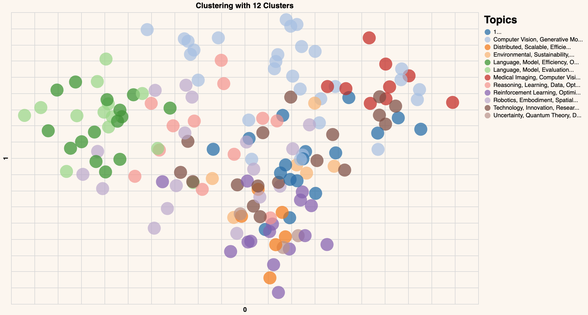
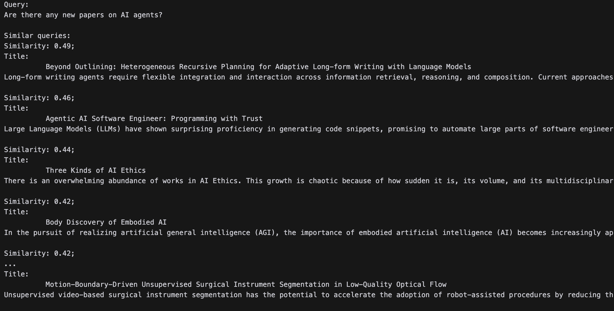

import { AuthorsContainer } from "../../components/authors-container";
import { CookbookHeader } from "../../components/cookbook-header";

<CookbookHeader href="https://github.com/cohere-ai/cohere-developer-experience/blob/main/notebooks/guides/Topic_Modeling_AI_Papers.ipynb" />

Natural Language Processing (NLP) is a key area of machine learning focused on analyzing and understanding text data. One popular NLP application is topic modeling, which uses unsupervised learning and clustering algorithms to group similar texts and extract underlying topics from document collections. This approach enables automatic document organization, efficient information retrieval, and content filtering.

Here, you'll learn how to use Cohere’s NLP tools to perform semantic search and clustering of AI Papers, which could help you discover trends in AI. You'll:

- Scrape the most recent page of the ArXiv page for AI, with the output being a list of recently published AI papers.
- Use Cohere’s Embed Endpoint to generate word embeddings using your list of AI papers.
- Visualize the embeddings and proceed to perform topic modeling.
- Use a tool to find the papers most relevant to a query you provide.

To follow along with this tutorial, you need to be familiar with Python and have python version 3.6+ installed, and you'll need to have a Cohere account. Everything that follows can be tested with a Google Colab notebook.

First, you need to install the python dependencies required to run the project. Use pip to install them using the command below.

```python PYTHON
pip install requests beautifulsoup4 cohere altair clean-text numpy pandas scikit-learn > /dev/null
```

And we'll also initialize the Cohere client.

```python PYTHON
import cohere

api_key = '<api_key>'
co = cohere.ClientV2(api_key="YOUR API KEY")
```

With that done, we'll import the required libraries to make web requests, process the web content, and perform our topic-modeling functions.

```python PYTHON
## Getting the web content
import requests
from bs4 import BeautifulSoup

## Processing the content 
import pandas as pd
import numpy as np

## Handling the underlying NLP
from sklearn.decomposition import PCA
from sklearn.cluster import KMeans
```

Next, make an HTTP request to the source website that has an archive of the AI papers.

```python PYTHON
URL = "https://arxiv.org/list/cs.AI/new"
page = requests.get(URL)
```

## Setting up the Functions We Need
In this section, we'll walk through some of the Python code we'll need for our topic modeling project. 

### Getting and Processing ArXiv Papers.

This `make_raw_df` function scrapes paper data from a given URL, pulling out titles and abstracts. It uses `BeautifulSoup` to parse the HTML content, extracting titles from elements with class `"list-title mathjax"` and abstracts from paragraph elements with class `"mathjax"`. Finally, it organizes this data into a pandas dataframe with two columns - "titles" and "texts" - where each row represents the information from a single paper.

```python PYTHON
def make_raw_df(url):
    response=requests.get(url)
    soup=BeautifulSoup(response.content, "html.parser")

    titles=list()
    texts=list()

    # Extract titles from <div class="list-title mathjax">
    title_tags = soup.find_all(class_="list-title mathjax")
    for title_tag in title_tags:
        titles.append(title_tag.text.strip())  # Remove leading/trailing whitespace

    # Extract abstracts from <p class="mathjax">
    abstract_tags = soup.find_all('p', class_="mathjax")#, tag="p")
    for abstract_tag in abstract_tags:
        texts.append(abstract_tag.text.strip())

    df = pd.DataFrame({"titles": titles, "texts": texts})
    return df
```

### Generating embeddings
[Word embedding](https://docs.cohere.com/docs/embeddings) is a technique for learning a numerical representation of words. You can use these embeddings to:

• Cluster large amounts of text  
• Match a query with other similar sentences  
• Perform classification tasks like sentiment classification

All of which we will do today.

Cohere’s platform provides an [Embed endpoint](https://docs.cohere.com/reference/embed) that returns text embeddings. An embedding is a list of floating-point numbers, and it captures the semantic meaning of the represented text. Models used to create these embeddings are available in several; small models are faster while large models offer better performance.

In the `get_embeddings`, `make_clusters`, and `create_cluster_names` functions defined below, we'll generate embeddings from the papers, use principal component analysis to create axes for later plotting efforts, use KMeans clustering to group the embedded papers into broad topics, and create a 'short name' that captures the essence of each cluster. This short name will make our Altair plot easier to read. 

```python PYTHON
def get_embeddings(text,model='embed-v4.0'):
  output = co.embed(
                model=model,
                texts=[text],
                input_type="classification",
                embedding_types=["float"],)
  return output.embeddings.float_[0]

# Reduce embeddings to 2 principal components to aid visualization
# Function to return the principal components
def get_pc(arr,n):
  pca = PCA(n_components=n)
  embeds_transform = pca.fit_transform(arr)
  return embeds_transform

def make_clusters(df,n_clusters):

    # Get the embeddings for the text column
    df_clust = df.copy()
    df_clust['text_embeds'] = df_clust['texts'].apply(get_embeddings) # We've defined this function above.

    # Convert the embeddings list to a numpy array
    embeddings_array = np.array(df_clust['text_embeds'].tolist())
    # Cluster the embeddings

    kmeans_model = KMeans(n_clusters=n_clusters, random_state=0, n_init='auto')
    classes = kmeans_model.fit_predict(embeddings_array).tolist()
    df_clust['cluster'] = (list(map(str,classes)))

    df_clust.columns.astype(str)
    return df_clust

def create_cluster_names(essences_dict):
    cluster_names = {}
    for cluster_num, description in essences_dict.items():
        # Take the first sentence and limit to first N characters
        short_name = description.split('.')[0][:30].strip() + '...'
        cluster_names[cluster_num] = short_name
    return cluster_names
```

### Get Topic Essences
Then, the `get_essence` function calls out to a Cohere [Command endpoint](https://docs.cohere.com/reference/chat) to create an 'essentialized' description of the papers in a given cluster. Like the 'short names' from above this will improve the readibility of our plot, because otherwise it would be of limited use.

```python PYTHON
def get_essence(df):

    clusters = sorted(df['cluster'].unique())
    cluster_descriptions = {}

    for cluster_num in clusters:
        
        cluster_df = df[df['cluster'] == cluster_num]
        # Combine titles and texts
        titles = ' '.join(cluster_df['titles'].fillna(''))
        texts = ' '.join(cluster_df['texts'].fillna(''))
        combined_text = f"Titles: {titles}\n\nTexts: {texts}"

        system_message = """
        ## Task & Context
        You are a world-class language model that's especially good at capturing the essence of complex text.

        ## Style Guide
        Unless the user asks for a different style of answer, you should answer in concise text with proper grammar and spelling.
        """

        message=f"""Based on the following titles and texts from academic papers, provide 3-4 words that describe what this category of papers is about. Think of this like a word cloud.
        Focus on the main theme or topic that unifies these papers.
        Please do not use the words 'AI', 'Artificial Intelligence,' 'Machine Learning,' or 'ML' in your response.
        
        {combined_text}
        
        Description:"""

        messages = [
            {"role": "system", "content": system_message},
            {"role": "user", "content": message},
        ]

        essence = co.chat(
            model="command-a-03-2025,
            messages=messages
        )

        description = essence.message.content[0].text.strip() + "."
        cluster_descriptions[cluster_num] = description     

    return cluster_descriptions
```

### Generating a Topic Plot
Finally, this `generate_chart` ties together the processing we've defined so far to create a beautiful Altair chart displaying the papers in our topics.

```python PYTHON
import altair as alt
# Function to generate the 2D plot
def generate_chart(df,xcol,ycol,lbl='off',color='basic',title='', cluster_names=None):

  ## IMPORTANT
  ## We're using this function to create the 'x' and 'y' columns for the chart.
  ## We don't actually use the principal components anywhere else in the code.
  embeds = np.array(df['text_embeds'].tolist())
  embeds_pc2 = get_pc(embeds,2)
  # Add the principal components to dataframe
  df = pd.concat([df, pd.DataFrame(embeds_pc2)], axis=1)
  ## END IMPORTANT

  # Add cluster names to the dataframe if provided
  if cluster_names:
      df['cluster_label'] = df['cluster'].map(cluster_names)
  else:
      df['cluster_label'] = df['cluster']
  
  # Plot the 2D embeddings on a chart
  df.columns = df.columns.astype(str)

  if color == 'basic':
      color_encode = alt.value('#333293')
  else:
      color_encode = alt.Color('cluster_label:N',
          scale=alt.Scale(scheme='category20'),
          legend=alt.Legend(
              title="Topics",
              symbolLimit=len(cluster_names) if cluster_names else None,
              orient='right',
              labelLimit=500,  # Increase label width limit (default is 200)
              columns=1  # Force single column layout
          ))


  chart = alt.Chart(df).mark_circle(size=500).encode(
        x=alt.X(xcol,
            scale=alt.Scale(zero=False),
            axis=alt.Axis(labels=False, ticks=False, domain=False)
        ),
        y=alt.Y(ycol,
            scale=alt.Scale(zero=False),
            axis=alt.Axis(labels=False, ticks=False, domain=False)
        ),
        color=color_encode,
        tooltip=['titles', 'cluster_label']  # Updated to show cluster label in tooltip
    )

  if lbl == 'on':
    text = chart.mark_text(align='left', baseline='middle',dx=15, size=13,color='black').encode(text='title', color= alt.value('black'))
  else:
    text = chart.mark_text(align='left', baseline='middle',dx=10).encode()

  result = (chart + text).configure(background="#FDF7F0"
      ).properties(
          width=800,
          height=500,
          title=title
      ).configure_legend(
          orient='right',
          titleFontSize=18,
          labelFontSize=10,
          padding=5,  # Add some padding around the legend
          offset=5,   # Move legend away from chart
          labelLimit=500  # Also need to set it here
      )
      
  return result
```

### Calling the Functions
Since we've defined our logic in the functions above, we now need only to call them in order.

```python PYTHON
### Creating the baseline dataframe.
df = make_raw_df("https://arxiv.org/list/cs.AI/new")

### Defining our cluster number and making a 'cluster' dataframe.
n_clusters = 12
df_clust = make_clusters(df,n_clusters)

### Get the topic essences and cluster names
overview = get_essence(df_clust)
cluster_names = create_cluster_names(overview)

### Generate the chart
generate_chart(df_clust,'0','1',lbl='off',color='cluster',title=f'Clustering with {n_clusters} Clusters', cluster_names=cluster_names)
```

Your chart will look different, but it should be similar to this one:


Congratulations! You have created the word embeddings and visualized them using a scatter plot, showing the overall structure of these papers.

## Similarity Search Across Papers
Next, we'll expand on the functionality we've built so far to make it possible to find papers related to a user-provided query.

As before, we'll begin by defining our `get_similarity` function. It takes a `target` query and compares it to `candidates` to return the most relevant papers. 

```python PYTHON
from sklearn.metrics.pairwise import cosine_similarity

def get_similarity(target,candidates):
  # Turn list into array
  candidates = np.array(candidates)
  target = np.expand_dims(np.array(target),axis=0)

  # Calculate cosine similarity
  sim = cosine_similarity(target,candidates)
  sim = np.squeeze(sim).tolist()
  sort_index = np.argsort(sim)[::-1]
  sort_score = [sim[i] for i in sort_index]
  similarity_scores = zip(sort_index,sort_score)

  # Return similarity scores
  return similarity_scores
```

All we need now is to feed it a query and print out the top papers:

```python PYTHON 
# Add new query
new_query = "Anything on AI personalities?"

# Get embeddings of the new query
new_query_embeds = get_embeddings(new_query)

embeds = np.array(df_clust['text_embeds'].tolist()) # We defined these embeddings earlier and are pulling them out now for the function.

# Get the similarity between the search query and existing queries
similarity = get_similarity(new_query_embeds, embeds)
#print(list(similarity))
# View the top 5 articles
print('Query:')
print(new_query,'\n')

print('Similar queries:')
for idx,sim in similarity:
  print(f'Similarity: {sim:.2f};')
  print(df.iloc[idx]['titles'])
  print(df.iloc[idx]['texts'])
  print()
```

You should see something like this:



## Conclusion

Let's recap the NLP tasks implemented in this tutorial. You’ve created word embeddings, clustered those, and visualized them, then performed a semantic search to find similar papers. Cohere’s platform provides NLP tools that are easy and intuitive to integrate. You can create digital experiences that support powerful NLP capabilities like text clustering. It’s easy to [register a Cohere account](https://dashboard.cohere.com/) and get to an API key.
