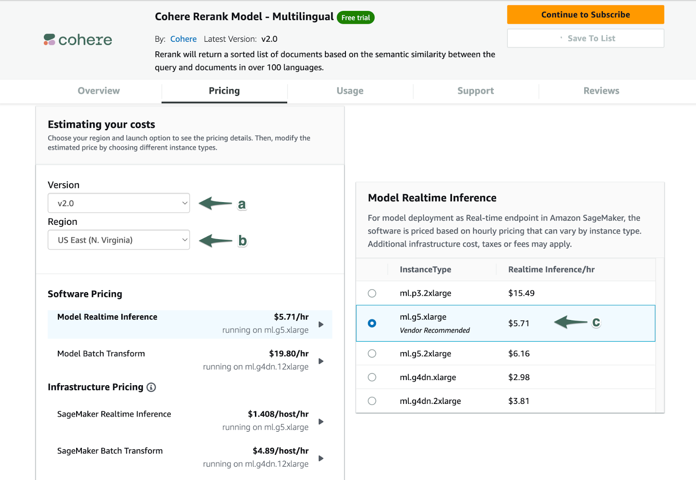
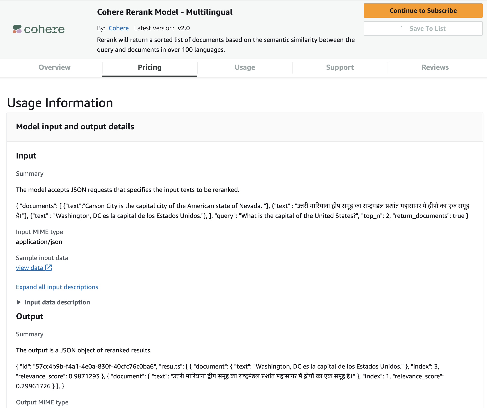
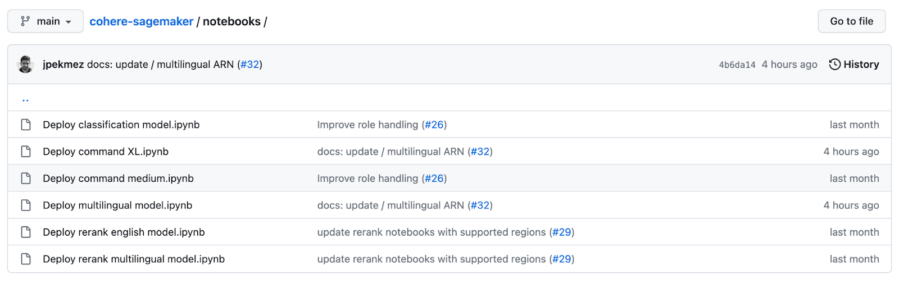
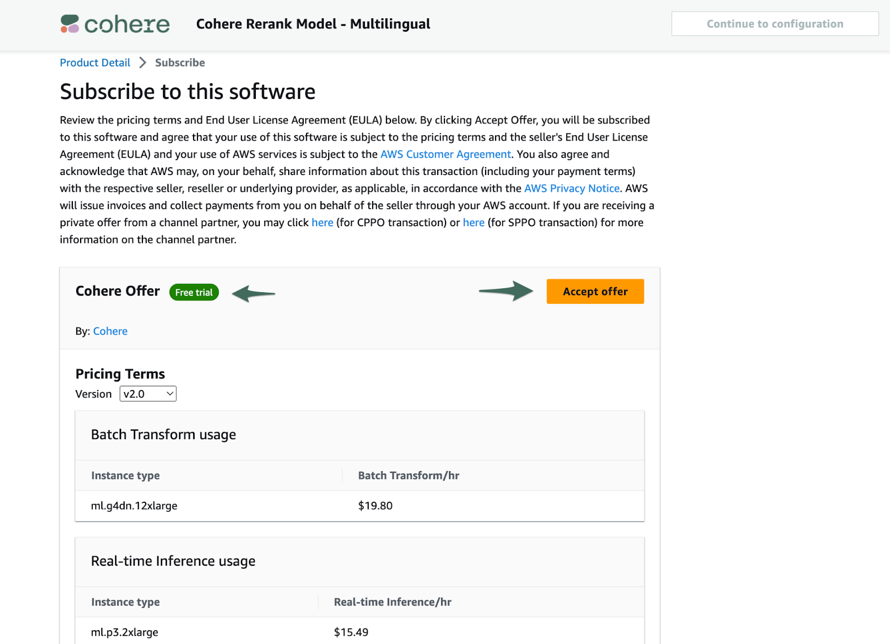
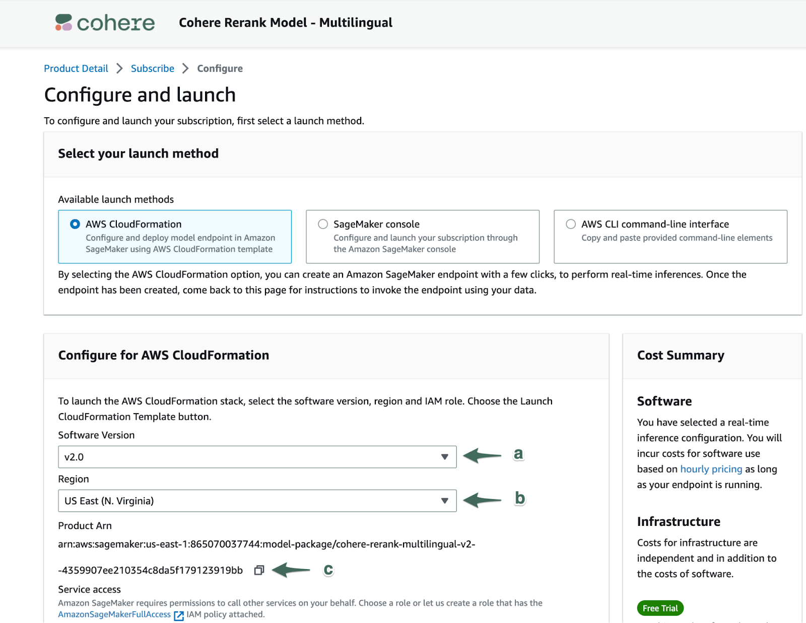

This document will guide you through enabling development teams to access <a href="https://aws.amazon.com/marketplace/seller-profile?id=87af0c85-6cf9-4ed8-bee0-b40ce65167e0" target="_blank"> Cohere’s offerings on Amazon SageMaker</a>. 

## Prerequisites

In order to successfully subscribe to Cohere’s offerings on SageMaker, the user will need the following **Identity and Access Management (IAM)** permissions:  

- **AmazonSageMakerFullAccess**
- **aws-marketplace:ViewSubscriptions**
- **aws-marketplace:Subscribe**
- **aws-marketplace:Unsubscribe**

These permissions allow a user to manage your organization’s SageMaker subscriptions. Learn more about [managing Amazon’s IAM Permissions here](https://aws.amazon.com/iam/?trk=cf28fddb-12ed-4ffd-981b-b89c14793bf1&sc_channel=ps&ef_id=CjwKCAjwsvujBhAXEiwA_UXnAJ4JEQ3KgW0eFBzr5nuwt9L5S7w3A0f3wqensQJgUQ7Mf_ZEdArZRxoCjKQQAvD_BwE:G:s&s_kwcid=AL!4422!3!652240143562!e!!g!!amazon%20iam!19878797467!148973348604). Contact your AWS administrator if you have questions about account permissions.

## Cohere with Amazon SageMaker Setup

First, navigate to [Cohere’s Sagemaker Marketplace](https://aws.amazon.com/marketplace/seller-profile?id=87af0c85-6cf9-4ed8-bee0-b40ce65167e0) to view the product offerings available to you. Select the product offering to which you are interested in subscribing.

Next, explore the tools on the **Product Detail** page to evaluate how you want to configure your subscription. Some of the key sections to consider are detailed below.

#### Pricing

This section allows you to estimate the cost of running inference on different types of instances.

**(a) Version:** Select the model version that suits your use case. Typically selecting the most recent version is appropriate. Release notes can be found in the Overview section of the listing.

**(b) Region**: Select a region to see which instance types are available.

**(c) Instance Type:** Select the instance type to estimate the costs of different configurations (learn more about [Amazon instance types here](https://aws.amazon.com/ec2/instance-types/#Accelerated_Computing)). Typically, instances that cost more will have lower latencies, meaning they will produce generations faster. Model quality is unaffected by instance type. Cohere provides a recommended instance type for each of our product offerings.

_Note: Due to regional availability and high demand, some supported instance types may not be available from Amazon at all times. Cohere does not control which instance types are available on Amazon’s platform._

#### Usage Information

This section contains the technical details around supported data formats for each model, and offers links to documentation and notebooks that will help developers scope out the effort required to integrate with Cohere’s models.

Each product offering has a corresponding notebook in GitHub that guides developers through the process of creating an endpoint for the model and performing real-time inference against it.

   [Notebooks for all of Cohere’s SageMaker compatible models are found here.](https://github.com/cohere-ai/cohere-sagemaker/tree/main/notebooks)

#### Subscribing

When you are ready to subscribe to one of Cohere’s models, select the **Continue to Subscribe** button at the top of the **Product Details** page.

On the Subscribe page, you are presented again with the pricing details and the EULA for final review before accepting the offer. This information is identical to the information on Product Detail page. If the product includes a **Free Trial**, that will be indicated on this page. Selecting different options in the **Version** will update the pricing displayed on the page, but does not impact your implementation in any way.

When you are ready to proceed with subscription, select **Accept Offer**. This request may take a few seconds to complete.

_Note: Subscribing to the models alone will not result in charges to your account, this only enables your organization to proceed with setting up SageMaker instances with Cohere’s models. You will begin accruing charges when you create a SageMaker instance configured to run one of Cohere's products._

#### Configuration

When Amazon has processed your subscription, select **Continue to configuration**. 

On the Configure page, the primary goal is to retrieve the [Amazon Resource Name (ARN)](https://docs.aws.amazon.com/IAM/latest/UserGuide/reference-arns.html) for the product you have subscribed to. To do this, first select both **a) Software Version** and **b) Region**, at which point the **Product ARN** will be displayed, which you can copy via the **c) copy icon**.

With your selected configuration and Product ARN available, you now have everything you need to integrate with Cohere’s model offerings on SageMaker. 

Cohere recommends your next step be to find the appropriate notebook in [Cohere's list of SageMaker notebooks](https://github.com/cohere-ai/cohere-sagemaker/tree/main/notebooks), and follow the instructions there, or provide the link to Cohere’s SageMaker notebooks to your development team to implement. The notebooks are thorough, developer-centric guides that will enable your team to begin leveraging Cohere’s endpoints in production for live inference. 

If you have further questions about subscribing or configuring Cohere’s product offerings on Amazon SageMaker, please contact our team at [support+aws@cohere.com](mailto:support+aws@cohere.com).
