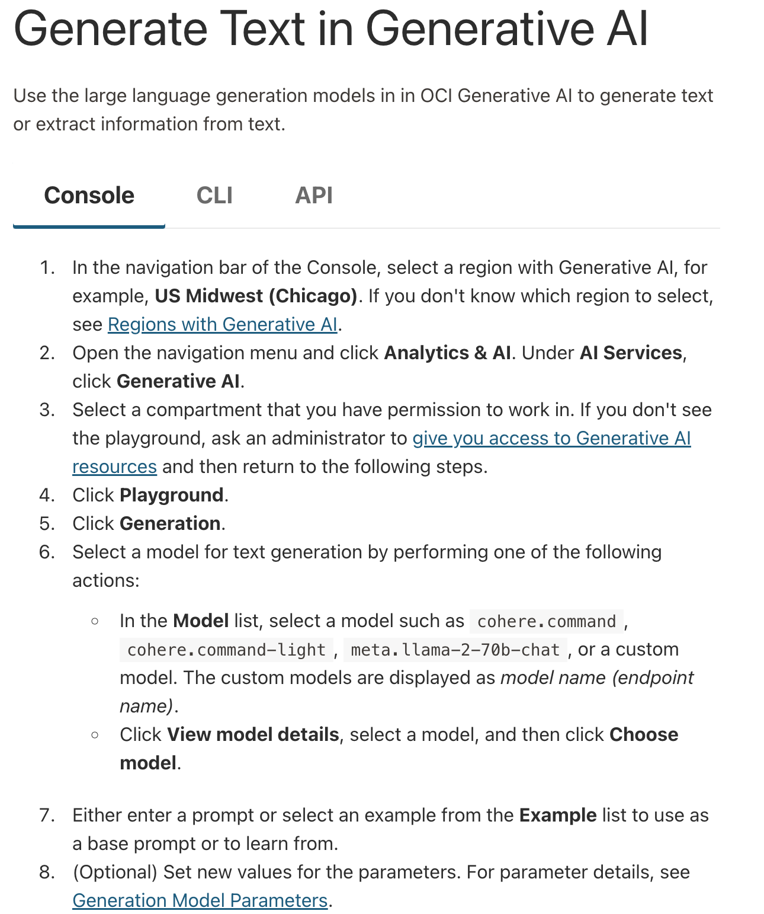
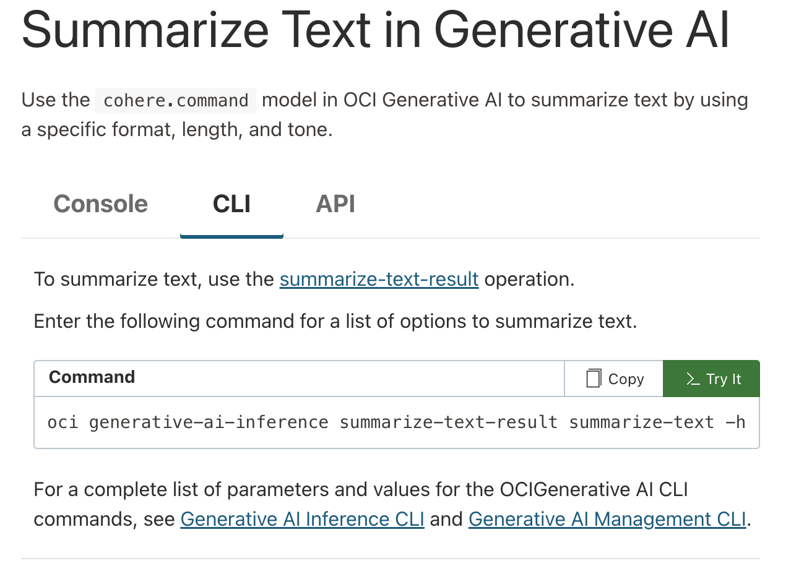
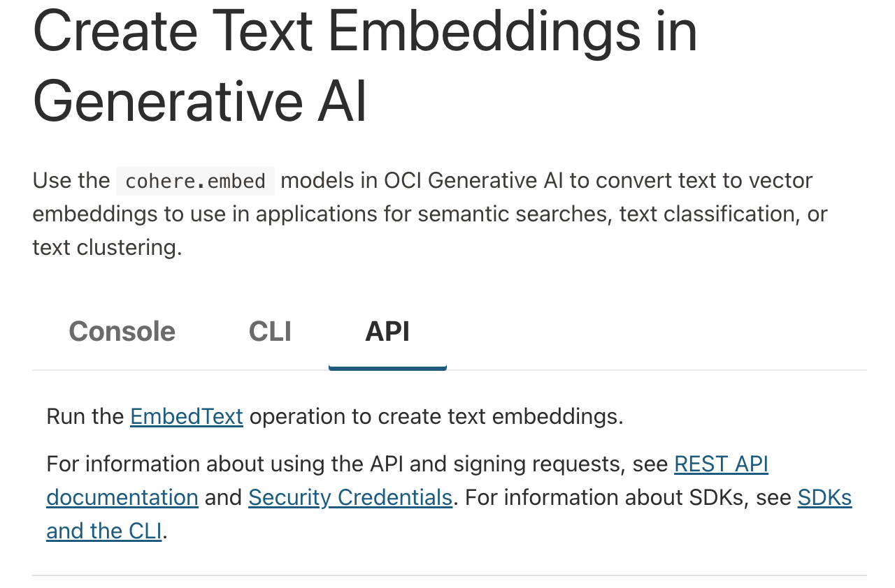

In an effort to make our language-model capabilities more widely available, we've partnered with a few major platforms to create hosted versions of our offerings.

Here, you'll learn how to use Oracle Cloud Infrastructure (OCI) to deploy both the Cohere Command and the Cohere Embed models on the AWS cloud computing platform. The following models are available on OCI:

- Command A Reasoning 
- Command A Vision
- Command A 
- Command R+ 08-2024
- Command R 08-2024
- Command R+ (retired)
- Command R (retired)
- Command (deprecated)
- Command light (deprecated)
- Embed v4
- Embed English v3
- Embed English v3 light 
- Embed Multilingual v3
- Embed Multilingual v3 light
- Rerank v3.5

We also support fine-tuning for Command R (`command-r-04-2024` and `command-r-08-2024`) on OCI. 

For the most updated list of available models, see the [OCI documentation](https://docs.oracle.com/en-us/iaas/Content/generative-ai/pretrained-models.htm).

## Working With Cohere Models on OCI

- [Embeddings generation](https://docs.oracle.com/en-us/iaas/Content/generative-ai/use-playground-embed.htm#playground-embed)

And OCI offers three ways to perform these workloads:

- The console
- The CLI
- The API

In the sections that follow, we'll briefly outline how to use each, and link out to other documentation to fill in any remaining gaps. 

### The Console

OCI offers a console through which you can perform many generative AI tasks. It allows you to select your region and the model you wish to use, then pass a prompt to the underlying model, configuring parameters as you wish.

If you want to use the console for [chat](https://docs.oracle.com/en-us/iaas/Content/generative-ai/use-playground-chat.htm), [text generation](https://docs.oracle.com/en-us/iaas/Content/generative-ai/use-playground-generate.htm#playground-generate), [summarization](https://docs.oracle.com/en-us/iaas/Content/generative-ai/use-playground-summarize.htm#playground-summarize), and [embeddings](https://docs.oracle.com/en-us/iaas/Content/generative-ai/use-playground-embed.htm#playground-embed), visit those links and select "console."

### The CLI

With OCI's command line interface (CLI), it's possible to use Cohere models to generate text, get embeddings, or extract information. 

If you want to use the console for [text generation](https://docs.oracle.com/en-us/iaas/Content/generative-ai/use-playground-generate.htm#playground-generate), [summarization](https://docs.oracle.com/en-us/iaas/Content/generative-ai/use-playground-summarize.htm#playground-summarize), and [embeddings](https://docs.oracle.com/en-us/iaas/Content/generative-ai/use-playground-embed.htm#playground-embed), visit those links and select "CLI."

### The API

If you're trying to use Cohere models on OCI programmatically -- i.e. as part of software development, or while building an application -- you'll likely want to use the API.

If you want to use the console for [text generation](https://docs.oracle.com/en-us/iaas/Content/generative-ai/use-playground-generate.htm#playground-generate), [summarization](https://docs.oracle.com/en-us/iaas/Content/generative-ai/use-playground-summarize.htm#playground-summarize), and [embeddings](https://docs.oracle.com/en-us/iaas/Content/generative-ai/use-playground-embed.htm#playground-embed), visit those links and select "API."

