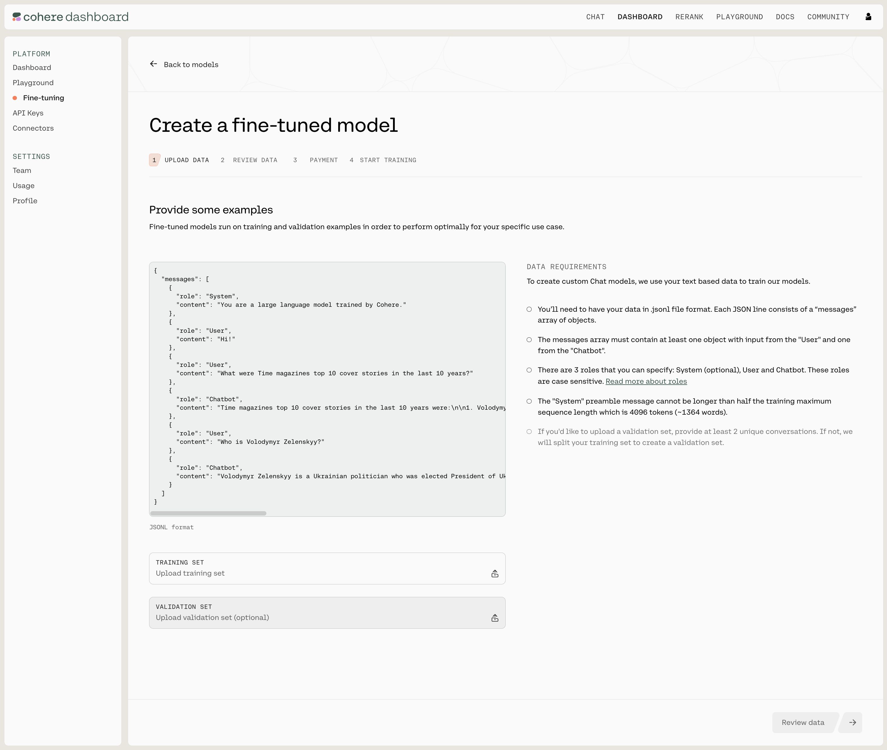
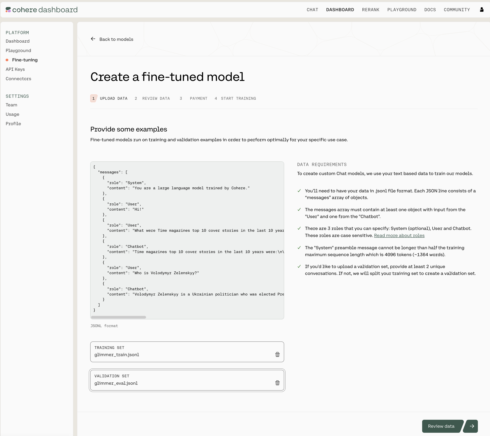
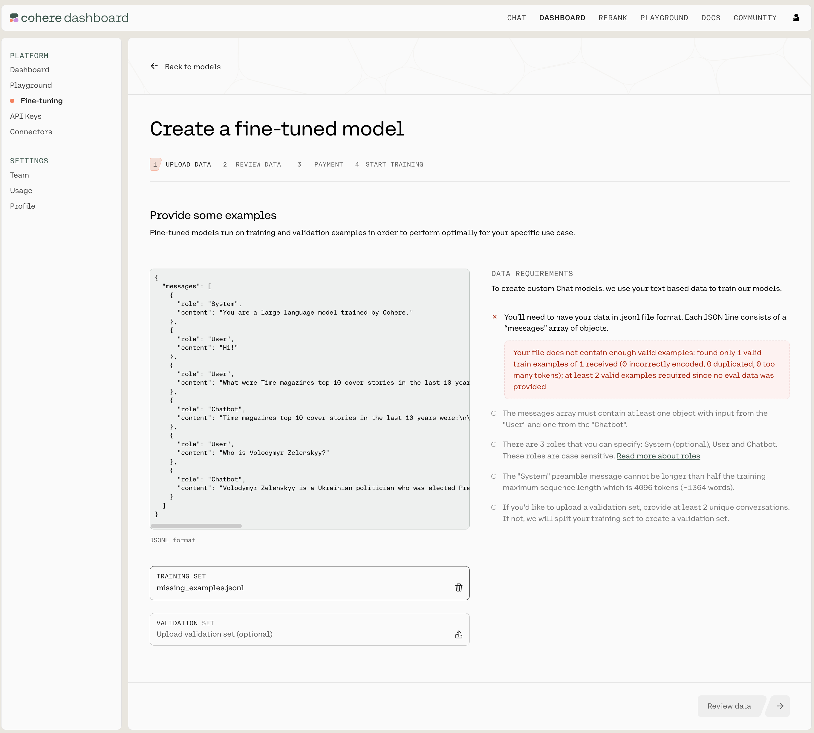
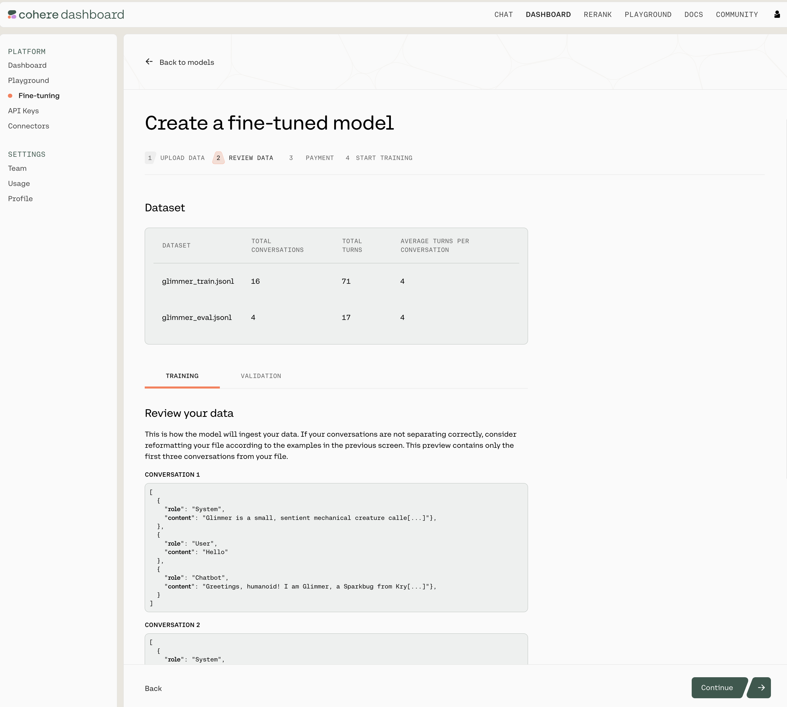
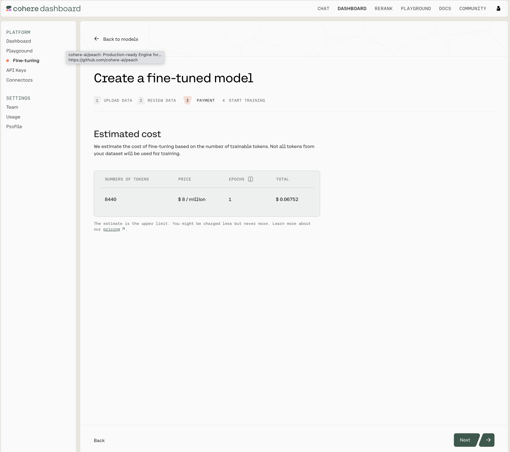
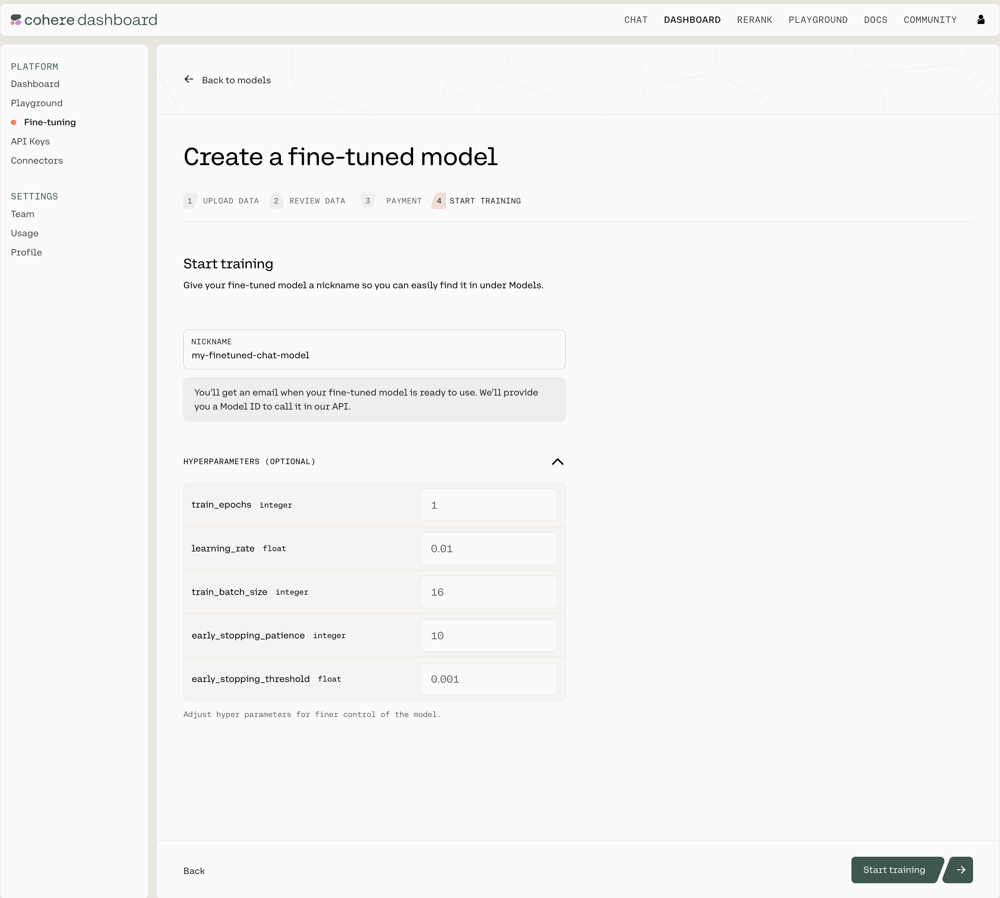

In this section, we will walk through how you can start training a fine-tuning model for Chat on both the Web UI and the Python SDK.

## Cohere Dashboard

Fine-tuning of the Command family of models for Chat with the Web UI consists of a few simple steps, which we'll walk through now.

### Choose the Chat Option

Go to the [fine-tuning page](https://dashboard.cohere.com/fine-tuning) and click on 'Create a Chat model'.


<br />

### Upload Your Data

Upload your custom dataset data by going to 'Training data' and clicking on the upload file button. Your data should be in `jsonl` format.

Upload your training data by clicking on the `TRAINING SET` button at the bottom of the page, and if you want to upload a validation set you can do that with the `VALIDATION SET` button.

Your data has to be in a `.jsonl` file, where each `json` object is a conversation with the following structure:

```json JSON
{
  "messages": [
    {
      "role": "System",
      "content": "You are a chatbot trained to answer to my every question."
    },
    {
      "role": "User",
      "content": "Hello"
    },
    {
      "role": "Chatbot",
      "content": "Greetings! How can I help you?"
    }, ...
  ]
}

```

We require a minimum of two valid conversations to begin training. Currently, users are allowed to upload either a single train file, or a train file along with an evaluation file. If an evaluation file is uploaded it must contain at least one conversation.



### Data Requirements and Errors

There a certain requirements for the data you use to fine-tune a model for Chat through the UI:

- There are only three acceptable values for the `role` field: `System`, `Chatbot` or `User`. There should be at least one instance of `Chatbot` and `User` in each conversation. If your dataset includes other roles, a validation error will be thrown.
- A system instruction should be uploaded as the first message in the conversation, with `role: System`. All other messages with `role: System` will be treated as speakers in the conversation.
- What's more, each turn in the conversation should be within the context length of 16384 tokens to avoid being dropped from the dataset. We explain a turn in the ['Chat Customization Best Practices'](/docs/chat-preparing-the-data#:~:text=.await_validation()) section.

If you need more information, see ['Preparing the Data'](/docs/chat-preparing-the-data).

The Cohere platform will automatically check the data you've uploaded. If everything is in order, you'll see a screen like this (note the 'DATA REQUIREMENTS' panel on the right):



If something is wrong or needs to be amended, you'll see a screen like this (note the 'DATA REQUIREMENTS' panel on the right):



### Review Data

The next window will show you the first few samples of your uploaded training and validation datasets.

Here's what that looks like:



Note that this page shows you the total number of conversations for both the training and validation datasets, the total number of turns in the respective files, and the average turns per conversation. It also includes a sample of the conversations in your data files.

As a reminder, even if you specify a preamble in your dataset, the default inference request to `co.chat()` will have an empty preamble. If you want to make an inference request with preamble, [please pass the parameter](/reference/chat) `preamble`. 

If you are happy with how the samples look, click on 'Continue' at the bottom of the page.

### Pricing

This page gives an estimated cost of your fine-tuning job. Please see our [latest pricing](https://cohere.com/pricing) for more information.



Click next to finalize your fine-tuning job.

### Start Training

Now, we're ready to begin training your fine-tuning model for Chat. Give your model a nickname so you can find it later, and press 'Start Training' to kick things off!



As the training proceeds you'll receive updates with various accuracy and loss metrics. If you're not sure what these terms mean, you can go to the ['Understanding the Chat Fine-tuning Results'](/docs/chat-understanding-the-results) section.

## Using the Python SDK

In addition to using the [Web UI](/docs/fine-tuning-with-the-web-ui) for fine-tuning models, customers can also kick off fine-tuning jobs programmatically using the [Cohere Python SDK](https://pypi.org/project/cohere/). This can be useful for fine-tuning jobs that happen on a regular cadence, such as nightly jobs on newly-acquired data.

## Prepare your Dataset

Creating a fine-tuned model that can be used with the `co.Chat` API requires good examples of data. 

Your data has to be in a `.jsonl` file, where each `json` object is a conversation with the following structure:

```json JSON
{
  "messages": [
    {
      "role": "System",
      "content": "You are a chatbot trained to answer to my every question."
    },
    {
      "role": "User",
      "content": "Hello"
    },
    {
      "role": "Chatbot",
      "content": "Greetings! How can I help you?"
    }, ...
  ]
}

```

We require a minimum of two valid conversations to begin training. Currently, users are allowed to upload either a single train file, or a train file along with an evaluation file. If an evaluation file is uploaded it must contain at least one conversation.

## Create a new Fine-tuned model

Using the `co.finetuning.create_finetuned_model()` method of the Cohere client, you can kick off a training job that will result in a fine-tuned model. Fine-tuned models are trained on custom datasets which are created using the `co.datasets.create()` method. In the example below, we create a dataset with training and evaluation data, and use it to fine-tune a model.

```python PYTHON
import cohere

co = cohere.Client("Your API key")

# Single train file upload
chat_dataset = co.datasets.create(
    name="chat-dataset",
    data=open("path/to/train.jsonl", "rb"),
    type="chat-finetune-input",
)
print(co.wait(chat_dataset))

# Uploading both train and eval file
chat_dataset_with_eval = co.datasets.create(
    name="chat-dataset-with-eval",
    data=open("path/to/train.jsonl", "rb"),
    eval_data=open("path/to/eval.jsonl", "rb"),
    type="chat-finetune-input",
)
print(co.wait(chat_dataset_with_eval))
```

## Data Formatting and Requirements

Please see the ['Data Requirements'](/docs/chat-preparing-the-data#:~:text=Zelenskyy.%22%0A%20%20%20%20%7D%0A%20%20%5D%0A%7D-,Data%20Requirements,-To%20pass%20the) section in 'Preparing the data' page for the full list of requirements.

After uploading your dataset, via `co.datasets.create()`, it will be validated. The `co.wait(chat_dataset)` method will return a `cohere.Dataset` object with these properties:

- `validation_status` will inform you of whether you dataset has been `validated` or has `failed`. 
- `validation_error` contains any errors in the case where the validation has failed.
- `validation_warnings` contains warnings about your dataset. In the case of your dataset having more than one error, one will appear in `validation_error`, and the rest in `validation_warnings`.

Below is a table of errors or warnings you may receive and how to fix them.

| Error/Warning | Error/Warning Text                                                                                                                                                  | Meaning                                                                                                                                                                                                                                            | Fix                                                                                   |
|---------------|----------------------------------------------------------------------------------------------------------------------------------------------------------------------|----------------------------------------------------------------------------------------------------------------------------------------------------------------------------------------------------------------------------------------------------|---------------------------------------------------------------------------------------|
| Error         | 'not enough valid examples: found only X valid train examples of Y received (A incorrectly encoded, B duplicated, C too many tokens); at least 2 valid examples required since no eval data was provided' | Is thrown for any incorrectly encoded or duplicated messages, as well as when turns are above the context length (in which case those turns will be dropped).                                                                                      | You need to upload more valid examples in your dataset for a minimum of 2 examples.   |
| Error         | 'train preambles are too long:..'  \nOR  \n'invalid eval file: preambles are too long:..'                                                                            | Is thrown when uploaded train preambles in train and/or eval data are above the context length of 2048 tokens. The error message will contain the preamble which needs to be shortened.                                                             | Shorten or upload new preambles.                                                      |
| Error         | 'extra speaker in example: \<extra_speaker_name> (line : X)'                                                                                                         | This means that the uploaded training dataset has speakers which are not one of the allowed roles: `System`,`User` or `Chatbot`                                                                                                                     | Rename or remove the extra speaker and re-upload the dataset.                         |
| Error         | 'missing Chatbot in example'  \nOR  \n'missing User in example'                                                                                                      | This means the uploaded training dataset is missing either `Chatbot` or `User` speaker, both of which are required.                                                                                                                                | Upload your dataset with required speakers `Chatbot` and `User`                       |
| Warning       | 'dataset has 0 valid eval rows. dataset will be auto-split'                                                                                                          | This error is thrown when eval data was not uploaded, in which case the dataset will be auto-split with 80% going to training and 20% to evaluation.                                                                                               | None                                                                                  |
| Warning       | 'train dataset has conversations with too many tokens. conversation number: number of turns with too many tokens is as follows, x:y'  \nOR  \n'eval dataset has conversations with too many tokens. conversation number: number of turns with too many tokens is as follows, x:y' | This means the train and/or eval dataset has turns which exceed the context length of 16384 tokens, and will be dropped for training. The message specifies the conversation index x (which starts at 0), as well as the number of turns over the context length in that conversation, y. | If you do not want any turns dropped, consider shortening turns.                      |


## Parameters

To train a custom model, please see the example below for parameters to pass to `co.finetuning.create_finetuned_model()`, or visit our [API guide](/reference/createfinetunedmodel). Default hyper parameter values are listed below:

- `hyperparameters` (cohere.finetuning.Hyperparameters) - Adjust hyperparameters for training.
  - `train_epochs` (int) The maximum number of epochs the customization job runs for. Must be between 1 and 10. Defaults to **1**.
  - `learning_rate` (float) The learning rate to be used during training. Must be between 0.00005 and 0.1. Defaults to **0.01**.
  - `train_batch_size` (int) The batch size is the number of training examples included in a single training pass. Must be between 2 and 16. Defaults to **16**.
  - `early_stopping_threshold` (float) How much the loss must improve to prevent early stopping. Must be between 0.001 and 0.1. Defaults to **0.001**.
  - `early_stopping_patience` (int) Stops training if the loss metric does not improve beyond the value of `early_stopping_threshold` after this many rounds of evaluation. Must be between 0 and 10. Defaults to **10**.

You can optionally publish the training metrics and hyper parameter values to your [Weights and Biases](https://wandb.ai) account using the `wandb` parameter. This is currently only supported when fine-tuning a Chat model.

- `wandb` (cohere.finetuning.WandbConfig) - The Weights & Biases configuration.
  - `project` (string) The Weights and Biases project to be used during training. This parameter is mandatory.
  - `api_key` (string) The Weights and Biases API key to be used during training. This parameter is mandatory and will always be stored securely and automatically deleted after the fine-tuning job completes training.
  - `entity` (string) The Weights and Biases API entity to be used during training. When not specified, it will assume the default entity for that API key.

When the configuration is valid, the Run ID will correspond to the fine-tuned model ID, and Run display name will be the name of the fine-tuned model specified during creation. When specifying a invalid Weights and Biases configuration, the fine-tuned model creation will proceed but nothing will be logged to your Weights and Biases.

Once a fine-tuned model has been created with a specified Weights and Biases configuration, you may view the fine-tuning job run via the Weights and Biases dashboard. It will be available via the following URL: `https://wandb.ai/<your-entity>/<your-project>/runs/<finetuned-model-id>`.

## Example

```python PYTHON
import cohere
from cohere.finetuning import (
    Hyperparameters,
    Settings,
    FinetunedModel,
    BaseModel,
    WandbConfig,
)

co = cohere.Client("Your API key")

chat_dataset = co.datasets.create(
    name="chat-dataset",
    data=open("path/to/train.jsonl", "rb"),
    type="chat-finetune-input",
)
# optional (define custom hyperparameters)
hp = Hyperparameters(
    early_stopping_patience=10,
    early_stopping_threshold=0.001,
    train_batch_size=16,
    train_epochs=1,
    learning_rate=0.01,
)

# optional (define wandb configuration)
wnb_config = WandbConfig(
    project="test-project",
    api_key="<<wandbApiKey>>",
    entity="test-entity",
)

create_response = co.finetuning.create_finetuned_model(
    request=FinetunedModel(
        name="customer-service-chat-model",
        settings=Settings(
            base_model=BaseModel(
                base_type="BASE_TYPE_CHAT",
            ),
            dataset_id=chat_dataset.id,
            hyperparameters=hp,
            wandb=wnb_config,
        ),
    ),
)
```

## Calling your Chat Model with the Chat API

Once your model completes training, you can call it via the [Chat API](/docs/chat-api) and pass your custom model's ID via the `model` parameter.

Please note, the `model_id` is the `id` returned by the fine-tuned model object with the `"-ft"` suffix.

`co.chat()` uses no preamble by default for fine-tuned models. You can specify a preamble using the `preamble` parameter. Note that for the `model` parameter, you must pass the finetune's id with `"-ft"` appended to the end.

By passing `return_prompt=True` in any message, you can see which preamble is being used for your conversation.

Here's a Python script to make this clearer:

```python PYTHON
import cohere

co = cohere.Client("Your API key")
# get the fine-tuned model object
get_response = co.finetuning.get_finetuned_model(
    create_response.finetuned_model.id
)

response = co.chat(
    message="Hi there",
    model=get_response.finetuned_model.id + "-ft",
    # optional (to specify a preamble)
    preamble="You are a chatbot trained to answer to my every question. Answer every question with full sentences.",
    # optional
    return_prompt=True,
)

# Printing the model's response.
print(response.text)
```

After your first message with the model, an `id` field will be returned which you can pass as the `conversation_id` to continue the conversation from that point onwards, like so:

```python PYTHON
# Continuing the above conversation with `response.id`.
response_2 = co.chat(
    message="How are you?",
    model=get_response.finetuned_model.id + "-ft",
    # optional (to specify a preamble)
    preamble_override="You are a chatbot trained to answer to my every question. Answer every question with full sentences",
    # optional
    return_prompt=True,
    conversation_id=response.chat_history,
)
```

We can’t wait to see what you start building! Share your projects or find support on our [Discord](https://discord.com/invite/co-mmunity).

