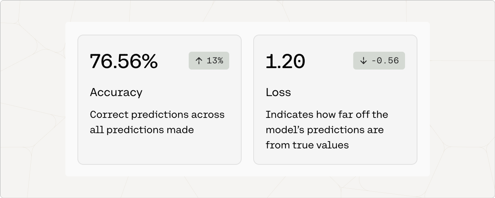

<Warning>
Cohere's fine-tuning feature was deprecated on September 15, 2025
</Warning>

The outputs of a fine-tuned model for Chat are often best evaluated qualitatively. While the performance metrics are a good place to start, you'll still have to assess whether it _feels_ right to arrive at a comprehensive understanding of the model’s performance.

When you create a fine-tuned model for Chat, you will see metrics that look like this:

The next few sections explain what these and other metrics mean.

### Accuracy

Accuracy is a measure of how many predictions the model made correctly out of all the predictions in an evaluation. To evaluate chat models for accuracy, we ask it to predict certain words in the user-uploaded data.

The number in the pill (eg. 13%) is the difference between the accuracy of the default model when the user started training, and the accuracy of the model that is deployed. This difference is a proxy for how much accuracy improved when the model was trained on the dataset.

### Loss

Loss is a measure that describes how bad or wrong a prediction is. Accuracy may tell you how many predictions the model got wrong, but it will not describe how incorrect the wrong predictions are. If every prediction is perfect, the loss will be 0.

To evaluate chat models for loss, we ask the model to predict certain words in the user-provided data and evaluate how wrong the incorrect predictions are. A loss of around 11 indicates totally random performance.

For this reason, **the loss should decrease as the model improves**. The number in the pill (e.g. -0.56) is the difference between the loss when the default model started training and when it was deployed. This difference is a proxy for how much loss improved when the model was trained on your dataset.

## Troubleshooting a Fine-Tuned Chat Model

We have a dedicated guide for troubleshooting fine-tuned models which is consistent for all the different model types and endpoints. Check it out [here](/docs/troubleshooting-a-fine-tuned-model).
