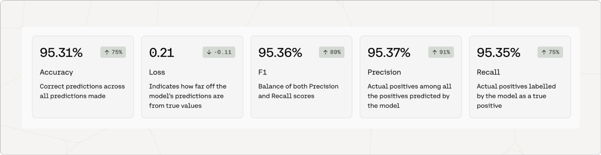

<Error>
Cohere's fine-tuning feature was deprecated on September 15, 2025
</Error>

In this section, we will explain the metrics for a fine-tuned model for Classification.

Fine-tuned models for Classification are trained using data of examples mapping to predicted labels, and for that reason they are evaluated using the same methods and performance metrics. You can also provide a test set of data that we will use to calculate performance metrics. If a test set is not provided, we will split your training data randomly to calculate these performance metrics.

When you create a fine-tuned model for Classification, you will see metrics that look like this:

### Accuracy

Accuracy is a measure of how many of a model's predictions were made correctly. To evaluate Classify models for accuracy, we ask the model to predict labels for the examples in the test set. In this case, the model predicted 95.31% of the labels correctly.

The number in the pill (eg. 75%) is the difference between the accuracy of the default model when the user started training, and the accuracy of the fine-tuned model that is deployed. This difference is a proxy for how much accuracy improved when the model was trained on the dataset.

#### Multilabel Accuracy

For multilabel classification problems, accuracy is calculated as an average across labels. Technically, this is known as a 'Hamming score'.

### Precision

Precision is a measure that shows how correct the model was when it predicted a given label. It’s calculated by taking the number of true positives and dividing it by the sum of [true positives](https://developers.google.com/machine-learning/crash-course/classification/true-false-positive-negative#:~:text=A%20true%20positive%20is%20an,incorrectly%20predicts%20the%20positive%20class.) and [false positives](https://developers.google.com/machine-learning/crash-course/classification/true-false-positive-negative#:~:text=A%20true%20positive%20is%20an,incorrectly%20predicts%20the%20positive%20class.).

For example, let’s say we have a test set of 100 examples. 50 of them are label `A` and 50 of them are label `B`. If the model guessed label `A` for every prediction (100 times), every incorrectly predicted label `B` would be a false positive. The precision of label `A` would be 50%.

This is calculated for every label. The number shown in the metrics is the [macro-weighted average](https://datascience.stackexchange.com/questions/65839/macro-average-and-weighted-average-meaning-in-classification-report) of the precision across labels.

#### Multilabel Precision

For both single-label and multilabel classification problems, precision is calculated as an average across labels.

### Recall

Recall is a measure that shows how often the model predicted a given label correctly. It’s calculated by taking the number of true positives and dividing it by the sum of [true positives](https://developers.google.com/machine-learning/crash-course/classification/true-false-positive-negative#:~:text=A%20true%20positive%20is%20an,incorrectly%20predicts%20the%20positive%20class.) and [false negatives](https://developers.google.com/machine-learning/crash-course/classification/true-false-positive-negative#:~:text=A%20true%20positive%20is%20an,incorrectly%20predicts%20the%20positive%20class.).

For example, let’s say we have a test set of 100 examples. 50 of them are label `A` and 50 of them are label `B`. If the model guessed label `A` for every prediction (100 times), there would be no false negative predictions of label `A`. The recall of label `A` would be 100%.

This is calculated for every label. The number shown in the metrics are the [macro-weighted average](https://datascience.stackexchange.com/questions/65839/macro-average-and-weighted-average-meaning-in-classification-report) of the recall across labels.

#### Multilabel Recall

For both single-label and multilabel classification problems, recall is calculated as an average across labels.

### F1

Optimizing for either precision or recall often means sacrificing quality in the other. In the example above, 100% recall for label `A` does not mean that it was a great model, as demonstrated by its poor precision score. The F1 score attempts to provide a measure of performance that balances between precision and recall.

The number shown in the metrics are the [macro-weighted average](https://datascience.stackexchange.com/questions/65839/macro-average-and-weighted-average-meaning-in-classification-report) of F1 across labels.

For recall, precision, and F1, the number in the pill is a proxy for how much improvement was observed when the default model was trained on your dataset.

You can see the detailed calculations to evaluate Classify models in this [blog post](https://cohere.com/blog/classification-eval-metrics/).

#### Multilabel F1

The F1 score is calculated the same way for both single-label and multilabel classification problems.
