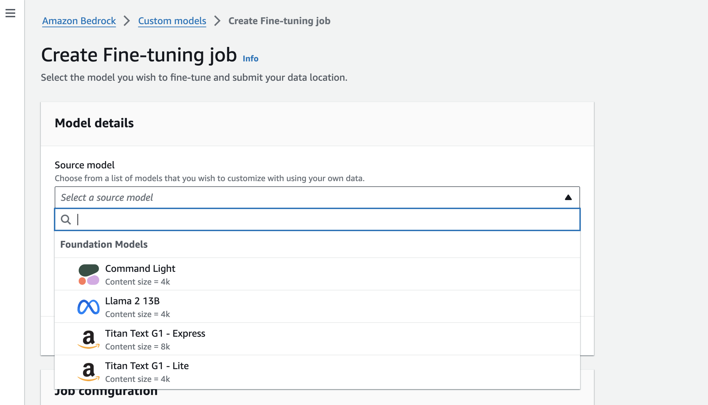
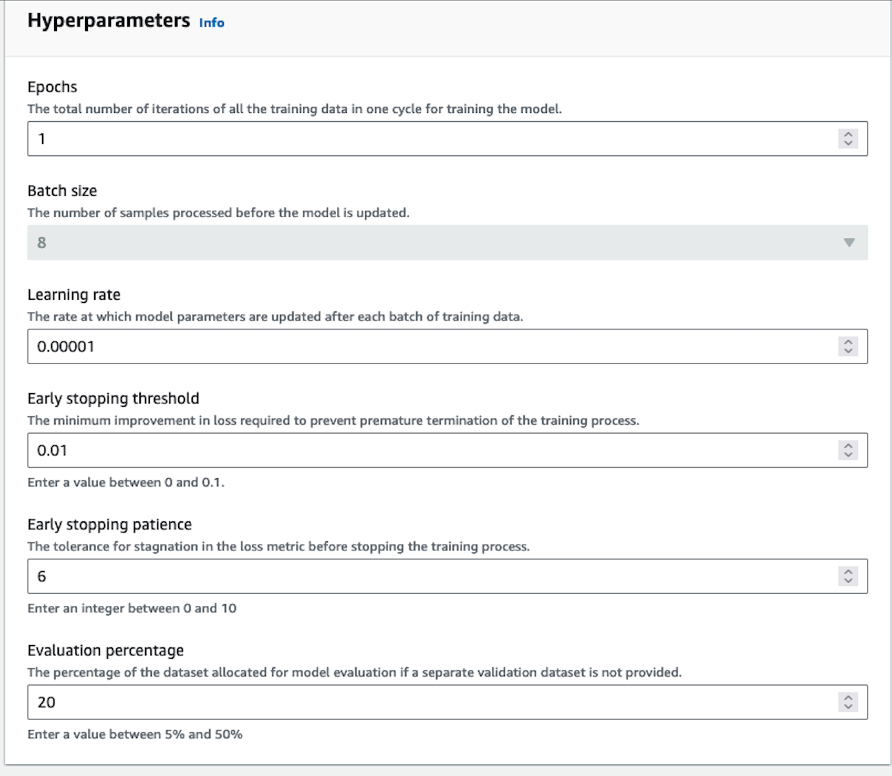
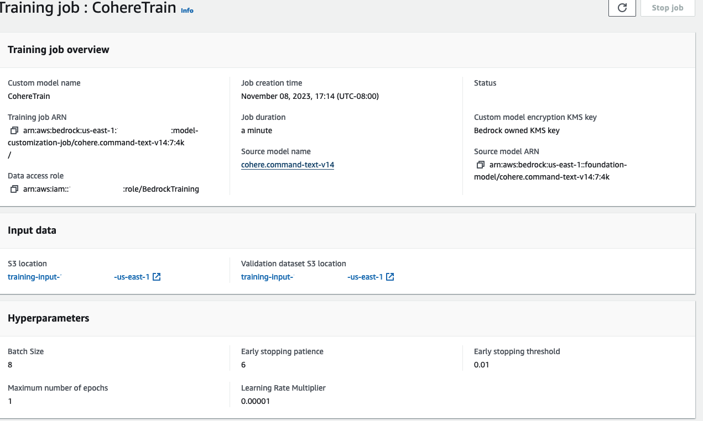

In this section, you'll find information on how to fine-tune Cohere's generative models on AWS Bedrock. 

Bedrock customers can fine-tune Cohere’s [Command Light](https://us-west-2.console.aws.amazon.com/bedrock/home?region=us-west-2#/providers?model=cohere.command-light-text-v14) as well as [Command model](https://us-west-2.console.aws.amazon.com/bedrock/home?region=us-west-2#/providers?model=cohere.command-text-v14) for their use cases. 

Customers can kick off fine-tuning jobs by completing the data preparation and validation steps through the [AWS Console](https://console.aws.amazon.com/bedrock/home). This is useful for customers who don't need or don't want to create a fine-tuning job programmatically via the [Cohere AWS SDK](https://github.com/cohere-ai/cohere-aws), preferring to opt for the ease and simplicity of a web interface instead.

# Preparing your data

Before a fine-tuning job can be started, users must upload a dataset with training and (optionally) evaluation data. The structure of the data for fine-tuning on Amazon Bedrock should be `jsonl`. Read more about preparing the training data for generative fine-tuning on Bedrock [here](https://docs.aws.amazon.com/bedrock/latest/userguide/model-customization-prepare.html).

To be able to start a fine-tuning job, your dataset must contain at least **32** examples.

### Data format

Data is stored as tuples, where each tuple consists of a prompt and its corresponding completion. Here's an example:

- **prompt**: What is the capital of France?
- **completion**: The capital of France is Paris.

The context length for prompt and a completion pair is 4096 tokens using our tokenizer. If there are any examples above that count, they will be dropped. The data will be saved in a `.jsonl` format.

#### jsonl

```
{"prompt": "What is the capital of France?", "completion": "The capital of France is Paris."}
{"prompt": "What is the smallest state in the USA?", "completion": "The smallest state in the USA is Rhode Island."}

```

# Starting the Chat Fine-tuning

After uploading the dataset, the fine-tuning job can begin.

The Bedrock fine-tuning job requires:

- an s3 path to the uploaded train dataset
- an optional s3 path to the eval dataset

In this section, we will walk through how you can start training a fine-tuned model for Generate with both the AWS Console and the [Cohere AWS SDK](https://github.com/cohere-ai/cohere-aws). 

## AWS Console

Creating a fine-tuned model for Generate via the AWS Console consists of a few simple steps, discussed below.

### Choose a Custom Model

Open the [Amazon Bedrock Console](https://console.aws.amazon.com/bedrock/home). In the navigation pane, choose 'Foundation models' -> 'Custom models'. In the 'Models' tab, choose 'Customize model' -> 'Fine-train model'.

In the 'Create Fine-tuning job' page there is a 'Model details' section, which allows you to choose 'Command' or 'Command Light' based on which Cohere base model you want to fine-tune.




### Input your data

In the Input your data section, you can provide the S3 link to the training dataset file and, optionally, the validation dataset file. Your data should be in  `jsonl` format. You can also set the following hyperparameters to use in training.

### Set Your Hyperparameters

We allow you to specify the following hyperparameters for Command-Light and Command.




We suggest starting your training _without_ setting any specific parameters. That said, here are some guidelines for resolving certain issues you might encounter:

- If the model outputs are too similar or lack diversity, reduce the epoch number by 1 or 2.
- If the model does not appear to be converging, increase the learning rate.
- If you want to change your batch size, you can use 8, 16 or 24 for Command Light. Command has a batch size of 8.

### Output your data

In the Output data section, enter the Amazon S3 location in which Amazon Bedrock should save the output of the job. Amazon Bedrock stores the training loss metrics and validation loss metrics for each epoch in separate files in the location that you specify.

### Start Training

Choose 'Create Fine-tuning job' to begin the job.

You will be able to see your training job overview as illustrated below. 




You will receive an email notification when the fine-tuning job has completed training. You can explore the evaluation metrics using the AWS Console. Learn more [here](https://docs.aws.amazon.com/bedrock/latest/userguide/model-customization-analyze.html). 

### Fine-tuning Job Statuses

As your fine-tuning job runs, it will [progress through various stages](https://docs.aws.amazon.com/bedrock/latest/userguide/model-customization-monitor.html). The following table describes the meaning of the various status messages you might encounter. You can also [stop your fine-tuning job](https://docs.aws.amazon.com/bedrock/latest/userguide/model-customization-stop.html) while it is in progress.

| Status      | Meaning                                                                                                                        |
| ----------- | ------------------------------------------------------------------------------------------------------------------------------ |
| In Progress | The Fine-tuning job is in progress                                                                                             |
| Stopping    | The Fine-tuning job is in the process of stopping.                                                                             |
| Stopped     | The Fine-tuning job is currently stopped.                                                                                      |
| Completed   | The Fine-tuning job has finished and is ready to be called.                                                                    |
| Failed      | The Fine-tuning job has failed. Please contact customer support if you need more help in understanding why the job has failed. |

## Calling the Fine-tuned Model

In order to call the model -- that is, to use it for inference -- you will need to set up [Provisioned Throughput on Bedrock](https://docs.aws.amazon.com/bedrock/latest/userguide/prov-throughput.html).

# Cohere's AWS SDK

In addition to the Bedrock UI, customers are also able to create programatic fine-tuning jobs using the [Cohere AWS SDK](https://github.com/cohere-ai/cohere-aws). The SDK exposes methods to create fine-tuning jobs, monitor progress, provision throughput, and invoke the fine-tuned model. If you would prefer to use the AWS CLI or the AWS Python SDK you can learn more about how to do that [here](https://docs.aws.amazon.com/bedrock/latest/userguide/model-customization-inference.html).

## Start a fine-tuning job
