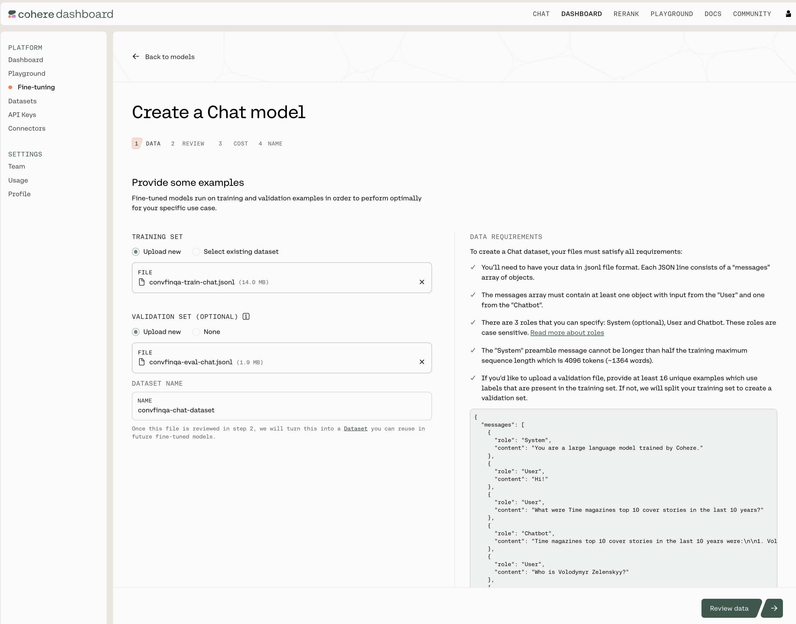

Customers can kick off fine-tuning jobs by completing the data preparation and validation steps through the [Cohere dashboard](http://dashboard.cohere.com/fine-tuning). This is useful for customers who don't need or don't want to create a fine-tuning job programmatically via the [Fine-tuning API](/reference/listfinetunedmodels) or via the Cohere [Python SDK](/docs/fine-tuning), instead preferring the ease and simplicity of a web interface.

## Datasets

Before a fine-tuning job can be started, users must upload a [dataset](/docs/datasets) with training and (optionally) evaluation data. The contents and structure of the dataset will vary depending on the type of fine-tuning. Read more about preparing the training data for [Chat](/docs/chat-preparing-the-data), [Classify](/docs/classify-preparing-the-data), and [Rerank](/docs/rerank-preparing-the-data) fine-tuning.

Your Datasets can be managed in the [Datasets dashboard](https://dashboard.cohere.com/datasets).

## Starting a Fine-tuning job

After uploading the dataset and going through the validation and review data phases in the UI, the fine-tuning job can begin. Read more about starting the fine-tuning jobs for [Chat](/docs/chat-starting-the-training), [Classify](/docs/classify-starting-the-training), and [Rerank](/docs/rerank-starting-the-training).

## Fine-tuning results

You will receive an email notification when the fine-tuned model is ready. You can explore the evaluation metrics using the [Dashboard](http://dashboard.cohere.com/fine-tuning) and try out your model using one of our APIs on the interactive [Playground](https://dashboard.cohere.com/playground/).

## Fine-tuning job statuses

As your fine-tuning job progresses, it will progress through various stages. The following table describes the meaning of the various status messages you might encounter:

| Status    | Meaning                                                                                                                        |
| :-------- | :----------------------------------------------------------------------------------------------------------------------------- |
| Queued    | The fine-tuning job is queued and will start training soon.                                                                    |
| Training  | The fine-tuning job is currently training.                                                                                     |
| Deploying | The fine-tuning job has finished training and is deploying the model endpoint.                                                 |
| Ready     | The fine-tuning job has finished and is ready to be called.                                                                    |
| Failed    | The fine-tuning job has failed. Please contact customer support if you need more help in understanding why the job has failed. |
