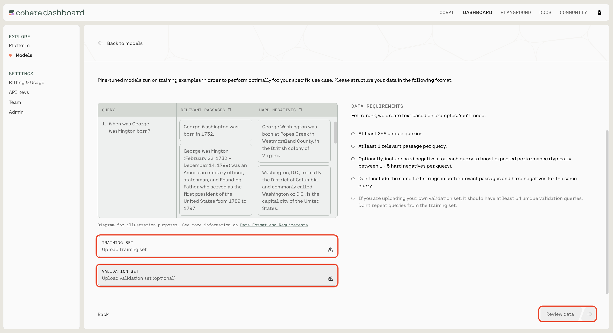
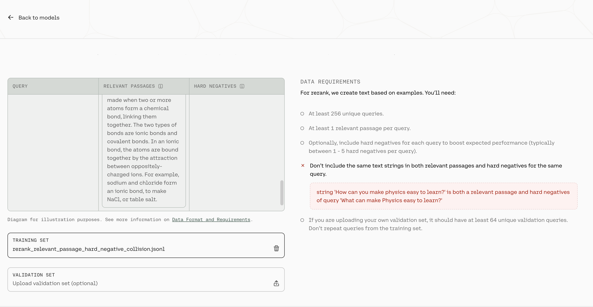
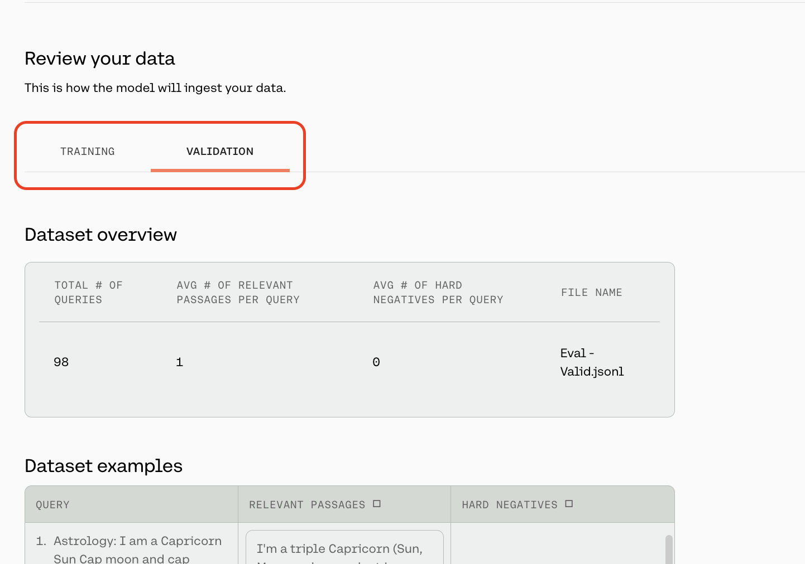
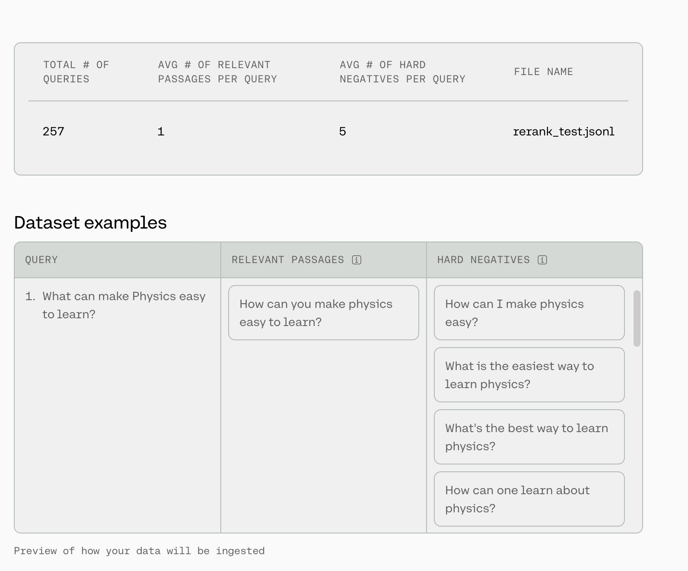
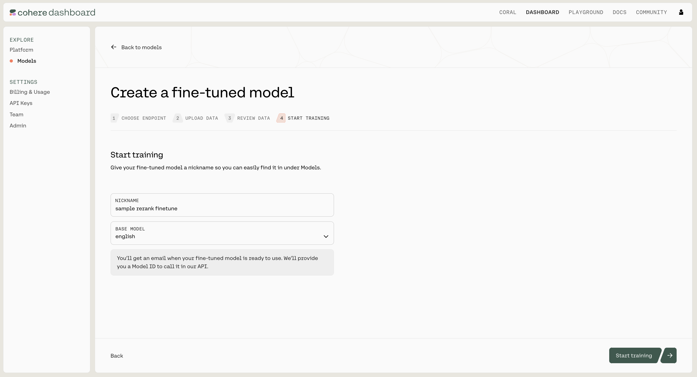

In this section, we will walk through how you can start training a fine-tuning model for Rerank on both the Web UI and  the Python SDK.

## Web UI

Creating a fine-tuned model for Rerank via the Web UI consists of a few simple steps, which we'll walk through now.

### Choose the Rerank Option

Go to the [fine-tuning page](http://dashboard.cohere.com/fine-tuning) and click on 'Create a Rerank model'.


### Upload Your Data

Upload your custom dataset data by going to 'Training data' and clicking on the upload file button. Your data should be in `jsonl` format with three fields: `query`, `relevant_passages`, and `hard_negatives`. 

- `query`: this field contains the question or target
- `relevant_passages`: this field contains a list of documents or passages with information that answers the `query`. For every query there must be at least one `relevant_passage`
- `hard_negatives`: this represents examples that appear to be relevant to the query but ultimately are not because they don’t contain the answer. They differ from easy negatives which are totally unrelated to the query. Hard negatives are optional but providing them lead to improvements of the overall performance. We believe ~five hard negatives leads to meaningful improvement, so include that many, if possible.




You also have the option of uploading a validation dataset. This will not be used during training, but will be used for evaluating the model’s performance during training. To do so, go to 'Upload validation set (optional)' and repeat the same steps you just completed with the training dataset. If you don’t upload a validation dataset, the platform will automatically set aside part of the training dataset to use for validation.

At this point in time, the platform will error if you upload a query in which a passage is listed as both a relevant passage and a hard negative

<Frame caption="In the image above, there is a row in the training file where the query `What can make Physics easy to learn?` has the string `How can you make physics easy to learn` in both the `relevant_passages` list and the `hard_negatives` list.">

</Frame>


In addition, if your `hard_negatives` are empty strings or duplicated in a given row, we will remove those from the training set as well. 

Once done, click 'Next'.

### Preview Your Data

The preview window will show a few samples of your custom training dataset, and your validation dataset (if you uploaded it).




Toggle between the 'Training' and 'Validation' tabs to see a sample of your respective datasets. 




At the top of this page, we will show some dataset statistics, such as the average number of relevant passages per query and the average number of hard negatives per query. We will also display a total of three queries from your dataset so you can check for formatting.

If you are happy with how the samples look, click 'Continue'.

### Start Training

Now, everything is set for training to begin. Click 'Start training' to proceed.




### Calling the Fine-tuned Model

Calling your fine-tuned model is currently not support via the Web UI. Please use the Python SDK instead.

## Python SDK

In addition to using the [Web UI](/docs/fine-tuning-with-the-web-ui) for fine-tuning models, customers can also kick off fine-tuning jobs programmatically using the [Cohere Python SDK](https://pypi.org/project/cohere/). This can be useful for fine-tuning jobs that happen on a regular cadence, such as fine-tuning nightly on newly-acquired data.

Using the `co.finetuning.create_finetuned_model()` method of the Cohere client, you can kick off a training job that will result in a fine-tuned model.

### Examples

Here are some example code snippets for you to use.

#### Starting a fine-tuning job

```python PYTHON
# create dataset
rerank_dataset = co.datasets.create(name="rerank-dataset",
                                    data=open("path/to/train.jsonl", "rb"),
                                    type="reranker-finetune-input")
print(co.wait(rerank_dataset))
                                              
# start the fine-tuning job using this dataset
create_response = co.finetuning.create_finetuned_model(
  request=FinetunedModel(
    name="rerank-ft",
    settings=Settings(
      base_model=BaseModel(
        name="english",
        base_type="BASE_TYPE_RERANK",
      ),
      dataset_id=rerank_dataset.id,
    ),
  )
)

print(f"fine-tuned model ID: {create_response.finetuned_model.id}, fine-tuned model status: {create_response.finetuned_model.status}")
```

### Parameters:

Please see our API docs for the full documentation, for passing the request. For base_model, we currently have 2 parameters for rerank:

- `base_type` -  For rerank, this should always be "BASE_TYPE_RERANK"
- `name`(str) – The baseline rerank model you would like to train - we currently have two model options: english and multilingual. By default we will always train on the most recent version of the rerank models.

### Calling a fine-tuned model

```python PYTHON
import cohere

co = cohere.Client('Your API key')
# get the fine-tuned model object
get_response = co.finetuning.get_finetuned_model(create_response.finetuned_model.id)

response = client.rerank(
    query="which one is the best doc?",
    documents=["this is the first doc", "this is the second doc"],
    model=get_response.finetuned_model.id+"-ft",
)

# Printing the model's response.
print(response)
```

We can’t wait to see what you start building! Share your projects or find support on our [Discord](https://discord.com/invite/co-mmunity).
