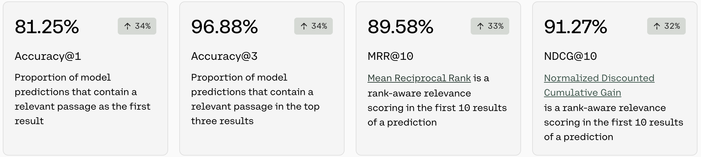
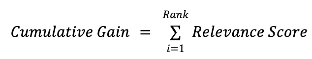
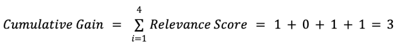
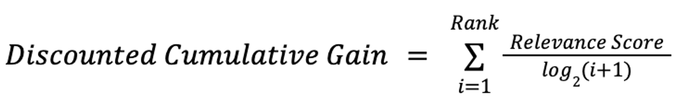
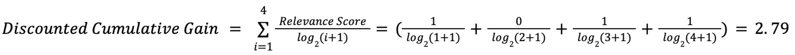
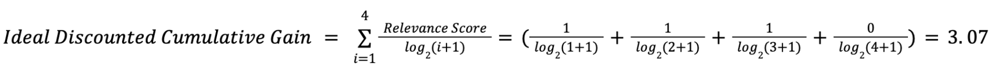
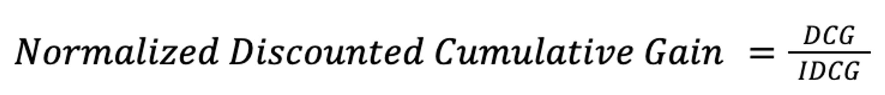
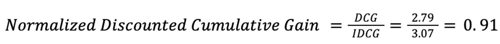

<Warning>
Cohere's fine-tuning feature was deprecated on September 15, 2025
</Warning>

In this section, we will explain the metrics for a fine-tuned model for Rerank.

Fine-tuned models for Rerank are trained using data consisting of queries mapping to relevant passages and documents and, for that reason, are evaluated using the same methods and performance metrics. You can also provide a test set of data that we will use to calculate performance metrics. If a test set is not provided, we will split your training data randomly to calculate performance metrics.

When you create a fine-tuned model for Rerank, you will see metrics that look like this:

### Accuracy@1 and Accuracy@3

Accuracy is a measure for a set of queries, how often the model was able to retrieve at least a single relevant passage in the top `k` documents. To evaluate Rerank models for accuracy on a given query, we ask the model to compute a list of `relevant passages`. For `Accuracy@1`, we check if the first ranked passage is a relevant result, and for `Accuracy@3`, we check if any of the top three ranked passages are relevant results.

The number in the pill (eg. 34%) is the difference between the accuracy of the default model when the user started training, and the accuracy of the model that is deployed. This difference is a proxy for how much accuracy improved when the model was trained on the dataset.

### MRR@10

MRR stands for [Mean Reciprocal Rank](https://en.wikipedia.org/wiki/Mean_reciprocal_rank) and is a rank-aware relevance score in the first 10 results of a ranking. The reciprocal rank of a query response is the multiplicative inverse of the rank of the **first correct answer**: 1 for first place, 1/2 for second place, and 1/n for the nth place. The mean reciprocal rank is the average of the reciprocal ranks of results for a sample of queries.

#### Example of how MRR@k is calculated (when k=2)

| QUERY                                     | PASSAGES / DOCUMENTS                                                                                                                                                                                                                                                              | FIRST RELEVANT RESPONSE                                                                                                                    | RANK | RECIPROCAL RANK |
| ----------------------------------------- | --------------------------------------------------------------------------------------------------------------------------------------------------------------------------------------------------------------------------------------------------------------------------------- | ------------------------------------------------------------------------------------------------------------------------------------------ | ---- | --------------- |
| When was George Washington born?          | `{George Washington was born at Popes Creek in Westmoreland County, in the British colony of Virginia.,Washington, D.C., formally the District of Columbia and commonly called Washington or D.C., is the capital city of the United States., George Washington was born in 1732.}` | `George Washington was born in 1732.`                                                                                                       | 3    | `1/3`             |
| What is the capital of the United States? | `{Capital punishment has existed in the United States since before the United States was a country. ,Washington, D.C. (also known as simply Washington or D.C., and officially as the District of Columbia) is the capital of the United States.}`              | `Washington, D.C. (also known as simply Washington or D.C., and officially as the District of Columbia) is the capital of the United States` | 2    | `1/2`             |

Given these two samples we could calculate the mean reciprocal rank as `((1/3)+(1/2))/2=5/12`or 0.42.

### nDCG@10

NDCG stands for Normalized Discounted Cumulative Gain and is a rank-aware relevance score. It measures the effectiveness of a ranking system, taking into the account the position of relative items in a ranked list. NDCG, emphasizes that highly relevant documents should appear earlier in the result list. NDCG is calculated by taking the Discounted Cumulative Gain (DCG) divided by the Ideal Discounted Cumulative Gain (IDCG).

#### Example of how nDCG@k is Calculated

Supposed for a given query you have the following order of passages returned. For each passage it is assigned a relevant score; each relevant score is from the test set (i.e. each passages gets 1 if it's one of the relevant passages of the set with respect to the query, otherwise 0). In this case we have 4 passages so we will be calculating when k=4

| PASSAGES | RANK (ORDER IN WHICH THE PASSAGE WAS RETURNED) | RELEVANCE SCORE |
| -------- | ---------------------------------------------- | --------------- |
| Doc A    | 1                                              | 1               |
| Doc B    | 2                                              | 0               |
| Doc C    | 3                                              | 1               |
| Doc D    | 4                                              | 1               |

The following are the necesary steps you need to take to calculate `nDCG@k`

#### Example of how Cumulative Gain is Calculated

Cumulative Gain (CG) is a building block to calculate Discounted Cumulative Gain (DCG) - to calculate the CG, it would be the following formula:

To calculate the CG of the example above it would be:

#### Example of how Discounted Cumulative Gain is Calculated

Whether or not `Doc B` was returned in position 1,2,3, or 4, the value of `CG` would not change because it is not `rank-aware`. Because of this, we want to apply some weighting factor. In general, this weight factor would be the relevance score over the `log(i+1)`, where `i` represents the position of the document and log base 2 is used. The formula to calculate DCG is as follows:

To calculate the DCG of the example above it would be:

#### Example of how Ideal Discounted Cumulative Gain is Calculated

In order to compute the NDCG, we have to start by computing the Ideal Discounted Cumulative Gain (IDCG), which represents the ideal order. In the example above, for instance, we have `Doc B` placed higher than `Doc C` and `Doc D`, which are relevant documents. Since `Doc C` and `Doc D` have the same relevance score, it does not matter which of these passages is retrieved first. A more ideal ranking could be `Doc A`,`Doc D`,`Doc C`,`Doc B`.

To continue to calculating IDCG, we would use this:

#### Example of How Normalized Discounted Cumulative Gain is Calculated

Normalized Discounted Cumulative Gain (NDCG) normalizes the DCG of a query and its ranked results by the IDCG. The formula for calculating DCG is as follows:

To calculate the NDCG of the example above it would be:

### Putting it all Together

NDCG is calculated as a `rank-aware` metric by comparing a query and the computed ranking of documents against the ideal ranking. For `NDCG@10` we care only about the top 10 documents in the ranked list.
