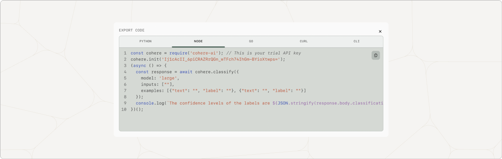

## How Long Does it Take to Train a Model?

Trainings are completed sequentially, and when you launch a training session, it is added to the end of a queue. Depending on the length of our training queue, training may take between an hour and a day to complete.

## Using Your Trained Model

To use your trained model in our API or SDKs, you must call it by its model UUID and not by its name. To get the model UUID, select the model in the playground and click `Export Code`. Select the language you are using and copy the code to call the model.

_This is a screenshot of how to locate the model path to call your custom model._

## Restarting A Paused Fine-tuned Model

Rerank finetuned models are paused after 24 hours of inactivity. To restart your model, select your model in the trained models panel and click on the `Wake` button.

## Troubleshooting A Failed Training Run

Our engineers review every individual failed training run and will attempt to rectify it, without any action on your part. We reach out to individuals with failed custom models we cannot resolve manually.

# FAQs

### How do I Know if my Fine-tuned Model is Actually Better than the Base Model?

We recommend generating samples from both the base model and the fine-tuned model on a test set. Then, compare these examples directly through human evaluations.

### How Many Fine-tuning jobs can I have?

Standard organizations are allowed 10 jobs per day (15 jobs in total), while enterprises are allowed 25 jobs per day (with no limit on total). 

### Will my Fine-tuned Models be Deleted?

No, we do not delete any fine-tuned models. 

Please reach out to [support@cohere.com](mailto:support@cohere.com) or post in [our Discord](https://discord.com/invite/co-mmunity) if you have unanswered questions about fine-tuning.
