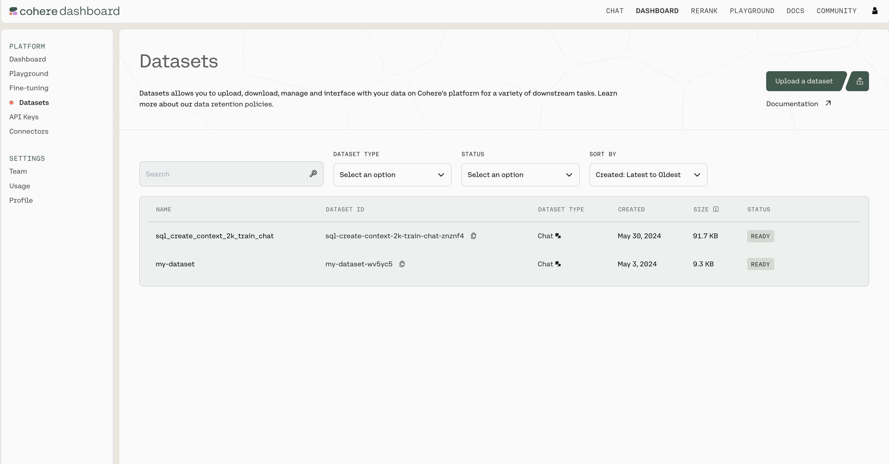

The Cohere platform allows you to upload and manage datasets that can be used for Fine-tuning models or in  batch embedding with [Embedding Jobs](/docs/embed-jobs-api). Datasets can be managed [in the Dashboard](https://dashboard.cohere.com/datasets) or programmatically using the [Datasets API](/reference/create-dataset).


<br />

### File Size Limits

There are certain limits to the files you can upload, specifically:

- A Dataset can be as large as 1.5GB
- Organizations have up to 10GB of storage across all their users

### Retention

You should also be aware of how Cohere handles data retention. This is the most important context:

- Datasets get deleted 30 days after creation
- You can also manually delete a dataset in the Dashboard UI or [using the Datasets API](/reference/delete-dataset)

## Managing Datasets using the Python SDK

### Getting Set up

First, let's install the SDK

```python
pip install cohere
```

Import dependencies and set up the Cohere client.

```python
import cohere
co = cohere.Client(api_key='Your API key')
```

(All the rest of the examples on this page will be in Python, but you can find more detailed instructions for getting set up by checking out the Github repositories for [Python](https://github.com/cohere-ai/cohere-python), [Typescript](https://github.com/cohere-ai/cohere-typescript), and [Go](https://github.com/cohere-ai/cohere-go).)

### Dataset Creation

Datasets are created by uploading files, specifying both a `name` for the dataset and the `dataset_type`.

The file extension and file contents have to match the requirements for the selected `dataset_type`. See the table below to learn more about the supported dataset types. 

The dataset `name` is useful when browsing the datasets you've uploaded. In addition to its name, each dataset will also be assigned a unique `id` when it's created.

Here is an example code snippet illustrating the process of creating a dataset, with both the `name` and the `dataset_type` specified.

```python
my_dataset = co.datasets.create(
	name="shakespeare",
	data=open("./shakespeare.csv", "rb"),
	dataset_type="prompt-completion-finetune-input")

print(my_dataset.id)
```

### Dataset Validation

Whenever a dataset is created, the data is validated asynchronously against the rules for the specified `dataset_type` . This validation is kicked off automatically on the backend, and must be completed before a dataset can be used with other endpoints.

Here's a code snippet showing how to check the validation status of a dataset you've created.

```python
ds = co.wait(my_dataset)
print(ds.validation_status)
```

To help you interpret the results, here's a table specifying all the possible API error messages and what they mean:

| Error Code | Endpoint   | Error Explanation                                                          | Actions Required                                                                   |
| :--------- | :--------- | :------------------------------------------------------------------------- | :--------------------------------------------------------------------------------- |
| 400        | Create     | The name parameter must be set.                                            | Set a name parameter.                                                              |
| 400        | Create     | The type parameter must be set.                                            | Set a type parameter.                                                              |
| 400        | Create     | The dataset type is invalid.                                               | Set the type parameter to a supported type.                                        |
| 400        | Create     | You have exceeded capacity.                                                | Delete unused datasets to free up space.                                           |
| 400        | Create     | You have used an invalid csv delimiter.                                    | The csv delimiter must be one character long.                                      |
| 400        | Create     | The name must be less than 50 characters long.                             | Shorten your dataset name.                                                         |
| 400        | Create     | You used an invalid parameter for part: %v use file or an evaluation file. | The file parameters must be a named file or an evaluation file.                    |
| 499        | Create     | The upload connection was closed.                                          | Don't cancel the upload request.                                                   |
|            | Validation | The required field {} was not fund in the dataset (line: {})               | You are missing a required field, which must be supplied.                          |
|            | Validation | Custom validation rules per type                                           | There should be enough context in the validation error message to fix the dataset. |
|            | Validation | csv files must have a header with the required fields: [{}, {}, ...].      | Fix your csv file to have a 'headers' row with the required field names.           |
| 404        | Get        | The dataset with id '{}' was not found.                                    | Make sure you're passing in the right id.                                          |

### Dataset Metadata Preservation

The Dataset API will preserve metadata if specified at time of upload. During the `create dataset` step, you can specify either `keep_fields` or `optional_fields` which are a list of strings which correspond to the field of the metadata you’d like to preserve. `keep_fields` is more restrictive, where if the field is missing from an entry, the dataset will fail validation whereas `optional_fields` will skip empty fields and validation will still pass.

#### Sample Dataset Input Format

```json
{"wiki_id": 69407798, "url": "https://en.wikipedia.org/wiki?curid=69407798", "views": 5674.4492597435465, "langs": 38, "title": "Deaths in 2022", "text": "The following notable deaths occurred in 2022. Names are reported under the date of death, in alphabetical order. A typical entry reports information in the following sequence:", "paragraph_id": 0, "id": 0}
{"wiki_id": 3524766, "url": "https://en.wikipedia.org/wiki?curid=3524766", "views": 5409.5609619796405, "title": "YouTube", "text": "YouTube is a global online video sharing and social media platform headquartered in San Bruno, California. It was launched on February 14, 2005, by Steve Chen, Chad Hurley, and Jawed Karim. It is owned by Google, and is the second most visited website, after Google Search. YouTube has more than 2.5 billion monthly users who collectively watch more than one billion hours of videos each day. , videos were being uploaded at a rate of more than 500 hours of content per minute.", "paragraph_id": 0, "id": 1}
```

As seen in the above example, the following would be a valid `create_dataset` call since `langs` is in the first entry but not in the second entry. The fields `wiki_id`, `url`, `views` and `title` are present in both JSONs.

```python
# Upload a dataset for embed jobs
ds=co.datasets.create(
	name='sample_file',
	# insert your file path here - you can upload it on the right - we accept .csv and jsonl files
	data=open('embed_jobs_sample_data.jsonl', 'rb'),
	keep_fields=['wiki_id','url','views','title']
	optional_fields=['langs']
	dataset_type="embed-input",
  embedding_types=['float']
	)

# wait for the dataset to finish validation
print(co.wait(ds))
```

### Using Datasets for Fine-tuning

Once the dataset passes validation, it can be used to fine-tune a model. To do this properly, you must include at least five train examples per label.

In the example below, we will create a new dataset and upload an evaluation set using the optional `eval_data` parameter. We will then kick off a fine-tuning job using `co.finetuning.create_finetuned_model`.

```python
# create a dataset
my_dataset = co.datasets.create(
	name="shakespeare",
	dataset_type="prompt-completion-finetune-input",
	data=open("./shakespeare.csv", "rb"),
  eval_data=open("./shakespeare-eval.csv", "rb")
)

co.wait(my_dataset)

# start training a custom model using the dataset
co.finetuning.create_finetuned_model(
	name="shakespearean-model", 
	model_type="GENERATIVE", 
	dataset=my_dataset)
```

### Dataset Types

When a dataset is created, the `dataset_type` field _must_ be specified in order to indicate the type of tasks this dataset is meant for.

Datasets of type `chat-finetune-input`, for example, are expected to have a json with the field `messages` containing a list of messages: 

```python
{
  "messages": [
    {
      "role": "System",
      "content": "You are a large language model trained by Cohere."
    },
    {
      "role": "User",
      "content": "Hi! What were Time magazines top 10 cover stories in the last 10 years?"
    },
    {
      "role": "Chatbot",
      "content": "Time magazines top 10 cover stories in the last 10 years were:\\n\\n1. Volodymyr Zelenskyy\\n2. Elon Musk\\n3. Martin Luther King Jr.\\n4. How Earth Survived\\n5. Her Lasting Impact\\n6. Nothing to See Here\\n7. Meltdown\\n8. Deal With It\\n9. The Top of America\\n10. Bitter Pill"
    }
}
```

The following table describes the types of datasets supported by the Dataset API:

| Dataset Type                           | Description                                                                                                                                                                     | Schema                                                                                     | Rules                                                                                                                                                                      | Task Type                   | Status                    | File Types Supported           | Are Metadata Fields Supported? | Sample File                                                                                                                                                                               |
|----------------------------------------|---------------------------------------------------------------------------------------------------------------------------------------------------------------------------------|--------------------------------------------------------------------------------------------|----------------------------------------------------------------------------------------------------------------------------------------------------------------------------|-----------------------------|---------------------------|--------------------------------|--------------------------------|---------------------------------------------------------------------------------------------------------------------------------------------------------------------------------------------|
| `single-label-classification-finetune-input` | A file containing text and a single label (class) for each text                                                                                                                 | `text:string  \nlabel:string`                                                              | You must include 40 valid train examples,  \nwith five examples per label. A label cannot be present in all examples  \nThere must be 24 valid evaluation examples.        | Classification Fine-tuning  | Supported                 | `csv` and `jsonl`               | No                             | [Art classification file](https://drive.google.com/file/d/15-CchSiALUQwto4b-yAMWhdUqz8vfwQ1/view?usp=drive_link)                                                                          |
| `multi-label-classification-finetune-input`  | A file containing text and an array of label(s) (class) for each text                                                                                                            | `text:string  \nlabel:list[string]`                                                        | You must include 40 valid train examples, with five  examples per label  \nA label cannot be present in all examples. There must be 24 valid evaluation examples.          | Classification Fine-tuning  | Supported                 | `jsonl`                          | No                             | n/a                                                                                                                                                                                         |
| `reranker-finetune-input`              | A file containing queries and an array of passages relevant to the query. There must also be "hard negatives", passages semantically similar but ultimately not relevant.        | `query:string  \nrelevant_passages:list[string]  \nhard_negatives:list[string]`            | There must be 256 train examples and at least 64 evaluation examples. There must be  at least one relevant passage, with no overlap between relevant passage and hard  negatives. | Rerank Fine-tuning          | Supported                 | `jsonl`                          | No                             | [train_valid.json](https://drive.google.com/file/d/1CmXWfQRedVyWBDCsSkeF9g8gyqmpUA7C/view?usp=drive_link)                                                                                  |
| `chat-finetune-input`                  | A file containing conversations                                                                                                                                                 | `messages: list[Message]`  \n  \n`- Message -  \n  role: text  \n  context: text`          | There must be two valid train examples and one valid evaluation example.                                                                                                     | Chat Fine-tuning            | In progress/not supported | `jsonl`                          | No                             | [train_celestial_fox.json](https://drive.google.com/file/d/19x6sOPXNWoZj9Jo989h09wd4IJ6Su9by/view?usp=drive_link)                                                                         |
| `embed-input`                          | A file containing text to be embedded                                                                                                                                           | `text:string`                                                                              | None of the rows in the file can be empty.                                                                                                                                | Embed job                   | Supported                 | `csv` and `jsonl`               | Yes                            | [embed_jobs_sample_data.jsonl](https://raw.githubusercontent.com/cohere-ai/notebooks/main/notebooks/data/embed_jobs_sample_data.jsonl) / [embed_jobs_sample_data.csv](https://github.com/cohere-ai/notebooks/blob/main/notebooks/data/embed_jobs_sample_data.csv) |


### Downloading a dataset

Datasets can be fetched using its unique `id`. Note that the dataset `name` and `id` are different from each other; names can be duplicated, while `id`s cannot.

Here is an example code snippet showing how to fetch a dataset by its unique `id`.

```python
# fetch the dataset by ID
my_dataset = co.datasets.get(id="<DATASET_ID>")

# print each entry in the dataset
for record in my_dataset.open():
  print(record)

# save the dataset as jsonl
co.utils.save_dataset(dataset=my_dataset, filepath='./path/to/new/file.jsonl')
# or save the dataset as csv
co.utils.save_dataset(dataset=my_dataset, filepath='./path/to/new/file.csv')
```

### Deleting a dataset

Datasets are automatically deleted after 30 days, but they can also be deleted manually. Here's a code snippet showing how to do that:

```python
co.datasets.delete(id="<DATASET_ID>")
```
