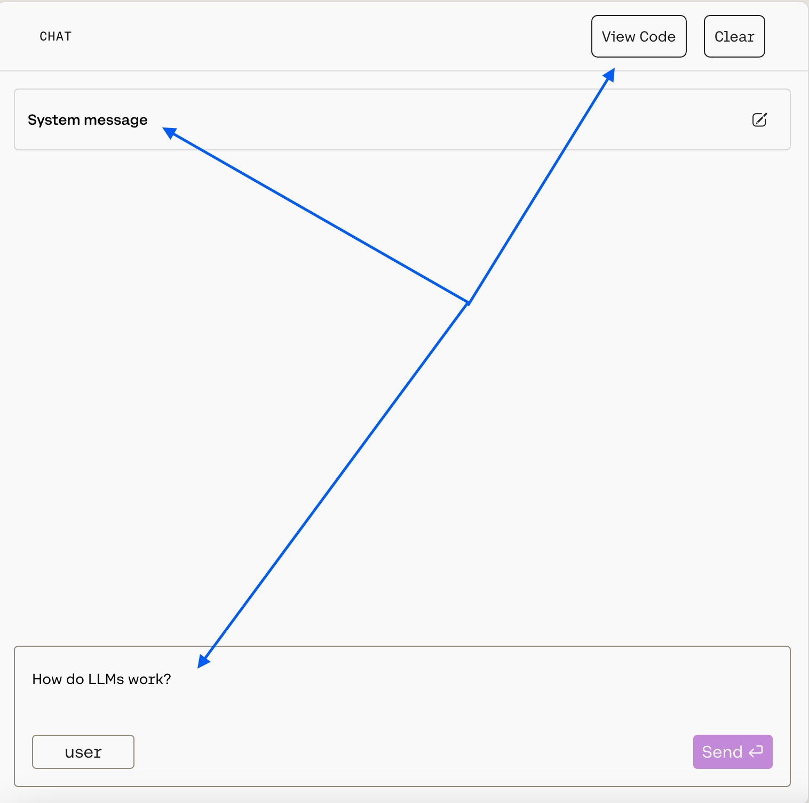
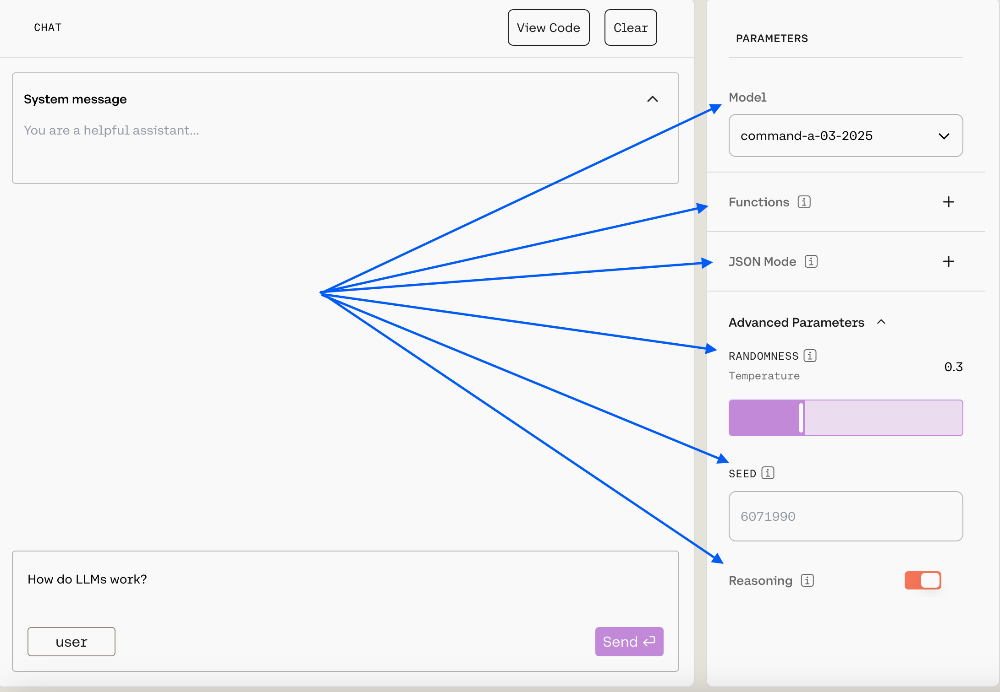
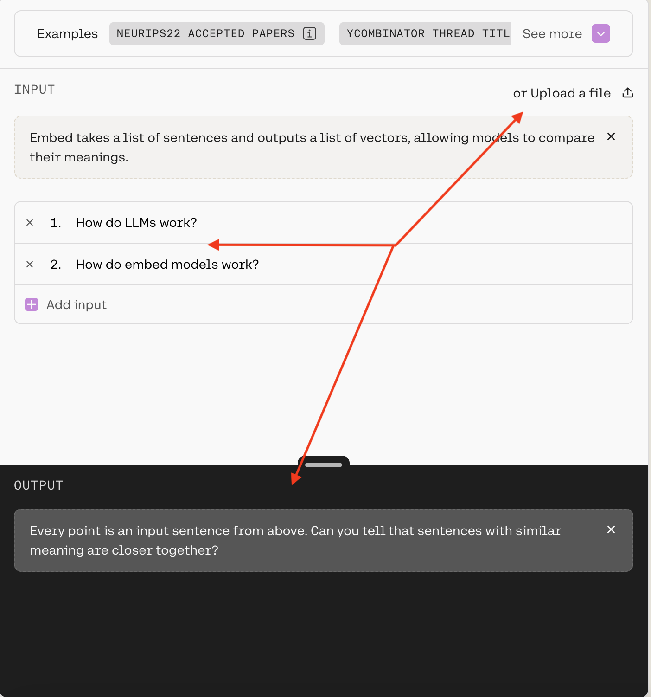
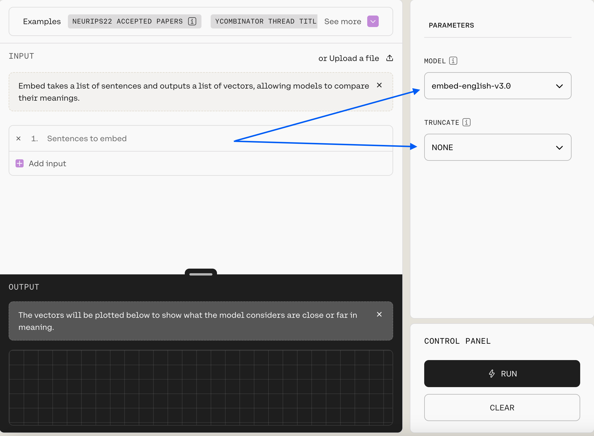
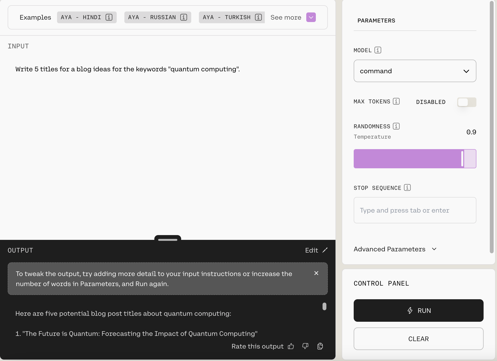

## What is the Playground?

The [Cohere Playground](https://dashboard.cohere.com/playground) is a visual interface supporting three models:

- [Chat](https://docs.cohere.com/reference/chat)
- [Embed](https://docs.cohere.com/reference/embed)
- [Generate (legacy)](https://docs.cohere.com/v1/reference/generate)

The Playground is ideal for users wanting to try test our models against specific use cases without writing code; when you're ready to start building, simply click `View Code` to get the underlying logic to add to your application.

## Using the Playground

In the next few sections, we'll walk through the Playground for each of the three supported models.

### Chat

The [Chat endpoint](https://docs.cohere.com/reference/chat) provides a natural language response to a prompt. You can use the Chat Playground to generate text, answer a question or create content. Here are the highlights:

Your message goes in the `Message...` box at the bottom. You can pass your message by hitting `Enter` or by clicking the `Send` button.

You customize the model behavior with the `System message`, which is a prompt that guides the model as it generates output. You can learn more about how to craft a system message in our [dedicated guide](https://docs.cohere.com/docs/preambles).

To customize further, you can use the panel on the right:

Here's an outline of what's available:

- `Model`: Choose from a list of our generation models (we recommend `command-a-03-2025`, the default).
- `Functions`: Function calling allows developers to connect models to external functions like APIs, databases, etc., take actions in them, and return results for users to interact with. Learn more in [tool use](https://docs.cohere.com/docs/tool-use) docs.
- `JSON Mode`: This is part of Cohere's [structured output](https://docs.cohere.com/docs/structured-outputs) functionality. When enabled, the model's response will be a JSON object that matched the schema that you have supplied. Learn more in [JSON mode](https://docs.cohere.com/docs/json-mode).
- Under `Advanced Parameters`, you can customize the `temperature` and `seed`. A higher temperature will make the model more creative, while a lower temperature will make the model more focused and deterministic, and seed can help you keep outputs consistent. Learn more [here](https://docs.cohere.com/docs/predictable-outputs).
- Under `Advanced Parameters`, you'll also see the ability to turn on reasoning. This will cause the model to consider the implications of its response and provide a justification for its output. More information will be available as we continue to roll out this feature.

### Embed

The [Embed](https://docs.cohere.com/reference/embed) model enables users to create numerical representations for strings and visualize their comparative meaning--phrases similar in meaning should ideally be closer together. 

To create embeddings through the playground, you can either use `Add input` to feed the model strings, or you can use `Upload a file`. If you select `Run`, you'll see the two-dimensional visualization of the strings.

As with Chat, the Playground's Embed model interface offers a side panel where you can further customize the model:

Here's an outline of what's available:

- `Model`: Choose from a list of our embedding models (we recommend `embed-english-v3.0`, the default).
- `Truncate`: This allows you to specify how the API will handle inputs longer than the maximum token length.

### Generate

Since generate is a legacy endpoint, we will not cover it in detail. However, its interface looks and works more or less exactly as the Chat model's:

