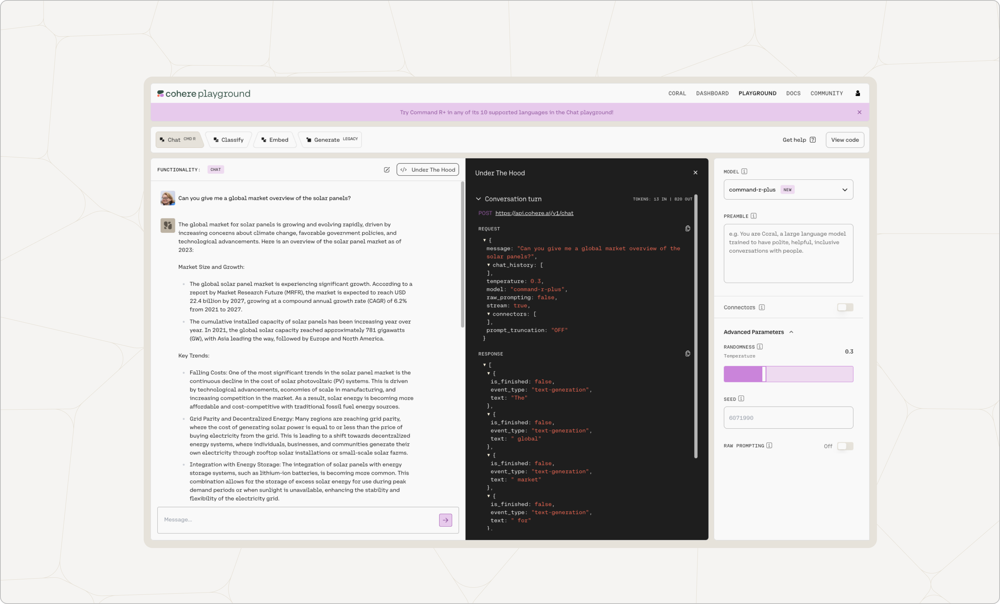
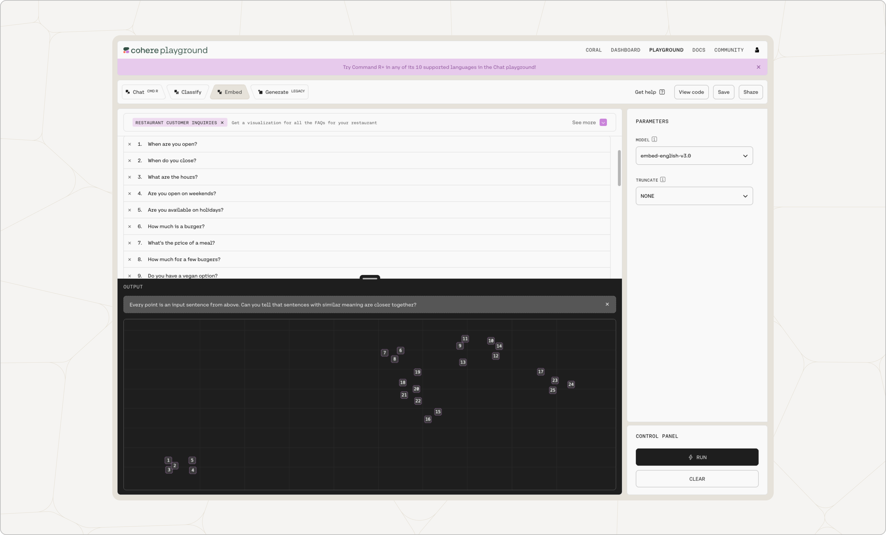
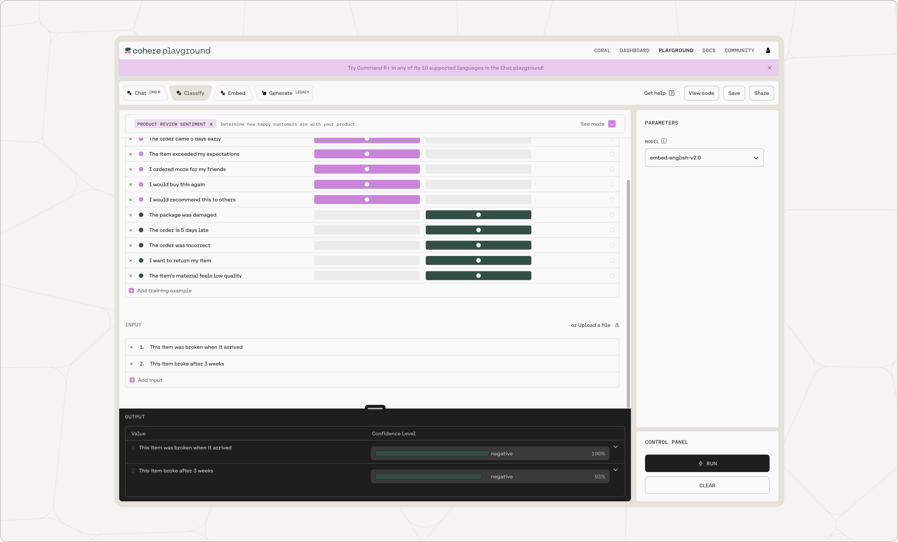
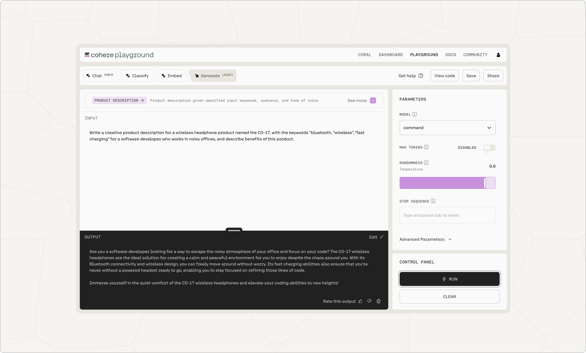

## What is the Playground?

The [Developer Playground](https://dashboard.cohere.com/playground) is a visual interface for users to try out our APIs and iterate on prompts without writing a single line of code. Use the Playground to test your use cases and when you're ready to start building, simply click `View Code` to add Cohere's functionality to your application.

## Using the Playground

### Chat

The Chat API provides a natural language response to a prompt.  You can use the Chat Playground to generate text, answer a question or create content.  There is a default preamble, which you can change in the playground. The preamble and the messages are sent to the model to generate a response. 

- To write inputs that produce the best results for your use case, read our [Prompt Engineering](/docs/prompt-engineering) guide.
- Try tinkering with different [temperature](/docs/temperature)  to get different outputs.
- You can also toggle raw prompting on the playground.  If raw prompting is turned off, the user's input will be sent to the playground without any preprocessing.

  

### Embed

Using [Embed](/reference/embed) in the Playground enables users to assign numerical representations to strings and visualize comparative meaning on a 2-dimensional plane. Phrases similar in meaning should ideally be closer together on this visualization. Add a couple of your own phrases and see if the Playground visualization feels accurate to you.

Cohere [embeddings](/docs/embeddings) can be used to train a semantic classifier out of the box, saving users countless hours gathering data to train a model themselves.

### Classify

The Cohere [Classify](/reference/classify) endpoint enables users to create a classifier from a few labeled examples.

### Generate

[Generate](/reference/generate) produces natural language text in response to an input prompt. Generate is a [legacy](/docs/migrating-from-cogenerate-to-cochat) endpoint.  As seen in the screenshot below, we supplied the model with a prompt, "Given a product and keywords, this program will generate exciting product descriptions. Here are some examples:" and gave two examples of a product and keywords. The bolded text was generated by the model.

- To write inputs that produce the best results for your use case, read our [Prompt Engineering](/docs/prompt-engineering) guide.
- Try tinkering with different [temperature](/docs/temperature) and [token-picking](/docs/controlling-generation-with-top-k-top-p) settings to alter the model's output behavior.
- To further improve your generations or to get the model to focus on generating text about a specific topic, try uploading a sample text to [train](/docs/generate-starting-the-training) the model. If you're interested in training a model, please submit a Full Access request from your Cohere Dashboard.

Try asking the model to do any of the following:

- Summarize a paragraph of text
- Generate SEO tags for a blog post
- Produce some questions for your next trivia night
- Provide ideas of what to do in your city this weekend

In each case, give the model a few examples your desired output.

Additionally, note the `Show Likelihood` button within `Advanced Parameters`. This feature outputs the likelihood that each token would be generated by the model in the given sequence, as well as the average log-likelihood of each token in the input. Token likelihoods can be retrieved from our [Generate](/reference/generate) endpoint.

The log-likelihood is useful for [evaluating model performance](/docs/generate-understanding-the-results), especially when testing user-trained models. If you're interested in training a model, please submit a Full Access request from your Cohere Dashboard.
