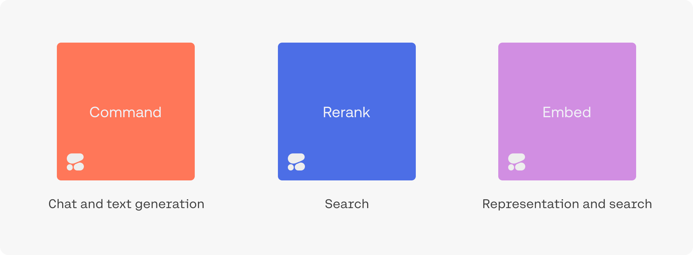
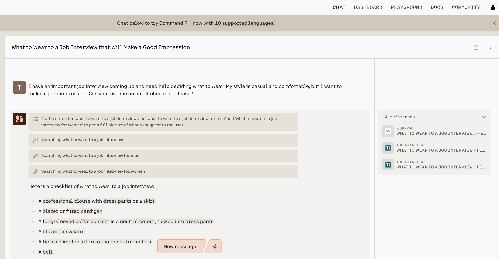
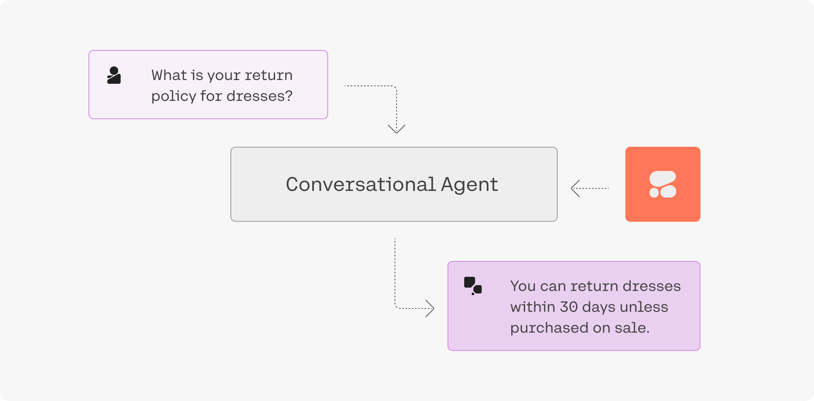
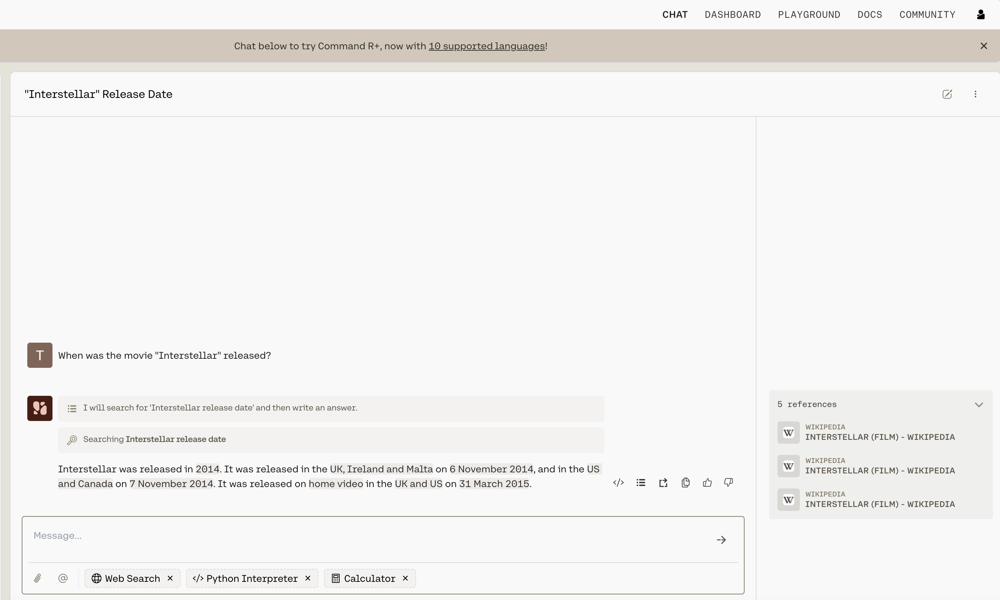
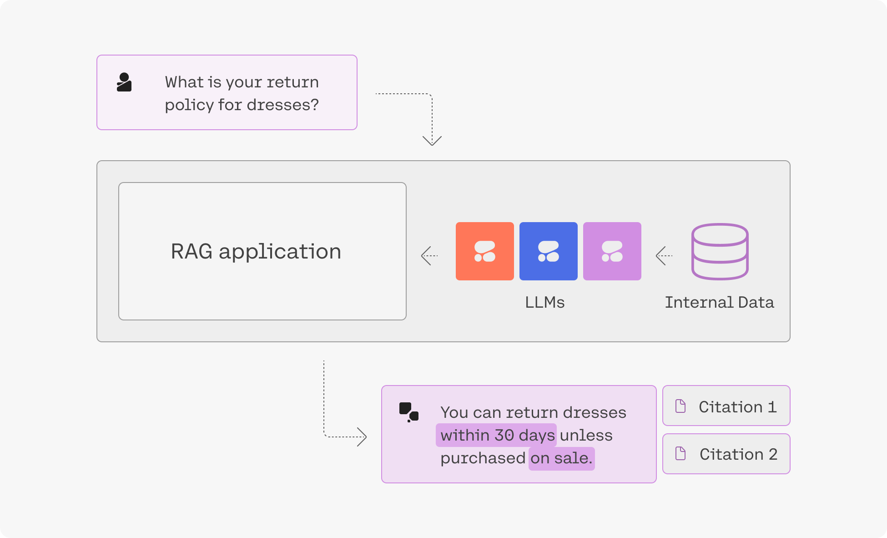
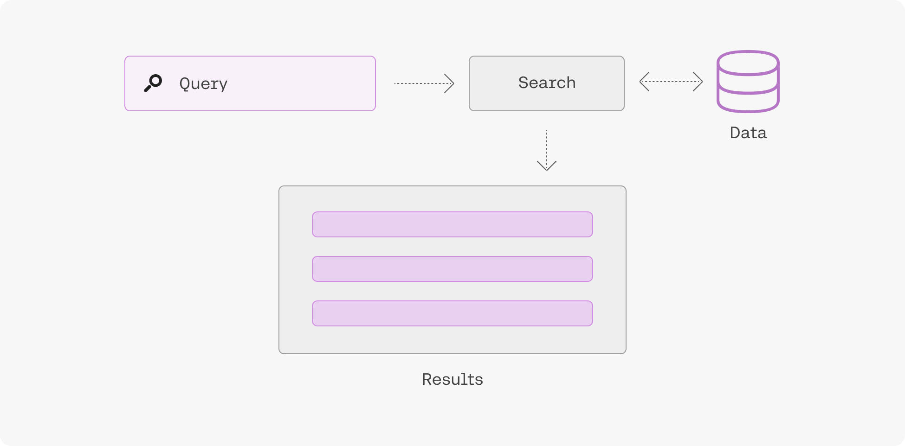
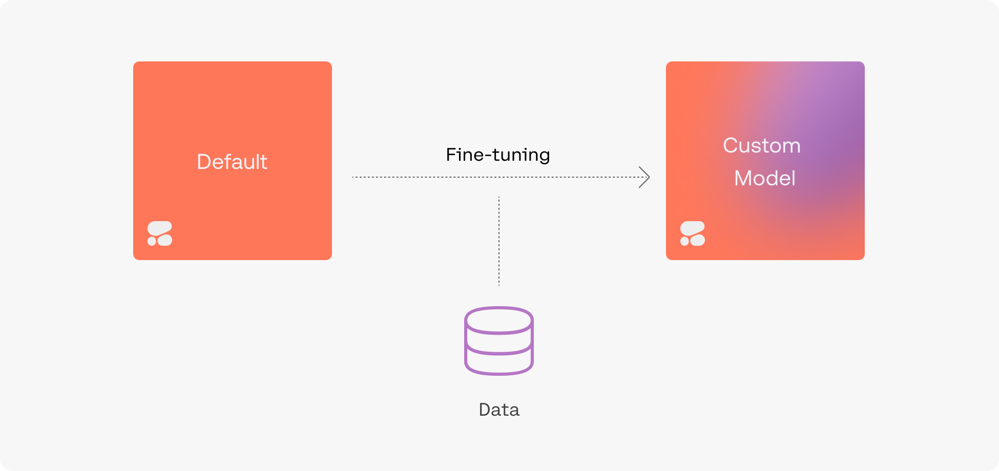
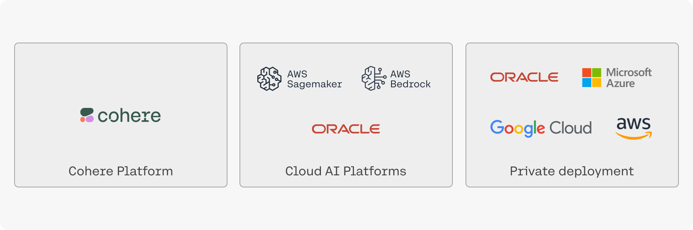

Cohere allows developers and enterprises to build LLM-powered applications. We do that by creating world-class models, along with the supporting platform required to deploy them securely and privately.

## Cohere Large Language Models (LLMs).

The Command family of models includes [Command](https://cohere.com/models/command), [Command R](/docs/command-r), and [Command R+](/docs/command-r-plus). Together, they are the text-generation LLMs powering conversational agents, summarization, copywriting, and similar use cases. They work through the [Chat](/reference/chat) endpoint, which can be used with or without [retrieval augmented generation](/docs/retrieval-augmented-generation-rag) RAG.

[Rerank](https://txt.cohere.com/rerank/) is the fastest way to inject the intelligence of a language model into an existing search system. It can be accessed via the [Rerank](/reference/rerank-1) endpoint.

[Embed](https://cohere.com/models/embed) improves the accuracy of search, classification, clustering, and RAG results. It also powers the [Embed](/reference/embed) and [Classify](/reference/classify) endpoints.

[Click here](/docs/foundation-models) to learn more about Cohere foundation models.

## These LLMs Make it Easy to Build Conversational Agents (and Other LLM-powered Apps)

Try [the Chat UI](https://coral.cohere.com) to see what an LLM-powered conversational agent can look like. It is able to converse, summarize text, and write emails and articles.

Our goal, however, is to enable you to build your own LLM-powered applications. The [Chat endpoint](/docs/chat-api), for example, can be used to build a conversational agent powered by the Command family of models. 

### Retrieval-Augmented Generation (RAG)

“Grounding” refers to the practice of allowing an LLM to access external data sources – like the internet or a company’s internal technical documentation – which leads to better, more factual generations. 

Chat is being used with grounding enabled in the screenshot below, and you can see how accurate and information-dense its reply is.

What’s more, advanced RAG capabilities allow you to see what underlying query the model generates when completing its tasks, and its output includes [citations](/docs/documents-and-citations) pointing you to where it found the information it uses. Both the query and the citations can be leveraged alongside the Cohere Embed and Rerank models to build a remarkably powerful RAG system, such as the one found in [this guide](https://cohere.com/llmu/rag-chatbot).

[Click here](/docs/serving-platform) to learn more about the Cohere serving platform.

### Use Language Models to Build Better Search and RAG Systems

Embeddings enable you to search based on what a phrase _means_ rather than simply what keywords it _contains_, leading to search systems that incorporate context and user intent better than anything that has come before.

Learn more about semantic search [here](/docs/intro-semantic-search).

## Create Fine-Tuned Models with Ease

To [create a fine-tuned model](/docs/fine-tuning), simply upload a dataset and hold on while we train a custom model and then deploy it for you. Fine-tuning can be done with [generative models](/docs/generate-fine-tuning), [multi-label classification models](/docs/classify-fine-tuning), [rerank models](/docs/rerank-fine-tuning), and [chat models](/docs/chat-fine-tuning).

## Where you can access Cohere Models

Depending on your privacy/security requirements there are a number of ways to access Cohere:

- [Cohere API](/reference/about): this is the easiest option, simply grab an API key from [the dashboard](https://dashboard.cohere.com/) and start using the models hosted by Cohere.
- Cloud AI platforms: this option offers a balance of ease-of-use and security. you can access Cohere on various cloud AI platforms such as [Oracle's GenAI Service](https://www.oracle.com/uk/artificial-intelligence/generative-ai/large-language-models/), AWS' [Bedrock](https://aws.amazon.com/bedrock/cohere-command-embed/) and [Sagemaker](https://aws.amazon.com/blogs/machine-learning/cohere-brings-language-ai-to-amazon-sagemaker/) platforms, [Google Cloud](https://console.cloud.google.com/marketplace/product/cohere-id-public/cohere-public?ref=txt.cohere.com), and [Azure's AML service](https://txt.cohere.com/coheres-enterprise-ai-models-coming-soon-to-microsoft-azure-ai-as-a-managed-service/).
- Private cloud deploy deployments: Cohere's models can be deployed privately in most virtual private cloud (VPC) environments, offering enhanced security and highest degree of customization. Please [contact sales](emailto:team@cohere.com) for information.

### On-Premise and Air Gapped Solutions

- On-premise: if your organization deals with sensitive data that cannot live on a cloud we also offer the option for fully-private deployment on your own infrastructure. Please [contact sales](emailto:team@cohere.com) for information.

### Let us Know What You’re Making

We hope this overview has whetted your appetite for building with our generative AI models. Reach out to us on [Discord](https://discord.com/invite/co-mmunity) with any questions or to showcase your projects – we love hearing from the Cohere community!
