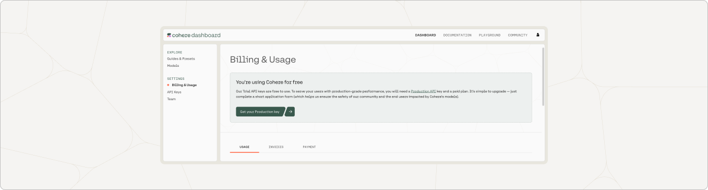

Cohere offers two kinds of API keys: trial keys (with a variety of attendant limitations), and production keys (which have no such limitations). 

In this document, we'll discuss some of the limitations associated with a trial key before turning to the parameters of a production key.  

## Trial Key Limitations

Trial keys are rate-limited depending on the endpoint you want to use:

| Endpoint                                                                                             | Calls per Minute |
| :--------------------------------------------------------------------------------------------------- | :--------------- |
| [Embed](/reference/embed)                                                     | 5                |
| [Rerank](/reference/rerank-1), [Chat](/reference/chat) | 10               |
| All other endpoints                                                                                  | 100              |

[Chat](/reference/chat) and the [Coral user interface](https://coral.cohere.ai/) are limited to a total of 1,000 calls a month with a trial key. All remaining endpoints are limited to a total of 1,000 calls per month with a trial key. 

If you’d like to use Cohere endpoints in a production application or require higher throughput from our endpoints for your usage, you can upgrade to a production key.

With a trial key:

- Organizations can still have unlimited trial keys in the free tier.
- There is a defined usage limit on all the development API keys per minute (all keys add up to that rate limit).
- When a developer/org reaches a rate limit, they will receive an error that they have exceeded the limit/minute.
- Playground usage counts toward your trial key rate limit.
- If calls exceed the throttling we throw an error that says “Trial keys are throttled." Please upgrade your API key or contact us directly on <a href="https://discord.com/invite/co-mmunity" target="_blank">Discord</a>.
- Trial keys are free to use even after you upgrade to a Production key.

## Production Key Specifications

Production keys for all endpoints are rate-limited at 10,000 calls per minute and are intended for serving Cohere in a public-facing application and testing purposes. Usage of production keys is metered at price points which can be found on our pricing page.

To get a production key, you will need to complete a few steps in our Go to Production workflow. You can start the process by navigating to the [API Keys](https://dashboard.cohere.com/api-keys) page in your Cohere dashboard as the Admin of your organization (or asking your organization Admin to complete these steps). From there, click on the _New Production Key_ button to start the process.

The process takes less than three minutes to finish and enables you to generate a Production key that you can use to serve Cohere APIs in production. If you deploy without completing the Go to Production workflow, your API key may be temporarily or permanently revoked.
