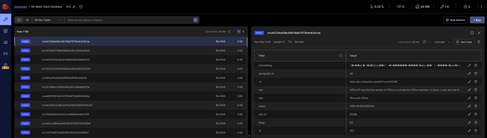

[RedisVL](https://www.redisvl.com/) provides a powerful, dedicated Python client library for using Redis as a Vector Database. This walks through how to integrate [Cohere embeddings](/docs/embeddings) with Redis using a dataset of Wikipedia articles to set up a pipeline for semantic search. It will cover:

- Setting up a Redis index
- Embedding passages and storing them in the database
- Embedding the user’s search query and searching against your Redis index
- Exploring different filtering options for your query

To see the full code sample, refer to this [notebook](https://github.com/cohere-ai/cohere-developer-experience/blob/main/notebooks/Cohere_Redis_Guide.ipynb). You can also consult [this guide](https://www.redisvl.com/user_guide/vectorizers_04.html#cohere) for more information on using Cohere with Redis.

## Prerequisites:

The code samples on this page assume the following:

- You have docker running locally

```shell SHELL
docker run -d --name redis-stack -p 6379:6379 -p 8001:8001 redis/redis-stack:latest
```

- You have Redis installed (follow this [link](https://www.redisvl.com/overview/installation.html#redis-stack-local-development) if you don't).
- You have a Cohere API Key (you can get your API Key at this [link](https://dashboard.cohere.com/api-keys)).

## Install Packages:

Install and import the required Python Packages:

- `jsonlines`: for this example, the sample passages live in a `jsonl` file, and we will use jsonlines to load this data into our environment.
- `redisvl`: ensure you are on version `0.1.0` or later
- `cohere`: ensure you are on version `4.45` or later

To install the packages, use the following code

```shell SHELL
!pip install redisvl==0.1.0
!pip install cohere==4.45
!pip install jsonlines
```

### Import the required packages:

```python PYTHON
from redis import Redis
from redisvl.index import SearchIndex
from redisvl.schema import IndexSchema
from redisvl.utils.vectorize import CohereTextVectorizer
from redisvl.query import VectorQuery
from redisvl.query.filter import Tag, Text, Num
import jsonlines
```

# Building a Retrieval Pipeline with Cohere and Redis

## Setting up the Schema.yaml:

To configure a Redis index you can either specify a `yaml` file or import a dictionary. In this tutorial we will be using a `yaml` file with the following schema. Either use the `yaml` file found at this [link](https://github.com/cohere-ai/cohere-developer-experience/blob/main/notebooks/configs/redis_guide_schema.yaml), or create a `.yaml` file locally with the following configuration.

```yaml YAML
version: "0.1.0"
index:
  name: semantic_search_demo
  prefix: rvl
  storage_type: hash

fields:
  - name: url
    type: text
  - name: title
    type: tag
  - name: text
    type: text
  - name: wiki_id
    type: numeric
  - name: paragraph_id
    type: numeric
  - name: id
    type: numeric
  - name: views
    type: numeric
  - name: langs
    type: numeric
  - name: embedding
    type: vector
    attrs:
      algorithm: flat
      dims: 1024
      distance_metric: cosine
      datatype: float32
```

This index has a name of `semantic_search_demo` and uses `storage_type: hash` which means we must set `as_buffer=True` whenever we call the vectorizer. Hash data structures are serialized as a string and thus we store the embeddings in hashes as a byte string.

For this guide, we will be using the Cohere `embed-english-v3.0 model` which has a vector dimension size of `1024`.

## Initializing the Cohere Text Vectorizer:

```python PYTHON
# create a vectorizer
api_key = "{Insert your cohere API Key}"

cohere_vectorizer = CohereTextVectorizer(
    model="embed-english-v3.0",
    api_config={"api_key": api_key},
)
```

Create a `CohereTextVectorizer` by specifying the embedding model and your api key.

The following [link](/docs/embed-2) contains details around the available embedding models from Cohere and their respective dimensions.

## Initializing the Redis Index:

```python PYTHON
# construct a search index from the schema - this schema is called "semantic_search_demo"
schema = IndexSchema.from_yaml("./schema.yaml")
client = Redis.from_url("redis://localhost:6379")
index = SearchIndex(schema, client)

# create the index (no data yet)
index.create(overwrite=True)
```

Note that we are using `SearchIndex.from_yaml` because we are choosing to import the schema from a yaml file, we could also do `SearchIndex.from_dict` as well.

```curl CURL
!rvl index listall
```

The above code checks to see if an index has been created. If it has, you should see something like this below:

```text TEXT
15:39:22 [RedisVL] INFO   Indices:
15:39:22 [RedisVL] INFO   1. semantic_search_demo
```

Look inside the index to make sure it matches the schema you want

```curl CURL
!rvl index info -i semantic_search_demo
```

You should see something like this:

```
Look inside the index to make sure it matches the schema you want:
╭──────────────────────┬────────────────┬────────────┬─────────────────┬────────────╮
│ Index Name           │ Storage Type   │ Prefixes   │ Index Options   │   Indexing │
├──────────────────────┼────────────────┼────────────┼─────────────────┼────────────┤
│ semantic_search_demo │ HASH           │ ['rvl']    │ []              │          0 │
╰──────────────────────┴────────────────┴────────────┴─────────────────┴────────────╯
Index Fields:
╭──────────────┬──────────────┬─────────┬────────────────┬────────────────┬────────────────┬────────────────┬────────────────┬────────────────┬─────────────────┬────────────────╮
│ Name         │ Attribute    │ Type    │ Field Option   │ Option Value   │ Field Option   │ Option Value   │ Field Option   │   Option Value │ Field Option    │ Option Value   │
├──────────────┼──────────────┼─────────┼────────────────┼────────────────┼────────────────┼────────────────┼────────────────┼────────────────┼─────────────────┼────────────────┤
│ url          │ url          │ TEXT    │ WEIGHT         │ 1              │                │                │                │                │                 │                │
│ title        │ title        │ TEXT    │ WEIGHT         │ 1              │                │                │                │                │                 │                │
│ text         │ text         │ TEXT    │ WEIGHT         │ 1              │                │                │                │                │                 │                │
│ wiki_id      │ wiki_id      │ NUMERIC │                │                │                │                │                │                │                 │                │
│ paragraph_id │ paragraph_id │ NUMERIC │                │                │                │                │                │                │                 │                │
│ id           │ id           │ NUMERIC │                │                │                │                │                │                │                 │                │
│ views        │ views        │ NUMERIC │                │                │                │                │                │                │                 │                │
│ langs        │ langs        │ NUMERIC │                │                │                │                │                │                │                 │                │
│ embedding    │ embedding    │ VECTOR  │ algorithm      │ FLAT           │ data_type      │ FLOAT32        │ dim            │           1024 │ distance_metric │ COSINE         │
╰──────────────┴──────────────┴─────────┴────────────────┴────────────────┴────────────────┴────────────────┴────────────────┴────────────────┴─────────────────┴────────────────╯
```

You can also visit: [http://localhost:8001/redis-stack/browser](http://localhost:8001/redis-stack/browser). The Redis GUI will show you the index in realtime.

<Frame caption="Redis GUI">

</Frame>

## Loading your Documents and Embedding them into Redis:

```python PYTHON
# read in your documents
jsonl_file_path = "data/redis_guide_data.jsonl"

corpus = []
text_to_embed = []

with jsonlines.open(jsonl_file_path, mode="r") as reader:
    for line in reader:
        corpus.append(line)
        # we want to store the embeddings of the field called `text`
        text_to_embed.append(line["text"])

# call embed_many which returns an array
# hash data structures get serialized as a string and thus we store the embeddings in hashes as a byte string (handled by numpy)
res = cohere_vectorizer.embed_many(
    text_to_embed, input_type="search_document", as_buffer=True
)
```

We will be loading a subset of data which contains paragraphs from wikipedia - the data lives in a `jsonl` and we will need to parse it to get the text field which is what we are embedding. To do this, we load the file and read it line-by-line, creating a corpus object and a text_to_embed object. We then pass the text_to_embed object into `co.embed_many` which takes in an list of strings.

## Prepare your Data to be inserted into the Index:

```python PYTHON
# contruct the data payload to be uploaded to your index
data = [
    {
        "url": row["url"],
        "title": row["title"],
        "text": row["text"],
        "wiki_id": row["wiki_id"],
        "paragraph_id": row["paragraph_id"],
        "id": row["id"],
        "views": row["views"],
        "langs": row["langs"],
        "embedding": v,
    }
    for row, v in zip(corpus, res)
]

# load the data into your index
index.load(data)
```

We want to preserve all the meta-data for each paragraph into our table and create a list of dictionaries which is inserted into the index

At this point, your Redis DB is ready for semantic search!

## Query your Redis DB:

```python PYTHON
# use the Cohere vectorizer again to create a query embedding
query_embedding = cohere_vectorizer.embed(
    "What did Microsoft release in 2015?",
    input_type="search_query",
    as_buffer=True,
)


query = VectorQuery(
    vector=query_embedding,
    vector_field_name="embedding",
    return_fields=[
        "url",
        "wiki_id",
        "paragraph_id",
        "id",
        "views",
        "langs",
        "title",
        "text",
    ],
    num_results=5,
)

results = index.query(query)

for doc in results:
    print(
        f"Title:{doc['title']}\nText:{doc['text']}\nDistance {doc['vector_distance']}\n\n"
    )
```

Use the `VectorQuery` class to construct a query object - here you can specify the fields you’d like Redis to return as well as the number of results (i.e. for this example we set it to `5`).

# Redis Filters

## Adding Tag Filters:

```python PYTHON
# Initialize a tag filter
tag_filter = Tag("title") == "Microsoft Office"

# set the tag filter on our existing query
query.set_filter(tag_filter)

results = index.query(query)

for doc in results:
    print(
        f"Title:{doc['title']}\nText:{doc['text']}\nDistance {doc['vector_distance']}\n"
    )
```

One feature of Redis is the ability to add [filtering](https://www.redisvl.com/api/query.html) to your queries on the fly. Here we are constructing a `tag filter` on the column `title` which was initialized in our schema with `type=tag`.

## Using Filter Expressions:

```python PYTHON
# define a tag match on the title, text match on the text field, and numeric filter on the views field
filter_data = (
    (Tag("title") == "Elizabeth II")
    & (Text("text") % "born")
    & (Num("views") > 4500)
)

query_embedding = co.embed(
    "When was she born?", input_type="search_query", as_buffer=True
)

# reinitialize the query with the filter expression
query = VectorQuery(
    vector=query_embedding,
    vector_field_name="embedding",
    return_fields=[
        "url",
        "wiki_id",
        "paragraph_id",
        "id",
        "views",
        "langs",
        "title",
        "text",
    ],
    num_results=5,
    filter_expression=filter_data,
)

results = index.query(query)
print(results)

for doc in results:
    print(
        f"Title:{doc['title']}\nText:{doc['text']}\nDistance {doc['vector_distance']}\nView {doc['views']}"
    )
```

Another feature of Redis is the ability to initialize a query with a set of filters called a [filter expression](https://www.redisvl.com/user_guide/hybrid_queries_02.html). A filter expression allows for the you to combine a set of filters over an arbitrary set of fields at query time.
