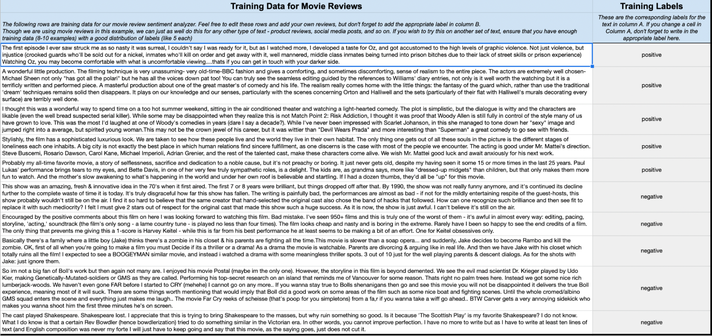
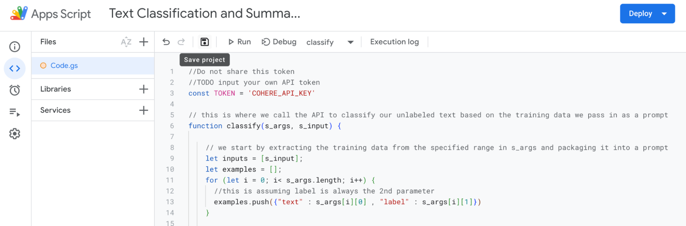
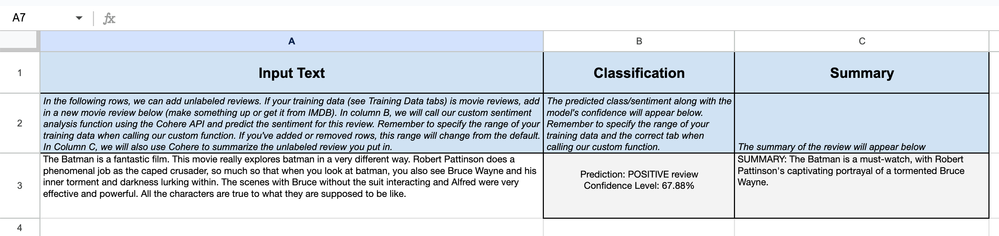

_The source code used for this example is available in our [GitHub repository](https://github.com/cohere-ai/cohere-developer-experience/tree/main/notebooks/llmu/examples/deploy_google_apps_script) _.

This tutorial demonstrates how to use Cohere and [Google Apps Script](https://developers.google.com/apps-script/guides/sheets), a scripting language based on JavaScript, to build two custom functions that add large language model (LLM) capabilities to Google Sheets documents. We'll be classifying the sentiment and generating summaries of movie reviews.

It involves the following steps.

- Step 1: Add training examples required for text classification.
- Step 2: Create a custom Apps Script function for text classification.
- Step 3: Create a custom Apps Script function for text summarization.
- Step 4: Run text classification and summarization on a new input.

### Setting Up

We’ve already [created a file](https://github.com/cohere-ai/cohere-developer-experience/blob/main/notebooks/llmu/examples/deploy_google_apps_script/cohere_google_apps_script.xlsx) to run the demo of this project. Open the file in Google Sheets and follow the instructions described in the `Instructions` worksheet.

Once you have completed the steps, you will be able to run the demo directly using the [script provided](https://github.com/cohere-ai/cohere-developer-experience/blob/main/notebooks/llmu/examples/deploy_google_apps_script/classify_summarize.js) in the repository. Let's understand how it is created.

### Step 1: Add Training Examples Required for Text Classification

The first step is to create a set of examples needed by the Classify endpoint to be able to perform a classification task.

The Classify endpoint requires a minimum of two training examples per class, though more training examples are generally better. You can find the examples we'll use for running movie reviews sentiment analysis in the `Classifier Examples` worksheet. It contains five examples for each class – `positive` and `negative`.


### Step 2: Create a Custom Apps Script Function for Text Classification

Now we are going to create the script for the first task: sentiment analysis. In Google Sheets, go to `Extensions`  and then go to `Apps Script`, which will take us to the Apps Script environment.

Next, we’ll use the Classify endpoint to build our text classification function, starting with the code below. It is a basic function definition taking in two parameters. The first one (`s_args`) is the range of cells for the training examples we defined in the previous section. The second one (`s_input`) is the new text we want to label or classify.

```javascript
function classify(s_args, s_input) {  
}
```

Let’s now add the logic between the curly braces. First, we extract the training examples from `s_args` and package them into something that the Classify endpoint can ingest.

Next, we call the [Classify endpoint](/reference/classify) to classify an input text, given the package of training examples. We pass the data package (such as authentication headers and other metadata) to the endpoint. Then, we store the response in a named response object.

Next, we parse the response and extract the classification and confidence level.

Finally, we output the parsed response back into the cell where we call the function.

```javascript
function classify(s_args, s_input) {

    // we start by extracting the training data from the specified range in s_args and packaging it into a prompt
    let inputs = [s_input];
    let examples = [];
    for (let i = 0; i< s_args.length; i++) {
      //this is assuming label is always the 2nd parameter
      examples.push({"text" : s_args[i][0] , "label" : s_args[i][1]})
    }
  
    const payload_for_classification = {
      examples,
      inputs,
      "model" : "embed-english-v2.0",
    };
  
    const options = {
      'headers' : { 'Authorization' : 'Bearer ' + TOKEN },
      'method' : 'post',
      'contentType': 'application/json',
      'payload' : JSON.stringify(payload_for_classification)
    };

    const response = UrlFetchApp.fetch('https://api.cohere.ai/v1/classify', options);
    const responseContent = response.getContentText();
    const responseContentText = JSON.parse(response.getContentText());
    const classificationContent = responseContentText.classifications[0];
    const ourPrediction = classificationContent.prediction;
    const confidence = (classificationContent.confidence * 100).toFixed(2) + "%";
    let displayString = "Prediction: " + ourPrediction.toUpperCase() + " review\n" + "Confidence Level: " + confidence + "\n";
    return displayString;
  
  }
```

### Step 3: Create a Custom Apps Script Function for Text Summarization

The methodology for text summarization is similar to the one used for text classification in the previous section, except we’ll be using the Chat endpoint instead.

We create a simple prompt asking the endpoint to provide a summary in about ten words. We are defining three parameters for the endpoint call.

- `message` - the prompt for the LLM
- `temperature` - we keep the value closer to 0 to make the output more predictable (0.2 in this example)
- `model`- we'll use `command-r`

Finally, we parse the response and output the summary.

```javascript
function summarize(cell_value) {

    let raw = JSON.stringify({
        "message": "Summarize this in about 10 words: " + cell_value,
        "temperature": 0.2,
        "model": "command-r",
    });
    let requestOptions = {
        'method': 'post',
        'muteHttpExceptions': true,
        'contentType': 'application/json',
        'headers': {
            'Authorization': 'Bearer ' + TOKEN
        },
        'payload': raw,
        redirect: 'follow'
    };
    
     let response = UrlFetchApp.fetch("https://api.cohere.ai/v1/chat", requestOptions)
     let responseContentTxt = JSON.parse(response.getContentText());
     let summarizedTxt = "SUMMARY: " + responseContentTxt.text + "\n";
     return summarizedTxt;

}
```

Finally, we save the code we have added for text classification and summarization.



### Step 4: Run Text Classification and Summarization on a New Input

Now, we get to the part we’ve been waiting for – classifying and summarizing text on Google Sheets.

For this, we’ll move back to the Google Sheets view and go to the `Demo` worksheet. It has three columns, as shown below.




The first column is the input text, the movie review that we want to classify its sentiment and summarize. Here, we have a review of The Batman.

In the second column, we call our text classification function as follows.

`=classify('Classifier Examples'!$A$3:$B$12,A3)`

Recall that this function takes in two parameters. The first one is the list of training examples. Our training examples are provided in the `Classifier Examples` tab between cells A3 and B12. 

The second parameter is `A3`, the review of The Batman. When we hit enter, it predicts the class, as shown in the screenshot above.

The third column calls the summarize function.

`=summarize(A3)`

This takes cell the movie review in `A3` and outputs the summary.

### Conclusion

Dealing with numbers in a spreadsheet has always been easy, but the same couldn’t be said of text — until now. With Cohere’s natural language processing capabilities, you can supercharge your spreadsheets, saving time and effort.
