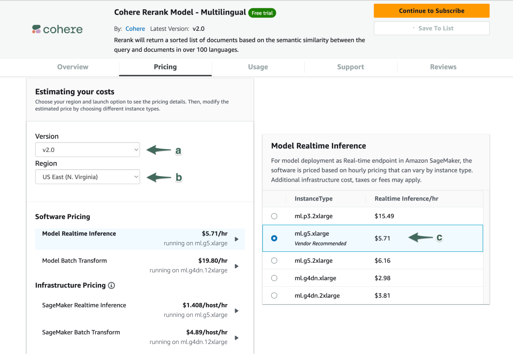
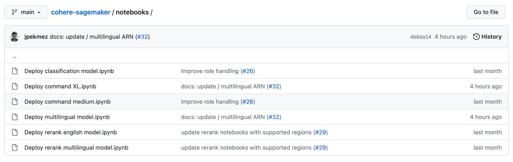
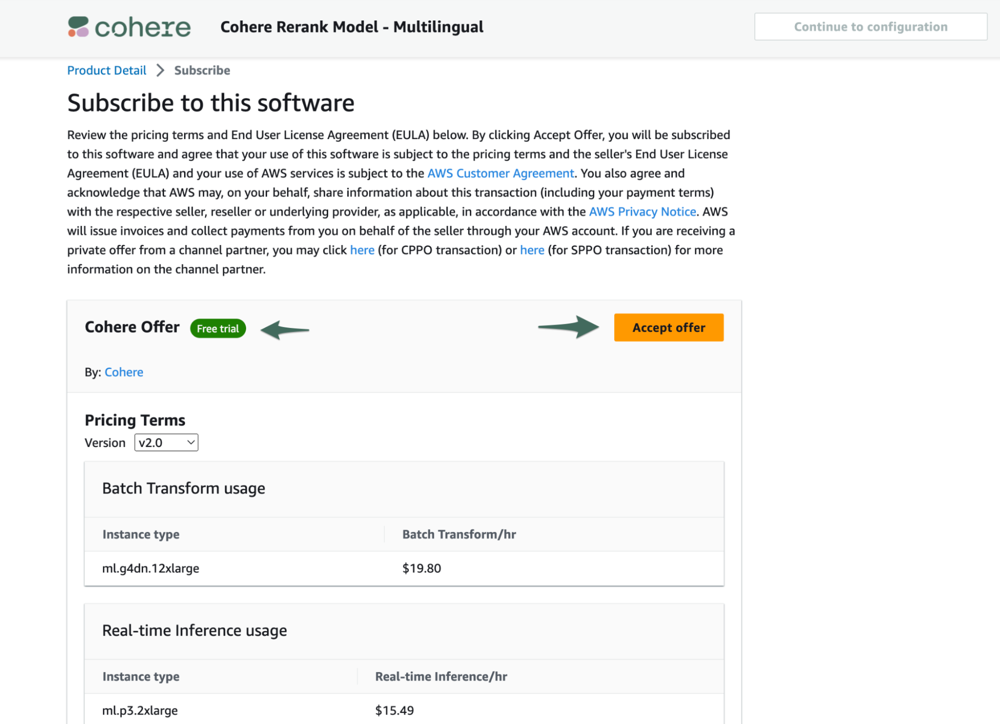
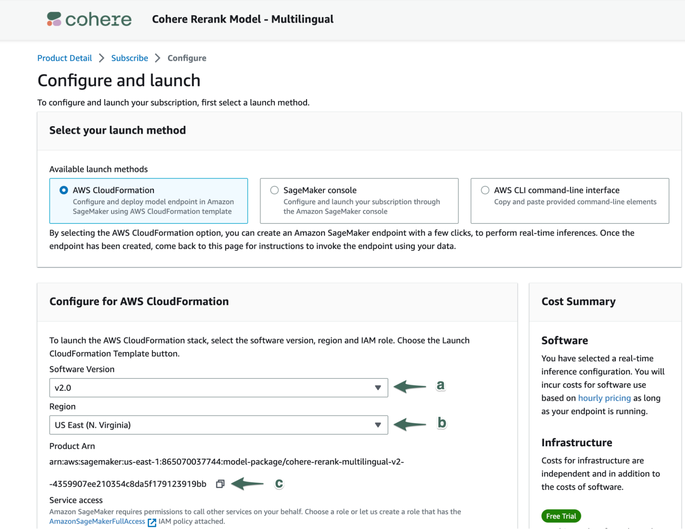

{/* [skip-file-snippets] */}
Cohere’s large language models (LLMs) are available through [Amazon SageMaker](https://aws.amazon.com/sagemaker/jumpstart/).  

Amazon SageMaker is a collection of fully managed infrastructure, tools, and workflows for training and deploying machine learning (ML) models. It offers a comprehensive set of ML services to quickly build, train, and deploy models.

The following is a summary of all available models on Amazon SageMaker at the time of writing ([visit the AWS Marketplace](https://aws.amazon.com/marketplace/seller-profile?id=87af0c85-6cf9-4ed8-bee0-b40ce65167e0) for the most updated list).

- Generative Models
  - [Command](https://aws.amazon.com/marketplace/pp/prodview-n44fbeuycwldi)
  - [Command Light](https://aws.amazon.com/marketplace/pp/prodview-6dmzzso5vu5my?sr=0-1&ref_=beagle&applicationId=AWSMPContessa)
- Representative Models
  - [Embedding - Multilingual](https://aws.amazon.com/marketplace/pp/prodview-z6huxszcqc25i)
  - [Rerank - English](https://aws.amazon.com/marketplace/pp/prodview-xwsyvhz7rkjqe)
  - [Rerank - Multilingual](https://aws.amazon.com/marketplace/pp/prodview-pf7d2umihcseq)
  - [Classification Finetuning - English](https://aws.amazon.com/marketplace/pp/prodview-hlqpwlttcdhva?sr=0-6&ref_=beagle&applicationId=AWSMPContessa)
  - [Classification Finetuning - Multilingual](https://aws.amazon.com/marketplace/pp/prodview-hukrkor45t7bw?sr=0-7&ref_=beagle&applicationId=AWSMPContessa)

With Amazon SageMaker Studio, teams can access the Command model, available on Amazon SageMaker JumpStart, which provides a curated experience for ML models, making foundation models discoverable and easily accessible.

Deploying Cohere's models on SageMaker provides several key benefits:

- **Private and secure** – With SageMaker, customers can spin up containers serving Cohere’s models without having to worry about their data leaving these self-managed containers.
- **Build, iterate, and deploy quickly** – Cohere empowers any developer (no NLP, ML, or AI expertise required) to quickly access pre-trained, state-of-the-art LLMs that enable use cases in text generation and representation. These LLMs reduce the time-to-value for teams by providing an out-of-the-box solution for various language tasks.

## Deploying a Model with Amazon SageMaker Studio

In this tutorial, we'll create a SageMaker endpoint for a product description generator using the Command model.

### Pre-requisites

In order to successfully subscribe to Cohere’s offerings on SageMaker, you'll need the following IAM permissions:

- AmazonSageMakerFullAccess
- aws-marketplace:ViewSubscriptions
- aws-marketplace:Subscribe
- aws-marketplace:Unsubscribe

### Creating an Endpoint

To get started with the Command model on SageMaker JumpStart, follow these steps:

- In the AWS Console, open up the [SageMaker Studio UI](https://aws.amazon.com/sagemaker/studio/).
- Look for `Prebuilt and automated solutions` and click `JumpStart`.
- A list of models will appear. Look for `Cohere Command` and then click `View notebook`.
- This will open up a sample notebook to get started with the model. To run the notebook, your organization must first [subscribe to the Command model here](https://aws.amazon.com/marketplace/pp/prodview-n44fbeuycwldi). [Refer to this section](#subscribing-to-models-through-aws-marketplace) for more details about subscribing to a model.

The notebook goes through an example of creating an endpoint (the complete [notebook is here](https://github.com/cohere-ai/cohere-sagemaker/blob/main/notebooks/Deploy%20command%20XL.ipynb)), which involves the following steps:

- Step 1: Import the required libraries
- Step 2: Define the Command model’s product ARN
- Step 3: Create an endpoint
- Step 4: Run inference on the endpoint
- Step 5: Delete the endpoint

### Step 1: Import the Required Libraries

```python PYTHON
!pip install cohere-sagemaker

from cohere_sagemaker import Client
import boto3
```

### Step 2: Subscribe to the Command Model Package

Select the product ARN while creating a deployable model using Boto3.

```python PYTHON
# Map the ARNs (current us-east-1 and eu-west-1 are supported)
model_package_map = {
    "us-east-1": "arn:aws:sagemaker:us-east-1:865070037744:model-package/cohere-gpt-xlarge-v1-2-4d938caa0259377e94c4eb5bf6bc365a",
    "eu-west-1": "arn:aws:sagemaker:eu-west-1:985815980388:model-package/cohere-gpt-xlarge-v1-2-4d938caa0259377e94c4eb5bf6bc365a",
}


region = boto3.Session().region_name

if region not in model_package_map.keys():
    raise Exception(
        f"Current boto3 session region {region} is not supported."
    )

model_package_arn = model_package_map[region]
```

### Step 3: Create an Endpoint

```python PYTHON
co = Client(region_name=region)

co.create_endpoint(
    arn=model_package_arn,
    endpoint_name="cohere-gpt-xlarge",
    instance_type="ml.p4d.24xlarge",
    n_instances=1,
)

# You will get "---------!" as the output. This is expected.
```

### Step 4: Run Inference on the Endpoint

```python PYTHON
prompt = "Write a creative product description for a wireless headphone product named the CO-1T"

response = co.generate(prompt=prompt, max_tokens=100, temperature=0.9)

print(response.generations[0].text)
```

```
SAMPLE RESPONSE:
The CO-1T is a sleek and stylish wireless headphone that is perfect for on-the-go listening. With a comfortable and secure fit, these headphones are perfect for all-day wear. The wireless design allows for easy movement and convenience, while the crisp sound quality ensures that you can enjoy your favorite tunes without any distractions. The CO-1T is also equipped with a noise-canceling microphone, so you can take calls and texts without any interference.
```

### Step 5: Delete the Endpoint

```python PYTHON
co.delete_endpoint()
co.close()
```

Note: You can see all existing endpoints by going to SageMaker -> Inference -> Endpoints in the AWS console.

## Subscribing to Models through AWS Marketplace

To subscribe to Cohere's models in the AWS Marketplace, follow these steps:

- Navigate to [Cohere’s SageMaker Marketplace](https://aws.amazon.com/marketplace/seller-profile?id=87af0c85-6cf9-4ed8-bee0-b40ce65167e0) to view the product offerings available to you. Select the product offering to which you are interested in subscribing.
- Explore the tools on the Product Detail page to evaluate how you want to configure your subscription. Two of the key sections to consider are detailed below:
  - **Pricing**  
    This section allows you to estimate the cost of running inference on different types of instances.
    - Version: Select the model version that suits your use case. Typically selecting the most recent version is appropriate. Release notes can be found in the Overview section of the listing.
    - Region: Select a region to see which instance types are available.
    - Instance Type: Select the instance type to estimate costs of different configurations. Learn more about Amazon instance types here. Typically, instances that cost more will have lower latencies, meaning they will produce generations faster. Model quality is unaffected by instance type. Cohere provides a recommended instance type for each of our product offerings. Note: Due to regional availability and high demand, some supported instance types may not be available from Amazon at all times. Cohere does not control which instance types are available on Amazon’s platform.



- **Usage Instructions**  
  This section contains the technical details around supported data formats for each model, as well as offering links to documentation and notebooks that will help developers scope out the effort required to integrate with Cohere’s models.  
  Each model has a corresponding notebook in GitHub that guides developers through the process of creating an endpoint for the model and performing real-time inference against it. [Notebooks for all of Cohere’s SageMaker compatible models are found here.](https://github.com/cohere-ai/cohere-sagemaker/tree/main/notebooks)



- When you are ready to subscribe to one of Cohere’s models, select the Continue to Subscribe button at the top of the product details page.
- On the Subscribe page, you are presented once again with the pricing details and the EULA for final review before accepting the offer. This information is identical to the Product Detail page. If the product includes a Free Trial, that will be indicated on this page. Selecting different options in the Version will update the pricing displayed on the page, but does not impact your implementation in any way.  
  When you are ready to proceed with subscription, select Accept Offer. This request may take a few seconds to complete.  
  Note: Subscribing to the models alone will not result in charges to your account, this only enables your organization to proceed with setting up SageMaker instances with Cohere’s models. You will begin accruing charges when you create an instance.



- When Amazon has processed your subscription, select Continue to configuration.
- On the Configuration page, select both a) Software Version and b) Region. With these selections, the Product ARN will be displayed, which you can copy via the c) copy icon.



- With your selected configuration and Product ARN available, you now have everything you need to integrate with Cohere’s model offerings on SageMaker.

### Conclusion

AWS SageMaker greatly simplifies the process of deploying Cohere's LLMs, and it will especially open the door to many use cases that deal with sensitive data. And with the addition of the Command model to AWS SageMaker JumpStart, building applications just got much easier.

