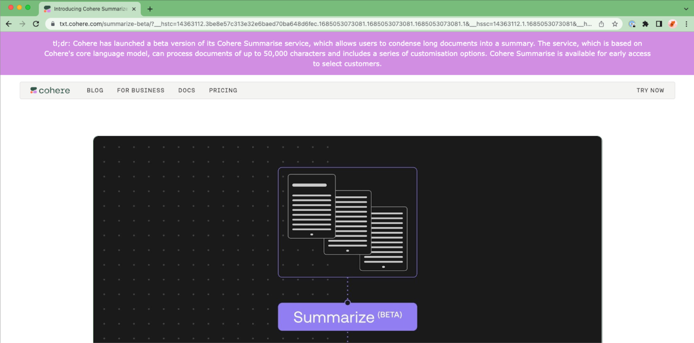

_This chapter was contributed by Leila Chan Currie from Cohere._

### Introduction

This tutorial demonstrates how to create Condense, a Google Chrome extension that summarizes the text content of a web page.


It involves the following steps:

- Step 1: Create a function for text display
- Step 2: Create a function for text summarization
- Step 3: Create a function for text capturing
- Step 4: Create a function for Cohere API key entry
- Step 5: Create a Chrome extension manifest file
- Step 6: Load the extension to Google Chrome
- Step 7: Run the extension on Google Chrome

The source code used for this example is available in our [GitHub repository](https://github.com/cohere-ai/sandbox-condense). This tutorial uses Javascript.

### Step 1: Create a Function for Text Display

The first step is to create a folder for this extension, which we’ll call `condense`. Then create another folder called `scripts` and inside it, a file called `content.js`. This file will contain the main logic of this extension.

First, we’ll create a function for text display, which will display the generated summary of a web page at the top of the page. This function, `display(text)`, creates the elements and styling for the header and the summary. Finally, it inserts the header immediately before the HTML body.

```javascript condense/scripts/content.js
// Display the text at the top of the page
function display(text) {
  // Create a purple header
  header = document.createElement("div");
  header.style.backgroundColor = "#d18ee2";
  header.style.padding = "5px";

  // Write the text with a bit of styling and add it to the header
  tldr = document.createElement("p");
  tldr.textContent = text;
  tldr.style.margin = "10px 100px";
  tldr.style.fontSize = "medium";
  tldr.style.color = "white";
  tldr.style.textAlign = "center";
  tldr.style.fontFamily = "Verdana, Geneva, sans-serif";
  header.appendChild(tldr);

  // Insert the header immediately before the HTML body
  document.body.parentNode.insertBefore(header, document.body);
}
```

### Step 2: Create a Function for Text Summarization

Next, we’ll create a function, `summarize(text)`, to perform the text summarization, leveraging Cohere’s [Chat](https://cohere.com/chat) endpoint. This function calls the Chat endpoint by defining several parameters, such as `message` (used to direct the model to summarize the contents of the webpage), `preamble` (set to an empty string to make the model give a brief response), and `temperature` (we set it to a low value to make the outputs less random). Refer to the [API reference](/reference/chat) to learn more about the parameters of the Chat endpoint.

This function then takes the endpoint response, `response.text`, and sends it to the `display(text)` function we created in the previous section.

```javascript condense/scripts/content.js
// Fetch the summary for the given text and display it
function summarize(text) {
  // Use the user's stored API key
  chrome.storage.sync.get("apiKey", (key) => {
    // Set up the request to send to the endpoint
    options = {
      method: "POST",
      headers: {
        accept: "application/json",
        "content-type": "application/json",
        authorization: "Bearer " + key.apiKey,
      },
      // These are the chat endpt paramters.
      // Try playing around with them and reloading the extension to see
      // how they affect the summarization behaviour.
      // Reference: /reference/chat
      body: JSON.stringify({
        message: "Generate a summary of this webpage: " + text,
        preamble: "",
        temperature: 0.1,
      }),
    };

    fetch("https://api.cohere.ai/v1/chat", options)
      .then((response) => response.json())
      .then((response) => {
        if (response.text === undefined) {
          // If there's no summary in the endpoint's response,
          // display whatever error message it returned
          display("There was an error: " + response.message);
        } else {
          // Otherwise, display the summary
          display("tl;dr: " + response.text);
        }
      });
  });
}
```

### Step 3: Create a Function for Text Capturing

Now we create a function that feeds the text needed by the `summarize(text)` function. Here, `getVisibleText()` returns only the visible text from the page. It uses jQuery selectors (requires jQuery v3.7.0 to be added to the `scripts` folder) to try to find the page's main body of content, often in a `content` or `main` element. It also defines a fallback to using the whole body content.

```javascript condense/scripts/content.js
// Returns true if the given element isn't visible on the page
function isHidden(el) {
  var style = window.getComputedStyle(el);
  return style.display === "none" || style.visibility === "hidden";
}

// Returns only the visible text from the page
function getVisibleText() {
  // Using jQuery selectors, try to find the page's main body of content,
  // often in a content or main element. Fall back to using the whole
  // body which is ~universal.
  var body = document.querySelector("body");
  if (document.querySelector("#content")) {
    body = document.querySelector("#content");
  }
  if (document.main) {
    body = document.querySelector("main");
  }
  var allTags = body.getElementsByTagName("*");

  let visibleText = [];
  var nChars = 0;
  // Select all visible text in the body, up to charLimit
  for (var i = 0, max = allTags.length; i < max; i++) {
    var elem = allTags[i];
    if (!isHidden(elem)) {
      var text = $(elem)
        .contents()
        .filter(function () {
          return this.nodeType == Node.TEXT_NODE;
        });
      if (text === undefined || text.length == 0) {
        continue;
      }
      text = text[0].nodeValue;
      nChars += text.length + 1; // for newline
      if (nChars < charLimit) {
        visibleText.push(text);
      } else {
        break;
      }
    }
  }
  // Separate all the text elements with a newline
  return visibleText.join("\n");
}
```

The following code block stitches together the three steps we created to capture visible text from a web page, summarize it, and display it at the top.

```javascript condense/scripts/content.js
// This code block runs when pages are loaded.
chrome.storage.sync.get("apiKey", (key) => {
  if (key.apiKey === undefined) {
    // If there's no saved API key, tell the user how to add one
    display("Please set an API key in co:ndense > Options");
  } else {
    // If there is a key, we can use it to summarize the page
    const truncatedVisibleText = getVisibleText();
    // During the dev process, it's helpful to be able to see exactly what
    // text is being summarized
    console.log(truncatedVisibleText);

    summarize(truncatedVisibleText);
  }
});
```

### Step 4: Create a Function for Cohere API Key Entry

We also need to create a user interface for users to add a Cohere API key before they can run the extension. For this, we create a new folder called `options` and create two files, `options.html` and `options.js`. For brevity, the code blocks are not included here, but you can refer to the repository for the full code.

### Step 5: Create a Chrome Extension Manifest File

The manifest file is required by a Chrome extension, describing how the extension is configured. It is a JSON file placed in the extension's root directory. It also contains metadata about the extension, such as its name, version, and author.

So let’s create a `manifest.json` file at the root of our folder. The contents of the file are shown below. It contains the metadata, permissions, description of the UI for adding the API key, and the scripts to run.

```json manifest.json
// This file describes how the extension is configured.
{
  // Metadata
  "name": "co:ndense",
  "version": "1.0",
  "description": "Summarizes web pages",
  "manifest_version": 3,

  // - activeTab gives us access to the user's currently active tab
  // - scripting gives us permission to run our code
  // - storage allows us to store the user's API key
  "permissions": ["activeTab", "scripting", "storage"],

  // This describes the UI for user options
  "options_ui": {
    // This page contains the UI
    "page": "options/options.html",
    // The options will open as a pop-up, not a new tab
    "open_in_tab": false
  },

  "content_scripts": [
    {
      // scripts/content.js contains the extension's main logic.
      // It relies on jQuery so we need to configure the path to that too.
      "js": ["scripts/content.js", "scripts/jquery-3.7.0.min.js"],
      // This extension will run on all webpages by default.
      "matches": ["<all_urls>"],
      // Don't run the extension on these specific sites
      "exclude_globs": [
        // The header breaks cursor alignment in Google Docs
        "*://docs.google.com/*"
      ]
    }
  ]
}
```

### Step 6: Load the Extension to Google Chrome

The code package is now complete, and we can load the extension to Chrome. For this, take the following steps:

1. Go to chrome://extensions/.
2. At the top right, turn on `Developer mode`.
3. Click `Load unpacked` at the top left.
4. Find and select the folder where the code package is located. The extension will now appear in the list of extensions. Make sure it is enabled using the button on the bottom right.


5. Select `Details` on the extension. Click `Extension Options` and then add an API key (use a trial key).

### Step 7: Run the Extension on Google Chrome

We are now ready to run the extension. Open a new tab in Chrome and then click the Extension icon at the top right (look for the jigsaw piece icon).

Then go to any web page. After a short while, a summary of the page will be displayed at the top! (look for the purple banner)

### Conclusion

The Chrome extension provides developers with a platform to build applications that enrich the web browsing experience. And the ease of access to large language models like Cohere’s unlocks new types of applications that enable more efficient and natural language-based interactions with the browser.
