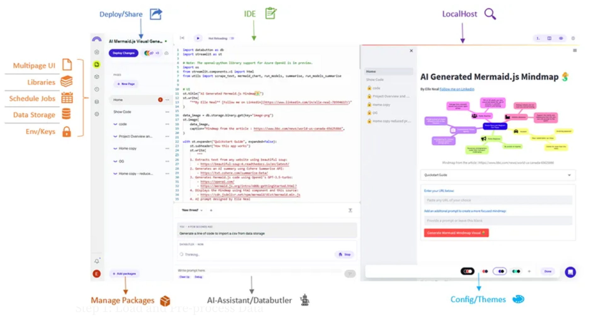
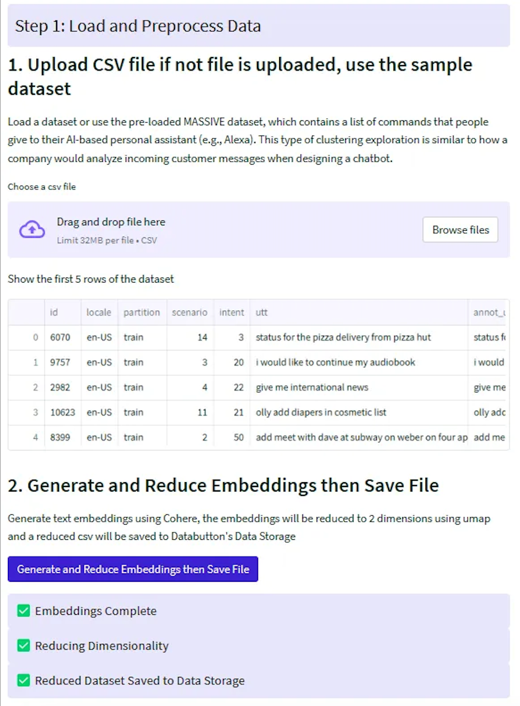
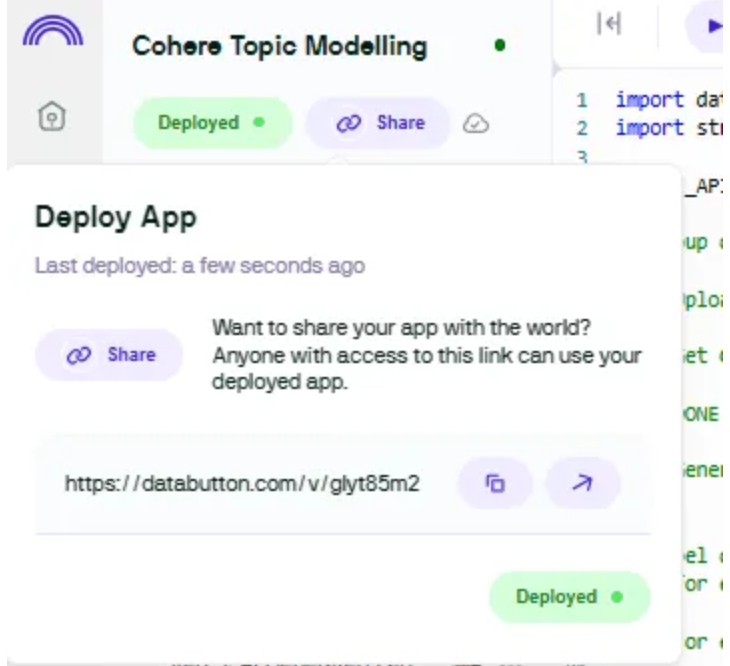

{/* [skip-file-snippets] Reason: not supported python version */}
_This chapter is contributed by Cohere’s Community Champion, [Elle Neal](https://www.linkedin.com/in/elle-neal-78994617/)._

Databutton is an all-in-one online workspace designed to streamline the process of creating, deploying, and managing data apps. It supports Streamlit-based applications, but it also comes with additional features to make the process of developing and deploying applications simple. For example, Pages allows you to create multipage UIs for your users, Jobs enables scheduling of Python code, Libraries provides a place to write reusable code across your app, and Data Storage offers a simple put/get data store for various types of data.




This tutorial demonstrates creating a topic modeling application using [Databutton](https://databutton.com/home).

It involves the following steps:

- Step 1: Load and embed data
- Step 2: Create a user interface with Streamlit code
- Step 3: Cluster data to identify groups
- Step 4: Auto-generate cluster label names
- Step 5: Deploy and share application

The source code used for this example is available via [this Databutton fork](https://databutton.com/new?templateId=pt-BAiNy6hKbcXESYnF).

### Setting Up

1. Create a free account with [Databutton](https://databutton.com/login).
2. Create a new app by clicking on ‘New Blank App\`on the home screen.
3. Set the app’s configurations in the`Configure`section. 
   - In`Secrets`, add the Cohere API key. 
   - In `Installed packages`, add the following packages: cohere, scikit-learn, hdbscan, umap-learn, setuptools, plotly, matplotlib, and datasets.

### Step 1: Load and Embed Data

As a default, this app will use [Amazon’s MASSIVE dataset](https://github.com/alexa/massive), which contains a list of commands that people give to their AI-based personal assistant (e.g., Alexa).

We’ll build a few helper functions:

- To generate embeddings via the [Embed endpoint](/docs/embed-endpoint)
- To reduce the dimensions of these embeddings to two for plotting purposes
- To save the embeddings into a JSON file in Databutton’s data storage

The user needs to generate the embeddings of the dataset only once. This provides two outputs that are saved to Databutton’s data storage: the embeddings as a JSON file and the embeddings’ reduced dimensions that are appended to the dataset’s DataFrame.

As the file is now saved to storage, the user can access the data throughout the application without having to perform this task again. There is no need to worry about caching the dataset for the user; with one line of code, you can return the data to the user anywhere within the application.

The following are the helper functions mentioned above.

```python PYTHON
# Function to generate Cohere embeddings
def embed_text(texts):
    embeddings = []
    for i in range(0, len(texts), 90):
        batch = texts[i : i + 90]
        output = co.embed(
            model="embed-english-v3.0",
            input_type="search_document",
            texts=batch,
        )
        embeddings.extend(output.embeddings)
        time.sleep(
            60
        )  # accounting for Cohere trial API key rate limit
    return embeddings
```

```python PYTHON
# Function to reduce dimensionality of embeddings using umap


def reduce_dimensionality(embeddings):
    reducer = umap.UMAP()
    umap_embeddings = reducer.fit_transform(embeddings)
    return umap_embeddings[:, 0], umap_embeddings[:, 1]
```

```python PYTHON
# Function to save embeddings into a json file in Databutton data storage


def save_embeddings_to_json(df):
    # Create a dictionary where each key is the index of the DataFrame and each value is the corresponding embedding
    embeddings_dict = df["embedding"].to_dict()
```

### Step 2: Create a User Interface with Streamlit

We’ll build the user interface using the Streamlit API, which goes through the following steps when a user interacts with the application.

- User uploads a CSV file. Or, they can opt for the sample dataset (Amazon’s MASSIVE dataset).
- Text embeddings are generated using the Embed endpoint, and the embeddings will be reduced to two dimensions using UMAP (Uniform Manifold Approximation and Projection).
- The embeddings will be saved to Databutton storage as a JSON file.
- The reduced embeddings will be saved to Databutton’s data storage as a new CSV file.

The following is what the user interface will look like at this point.




The reduced embeddings are now saved as a new file. We can copy the code snippet to import and use the DataFrame anywhere in our application. Here is an example of how you call the data as a DataFrame:

```python PYTHON [ignore-snippet]
# Call the embeddings data as a DataFrame
df = db.storage.dataframes.get(key="reduced.csv")
```

### Step 3: Cluster Data to Identify Groups

This next stage in the workflow uses machine learning to perform text clustering — finding clusters in the data that share similar properties.

We will create a user interface that provides interactivity at a few crucial points along the process of text clustering. This allows users to make decisions based on the results of initial analyses. Here are the step-by-step instructions:

- **Load the DataFrame:** The script will load the DataFrame previously saved in Databutton’s storage.
- **Extract UMAP coordinates**: The script will extract the 2D UMAP coordinates that were previously computed. These coordinates are reduced representations of your data.
- **Determine the optimal number of clusters**: The script will compute the sum of squared errors (SSE) for a range of potential numbers of clusters. This is part of the process to use the k-means algorithm, which requires specifying the number of clusters beforehand. The script will plot an elbow plot, which can be used to select the optimal number of clusters — look for the “elbow” in the curve where adding more clusters doesn’t significantly decrease SSE.
- **Create the elbow plot**: The script will then visualize the SSE for different numbers of clusters as an elbow plot. This visualization will help you in choosing the optimal number of clusters.
- **User selection of clusters**: You will select the number of clusters based on the elbow plot. The selection is done using a slider in the Streamlit app.
- **Run k-means algorithm**: With the chosen number of clusters, the script will run the k-means algorithm, which assigns each point in your data to one of the clusters.
- **Plot the clusters**: The script will create a scatter plot of your data points, colored by their assigned cluster. This visualization gives you a spatial representation of how the algorithm has classified your data.
- **Calculate cluster centers and distances from centroids**: The script calculates the centroid (or geometric center) of each cluster. It then computes how far each point in your data is from its cluster’s centroid. We will need this in the next step of the process where we label our clusters.
- **Display and save the results**: The script will display the DataFrame that now includes cluster labels and distances from centroids. If you’re satisfied with the results, you can save this labeled data back into Databutton’s storage for later use.

```python PYTHON
import databutton as db
import streamlit as st
from sklearn.cluster import KMeans
from sklearn.metrics import silhouette_score
import matplotlib.pyplot as plt
import numpy as np
import plotly.express as px
from scipy.spatial import distance

# 1: Load DataFrame

df = db.storage.dataframes.get(key="reduced.csv")

# 2: Extract UMAP coordinates

umapx = df["umap_x"]
umapy = df["umap_y"]
umap_coords = np.column_stack((umapx, umapy))

# 3: Define a range of potential clusters and compute SSE

clusters = range(2, 10)  # You may want to modify this range
sse = []
for k in clusters:
    kmeans = KMeans(n_clusters=k, random_state=0)
    kmeans.fit(umap_coords)
    sse.append(kmeans.inertia_)

# 4: Plot the elbow plot

fig, ax = plt.subplots(figsize=(10, 5))
plt.plot(clusters, sse, "bx-")
plt.xlabel("k (number of clusters)")
plt.ylabel("Sum of Squared Errors (SSE)")
plt.title("Elbow Plot For Optimal Number of Clusters")
st.pyplot(fig)

# 5: User selects number of clusters based on elbow plot

n_clusters = st.slider(
    "Number of Clusters", min_value=2, max_value=10, value=2
)

# 6: Run KMeans with optimal number of clusters

kmeans_model = KMeans(n_clusters=n_clusters, random_state=0)
df["cluster_labels"] = kmeans_model.fit_predict(umap_coords)

# 7: Plotting the clusters

fig = px.scatter(
    df,
    x="umap_x",
    y="umap_y",
    color="cluster_labels",
    hover_data=["utt"],
)
st.plotly_chart(fig)

# 8: Calculate cluster centers and distances from centroids

centroids = (
    df.groupby("cluster_labels")[["umap_x", "umap_y"]]
    .mean()
    .reset_index()
)


def calc_distance(row):
    centroid = centroids[
        centroids["cluster_labels"] == row["cluster_labels"]
    ]
    centroid_coords = (
        centroid["umap_x"].values[0],
        centroid["umap_y"].values[0],
    )
    row_coords = (row["umap_x"], row["umap_y"])
    return distance.euclidean(row_coords, centroid_coords)


df["distance_from_centroid"] = df.apply(calc_distance, axis=1)

# 9: Display and save the results

selected_cluster = st.selectbox(
    "Select a cluster label", df["cluster_labels"].unique()
)
temp_df = df[["utt", "cluster_labels", "distance_from_centroid"]]
st.write(temp_df[temp_df["cluster_labels"] == selected_cluster])

if st.button("Save Labelled Data"):
    db.storage.dataframes.put(key="cluster.csv", df=df)
```

### Step 4: Auto-Generate Cluster Names

Finally we’ll use the [Chat endpoint](/reference/chat) to suggest a name for each cluster based on examples sampled from the clustered data. We’ll also generate the keywords for each cluster using the [TF-IDF algorithm](https://en.wikipedia.org/wiki/Tf%E2%80%93idf).

We use the `utterance_prompt` as the prompt to the Chat endpoint to generate descriptive labels for the data clusters.

```python PYTHON
utterance_prompt = """
These are clusters of commands given to an AI-based personal assistant. Each cluster represents a specific type of task or query that users often ask their personal assistant to perform. A list of keywords summarizing the collection is included, along with the name of the cluster. The name of each cluster should be a brief, precise description of the common theme within the utterances.
---
Cluster #0
Sample utterances from this cluster:
- status for the pizza delivery from pizza hut
- find and order rasgulla of janta sweet home pvt ltd
- i will be at pizza hut in ten minutes and will stay there for next forty minutes arrange an uber for me that can drop me home

Keywords for utterances in this cluster: pizza, delivery, uber, order
Cluster name: Food Delivery 

---
Cluster #1
Sample utterances from this cluster:
- show me where i can find a train
- can you show me the directions to go museum of flight in seattle
- please book train ticket to new york

Keywords for utterances in this cluster: train, directions, museum, book, ticket
Cluster name: Travel and Directions 

---
Cluster #2
Sample utterances from this cluster:
- get route for los angles from here
- nearest restaurants available at this time
- i want you to book a train ticket for me

Keywords for utterances in this cluster: route, los angeles, restaurants, time, book, train, ticket
Cluster name: Route Navigation and Reservations 

---
Cluster #3
Sample utterances from this cluster:
"""
```

We create several helper functions for processing the DataFrame, generating keywords, creating labels, and displaying information to the user. The `extract_top_n_words` function generates the most relevant keywords for each cluster. The `generate_label` function uses an AI model to generate a descriptive label for each cluster. The `generate_keywords_and_label` function wraps up these processes for each cluster and updates the DataFrame accordingly. The `present_cluster_data` function is used to present the information about each cluster to the user.

```python PYTHON
# Function to generate a name for each cluster


def generate_label(customer_service_prompt, text_series):
    # Initialize Cohere model
    COHERE_API_KEY = db.secrets.get(name="COHERE_API_KEY")
    co = cohere.Client(COHERE_API_KEY)
    text_list = text_series.tolist()
    formatted_text_list = ""
    for text in text_list:
        formatted_text_list += "- " + text + "\\n"
    prompt = customer_service_prompt + formatted_text_list
    response = co.chat(
        model="command-r",
        message=prompt,
        max_tokens=800,
        temperature=0.2,
        k=0,
    )
    return response.text, prompt
```

```python PYTHON
# Function to generate keywords for each cluster


def extract_top_n_words(vectorizer, tfidf_matrix, n=10):
    """
    Given a TfidfVectorizer and a TF-IDF matrix, return the `n` words with the highest TF-IDF scores.
    """
    # Get the names of the words
    # feature_names = vectorizer.get_feature_names_out()

    # Sum tfidf frequency of each term through documents
    summed_tfidf = np.sum(tfidf_matrix, axis=0)

    # Connecting term to its sums frequency
    words_freq = [
        (word, summed_tfidf[0, idx])
        for word, idx in vectorizer.vocabulary_.items()
    ]
    words_freq = sorted(words_freq, key=lambda x: x[1], reverse=True)

    # Return the n words with highest tfidf
    return [word[0] for word in words_freq[:n]]
```

```python PYTHON
# Helper function to generate the cluster name and keywords


@st.cache_resource
def generate_keywords_and_label(df, cluster, utterance_prompt):
    # Filter the DataFrame for each cluster
    df_cluster = df[df["cluster_labels"] == cluster]
    # Generate the TF-IDF matrix
    vectorizer = TfidfVectorizer(stop_words="english")
    tfidf_matrix = vectorizer.fit_transform(df_cluster["utt"])

    # Extract the top N keywords from each cluster
    keywords = extract_top_n_words(vectorizer, tfidf_matrix, n=10)

    # Generate a summary label using the AI model
    prompt = (
        utterance_prompt
        + "\nKeywords for messages in this cluster: "
        + ", ".join(keywords)
        + "\n"
    )
    summary, prompt = generate_label(
        prompt, df_cluster["utt"].sample(n=5)
    )

    # Extract cluster name from AI generated label
    start = summary.find("Cluster name:") + len("Cluster name:")
    end = summary.find("\n", start)
    cluster_name = summary[start:end].strip()

    # Update original DataFrame with generated label and keywords
    df.loc[df["cluster_labels"] == cluster, "label"] = cluster_name
    df.loc[df["cluster_labels"] == cluster, "keywords"] = ", ".join(
        keywords
    )

    return df, keywords, cluster_name


# Helper function to present cluster data


def present_cluster_data(df, cluster, keywords, label):
    df_cluster = df[df["cluster_labels"] == cluster]
    st.markdown(f"**Cluster {cluster}**")
    st.markdown(f"**Generated Keywords:** {', '.join(keywords)}")
    st.markdown(f"**AI Proposed Label:** {label}")
    st.DataFrame(df_cluster[["utt", "distance_from_centroid"]])
```

And finally, putting the steps together for cluster names and keyword generation, as well as adding the user interaction steps, we have the following:

- **Data loading**: The DataFrame is loaded from a Databutton storage with a key of "cluster.csv".
- **Cluster processing**: For each unique cluster in the DataFrame, the `generate_keywords_and_label` function is called to generate relevant keywords and an AI-generated label. These are added to the DataFrame. Then, the `present_cluster_data` function is used to display this information to the user.
- **User interactions:** The user is given the option to rename the AI-generated label for each cluster. If the user enters a new label, the DataFrame is updated with this new label.
- **Saving changes**: Finally, the user can click a button to save their changes to the DataFrame. When the “Save changes” button is clicked, the updated DataFrame is saved back to the Databutton storage with a new key of "labeled_cluster.csv".

These are reflected in the corresponding code block.

```python PYTHON
from sklearn.feature_extraction.text import TfidfVectorizer
import databutton as db
import streamlit as st
import pandas as pd
import cohere
import numpy as np
import time

# helper functions...

# Load Data

df = db.storage.dataframes.get(key="cluster.csv")

# Initialize an empty dictionary to hold cluster labels

cluster_labels = {}

# Define the TF-IDF vectorizer

vectorizer = TfidfVectorizer(stop_words="english")

clusters = df["cluster_labels"].unique()
if (
    st.button("Generate AI Labels", key="labelling", type="primary")
    or st.session_state.load_state
):
    st.session_state.load_state = True
    for cluster in clusters:
        df, keywords, label = generate_keywords_and_label(
            df, cluster, utterance_prompt
        )
        present_cluster_data(df, cluster, keywords, label)
        # Add user interaction to rename the label
        state_key = f"user_label_{cluster}"
        new_label = st.text_input(
            f"Enter a new label for cluster {cluster} (leave empty to keep the AI proposed label)",
            value=st.session_state.get(state_key, label),
            key=state_key,
        )
        if new_label != label:
            df.loc[df["cluster_labels"] == cluster, "label"] = (
                new_label
            )

    # For each cluster, find the utterance that is closest to the centroid
    for cluster in df["cluster_labels"].unique():
        min_distance_idx = df[df["cluster_labels"] == cluster][
            "distance_from_centroid"
        ].idxmin()
        df.loc[min_distance_idx, "closest_centroid_utt"] = df.loc[
            min_distance_idx, "utt"
        ]

    # Create the scatter plot
    fig = px.scatter(
        df,
        x="umap_x",
        y="umap_y",
        color="cluster_labels",
        hover_data=["utt", "label"],
    )

    # Add labels to the points that are closest to the centroid in each cluster
    for i in range(len(df)):
        if df.iloc[i]["utt"] == df.iloc[i]["closest_centroid_utt"]:
            fig.add_annotation(
                x=df.iloc[i]["umap_x"],
                y=df.iloc[i]["umap_y"],
                text=df.iloc[i]["label"],
            )

    # Display the plot
    st.plotly_chart(fig)

save = st.button("Save changes", type="primary")
if save:
    # Reset the input session states after save. Also reset the button state
    st.session_state.load_state = False
    for key in st.session_state.keys():
        if key.startswith("user_label_"):
            del st.session_state[key]
    db.storage.dataframes.put(key="labeled_cluster.csv", df=df)
    st.write("Labelled Data Saved")
```

### Step 5: Deploy and Share Application

Now your app is ready to deploy and share with a few clicks.




### Conclusion

Deploying with Databutton enables the usage of Streamlit functionality with additional backend features, making it a more robust solution for larger or more complex projects. Its all-in-one, online workspace simplifies the process of application development, deployment, and management.
