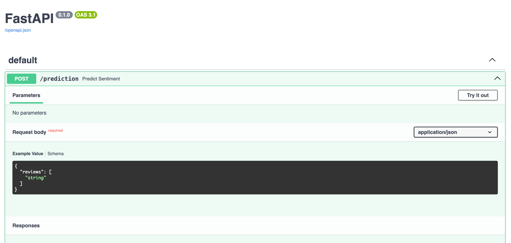
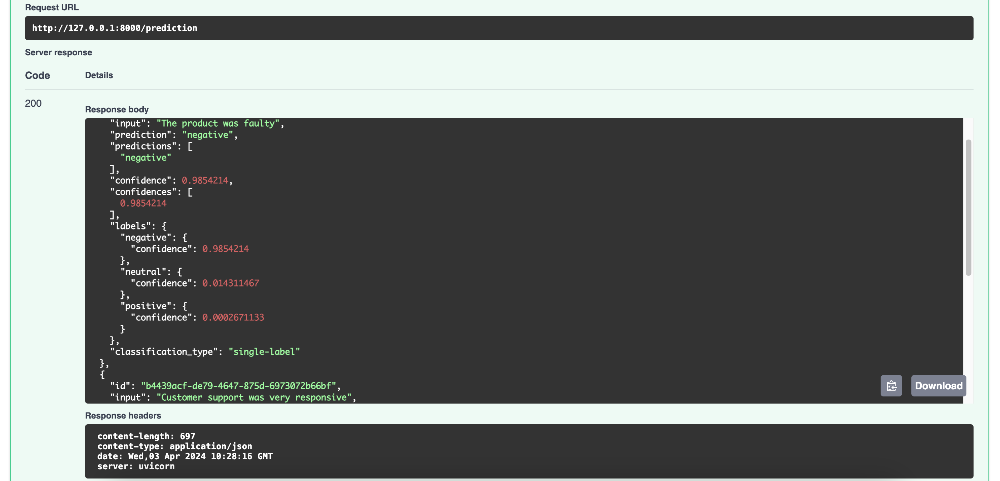

_We’ll use [Cohere’s Python SDK](/reference/about?ref=txt.cohere.com#python) for the code examples. Follow along in this Python file._

FastAPI is a web framework for building APIs with Python. It is designed to be fast, simple, and easy to use. It is also designed to be flexible for a wide variety of use cases.

A web framework is a set of tools and libraries that simplify the process of building web applications. It provides a high-level interface that allows developers to build web applications without having to worry about low-level details such as network protocols and data storage.

Developing with FastAPI has many benefits, but the major one is as advertised in its name – it is fast. It's both fast in performance (on par with NodeJS and Go) and in development time (increasing the speed to develop features by about 200% to 300%). You can read more about these in its [documentation](https://fastapi.tiangolo.com).

In this chapter, we'll build a simple sentiment analysis API with FastAPI and Cohere's [Classify endpoint](https://cohere.com/classify).

It involves the following steps.

- Step 1: Import the required libraries
- Step 2: Create a sentiment classifier
- Step 3: Create a FastAPI endpoint
- Step 4: Call the endpoint

### Import the Required Libraries

First, we create a Python file. Let's name it `main.py`.

Next, we import FastAPI and Cohere, as well as Pydantic, for structuring inputs to the API.

```shell
pip install cohere fastapi "uvicorn[standard]"
```

```python
from fastapi import FastAPI
from pydantic import BaseModel, conlist
import cohere
from cohere import ClassifyExample

# Setup the Cohere client
co = cohere.Client("COHERE_API_KEY")
```

Uvicorn serves as the default server for FastAPI, providing an asynchronous interface, while Pydantic provides a way to define data schemas using plain Python classes with type hints.

### Step 2: Create a Sentiment Classifier

To create a sentiment classifier, we need to provide the Classify endpoint with a list of labeled examples of the texts to classify and the expected classes. 

The Classify endpoint requires a minimum of two examples per class, but the more examples, the better it performs. In the example below, we have three classes to classify text into – `positive`, `negative`, and `neutral` – and five examples per class, making it a total of fifteen examples.

We feed these examples to the `co.classify()` method via the `examples` argument. We also provide the actual list of texts we want to classify via the `input` argument. The other thing we need to define is the type of model to be used via the `model` argument, which needs to be one of the embedding models. The code is shown below.

If you need more information about the endpoint, visit the [Classify endpoint documentation](/reference/classify).

```python
examples=[ClassifyExample(text="The order came 5 days early", label="positive"), 
          ClassifyExample(text="The item exceeded my expectations", label="positive"), 
          ClassifyExample(text="I ordered more for my friends", label="positive"), 
          ClassifyExample(text="I would buy this again", label="positive"), 
          ClassifyExample(text="I would recommend this to others", label="positive"), 
          ClassifyExample(text="The package was damaged", label="negative"), 
          ClassifyExample(text="The order is 5 days late", label="negative"), 
          ClassifyExample(text="The order was incorrect", label="negative"), 
          ClassifyExample(text="I want to return my item", label="negative"), 
          ClassifyExample(text="The item's material feels low quality", label="negative"), 
          ClassifyExample(text="The item was nothing special", label="neutral"), 
          ClassifyExample(text="I would not buy this again but it wasn't a waste of money", label="neutral"), 
          ClassifyExample(text="The item was neither amazing or terrible", label="neutral"), 
          ClassifyExample(text="The item was okay", label="neutral"), 
          ClassifyExample(text="I have no emotions towards this item", label="neutral")]

response = co.classify(
  inputs=product_reviews.reviews,
  examples=examples)
```

### Step 3: Create a FastAPI Endpoint

Now let's create a FastAPI wrapper around that code to extend the model as an API endpoint.

First, we create a `ProductReviews` class, which is a Pydantic model that defines the structure of the request body expected by the `prediction` endpoint (which we'll create after this). Specifically, it specifies that the request body must contain a field named reviews, which is a list of strings `(conlist(str, min_length=1))`. Each string in the list represents a product review. The `min_length=1` constraint ensures that the list contains at least one review.

Next, we create an endpoint that we call `prediction`together with a function that calls`predict_sentiment`. This endpoint will receive the user’s inputted list of strings and invoke the function.

We take the code to call the Classify endpoint from the previous step and put it inside the function.

```python
app = FastAPI()

class ProductReviews(BaseModel):
    reviews: conlist(str, min_length=1)

@app.post("/prediction")
def predict_sentiment(product_reviews: ProductReviews):
    examples=[ClassifyExample(text="The order came 5 days early", label="positive"), 
            ClassifyExample(text="The item exceeded my expectations", label="positive"), 
            ClassifyExample(text="I ordered more for my friends", label="positive"), 
            ClassifyExample(text="I would buy this again", label="positive"), 
            ClassifyExample(text="I would recommend this to others", label="positive"), 
            ClassifyExample(text="The package was damaged", label="negative"), 
            ClassifyExample(text="The order is 5 days late", label="negative"), 
            ClassifyExample(text="The order was incorrect", label="negative"), 
            ClassifyExample(text="I want to return my item", label="negative"), 
            ClassifyExample(text="The item's material feels low quality", label="negative"), 
            ClassifyExample(text="The item was nothing special", label="neutral"), 
            ClassifyExample(text="I would not buy this again but it wasn't a waste of money", label="neutral"), 
            ClassifyExample(text="The item was neither amazing or terrible", label="neutral"), 
            ClassifyExample(text="The item was okay", label="neutral"), 
            ClassifyExample(text="I have no emotions towards this item", label="neutral")]
    
    response = co.classify(
        inputs=product_reviews.reviews,
        examples=examples)

    return response.classifications
```

### Step 4: Call the Endpoint

We can now test the endpoint locally. Switch your terminal working directory to the location of your saved Python file, then input the following shell command. This brings up a server on your localhost.

```shell
uvicorn main:app
```

Let's test with these two text inputs and get the predicted classes from the model.

```
 The product was faulty
 Customer support was very responsive
```

There are a couple of options to call the endpoint. One way is to run a cURL command on your terminal.

```shell
curl -X 'POST' \
  'http://127.0.0.1:8000/prediction' \
  -H 'accept: application/json' \
  -H 'Content-Type: application/json' \
  -d '{
  "reviews": [
    "The product was faulty",
    "Customer support was very responsive"
  ]
}'
```

Another way is to use FastAPI's built-in documentation feature. It offers easy documentation based on OpenAPI standards showcasing API endpoints, sample values, responses, and their types.

For this, go to the URL provided when you run the shell command earlier to bring up the server and add `docs` as the path (For example, `127.0.0.1:8000/docs`).

Click the **Try it out** button and add comma-separated text to the **Request body** section



Click **Execute**. A sample curl command of your request is shown, along with the API call results. Here, the response contains the predicted class for each input text. It also provides its confidence scores against each possible class, with the predicted class having the highest confidence.


As an example, in the screenshot below, we can see that `The product was faulty` is classified as having a `negative` sentiment with a 0.985 confidence score, while `Customer support was very responsive`is classified as having a `positive` sentiment with a 0.972 confidence score.



### Conclusion

In this chapter, we built a simple sentiment analysis API with FastAPI and Cohere's Classify endpoint.

