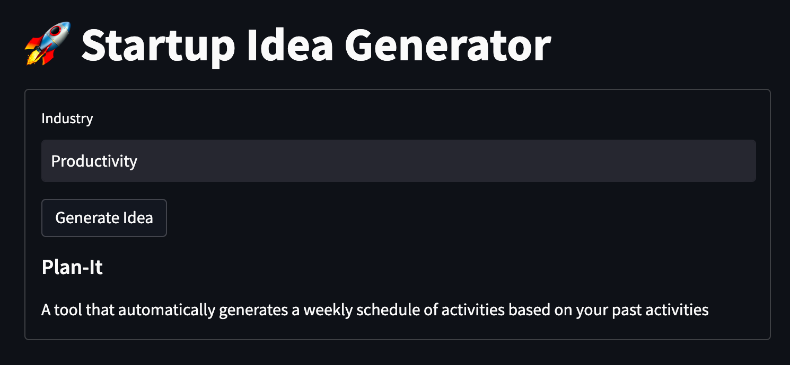
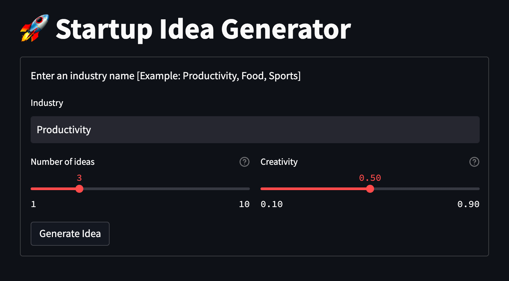
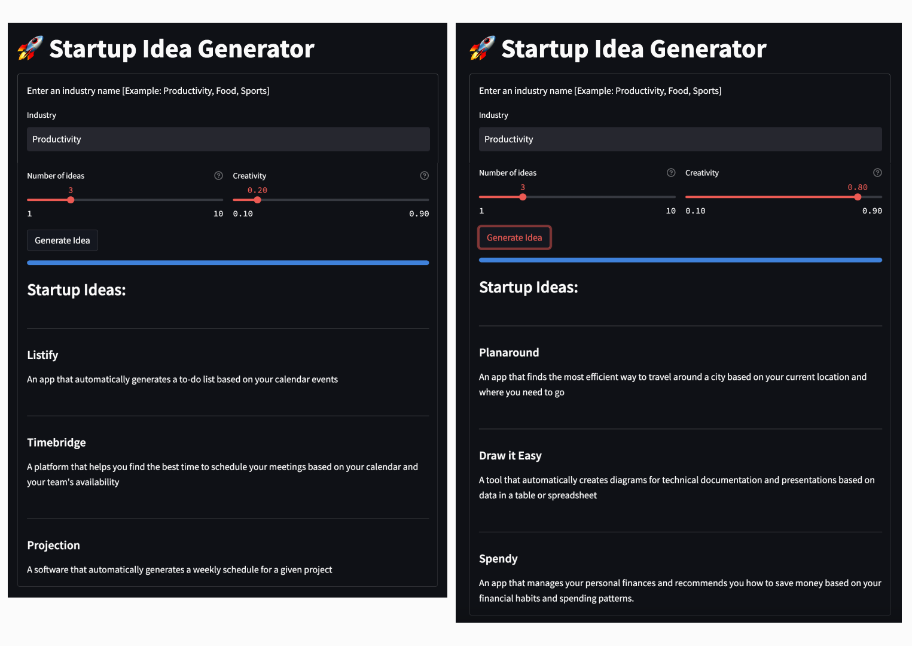

_We’ll show only selected code snippets in this article, but you can find the complete code in [this repository](https://github.com/cohere-ai/notebooks/tree/main/notebooks/llmu/examples/deploy_streamlit)_.

In this module, we will explore various options for deploying LLM-powered applications. And we'll begin with one of the fastest and simplest options to get started – Streamlit.

Web development is a multi-stage process, and front-end development usually comes back towards the end. While it may seem like front-end development should be one of the quickest parts of the process, it often turns out to be quite a lengthy endeavor.

Enter [Streamlit](https://streamlit.io/?ref=txt.cohere.com). It provides a very fast way to build front-end web applications with very little hassle. In this article, we’ll see how we can quickly prototype our Startup Idea Generator idea, deploy it as a web app and share it with the world!

But let’s go back to the start and see how we might approach this. We can break the plan into three key steps, as follows:

1. **Build the language AI back-end with Cohere**
2. **Build the front-end with Streamlit**
3. **Deploy with Streamlit Cloud**

<br />

## 1 - Build the language AI back-end with Cohere

### Build the startup idea generator

The first thing we need to do is build our main feature—the startup idea generator. For this, we use the [Chat endpoint](<>) , which generates text given an input called a prompt.

Creating prompts, or _prompt engineering_, does require some experimentation. This is also good news - it means there’s huge room for you to innovate and apply your own creativity in designing prompts that get the best out of the endpoint. Read [this documentation](/prompt-engineering-wiki/?ref=txt.cohere.com) if you are interested in learning more.

In our case, we create a prompt containing an instruction and a few examples of an industry and its corresponding startup idea.

We then build a function that leverages Cohere’s [Python SDK](/generate-reference?ref=txt.cohere.com) to take in user input and return the generated text, and the code looks as follows.

```python
def generate_idea(industry):
  prompt = f"""
Generate a startup idea given the industry.

# Examples
Industry: Workplace
Startup Idea: A platform that generates slide deck contents automatically based on a given outline

Industry: Home Decor
Startup Idea: An app that calculates the best position of your indoor plants for your apartment

Industry: Healthcare
Startup Idea: A hearing aid for the elderly that automatically adjusts its levels and with a battery lasting a whole week

Industry: Education
Startup Idea: An online primary school that lets students mix and match their own curriculum based on their interests and goals

Industry: {industry}"""

  # Call the Cohere Chat endpoint
  response = co.chat(
    model='command-r',
    message=prompt,
    preamble="")

  return response.text.replace("Startup Idea: ", "")

```

Doing a quick test, entering “_Public Transportation_” returns the following startup idea: “_A small electronic device that notifies users when they have to get off the train or bus_”. Looking good so far.

### Build the startup name generator

Generating startup ideas is great, but it would make the app much more exciting if we could also suggest a startup name for each idea. Using a similar approach as before, we create a new prompt containing an instruction and a few examples of a startup idea description and its corresponding startup name.

We create another function that takes in a startup idea as the input and returns the generated startup name. The code looks as follows.

```python
def generate_name(idea):
  prompt= f"""
Generate a startup name and name given the startup idea.

# Examples
Startup Idea: A platform that generates slide deck contents automatically based on a given outline
Startup Name: Deckerize

Startup Idea: An app that calculates the best position of your indoor plants for your apartment
Startup Name: Planteasy

Startup Idea: A hearing aid for the elderly that automatically adjusts its levels and with a battery lasting a whole week
Startup Name: Hearspan

Startup Idea: An online primary school that lets students mix and match their own curriculum based on their interests and goals
Startup Name: Prime Age

Startup Idea: {idea}"""

  # Call the Cohere Chat endpoint
  response = co.chat(
    model='command-r',
    message=prompt,
    preamble="")

  return response.text.replace("Startup Name: ", "")

```

Doing a quick test, entering the public transportation startup idea we got earlier returns the following startup name - “_Beepro_”. Not bad.

## 2 - Build the front-end with Streamlit

### Build the basic components

Now that the text generation part is working, let’s create the front end with Streamlit. Streamlit is an open-source Python library that makes it easy to create and share custom web apps. Instead of hours or even days, you can get a basic front end up and running and deploy it in minutes.

The following is our front-end code using Streamlit, which gets us a basic working app in just a few lines.

```python
st.title("🚀 Startup Idea Generator")

form = st.form(key="user_settings")
with form:
    industry_input = st.text_input("Industry", key = "industry_input")
    generate_button = form.form_submit_button("Generate Idea")
    if generate_button:
        startup_idea = generate_idea(industry_input)
        startup_name = generate_name(startup_idea)
        st.markdown("##### " + startup_name)
        st.write(startup_idea)

```

It uses a number of features from the [Streamlit API](https://docs.streamlit.io/library/api-reference?ref=txt.cohere.com), as follows:

- A form via the `st.form()` control flow
- `st.title()` for the header title
- `st.text_input()` for the user text input
- A submit button that comes with `st.form()`
- `st.markdown()` and `st.write()` to display the generated text.

We can deploy this Streamlit app by running the following command at the terminal (in this example, our code above is stored in `app.py`).

```
$ streamlit run app.py

```

Running the app locally renders the following.



<br />

### Add some interactivity

Now that we have a basic version of the app running, let’s see how we can enhance it. One way is to give users greater control when generating ideas. Let’s add a couple of options to add interactivity to the app.

The first one is straightforward. We want to let users generate more than one idea in one go. For this, we’ll use the `st.slider()` widget to let users input the number of generations to make. We’ll set the maximum number of generations to 10.

The second is a bit more interesting. With the Chat endpoint, we can use the `temperature` parameter to control the randomness of the model output. The value can range between 0 and 1. Lower values tend to generate more “predictable” output, while higher values tend to generate more “creative” output. The sweet spot is typically between 0 and 1, and for our app, we’ll just add a small buffer and set the range to be between 0.1 and 0.9. We’ll name this user setting `Creativity`.

For this, we’ll also use `st.slider()` to let the users control the `temperature` value. We’ll also need to modify the `generate_idea()` and `generate_name()` functions to accept the `temperature` argument, to be passed to the Chat API call. The following is an example with `generate_idea()`.

```python
def generate_idea(industry, temperature):
...
  response = co.chat(
    model='command-r',
    message=prompt,
    temperature=temperature,
    preamble="")
...

```

Let’s also add a couple more things. First, we’ll use `st.progress()` to show a progress bar as the idea generation takes place. Second, we’ll add a check to the `Industry` user input to make it a required field.

Altogether, the completed front-end Streamlit code looks like the following, about 20 lines.

```python
st.title("🚀 Startup Idea Generator")

form = st.form(key="user_settings")
with form:
# User input - Industry name
industry_input = st.text_input("Industry", key = "industry_input")

# Create a two-column view
col1, col2 = st.columns(2)

with col1:
    # User input - The number of ideas to generate
    num_input = st.slider("Number of ideas", value = 3, key = "num_input", min_value=1, max_value=10)

with col2:
    # User input - The 'temperature' value representing the level of creativity
    creativity_input = st.slider("Creativity", value = 0.5, key = "creativity_input", min_value=0.1, max_value=0.9)

# Submit button to start generating ideas
generate_button = form.form_submit_button("Generate Idea")

if generate_button:
    if industry_input == "":
        st.error("Industry field cannot be blank")
    else:
        my_bar = st.progress(0.05)
        st.subheader("Startup Ideas")
        for i in range(num_input):
            st.markdown("""---""")
            startup_idea = generate_idea(industry_input,creativity_input)
            startup_name = generate_name(startup_idea,creativity_input)
            st.markdown("##### " + startup_name)
            st.write(startup_idea)
            my_bar.progress((i+1)/num_input)

```

And with that, the final front-end now looks like the following.




## 3 - Deploy with Streamlit Cloud

Now that our app is ready, let’s deploy it to the web so everyone can start interacting with it. You can deploy the app via your own hosting option, but there’s also a quick and hassle-free way to do it — via Streamlit Cloud.

Streamlit Cloud launches apps directly from a GitHub repository. So, before you can deploy your app, do the following steps.

1. Push your code to a GitHub repository
2. [Sign up](https://streamlit.io/cloud?ref=txt.cohere.com) for Streamlit Cloud
3. [Connect](https://docs.streamlit.io/streamlit-cloud/get-started?ref=txt.cohere.com#connect-your-github-account) your Streamlit Cloud to the GitHub repository

Once you have completed the steps, on your Streamlit Cloud page, click on `New app`.

You’ll be brought to the `Deploy an app` page, where you can select the repository, the branch and the main file path i.e. the code we wrote earlier. You will also need to add your Cohere API key in the `Advanced settings…` link (more information [here](https://docs.streamlit.io/streamlit-cloud/get-started/deploy-an-app/connect-to-data-sources/secrets-management?ref=txt.cohere.com)).

And once that is done, click `Deploy!`. Wait a few minutes for Streamlit to deploy it, and the app is live. Now literally anyone on the web can access it!

Let’s now take the app for a spin and, say, we want to generate three startup ideas in the productivity industry.

Let’s first try with a low `Creativity` setting, of say 0.2, which should give us ideas that are more predictable and possibly more proven. The outcome? It generates ideas revolving around the usual suspects — to-do, time management, and scheduling.

Next, we try with a high `Creativity` setting, of say 0.8, which should result in ideas that are more creative but are probably bordering on being too ambitious. This time, the ideas are a lot more diverse — travel planning, diagram drawing, and personal finance.

Here are the screenshots of these generated ideas.




And that concludes our startup idea generator prototype, powered by Cohere and deployed with Streamlit.

## Conclusion

This example demonstrated how using Cohere and Streamlit, you can quickly turn your language AI product idea into a basic prototype. It’s an amazing feeling to be able to deploy a web app without spending long, frustrating hours building a front-end.
