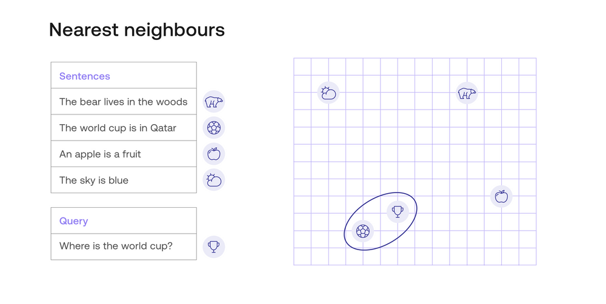
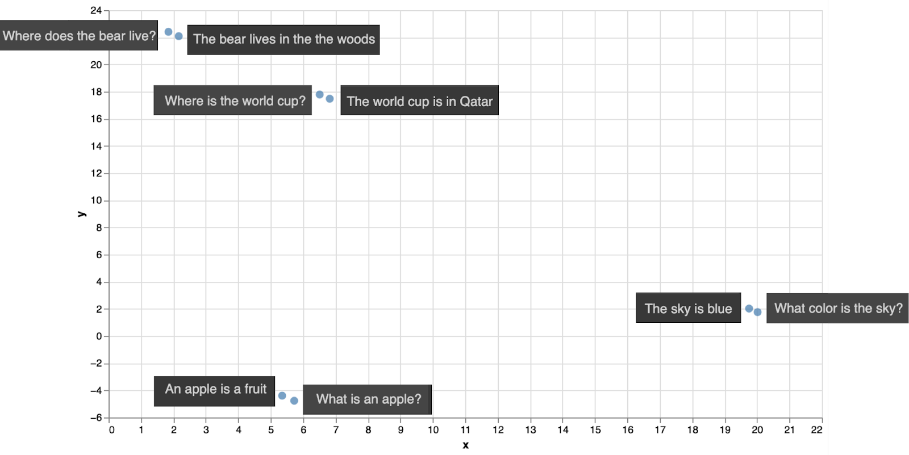
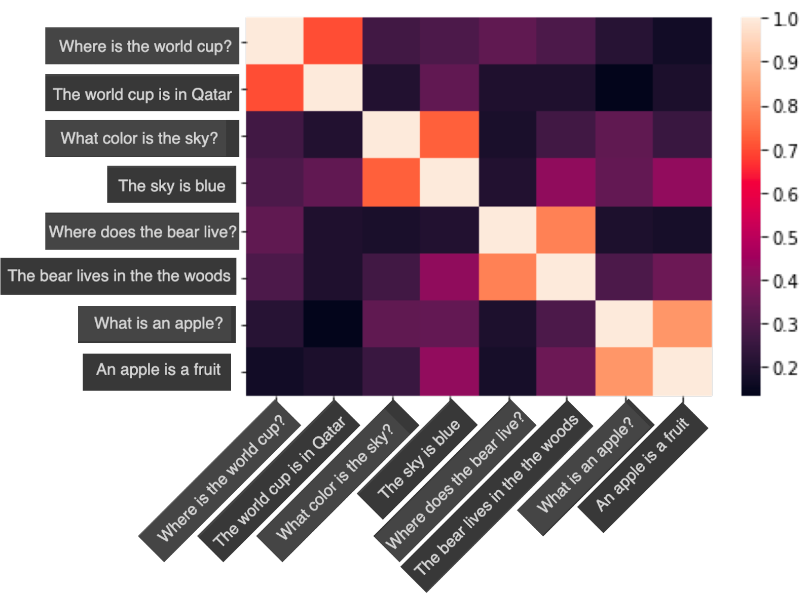
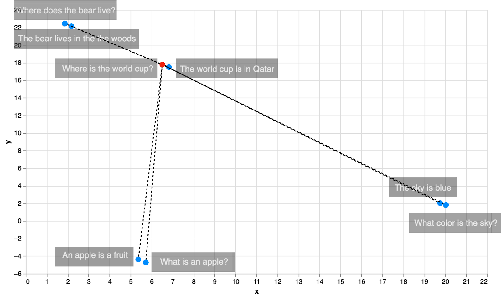
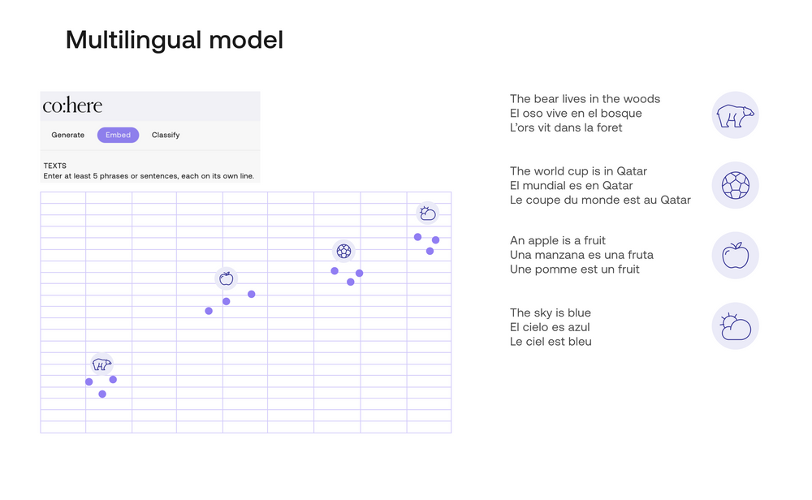
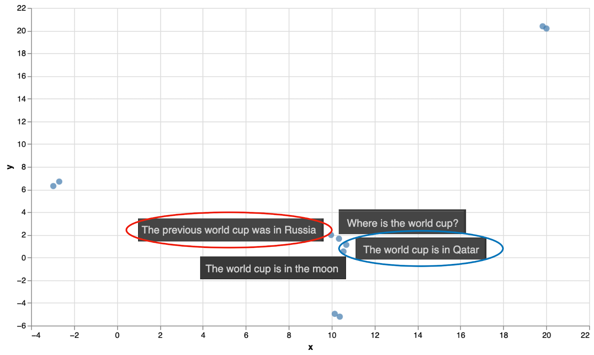

<iframe
  className="embedly-embed"
  src="https://cdn.embedly.com/widgets/media.html?src=https%3A%2F%2Fwww.youtube.com%2Fembed%2FfFt4kR4ntAA%3Ffeature%3Doembed&display_name=YouTube&url=https%3A%2F%2Fwww.youtube.com%2Fwatch%3Fv%3DfFt4kR4ntAA&image=https%3A%2F%2Fi.ytimg.com%2Fvi%2FfFt4kR4ntAA%2Fhqdefault.jpg&key=7788cb384c9f4d5dbbdbeffd9fe4b92f&type=text%2Fhtml&schema=youtube"
  width="624"
  height="350"
  scrolling="no"
  title="YouTube embed"
  frameBorder="0"
  allow="autoplay; fullscreen"
  allowFullScreen="true"
></iframe>

### Colab Notebook

This chapter comes with a [Colab notebook](https://github.com/cohere-ai/cohere-developer-experience/blob/main/notebooks/llmu/What_is_Semantic_Search.ipynb) where you get to build a simple semantic search model to answer queries from a small dataset. And if you'd like a more advanced semantic search Colab, check this one <a target="_blank" href="https://github.com/cohere-ai/cohere-developer-experience/blob/main/notebooks/guides/Basic_Semantic_Search.ipynb">here</a>!

For the setup, please refer to the [Setting Up](/docs/setting-up) chapter.

### First: What is Not Semantic Search?

Before we learn semantic search, let’s see what is not semantic search. Before semantic search, the most popular way of searching was keyword search. Imagine that you have a list of many sentences, which are the responses. When you ask a question (query), keyword search looks for the sentence (response) with the largest number of words in common with the query. For example, consider the following query and set of responses:

**Query:** Where is the world cup?

**Responses:**

- The world cup is in Qatar.
- The sky is blue.
- The bear lives in the woods.
- An apple is a fruit.

With keyword search, you can notice that the responses have the following number of words in common with the query:

**Responses:**

- **The world cup is** in Qatar. (4 words in common)
- **The** sky **is** blue. (2 words in common)
- **The** bear lives in **the** woods. (2 words in common)
- An apple **is** a fruit. (1 word in common)

In this case, the winning response is number 1, “The world cup is in Qatar”. This is the correct response, luckily. However, this won’t always be the case. Imagine if there was another response:

**Where** in **the world is** my **cup** of coffee?

This response has 5 words in common with the query, so it would win if it was in the list of responses. This is unfortunate, since this is not the correct response.

What can we do? We can improve keyword search, by removing stop words such as “the”, “and”, “is”, etc. We can also use methods like TF-IDF in order to tell apart relevant from non-relevant words. However, as you may imagine, there will always be cases in which, due to the ambiguity of the language, synonyms, and other roadblocks, keyword search will fail to find the best response. So we move on to the next algorithm, one that has performed very well: Semantic search.

In short, semantic search works as follows:

- It uses a text embedding to turn words into vectors (lists of numbers).  
  Uses similarity to find the vector among the responses which is the most similar to the vector corresponding to the query.
- Outputs the response corresponding to this most similar vector.  
  In this chapter, we’ll learn all these steps in detail. First, let’s look at text embeddings. If you need to brush up on these, check out this resource on [text embeddings](https://docs.cohere.com/docs/embeddings).

### How to Search Using Text Embeddings?

As you learned in a previous chapter, [an embedding](https://docs.cohere.com/docs/embeddings) is a way to assign to each sentence (or more generally, to each text fragment, which can be as short as a word or as long as a full article), a vector, which is a list of numbers. The Cohere embedding model used in the codelab for this chapter returns a vector of length 4096. This is a list of 4096 numbers (other Cohere embeddings, such as the multilingual one, return smaller vectors, for example, of length 768). A very important property of embeddings is that similar pieces of text get assigned to similar lists of numbers. For example, the sentence “Hello, how are you?” and the sentence “Hi, what’s up?” will be assigned lists of similar numbers, whereas the sentence “Tomorrow is Friday” will be assigned a list of numbers that are quite different from the two previous ones.

In the next image, there is an example of an embedding. For visual simplicity, this embedding assigns to each sentence, a vector of length 2 (a list of two numbers). These numbers are plotted in the graph in the right, as coordinates. For example, the sentence “The world cup is in Qatar” gets assigned to the vector (4, 2), so it gets plotted in the point with coordinates 4 (horizontal) and 2 (vertical).

In this image, all the sentences are located as points in the plane. Visually, you can identify that the query (represented by the trophy) is closest to the response “The world cup is in Qatar”, represented by the soccer ball. The other queries (represented by a cloud, a bear, and an apple) are much farther. Thus, semantic search would return the response “The world cup is in Qatar”, which is the correct response.

But before we get any further, let’s actually use a real-life text embedding to search in a small dataset. The following dataset has four queries, and their four corresponding responses.

**Dataset:**

Queries:

- Where does the bear live?
- Where is the world cup?
- What color is the sky?
- What is an apple?

Responses

- The bear lives in the woods
- The world cup is in Qatar
- The sky is blue
- An apple is a fruit

We can use the Cohere text embedding to encode these 8 sentences. That would give us 8 vectors of length 4096, but we can use some dimensionality reduction algorithms to bring those down to length 2. Just like before, this means we can plot the sentences in the plane with 2 coordinates. The plot is below.

Notice that each query is closest to its corresponding response. That means that if we used semantic search to search for the response to each of these 4 queries, we would get the correct response.

However, here’s a caveat. In the above example, we used Euclidean distance, which is simply distance in the plane. This can be generalized to vectors of 4096 entries as well (using the Pythagorean theorem). However, that’s not the ideal way to compare pieces of text. The way that is most commonly used and that has given the best results is similarity, which we study in the next section.

### Using Similarity to Find the Best Document

Elsewhere, we've [discussed how embeddings](https://cohere.com/llmu/what-is-semantic-search#:~:text=Using%20Similarity%20to%20Find%20the%20Best%20Document) allow you to tell if two pieces of text are similar or different. This uses text embeddings. In particular, you learned about two types of similarity:

- Dot product similarity
- Cosine similarity

For now, let’s join them into one notion, and let’s say that similarity is a number assigned to each pair of documents, with the following properties:

- The similarity between a piece of text and itself is a very high number.
- The similarity between two very similar pieces of text is a high number.
- The similarity between two different pieces of text is a small number.

For this chapter, we’ll use cosine similarity, which has the extra property that the values it returns are between 0 and 1. The similarity between a piece of text and itself is always 1, and the lowest value that a similarity can take is 0 (when two pieces of text are really dissimilar).

Now, in order to perform semantic search, all you have to do is calculate the similarity between the query and every pair of sentences, and return the sentence with the highest similarity. Let’s do an example. Below is a plot of the cosine similarities between the 8 sentences in the above dataset.

In this plot, the scale is given at the right. Notice the following properties:

- The diagonal is full of 1’s (as the similarity between each sentence and itself is 1).
- The similarities between each sentence and its corresponding response are around 0.7.
- The similarities between any other pair of sentences are lower values.

This means, if you were to search for the answer to, for example, the query “What is an apple?”, the semantic search model would look at the penultimate row on the table, and notice that the closest sentences are “What is an apple?” (with similarity 1), and “An apple is a fruit” (with similarity around 0.7). The system would eliminate the same query from the list, as it wouldn’t want to respond with the same question that is given. Thus, the winning response would be “An apple is a fruit”, which is the correct response.

There is a hidden algorithm here that we didn’t mention, but is very important: The nearest neighbors algorithm. In short, this algorithm finds the nearest neighbor of a point in a dataset. In this case, the algorithm found the nearest neighbor of the sentence “What is an apple?”, and the response was the sentence “An apple is a fruit”. In the next section, you’ll learn more about nearest neighbors.

### Nearest Neighbors - Pros and Cons, and How to Fix Them

Nearest neighbors is a very simple and useful algorithm, normally used for classification. More generally, it’s called k-nearest neighbors (knn), where k is any number. If the task at hand is classification, k-nearest neighbors will simply look at the k closest neighbors or a particular data point, and assign the data point the most common label amongst the neighbors. For example, if the task at hand is to classify a sentence as happy or sad (sentiment analysis), what 3-nearest neighbors would do is to look at the 3 closest neighbors to the sentence (in some embedding), and see if their majority (2) are happy or sad. That’s the label it assigns to the sentence.

As you can see, k-nearest-neighbors is exactly what we’ve been doing for semantic search in this chapter. Given a query, you look for the closest neighbor in the embedding, and that’s the response to the query. In the current examples, that method has worked well. However, k-nearest-neighbors is not the fastest algorithm. The reason for this is that in order to find the neighbors of one point, one needs to calculate the distances between that point and all the other points in the dataset, and then find the smallest one. As you can see in the image below, in order to find the closest neighbor to the sentence “Where is the world cup?”, we had to calculate 8 distances, one for each other data point.

When dealing with massive archives, however, we can optimize for performance by slightly adjusting the algorithm to become approximate-k-nearest-neighbors. In particular, in search, there are several improvements that can speed up this process quite a lot. Here are two of them:

Inverted File Index (IVD): Consists of clustering similar documents, then searching in the clusters that are closest to the query.  
Hierarchical Navigable Small World (HNSW): Consists on starting with a few points, and searching there. Then adding more points at each iteration, and searching in each new space.

### Multilingual Search

As you may have noticed, the performance of semantic search depends on the strength of the embedding. Therefore, any superpowers of the embedding may translate into superpowers of the semantic search model. The new multilingual embedding, by Cohere, is an embedding that supports more than 100 languages. In short, the embedding will send any piece of text in any of these languages, to a vector (this time of length 768). Similar pieces of text will be sent to similar vectors. Therefore, one can search using a query in any language, and the model will search for answers in all the other languages.

In the image below, you can see an example of multilingual embedding. The embedding sends each sentence to a vector of length 4096, but, just like in the previous example, a projection is used to send this vector to one of length 2. These 2 entries in the vector are used as coordinates in the plane for the plot.

In this plot, we have 4 sentences in English, together with their direct translations in Spanish and French.

**English:**

- The bear lives in the woods.
- The world cup is in Qatar.
- An apple is a fruit.
- The sky is blue.

**Spanish:**

- El oso vive en el bosque.
- El mundial es en Qatar.
- Una manzana es una fruta.
- El cielo es azul.

**French:**

- L’ours vit dans la forêt.
- La coupe du monde est au Qatar.
- Une pomme est un fruit.
- Le ciel est bleu.

As you can see in the plot, the multilingual model has located each sentence and its two translations very close together. Here’s a video if you’d like to learn more about multilingual embeddings and search.

### Are Embeddings and Similarity Enough? (No)

In this chapter, you’ve seen how effective a search model can be when it consists of a solid embedding, plus a search based in similarity. But is this the end of the story? Unfortunately (or fortunately?) no. It turns out that only using these two tools can lead to some mishaps. Luckily, these are mishaps that we can fix. Here is an example. Let’s extend our initial dataset a bit, by adding some more responses to the world cup question. Consider the following sentences.

**Query:** “Where is the world cup?”

**Responses:**

- The world cup is in Qatar
- The world cup is in the moon
- The previous world cup was in Russia

When we locate them in the embedding above, they are all close, as expected. However, the closest sentence to the query is not response 1 (the correct answer), but response 3. This response (“The previous world cup is in Russia”) is a correct statement, and semantically close to the question, but it’s not the answer to the question. Response 2 (“The world cup is in the moon”) is a completely wrong answer, but also semantically close to the query. As you can see in the embedding, it’s dangerously close to the query, meaning it is likely that bogus answers like these will be the top results in the semantic search model.

How do we fix this? There are many ways to improve search performance so that the actual response the model returns is ideal, or at least close to ideal. One of them is multiple negative ranking loss: Having positive pairs (query, response) and several other negative pairs (query, wrong response). Training the model to reward positive pairs, and punish negative pairs.

In the current example, we would take a positive (query, response) pair, such as this one:

(Where is the world cup?, The world cup is in Qatar.)

We would also take several negative (query, response) pairs, such as:

- (Where is the world cup?, The world cup is in the moon)
- (Where is the world cup?, The previous world cup was in Russia)
- (Where is the world cup?, The world cup is in 2022.)

By training the model to respond negatively to bad (query, response) pairs, the model is more likely to give the correct answer to a query.

### Conclusion

In this chapter you learned semantic search, which is a very powerful way to search for an answer to a particular question. It is an improvement over keyword search, since it actually compares the semantic meaning of the query and the responses. In order to do this, it uses a text embedding, and it ranks the responses based on their similarity to the query.

Follow along, as in Module 3 of this course, you'll be able to build semantic search models using the Cohere endpoints, and use them to search for answers in databases.

### Original Source

This material comes from the post <a target="_blank" href="https://cohere.com/llmu/what-is-semantic-search/">What is Semantic Search?</a>
