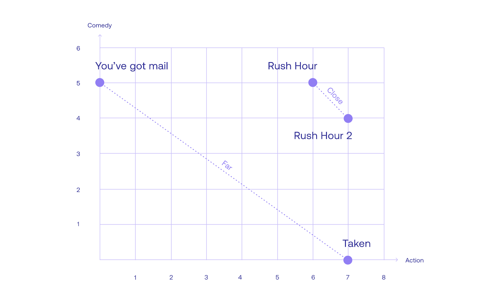
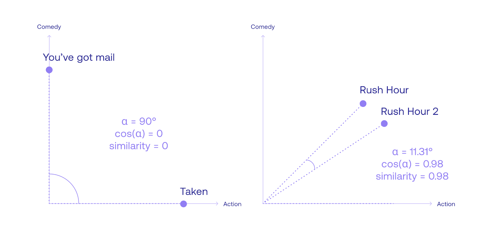
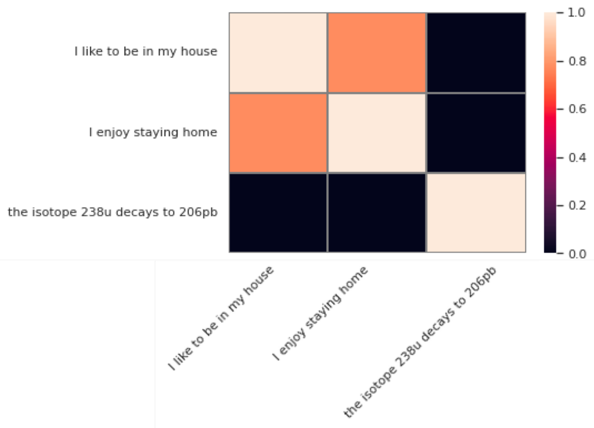

<iframe
  className="embedly-embed"
  src="https://cdn.embedly.com/widgets/media.html?src=https%3A%2F%2Fwww.youtube.com%2Fembed%2FB3jS_aUEicY%3Ffeature%3Doembed&display_name=YouTube&url=https%3A%2F%2Fwww.youtube.com%2Fwatch%3Fv%3DB3jS_aUEicY&image=https%3A%2F%2Fi.ytimg.com%2Fvi%2FB3jS_aUEicY%2Fhqdefault.jpg&key=7788cb384c9f4d5dbbdbeffd9fe4b92f&type=text%2Fhtml&schema=youtube"
  width="624"
  height="350"
  scrolling="no"
  title="YouTube embed"
  frameBorder="0"
  allow="autoplay; fullscreen"
  allowFullScreen="true"
></iframe>"

For large language models, it is crucial to know when two words, or two sentences, are similar or different. This can be a hard problem, but luckily, word and sentence embeddings are very helpful for this task. In this chapter, we go over some different notions of similarity.

### Codelab

This chapter comes with a codelab where you get to calculate similarities between different pieces of text. Check it out [here](https://colab.research.google.com/github/cohere-ai/notebooks/blob/main/notebooks/llmu/What_Is_Similarity_Between_Sentences.ipynb)!

### Similarity between text

Knowing if two words are similar or different is a very important task for every large language model. An even harder problem is knowing if two different sentences are similar or different. Luckily, word and sentence embeddings are very useful for this task.

In the previous chapter, I explained the concept of word embeddings. In a nutshell, a word embedding is an assignment of a list of numbers (vector) to every word, in a way that semantic properties of the word translate into mathematical properties of the numbers. What do we mean by this? For example, two similar words will have similar vectors, and two different words will have different vectors. But most importantly, each entry in the vector corresponding to a word keeps track of some property of the word. Some of these properties can be understandable to humans, such as age, size, gender, etc., but some others could potentially only be understood by the computer. Either way, we can benefit from these embeddings for many useful tasks.

Sentence embeddings are even more powerful, as they assign a vector of numbers to each sentence, in a way that these numbers also carry important properties of the sentence. One of the Cohere embeddings assigns a vector of length 4096 (i.e., a list of 4096 numbers) to each sentence. Furthermore, multilingual embedding does this for sentences in more than 100 languages. In this way, the sentence “Hello, how are you?” and its corresponding French translation, “Bonjour, comment ça va?” will be assigned very similar numbers, as they have the same semantic meaning.

Now that we know embeddings quite well, let’s move on to using them to find similarities. There are two types of similarities we’ll define in this post: dot product similarity and cosine similarity. Both are very similar and very useful to determine if two words (or sentences) are similar.

### Dot Product Similarity

Let’s start with a small example of sentence embedding. For simplicity, let’s consider a dataset of 4 sentences, all movie titles, and an embedding of dimension 2, meaning that each sentence is assigned to two numbers. Let’s say that the embedding is the following:

You’ve Got Mail: [0, 5]  
Rush Hour: [6, 5]  
Rush Hour 2: [7, 4]  
Taken: [7, 0]

Let’s take a closer look at these scores. Would they mean anything? As mentioned before, these scores sometimes mean something that humans can understand, and other times they don’t. In this case, notice that the first score is 0 for You’ve Got Mail, but high for all the other movies. Is there a feature that these three movies have, and that You’ve Got Mail doesn’t? I can think of one: being an action movie. Similarly, the second score is high for You’ve Got Mail, Rush Hour, and Rush Hour 2, but low for Taken. What could this property be? Comedy seems to be one. Therefore, in our embedding, it could well be that the first score is the amount of action in the movie, and the second score is the amount of comedy. The following table represents the embedding.

| Movie           | Score 1 (Action) | Score 2 (Comedy) |
| :-------------- | :--------------- | :--------------- |
| You’ve got mail | 0                | 5                |
| Rush Hour       | 6                | 5                |
| Rush Hour 2     | 7                | 4                |
| Taken           | 7                | 0                |

Now, imagine that we want to find the similarities between these movies. In particular, how similar would you say Taken is from You’ve Got Mail? How similar is Rush Hour to Rush Hour 2? In my opinion, Taken and You’ve Got Mail are very different, and Rush Hour and Rush Hour 2 are very similar. We now need to create a similarity score that is low for the pair [You’ve Got Mail, Taken], and high for the pair [Rush Hour, Rush Hour 2].

Here is one way to create this similarity score. Notice that if two movies are similar, then they must have similar action scores and similar comedy scores. So if we multiply the two action scores, then multiply the two comedy scores, and add them, this number would be high if the scores match. On the other hand, if the scores don’t match very well, the similarity score would be lower. This operation is called the dot product. Let’s see how it works for the two pairs of movies.

- Dot product for the pair [You’ve got mail, Taken] = 0\*7 + 5\*0 = 0
- Dot product for the pair [Rush Hour, Rush Hour 2] = 6\*7 + 5\*4 = 62

This matches our intuition since we were expecting a low similarity for the first pair, and a high similarity for the second pair. Of course, this was a very small example. Let’s do a real-life example with the Cohere embedding. Consider the following 3 sentences:

### Real-Life Example

Let’s use the cohere ‘embed’ function to find the embeddings of the following 3 sentences:

- Sentence 1: “I like to be in my house”
- Sentence 2: “I enjoy staying home”
- Sentence 3: the isotope 238u decays to 206pb”

One would expect the two first sentences to have a high similarity score when compared to each other, and the third one to have a very low similarity score when compared to the other two. Let’s calculate it using the Cohere embeddings. The following code will calculate the embeddings:

```
sentence1 = np.array(co.embed(["I like to be in my house"]).embeddings)
sentence2 = np.array(co.embed(["I enjoy staying home"]).embeddings)
sentence3 = np.array(co.embed(["the isotope 238u decays to 206pb"]).embeddings)
```

The results are as follows:

- Embedding for sentence 1 [-1.3662109 -0.53759766 0.06109619 ... 0.60839844 -0.2902832 0.68408203]
- Embedding for sentence 2 [-0.38427734 2.3808594 2.5527344 ... 0.12353516 -0.91259766 0.6542969 ]
- Embedding for sentence 3 [-1.3916016 -1.6757812 -1.1640625 ... -2.7988281 1.5898438 0.17578125]

Note that these are vectors (lists) of 4096 numbers, so they are truncated here (thus the dots in between). One would expect that the vectors corresponding to sentences 1 and 2 are similar to each other and that both are different from the vector corresponding to sentence 3. However, from inspection, this is not very clear. We need to calculate some similarities to see if this is the case. Let’s calculate the dot products between the three sentences. The following line of code will do it.

```
from numpy import dot
print("Similarity between sentences 1 and 2:", dot(sentence1[0], sentence2[0]))
print("Similarity between sentences 1 and 3:", dot(sentence1[0], sentence3[0]))
print("Similarity between sentences 2 and 3:", dot(sentence2[0], sentence3[0]))
```

And the results are:

- The similarity between sentences 1 and 2: 6738.2858668486715
- The similarity between sentences 1 and 3: -122.22666955510499
- The similarity between sentences 2 and 3: -3.494608113647928

These results certainly confirm our predictions. The similarity between sentences 1 and 2 is 6738, which is high. The similarities between sentences 1 and 3, and 2 and 3, are -122 and -3.5 (dot products are allowed to be negative too!), which are much lower.

Just for consistency, let’s calculate the similarities between each sentence and itself, to confirm that a sentence and itself has the highest similarity score.

- The similarity between sentences 1 and 1: 8709.117812702145
- The similarity between sentences 2 and 2: 8703.38120899619
- The similarity between sentences 3 and 3: 7978.303206108623

This checks out—the similarity between a sentence and itself is around 8000, which is higher than all the other similarities.

Now, these numbers are pretty big and hard to handle. Wouldn’t it be lovely to have a similarity score that was, say, between 0 and 1? Such that two sentences that are very dissimilar have a score close to 0, two sentences that are similar have a higher score, and two sentences that are identical have a similarity score of 1. This is definitely possible! And cosine similarity does precisely that.

### Cosine Similarity

Another measure of similarity between sentences (and words) is to look at the angle between them. For example, let’s plot the movie embedding in the plane, where the horizontal axis represents the action score, and the vertical axis represents the comedy score. The embedding looks like this.



Notice that You’ve Got Mail is quite far from Taken, which makes sense since they are very different movies. Furthermore, Rush Hour and Rush Hour 2 are very close, as they are similar movies. So Euclidean distance (the length of the line between the points) is a good measure for similarity. We need to tweak it a little bit, since we want a measure of similarity that is high for sentences that are close to each other, and low for sentences that are far away from each other. Distance does the exact opposite. So in order to tweak this metric, let’s look at the angle between the rays from the origin (the point with coordinates [0,0]), and each sentence. Notice that this angle is small if the points are close to each other, and large if the points are far away from each other. Now we need the help of another function, the cosine. The cosine of angles close to zero is close to 1, and as the angle grows, the cosine decreases. This is exactly what we need. Therefore, we define the cosine distance as the cosine of the angle formed by the two rays going from the origin, to the two sentences.



Notice that in the ongoing example, the angle between the movies You’ve Got Mail, and Taken, is 90 degrees, with a cosine of 0. Therefore, the similarity between them is 0. On the other hand, the angle between the movies Rush Hour and Rush Hour 2 is 11.31 degrees. Its cosine is 0.98, which is quite high. In fact, the similarity between a sentence and itself is always 1, as the angle is 0, with a cosine of 1.

Now let’s calculate the cosine distance of the sentences in the previous example.

### Real-Life Example

Recall that the three sentences we’re working with are:

- Sentence 1: “I like to be in my house”
- Sentence 2: “I enjoy staying home”
- Sentence 3: the isotope 238u decays to 206pb”

Now let’s calculate the cosine similarities between them.

```
from sklearn.metrics.pairwise import cosine_similarity
print("Cosine similarity between sentences 1 and 2:", cosine_similarity(sentence1, sentence2)[0][0])
print("Cosine similarity between sentences 1 and 3:", cosine_similarity(sentence1, sentence3)[0][0])
print("Cosine similarity between sentences 2 and 3:", cosine_similarity(sentence2, sentence3)[0][0])
```

The results are the following:

- Cosine similarity between sentences 1 and 2: 0.7739596968978093
- Cosine similarity between sentences 1 and 3: -0.014663026750986932
- Cosine similarity between sentences 2 and 3: -0.00041937178612739233

This checks out as well! The similarity between sentences 1 and 2, which are similar, is 0.77. On the other hand, their similarities with sentence 3 are very close to 0. Now let’s check the similarity between each sentence and itself. These appear in the plot below.

- Cosine similarity between sentences 1 and 1: 1.00
- Cosine similarity between sentences 2 and 2: 1.00
- Cosine similarity between sentences 3 and 3: 1.00


The similarity between each sentence and itself is 1 (the diagonal in the plot), which is consistent with our expectations. Furthermore, a sentence and itself represent the same point in space, which gives an angle of 0 with the origin, so it makes sense that the similarity is the cosine of 0, which is 1!

### Conclusion

In the previous chapter, we learned that sentence embeddings are the bread and butter of language models, as they associate each sentence with a particular list of numbers (a vector), in a way that similar sentences give similar vectors. We can think of embeddings as a way to locate each sentence in space (a high dimensional space, but a space nonetheless), in a way that similar sentences are located close by. Once we have each sentence somewhere in space, it’s natural to think of distances between them. And an even more intuitive way to think of distances is to think of similarities, i.e., a score assigned to each pair of sentences, which is high when these sentences are similar, and low when they are different. The similarity is a very useful concept in large language models, as it can be used for search, for translation, for summarization, and in many other applications. To learn more about these applications, stay tuned for the next article!

### Original Source

This material comes from the post <a target="_blank" href="https://txt.cohere.com/what-is-similarity-between-sentences/">What is Similarity Between Sentences?</a>
