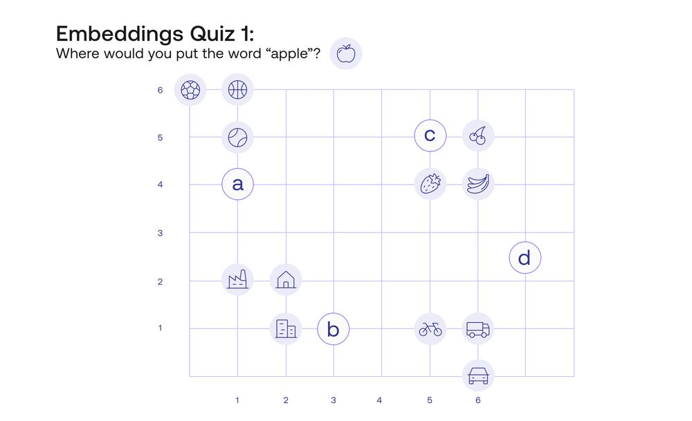
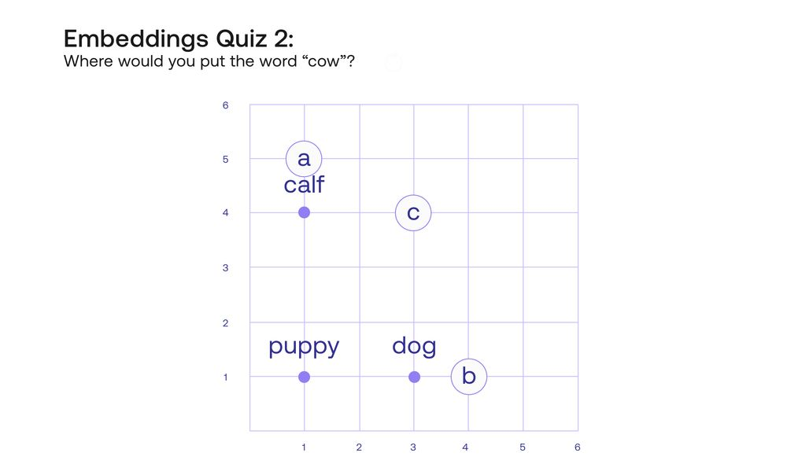
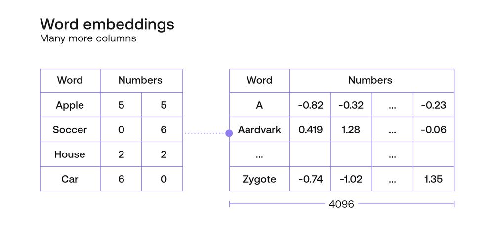
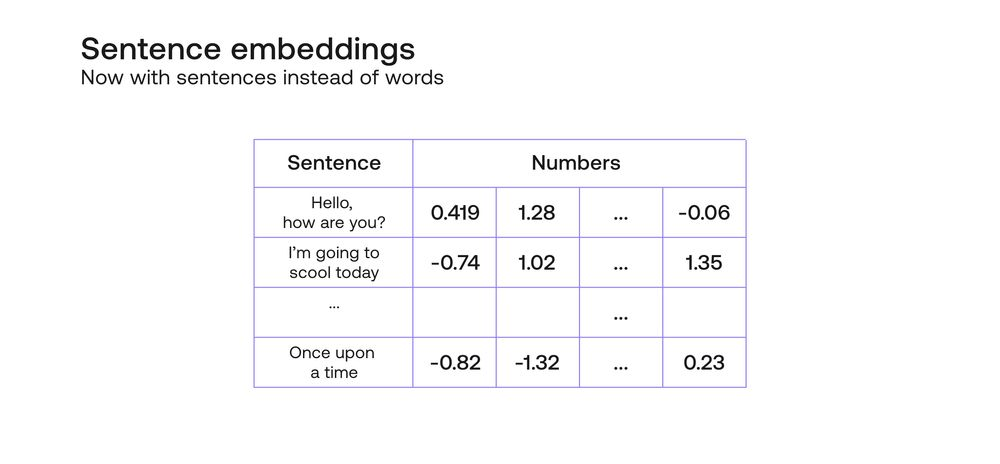
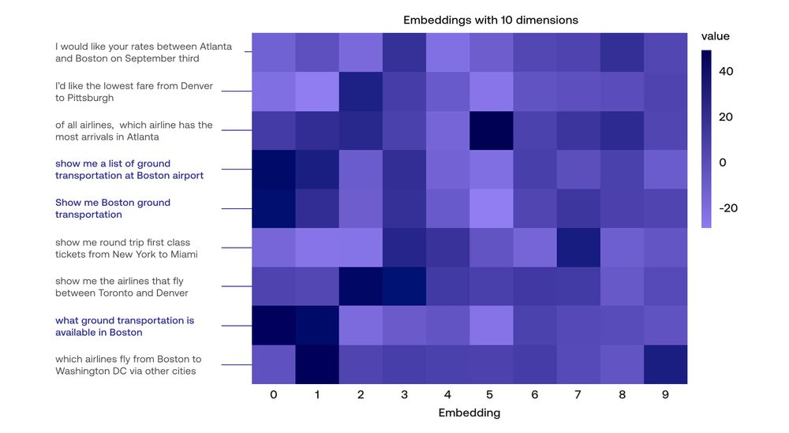
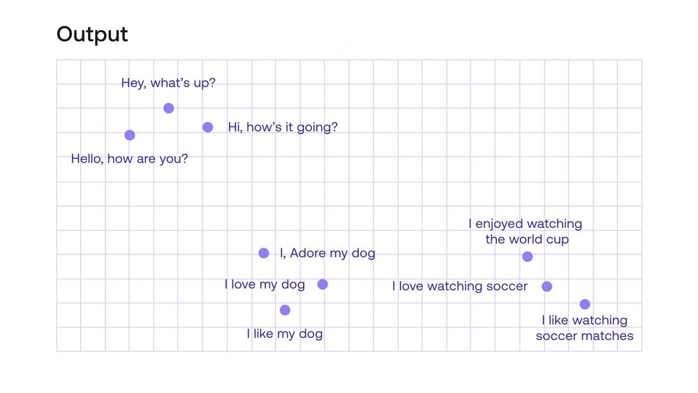
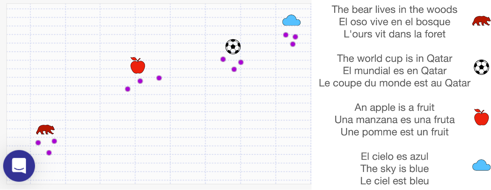

<iframe
  className="embedly-embed"
  src="https://cdn.embedly.com/widgets/media.html?src=https%3A%2F%2Fwww.youtube.com%2Fembed%2FA8HEPBdKVMA%3Ffeature%3Doembed&display_name=YouTube&url=https%3A%2F%2Fwww.youtube.com%2Fwatch%3Fv%3DA8HEPBdKVMA&image=https%3A%2F%2Fi.ytimg.com%2Fvi%2FA8HEPBdKVMA%2Fhqdefault.jpg&key=7788cb384c9f4d5dbbdbeffd9fe4b92f&type=text%2Fhtml&schema=youtube"
  width="624"
  height="350"
  scrolling="no"
  title="YouTube embed"
  frameBorder="0"
  allow="autoplay; fullscreen"
  allowFullScreen="true"
></iframe>

In old futuristic movies, such as the 2001 Space Odyssey, the main computer (HAL) was able to talk to humans and understand what they would say with great ease. At the time, getting computers to understand and produce language seemed like an impossible task, but the latest large language models (LLM) are able to do this in a way that makes it almost impossible for a human to tell if they are talking to another human, or to a computer.

The quintessential task of natural language processing (NLP) is to understand human language. However, there is a big disconnection there. Humans speak in words and sentences, but computers only understand and process numbers. How can we turn words and sentences into numbers in a coherent way? An assignment of words to numbers is called a word embedding. We can think of a word embedding as an assignment of scores to the words, with some nice properties (that we’ll learn soon).

### What is a Word Embedding?

Before we get into what is a word embedding, let me test your intuition. In the figure underneath (Quiz 1), I have located 12 words in the plane. The words are the following:

Banana  
Basketball  
Bicycle  
Building  
Car  
Castle  
Cherry  
House  
Soccer  
Strawberry  
Tennis  
Truck

Now, the question is, where would you locate the word “Apple” in this plane? There are many places it could go, but I’m allowing 3 possibilities labeled A, B, and C.

What I would do, is locate it in point C, because it would make sense to have the word “Apple” close to the words “Banana”, “Strawberry”, and “Cherry”, and far from the other words such as “House”, “Car”, or “Tennis”. This is precisely a word embedding. And what are the numbers we are assigning to each word? Simply the horizontal and vertical coordinates of the location of the word. In this way, the word “Apple” is assigned to the numbers [5,5], and the word “Bicycle” to the coordinates [5,1].

For the sake of redundancy, let’s enumerate some properties that a nice word embedding should have:

Words that are similar should correspond to points that are close by (or equivalently, to scores that are similar).  
Words that are different should correspond to points that are far away (or equivalently, to scores that are significantly different).

### Word Embeddings Capture Features of the Word

The word embedding above satisfies properties 1 and 2. Is that it? Not yet. There is something more to these word embeddings, and it is that they don’t only capture word similarity, but they also capture other properties of the language. In language, words can be combined to get more complicated concepts. In mathematics, numbers can be added or subtracted to get other numbers. Could we build a word embedding that captures relations between words, as relations between numbers?

Let’s look at four words, “Puppy”, “Dog”, “Calf”, and “Cow”. These words are clearly correlated. Now to test your intuition again, I’m going to locate the words “Puppy”, “Dog”, and “Calf” in the plane, and I’ll ask you to add the word “Cow”. Where would you add it, in the spot labeled A, B, or C?

While it would make sense to locate it in A, closer to “Calf” since they are both bovine, or in B, since it’s an adult animal, like “Dog”, the place where I would put this is in spot C, with coordinates [3,4]. Why? Because the rectangle formed by the four words captures some very important relationships between them. For instance, two analogies are captured here. The analogy “A puppy is to a dog like a calf is to a cow” can be translated into “The path from the word puppy to the word dog is the same as the path from the word calf to the word cow”. The analogy “A dog is to a cow like a puppy is to a calf” is also captured in this rectangle, as it’s shown in the figure below.

However, this is not even the tip of the iceberg. The main property of word embeddings that is in effect here is that the two axes (vertical and horizontal) represent different things. If you look carefully, moving towards the right turns the puppy into a dog, and the calf into a cow, which is an increase in age. Likewise, moving upwards turns a puppy into a calf and a dog into a cow, which is an increase in the size of the animal. It seems that this embedding is understanding that the words in it have two main properties, or features: age and size. Furthermore, it seems that the embedding is locating age in the horizontal axis and size in the vertical axis. In that case, where would you imagine that the word “whale” goes? Probably somewhere above the word “cow”. And if there was a word for “really old dog”? That word would go somewhere to the right of the word “dog”.

A good word embedding would be able to capture not only age and size, but also many more features of the words. Since each feature is one new axis, or coordinate, then a good embedding must have many more than two coordinates assigned to every word. One of the Cohere embeddings, for example, has 4096 coordinates associated with each word. These rows of 4096 (or however many) coordinates are called vectors, so we often talk about the vector corresponding to a word, and to each of the numbers inside a vector as a coordinate. Some of these coordinates may represent important properties of the word, such as age, gender, size. Some may represent combinations of properties. But some others may represent obscure properties that a human may not be able to understand. But all in all, a word embedding can be seen as a good way to translate human language (words) into computer language (numbers), so that we can start training machine learning models with these numbers.

### Sentence embeddings

So word embeddings seem to be pretty useful, but in reality, human language is much more complicated than simply a bunch of words put together. Human language has structure, sentences, etc. How would one be able to represent, for instance, a sentence? Well, here’s an idea. How about the sums of scores of all the words? For example, say we have a word embedding that assigns the following scores to these words:

No: [1,0,0,0]  
I: [0,2,0,0]  
Am: [-1,0,1,0]  
Good: [0,0,1,3]  
Then the sentence “No, I am good!” corresponds to the vector [0,2,2,3]. However, the sentence “I am no good” will also correspond to the vector [0,2,2,3]. This is not a good thing, since the computer understand these two sentences in the exact same way, yet they are quite different, almost opposite sentences! Therefore, we need better embeddings that take into account the order of the words, the semantics of the language, and the actual meaning of the sentence.

This is where sentence embeddings come into play. A sentence embedding is just like a word embedding, except it associates every sentence with a vector full of numbers, in a coherent way. By coherent, I mean that it satisfies similar properties as a word embedding. For instance, similar sentences are assigned to similar vectors, different sentences are assigned to different vectors, and most importantly, each of the coordinates of the vector identifies some (whether clear or obscure) property of the sentence.

The Cohere embedding does just this. Using transformers, attention mechanisms, and other cutting edge algorithms, this embedding sends every sentence to a vector formed by 4096 numbers, and this embedding works really well. As a small example, here is a heatmap of an embedding containing 10 entries for each sentence, for several sentences (writing the entire 4096 entries will take too much space, so we compressed it using a dimensionality reduction algorithm called <a target="_blank" href="https://www.youtube.com/watch?v=g-Hb26agBFg">Principal Component Analysis</a>.

Notice that these sentences are all very similar. In particular, the three highlighted sentences pretty much have the same meaning. If you look at their corresponding vectors, these are also really similar. That is exactly what an embedding should do.

### How to Use These Embeddings?

Now that you’ve learned how useful these embeddings are, it’s time to start playing with them and finding good practical uses for them! The <a target="_blank" href="https://dashboard.cohere.ai/">Cohere dashboard</a> provides a very friendly interface to use them. Here is a small example, with the following phrases:

I like my dog  
I love my dog  
I adore my dog  
Hello, how are you?  
Hey, how's it going?  
Hi, what's up?  
I love watching soccer  
I enjoyed watching the world cup  
I like watching soccer matches

To see the results of the sentence embedding, go to the “Embed” tab in the Cohere dashboard, and type the sentences (click here for an embed demo you can play with).

The results come out as vectors with 4096 entries for each sentence. These are obviously hard to visualize, but there is a way to bring them down to 2 entries per sentence in order to be easily visualized. This visualization is in the plot below.

Notice that the embedding seemed to capture the essence of the sentences, and there are 3 clear clusters of sentences. In the top left corner you find the sentences that greet a person, in the middle, those that talk about a person’s dog, and in the bottom right corner, those that talk about soccer. Notice that sentences such as “Hey what’s up” and “Hello, how are you?” have no words in common, yet the model can tell that they have the same meaning.

### Multilingual Sentence Embeddings

Most word and sentence embeddings are dependent on the language that the model is trained on. If you were to try to fit the French sentence “Bonjour, comment ça va?” (meaning: hello, how are you?) in the embedding from the previous section, it will struggle to understand that it should be close to the sentence “Hello, how are you?” in English. For the purpose of unifying many languages into one, and being able to understand text in all these languages, Cohere has trained a large multilingual model, that has showed wonderful results with <a target="_blank" href="/docs/supported-languages">more than 100 languages</a>. Here is a small example, with the following sentences in English, French, and Spanish.

The bear lives in the woods  
El oso vive en el bosque  
L’ours vit dans la foret  
The world cup is in Qatar  
El mundial es en Qatar  
La coupe du monde est au Qatar  
An apple is a fruit  
Una manzana es una fruta  
Une pomme est un fruit  
El cielo es azul  
The sky is blue  
Le ciel est bleu

The model returned the following embedding.

Notice that the model managed to identify the sentences about the bear, soccer, an apple, and the sky, even if they are in different languages.

### Conclusion

Word and sentence embeddings are the bread and butter of LLMs. They are the basic building block of most language models, since they translate human speak (words) into computer speak (numbers) in a way that captures many relations between words, semantics, and nuances of the language, into equations regarding the corresponding numbers.

Sentence embeddings can be extended to language embeddings, in which the numbers attached to each sentence are language-agnostic. These models are very useful for translation and for searching and understanding text in different languages.

### Original Source

This material comes from the post <a target="_blank" href="https://txt.cohere.com/sentence-word-embeddings/">What Are Word and Sentence Embeddings?</a>
