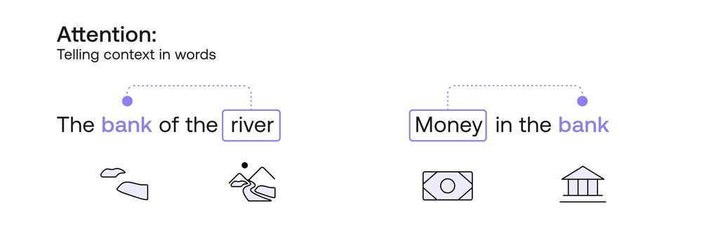
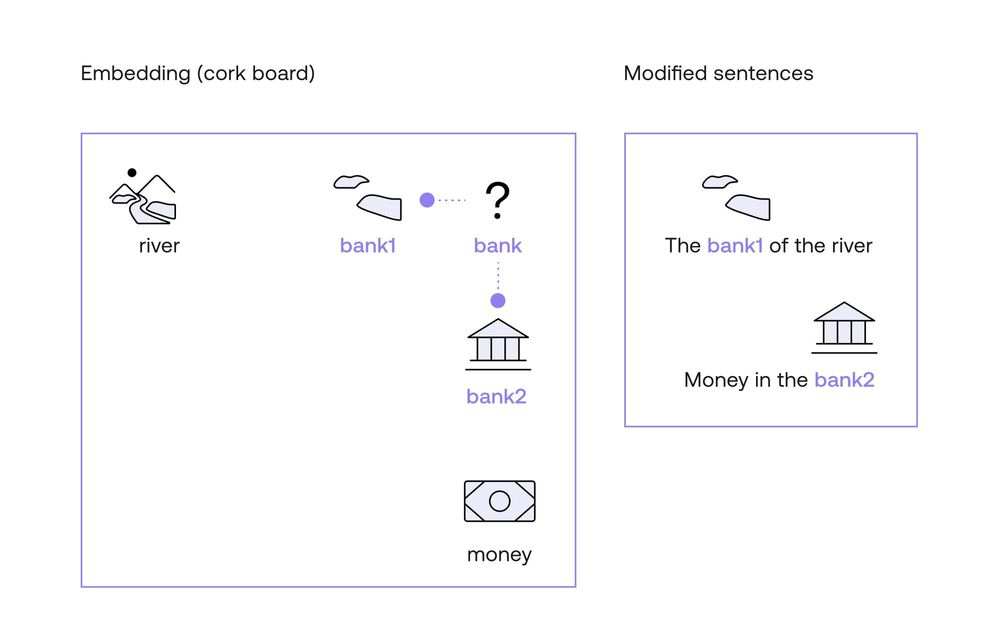
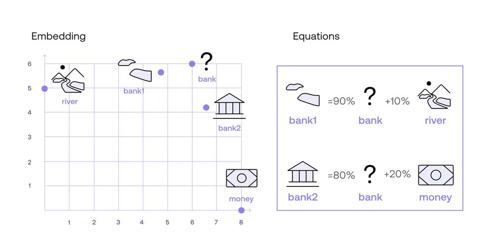
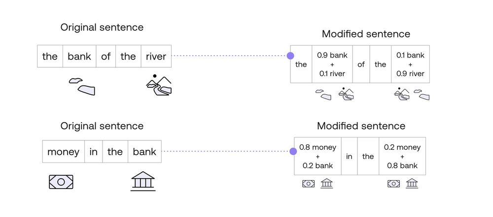

<iframe
  className="embedly-embed"
  src="https://cdn.embedly.com/widgets/media.html?src=https%3A%2F%2Fwww.youtube.com%2Fembed%2Fj10yrR6PPfg%3Ffeature%3Doembed&display_name=YouTube&url=https%3A%2F%2Fwww.youtube.com%2Fwatch%3Fv%3Dj10yrR6PPfg&image=https%3A%2F%2Fi.ytimg.com%2Fvi%2Fj10yrR6PPfg%2Fhqdefault.jpg&key=7788cb384c9f4d5dbbdbeffd9fe4b92f&type=text%2Fhtml&schema=youtube"
  width="624"
  height="350"
  scrolling="no"
  title="YouTube embed"
  frameBorder="0"
  allow="autoplay; fullscreen"
  allowFullScreen="true"
></iframe>

In the previous chapters, you learned about word and sentence embeddings and similarity between words and sentences. In short, a word embedding is a way to associate words with lists of numbers (vectors) in such a way that similar words are associated with numbers that are close by, and dissimilar words with numbers that are far away from each other. A sentence embedding does the same thing, but associating a vector to every sentence. Similarity is a way to measure how similar two words (or sentences) are, by assigning large numbers to words (sentences) that are similar, and small numbers to those that are different.

However, word embeddings have a huge Achilles heel: words that have more than one definition. If a word embedding assigns a vector to, say, the word ‘bank’, it assigns the same vector to all the definitions of ‘bank’. What if you want to use this word in different contexts? Here is where attention comes into play. Self-attention was introduced in the seminal paper Attention is All you Need, written by several co-authors, including Cohere’s cofounder Aidan Gomez. Attention is a very clever way to tell words apart when they are used in different contexts (which turns word embeddings into contextualized word embeddings).

### One Word, Multiple Meanings

In order to understand attention, let’s look at two sentences:

- **Sentence 1:** The **bank** of the river.
- **Sentence 2:** Money in the **bank**.

How would a computer know that the word “bank” in the first sentence refers to a setting in nature, and in the second sentence to a financial setting? Well, let’s ask a simpler question: How would a human know this? How did you figure out these two settings? The way you and I did it was probably to look at the neighbouring words. In the first sentence, the word “river” was the one that hinted at the nature setting, and in the second sentence, the word “money” was key to the financial setting. So in short, we need a way to use the other words in the sentence to understand what context of the word “bank” we want to use.

Here is where <a target="_blank" href="/docs/text-embeddings">word embeddings</a> come into play. As you learned in a previous chapter, word embeddings are a way to assign vectors (lists of numbers) to each word. I like to imagine them geometrically. Imagine that the words “bank”, “river”, and “money” are all attached on a cork board. Furthermore, this cork board contains all the existing words, and in such a way that two words that are similar (such as “apple” and “pear”) are close by. Now, in this cork board, “bank”, “river”, and “money” are not exactly close by. However, what you do is take the word “bank”, and move it slightly towards the word “river”. Call this word “bank1”. Now, take another copy of the word “bank”, and move it slightly towards the word “money”. Call this one “bank2”. Now, consider the following two modified sentences.

- **Modified sentence 1:** The **bank1** of the river.
- **Modified sentence 2:** Money in the **bank2**.

In these two sentences, the computer now knows a little more about the context of the word “bank”, as the word has been split into two distinct ones. One whose definition is closer to “river”, and another one whose definition is closer to “money”. That, in short, is how attention mechanisms work. However, there may be many questions lingering in your head. For example:

- What do you mean by “moving a word closer to another one”?
- Why did you ignore the other words in the sentence? How did you know the words “river” and “money” were the ones dictating the context, instead of the words “the”, “in”, or “of”? As humans, we know which words provide context, but a computer wouldn’t have a clue.
- As computers only handle numbers, how do we attach numbers to all these methods?

All these (and hopefully more!) questions will be answered next.

### Moving Words on the Cork Board

First, let me tell you what I mean by “moving a word closer to another one”. The way I like to imagine this, is to average two words. For example, let’s say that I want to move the word “bank” 10% closer to the word river. I now think of the word “0.9_Bank + 0.1_River”. That is, “bank1” is 90% “bank”, and 10% “river”. Also, let’s say that “bank2” is 80% “bank” and 20% “money”. So let’s say these are the modified words:

- Bank1 = 0.9\*Bank + 0.1\*River
- Bank2 = 0.8\*Bank + 0.2\*Money

How did I come up with the numbers 0.9, 0.1, 0.8, and 0.2? That comes later (ok I have to spoil it, the answer is similarity, but I’ll elaborate later in this chapter). For now, you may be wondering what do I mean by 0.9\*Bank + 0.1\*River. Well, in the embeddings chapter, we learned that a word embedding consists of assigning a vector (list) of numbers to each word. The Cohere embedding associates each word with a vector of length 4096 (that is, a list of 4096 numbers per word). For simplicity, let’s imagine an embedding that associates a vector of two numbers to each word, and that the following are the numbers:

- River: [0,5]
- Money: [8,0]
- Bank: [6,6]

These two numbers can be interpreted as coordinates in the plane, where the first number is the horizontal coordinate, and the second one, the vertical coordinate. This gives a graphic like the one below.

So in order to calculate the embeddings of Bank1 and Bank2, we simply do the math componentwise (that means, for each of the two components of the vector, separately). We get this:

- Bank1: 0.9\*Bank + 0.1\*River = 0.9\*[6, 6] + 0.1\*[0, 5]  
  = [5.4, 5.4] + [0, 0.5]  
  = [5.4, 5.9]
- Bank2: 0.8_Bank + 0.2_Money = 0.8\*[6,6] + 0.2\*[8,0]  
  = [4.8, 4.8] + [1.6, 0]  
  = [6.4, 4.8]

As you can see, “bank1” is closer to “river”, and “bank2” is closer to “money”. As a matter of fact, “bank1” is on the line between “bank” and “river”, 10% along the way. Similarly, “bank2” is on the line between “bank” and “money”, 20% along the way.

Thus, the attention mechanism managed to split the word “bank” into two words, and use each one in the corresponding sentence. You may still have some questions, however, such as the following one.

### How to Decide Which Words Determine Context?

In other words, why did I pick the words “river” and “money” instead of “the”, “of”, and “in”, in order to determine the context of “bank”. Obviously the answer is “because I’m human and I know the language”. But what can the computer do? It can rely on two mechanisms, one of them is a metric such as similarity, which you learned in the <a target="_blank" href="/docs/similarity-between-words-and-sentences">previous chapter</a>. The second one is multi-head attention, which we'll talk about at the end of the chapter.

Let’s first discuss the similarity mechanism. What the computer is going to do is to consider all the words in the sentence as context, including irrelevant words such as “the”, “of”, and “in”. However, it’s going to consider them a certain amount, and that amount is precisely the similarity between the word, and “bank”. We trust that in a good embedding, the similarity between “bank” and a word such as “the” is almost zero, as they are unrelated. Therefore, the model will know to ignore these words, and focus on those that may have a higher similarity with the word “bank”.

But let me add some numbers to this reasoning to make it more clear. Imagine that we calculate similarities for the words in each sentence, and we get the following:

This similarity makes sense in the following ways:

- The similarity between each word and itself is 1.
- The similarity between any irrelevant word (“the”, “of”, etc.) and any other word is 0.
- The similarity between “bank” and “river” is 0.11.
- The similarity between “bank” and “money” is 0.25.

Why is the similarity between “bank” and “money” higher than the similarity between “bank” and “river”. We can imagine that “bank” gets used more often in the same context as “money”, than as “river”, and that explains the difference. We are simplifying this model quite a bit, it could be that the similarity between “the” and “of” is not zero, but 0.001. However, to simplify our calculations, we’ll use these numbers.

Now, on to the next step. We are going to use the similarities to transform each of the words of this sentence. We’ll call these new words “the1”, “bank1”, “of1”, “river1” for the first sentence, and “money2”, “in2”, “the2”, “bank2” for the second sentence. Beware, we’ll be doing some math with words, but it won’t be very different from the one we did before. Let’s look at the first sentence, “The bank of the river”, and the word “the”. The similarities with the other words are as follows:

Similarities with “the”:

- the: 1
- bank: 0
- of: 0
- river: 0

Therefore, we turn the word “the” into the new word “the1”, which corresponds to the sum 1\*“the” + 0\*”bank” + 0\*”of” + 0\*”river”. This is equal to the word “the”. That means, the word “the” doesn’t change, and it’s equal to “the1”.

Now, let’s follow the same procedure with the word “bank”, and see what we get. The similarities of the word “bank” with the other words of the sentence “The bank of the river” are the following:

- the: 0
- bank: 1
- of: 0
- river: 0.11

Therefore, the word “bank” turns into the word “bank1”, given by the equation 1*”bank” + 0.11*”river”. We are almost done. We want the coefficients of the word to add to 1, so we can divide everything by their sum, which is 1.11. When we do that, we get that the word “bank” gets transformed into the word 0.9\*”bank” + 0.1”river”.

Let’s do one more for consistency. The word “money” in the second sentence turns into “money2”, given by the equation 1\*”money” + 0.25\*”bank”. When we normalize, we divide everything by 1.25, to get the equation 0.8\*”money” + 0.2\*”bank”. All these equations are summarized in the table below.

This is the way we obtained the modified words that we use in the attention mechanism above. The modified sentences then become the following:

### Is There More to Attention?

What you learned in this chapter is simple self-attention. However, we can do much better than that. There is a method called multi-head attention, in which one doesn't only consider one embedding, but several different ones. These are all obtained from the original by transforming it in different ways. Multi-head attention has been very successful at the task of adding context to text. If you'd like to learn more about the self and multi-head attention, you can check out the following two videos:

<iframe
  className="embedly-embed"
  src="https://cdn.embedly.com/widgets/media.html?src=https%3A%2F%2Fwww.youtube.com%2Fembed%2FOxCpWwDCDFQ%3Ffeature%3Doembed&display_name=YouTube&url=https%3A%2F%2Fwww.youtube.com%2Fwatch%3Fv%3DOxCpWwDCDFQ&image=https%3A%2F%2Fi.ytimg.com%2Fvi%2FOxCpWwDCDFQ%2Fhqdefault.jpg&key=7788cb384c9f4d5dbbdbeffd9fe4b92f&type=text%2Fhtml&schema=youtube"
  width="624"
  height="350"
  scrolling="no"
  title="YouTube embed"
  frameBorder="0"
  allow="autoplay; fullscreen; encrypted-media; picture-in-picture;"
  allowFullScreen="true"
></iframe>

<iframe
  className="embedly-embed"
  src="https://cdn.embedly.com/widgets/media.html?src=https%3A%2F%2Fwww.youtube.com%2Fembed%2FUPtG_38Oq8o%3Ffeature%3Doembed&display_name=YouTube&url=https%3A%2F%2Fwww.youtube.com%2Fwatch%3Fv%3DUPtG_38Oq8o&image=https%3A%2F%2Fi.ytimg.com%2Fvi%2FUPtG_38Oq8o%2Fhqdefault.jpg&key=7788cb384c9f4d5dbbdbeffd9fe4b92f&type=text%2Fhtml&schema=youtube"
  width="624"
  height="350"
  scrolling="no"
  title="YouTube embed"
  frameBorder="0"
  allow="autoplay; fullscreen; encrypted-media; picture-in-picture;"
  allowFullScreen="true"
></iframe>

### Conclusion

In this post, you learned what attention mechanisms are. They are a very useful method that helps give words the context coming from the sentence where they belong. In this way, the model has less chance of getting confused by words taken out of context. LLMs make great use of attention mechanisms in order to understand text.

### Original Source

This material comes from the post [What is Attention in Language Models?](https://txt.cohere.com/what-is-attention-in-language-models/)
