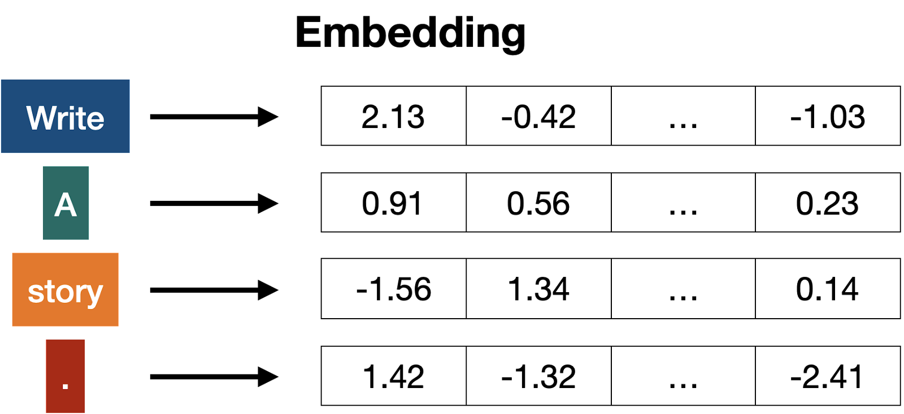
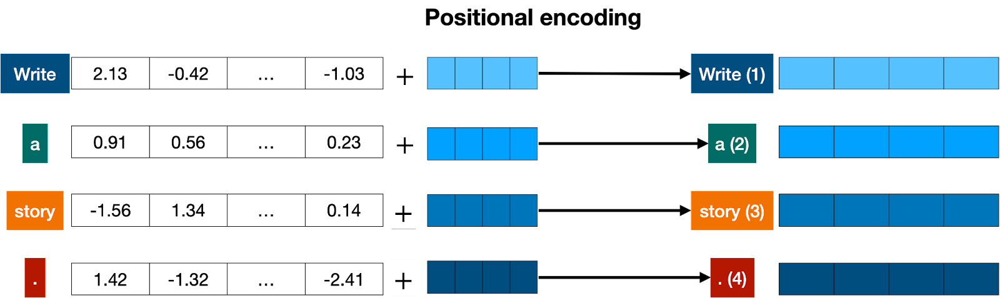
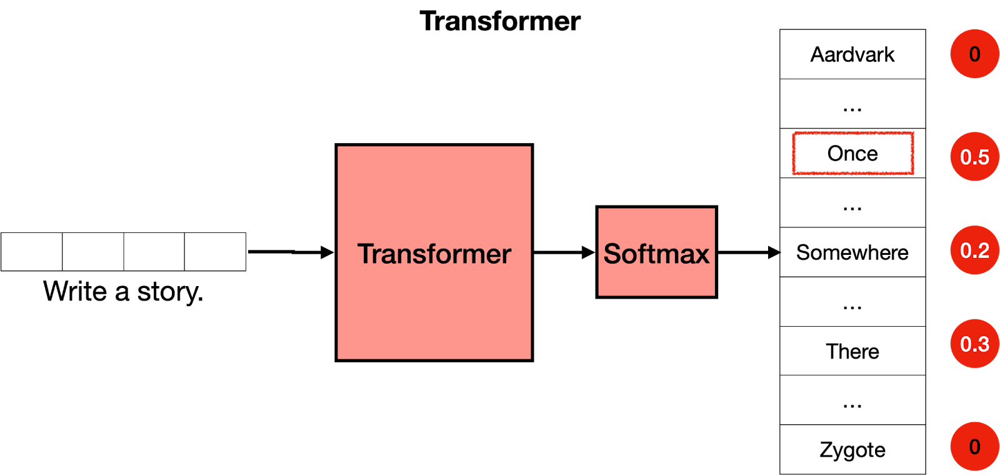

<iframe
  className="embedly-embed"
  src="https://cdn.embedly.com/widgets/media.html?src=https%3A%2F%2Fwww.youtube.com%2Fembed%2FtsbRdJbJi9U%3Ffeature%3Doembed&display_name=YouTube&url=https%3A%2F%2Fwww.youtube.com%2Fwatch%3Fv%3DtsbRdJbJi9U&image=https%3A%2F%2Fi.ytimg.com%2Fvi%2FtsbRdJbJi9U%2Fhqdefault.jpg&key=7788cb384c9f4d5dbbdbeffd9fe4b92f&type=text%2Fhtml&schema=youtube"
  width="624"
  height="350"
  scrolling="no"
  title="YouTube embed"
  frameBorder="0"
  allow="autoplay; fullscreen"
  allowFullScreen="true"
></iframe>

Transformer models are one of the most exciting new developments in machine learning. They were introduced in the paper Attention is All You Need. Transformers can be used to write stories, essays, poems, answer questions, translate between languages, chat with humans, and they can even pass exams that are hard for humans! But what are they? You’ll be happy to know that the architecture of transformer models is not that complex, it simply is a concatenation of some very useful components, each of which has its own function. In this chapter, you will learn all of these components.

In a nutshell, what does a transformer do? Imagine that you’re writing a text message on your phone. After each word, you may get three words suggested to you. For example, if you type “Hello, how are”, the phone may suggest words such as “you”, or “your” as the next word. Of course, if you continue selecting the suggested word in your phone, you’ll quickly find that the message formed by these words makes no sense. If you look at each set of 3 or 4 consecutive words, it may make sense, but these words don’t concatenate to anything with a meaning. This is because the model used in the phone doesn’t carry the overall context of the message, it simply predicts which word is more likely to come up after the last few. Transformers, on the other hand, keep track of the context of what is being written, and this is why the text that they write makes sense.

The phone can suggest the next word to use in a text message, but does not have the power to generate coherent text.

I have to be honest with you, the first time I found out that transformers build text one word at a time, I couldn’t believe it. First of all, this is not how humans form sentences and thoughts. We first form a basic thought, and then start refining it and adding words to it. This is also not how ML models do other things. For example, images are not built this way. Most neural network based graphical models form a rough version of the image, and slowly refine it or add detail until it is perfect. So why would a transformer model build text word by word? One answer is, because that works really well. A more satisfying one is that because transformers are so incredibly good at keeping track of the context, that the next word they pick is exactly what it needs to keep going with an idea.

And how are transformers trained? With a lot of data, all the data on the internet, in fact. So when you input the sentence “Hello, how are” into the transformer, it simply knows that, based on all the text in the internet, the best next word is “you”. If you were to give it a more complicated command, say, “Write a story.”, it may figure out that a good next word to use is “Once”. Then it adds this word to the command, and figures out that a good next word is “upon”, and so on. And word by word, it will continue until it writes a story.

**Command:** Write a story.  
**Response:** Once

**Next command:** Write a story. Once  
**Response:** upon

**Next command:** Write a story. Once upon  
**Response:** a

**Next command: Write a story. Once upon a  
**Response:\*\* time

**Next command: Write a story. Once upon a time  
**Response:\*\* there

etc.

Now that we know what transformers do, let’s get to their architecture. If you’ve seen the architecture of a transformer model, you may have jumped in awe like I did the first time I saw it, it looks quite complicated! However, when you break it down into its most important parts, it’s not so bad. The transformer has 4 main parts:

- Tokenization
- Embedding
- Positional encoding
- Transformer block (several of these)
- Softmax

The fourth one, the transformer block, is the most complex of all. Many of these can be concatenated, and each one contains two main parts: The attention and the feedforward components.

Let’s study these parts one by one.

### Tokenization

Tokenization is the most basic step. It consists of a large dataset of tokens, including all the words, punctuation signs, etc. The tokenization step takes every word, prefix, suffix, and punctuation signs, and sends them to a known token from the library.

For example, if the sentence is “Write a story”, then the 4 corresponding tokens will be `<Write>`, `<a>`, `<story>`, and` \<.>`.

### Embedding

Once the input has been tokenized, it’s time to turn words into numbers. For this, we use an embedding. In a previous chapter, you learned about how <a target="_blank" href="/docs/text-embeddings">text embeddings</a> send every piece of text to a vector (a list) of numbers. If two pieces of text are similar, then the numbers in their corresponding vectors are similar to each other (componentwise, meaning each pair of numbers in the same position is similar). Otherwise, if two pieces of text are different, then the numbers in their corresponding vectors are different.

For example, if the sentence we are considering is “Write a story.” and the tokens are `<Write>`, `<a>`, `<story>`, and `\<.>`, then each one of these will be sent to a long vector, and we’ll have four vectors.

### Positional encoding

Once we have the vectors corresponding to each of the tokens in the sentence, the next step is to turn all these into one vector to process. The most common way to turn a bunch of vectors into one vector is to add them, componentwise. That means, we add each coordinate separately. For example, if the vectors (of length 2) are [1,2], and [3,4], their corresponding sum is [1+3, 2+4], which equals [4, 6]. This can work, but there’s a small caveat. Addition is commutative, meaning that if you add the same numbers in a different order, you get the same result. In that case, the sentence “I’m not sad, I’m happy” and the sentence “I’m not happy, I’m sad”, will result in the same vector, given that they have the same words, except in different order. This is not good. Therefore, we must come up with some method that will give us a different vector for the two sentences. Several methods work, and we’ll go with one of them: positional encoding. Positional encoding consists of adding a sequence of predefined vectors to the embedding vectors of the words. This ensures we get a unique vector for every sentence, and sentences with the same words in different order will be assigned different vectors. In the example below, the vectors corresponding to the words “Write”, “a”, “story”, and “.” become the modified vectors that carry information about their position, labeled “Write (1)”, “a (2)”, “story (3)”, and “. (4)”.

Now that we know we have a unique vector corresponding to the sentence, and that this vector carries the information on all the words in the sentence and their order, we can move to the next step.

### Transformer block

Let’s recap what we have so far. The words come in and get turned into tokens (tokenization), tokenized words are turned into numbers (embeddings), then order gets taken into account (positional encoding). This gives us a vector for every token that we input to the model. Now, the next step is to predict the next word in this sentence. This is done with a really really large neural network, which is trained precisely with that goal, to predict the next word in a sentence.

We can train such a large network, but we can vastly improve it by adding a key step: the attention component. Introduced in the seminal paper Attention is All you Need, it is one of the key ingredients in transformer models, and one of the reasons they work so well. Attention is explained in the previous section, but for now, imagine it as a way to add context to each word in the text.

The attention component is added at every block of the feedforward network. Therefore, if you imagine a large feedforward neural network whose goal is to predict the next word, formed by several blocks of smaller neural networks, an attention component is added to each one of these blocks. Each component of the transformer, called a transformer block, is then formed by two main components:

- The attention component.
- The feedforward component.

The transformer is a concatenation of many transformer blocks.

### Attention

The next step is attention. As you learned in the <a target="_blank" href="/docs/the-attention-mechanism">previous chapter, the attention mechanism</a> deals with a very important problem: the problem of context. Sometimes, as you know, the same word can be used with different meanings. This tends to confuse language models, since an embedding simply sends words to vectors, without knowing which definition of the word they’re using.

Attention is a very useful technique that helps language models understand the context. In order to understand how attention works, consider the following two sentences:

- Sentence 1: The **bank** of the river.
- Sentence 2: Money in the **bank**.

As you can see, the word ‘bank’ appears in both, but with different definitions. In sentence 1, we are referring to the land at the side of the river, and in the second one to the institution that holds money. The computer has no idea of this, so we need to somehow inject that knowledge into it. What can help us? Well, it seems that the other words in the sentence can come to our rescue. For the first sentence, the words ‘the’, and ‘of’ do us no good. But the word ‘river’ is the one that is letting us know that we’re talking about the land at the side of the river. Similarly, in sentence 2, the word ‘money’ is the one that is helping us understand that the word ‘bank’ is now referring to the institution that holds money.

In short, what attention does is it moves the words in a sentence (or piece of text) closer in the word embedding. In that way, the word “bank” in the sentence “Money in the bank” will be moved closer to the word “money”. Equivalently, in the sentence “The bank of the river”, the word “bank” will be moved closer to the word “river”. That way, the modified word “bank” in each of the two sentences will carry some of the information of the neighboring words, adding context to it.

The attention step used in transformer models is actually much more powerful, and it’s called multi-head attention. In multi-head attention, several different embeddings are used to modify the vectors and add context to them. Multi-head attention has helped language models reach much higher levels of efficacy when processing and generating text.

### The Softmax Layer

Now that you know that a transformer is formed by many layers of transformer blocks, each containing attention and a feedforward layer, you can think of it as a large neural network that predicts the next word in a sentence. The transformer outputs scores for all the words, where the highest scores are given to the words that are most likely to be next in the sentence.

The last step of a transformer is a softmax layer, which turns these scores into probabilities (that add to 1), where the highest scores correspond to the highest probabilities. Then, we can sample out of these probabilities for the next word. In the example below, the transformer gives the highest probability of 0.5 to “Once”, and probabilities of 0.3 and 0.2 to “Somewhere” and “There”. Once we sample, the word “once” is selected, and that’s the output of the transformer.

Now what? Well, we repeat the step. We now input the text “Write a story. Once” into the model, and most likely, the output will be “upon”. Repeating this step again and again, the transformer will end up writing a story, such as “Once upon a time, there was a …”.

### Post Training

Now that you know how transformers work, we still have a bit of work to do. Imagine the following: You ask the transformer “What is the capital of Algeria?”. We would love for it to answer “Algiers”, and move on. However, the transformer is trained on the entire internet. The internet is a big place, and it’s not necessarily the best question/answer repository. Many pages, for example, would have long lists of questions without answers. In this case, the next sentence after “What is the capital of Algeria?” could be another question, such as “What is the population of Algeria?”, or “What is the capital of Burkina Faso?”. The transformer is not a human who thinks about their responses, it simply mimics what it sees on the internet (or any dataset that has been provided). So how do we get the transformer to answer questions?

The answer is post-training. In the same way that you would teach a person to do certain tasks, you can get a transformer to perform tasks. Once a transformer is trained on the entire internet, then it is trained again on a large dataset which corresponds to lots of questions and their respective answers. Transformers (like humans), have a bias towards the last things they’ve learned, so post-training has proven a very useful step to help transformers succeed at the tasks they are asked to.

Post-training also helps with many other tasks. For example, one can post-train a transformer with large datasets of conversations, in order to help it perform well as a chatbot, or to help us write stories, poems, or even code.

### More

As mentioned above, this is a conceptual introduction to give you an idea of how transformers generate text. If you'd like to open the hood and get a more detailed intuition of the mathematics behind a transformer, we invite you to check out the following articles and video by our course instructors, <a target="_blank" href="https://jalammar.github.io">Jay Alammar</a>, and <a target="_blank" href="https://youtube.com/c/LuisSerrano">Luis Serrano</a>.

- <a
    target="_blank"
    href="https://jalammar.github.io/illustrated-transformer/?ref=txt.cohere.com"
  >
    The Illustrated Transformer
  </a>
- <a
    target="_blank"
    href="https://jalammar.github.io/how-gpt3-works-visualizations-animations/?ref=txt.cohere.com"
  >
    How GPT3 Works
  </a>

<iframe
  className="embedly-embed"
  src="https://cdn.embedly.com/widgets/media.html?src=https%3A%2F%2Fwww.youtube.com%2Fembed%2F-QH8fRhqFHM%3Ffeature%3Doembed&display_name=YouTube&url=https%3A%2F%2Fwww.youtube.com%2Fwatch%3Fv%3D-QH8fRhqFHM&image=https%3A%2F%2Fi.ytimg.com%2Fvi%2F-QH8fRhqFHM%2Fhqdefault.jpg&key=7788cb384c9f4d5dbbdbeffd9fe4b92f&type=text%2Fhtml&schema=youtube"
  width="624"
  height="350"
  scrolling="no"
  title="YouTube embed"
  frameBorder="0"
  allow="autoplay; fullscreen"
  allowFullScreen="true"
></iframe>

<iframe
  className="embedly-embed"
  src="https://cdn.embedly.com/widgets/media.html?src=https%3A%2F%2Fwww.youtube.com%2Fembed%2FqaWMOYf4ri8%3Ffeature%3Doembed&display_name=YouTube&url=https%3A%2F%2Fwww.youtube.com%2Fwatch%3Fv%3DqaWMOYf4ri8&image=https%3A%2F%2Fi.ytimg.com%2Fvi%2FqaWMOYf4ri8%2Fhqdefault.jpg&key=7788cb384c9f4d5dbbdbeffd9fe4b92f&type=text%2Fhtml&schema=youtube"
  width="624"
  height="350"
  scrolling="no"
  title="YouTube embed"
  frameBorder="0"
  allow="autoplay; fullscreen; encrypted-media; picture-in-picture;"
  allowFullScreen="true"
></iframe>

### Conclusion

In this blog post you’ve learned how transformers work. They are formed by several blocks, each one with its own function, working together to understand the text and generate the next word. These blocks are the following:

- Tokenizer: Turns words into tokens.
- Embedding: Turns tokens into numbers (vectors)
- Positional encoding: Adds order to the words in the text.
- Transformer block: Guesses the next word. It is formed by an attention block and a feedforward block.
- Attention: Adds context to the text.
- Feedforward: Is a block in the transformer neural network, which guesses the next word.
- Softmax: Turns the scores into probabilities in order to sample the next word.

The repetition of these steps is what writes the amazing text you’ve seen transformers create. The main reason they work so well is because they have a huge amount of parameters that can capture many aspects of the context. We’re excited to see what you can build using transformer models!

### Original Source

This material comes from the post <a target="_blank" href="https://cohere.com/llmu/what-are-transformer-models/">What Are Transformer Models and How Do They Work?</a>
