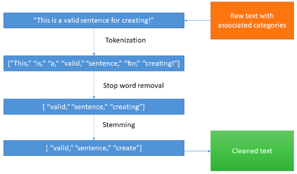
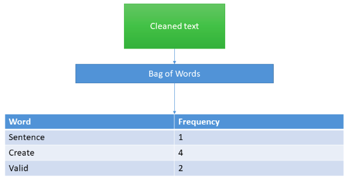
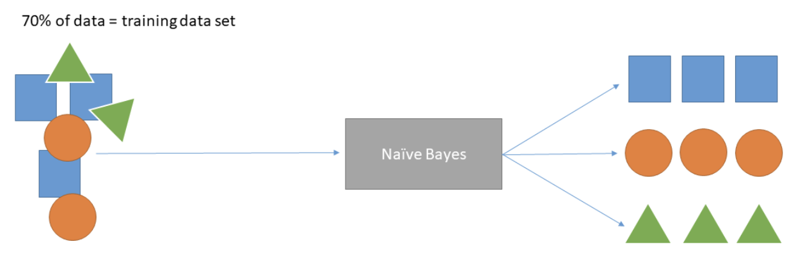

### Load the Data and Clean it

The first step in an ML project is usually data collection and cleaning. You must identify the data source. Is it from a database, files, or online web pages? The data source will inform how you load the data using your scripts.

After loading the data, you clean the textual data to remove noise and improve its quality using the following procedures:

- Split the sentences in your dataset into words through tokenization.
- Using a dictionary of stop words, filter out all the stop words, numbers, and punctuations present in your textual data through the stop word removal process.
- Next, check for all the remaining words that have prefixes or suffixes appended to them. Remove them and transform those words into the root word through the stemming process.

### Text Vectorization

With text vectorization, you must convert the documents in your corpus into a numeric representation. This helps the ML algorithms to process the data as they work better with numbers than text. You can use the bag-of-words algorithm to accomplish this. The output from the previous process is a corpus of training data, which has a dictionary of words, and each document has a target label. The bag-of-words algorithm will loop through all the documents in the data.

Here, you need to ensure you use the frequency of words appearing as your scoring method to create the vectors. Also, make sure to convert your target labels to numbers. For example, spam is 1 and not spam is 0.

### Train the Model

To build the supervised classifier, you must identify the algorithm you want to use. This overview will use the naïve Bayes algorithm. For each document in your corpus, you now have its associated vector representation and the target variable.

Before training the model, the first step is to split the data into two sets: training and testing data. It’s advisable to have the training set to be 70 percent of the data and the testing set to be the rest.

Use the training data set to train the naïve Bayes algorithm by using the vectors as the independent variables and the target labels as the dependent variables. This will output your fitted model.

### Performance Evaluation

The last step of this exercise is to test the model output and performance. This process uses the test data set because the model has not seen the data before. This reduces bias in the test results. Use the independent variables to create a predicted target label.

Compare the predicted value to the actual value. Then, perform this step on all documents in the testing data set, and use the predicted and actual values to calculate the model's accuracy.

### Conclusion

This chapter provided an overview of the process for creating a text classifier to help you understand the task in detail. In the next chapter, you’ll learn about the different metrics used for evaluating the performance of a classifier.
