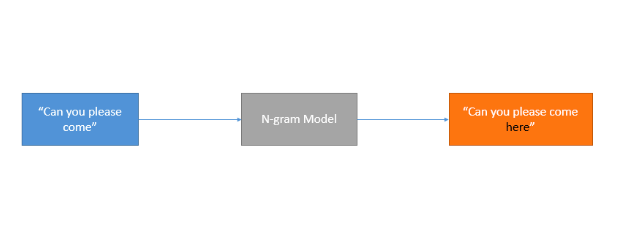
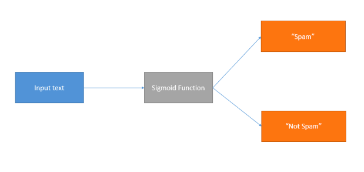
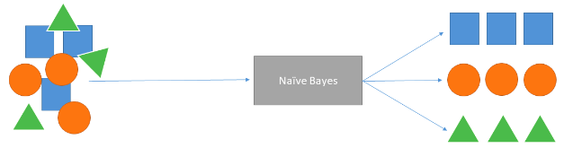
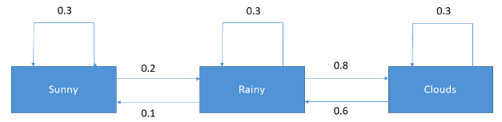

Natural language processing (NLP) has come a long way. Researchers have made significant progress to ensure that models offer better performance. But before the days of deep learning, which has revolutionized how machine learning practitioners approach NLP, various methods were used to create models. Although some of these methods and models are still in use today, some have been replaced by more modern techniques.

### Popular ML Methods

This section explores some popular machine learning (ML) methods used to perform NLP tasks and reviews how they work.

#### N-Gram Models

N-gram models are probabilistic models built by training on sequential text data. They count how often word sequences appear in the text and estimate the probability distribution of the word sequences. They predict the likelihood of a word occurring based on the previous words. They are best suited for NLP use cases like auto-completion of sentences and automatic spell-checking.

#### Logistic Regression

Logistic regression is an algorithm that’s popular in text classification tasks. It uses a mathematical function that uses probability to generate a value between zero and one for any given numerical input. This value represents the probability of input belonging to a particular class. 

You train this algorithm using text data as the independent variable and the category or class as the dependent variable. It’s perfect when the dependent variable is categorical, like yes or no. Additionally, it’s well-suited for spam detection applications because words that appear in spam categories can be used as predictor variables.

For a deeper introduction to this topic, please check out the following <a target="_blank" href="https://www.youtube.com/watch?v=jbluHIgBmBo">video on Logistic Regression</a>.

#### Naïve Bayes

Naïve Bayes is a supervised algorithm that uses probability to predict the likelihood of a class being the outcome. The Naïve algorithm uses Bayes’ theorem together with the (naïve) assumption that features in the data are independent of each other. 

The naïve Bayes algorithm calculates each category’s probability for the input text data and outputs the category with the highest probability score. The calculation of probability scores uses Bayes’ theorem, which bases the likelihood of an event on prior knowledge of conditions. 

An example of an NLP application of this algorithm is in sentiment analysis. Naïve Bayes is well-suited to sentiment analysis because it can offer good probabilistic results because of its independence rule.

For a deeper introduction into this algorithms, and its applications to spam detection, please check out the following  <a target="_blank" href="https://www.youtube.com/watch?v=Q8l0Vip5YUw">video on the naïve Bayes algorithm</a> or this  <a target="_blank" href="https://medium.com/@luis.serrano/using-probability-to-its-maximum-the-naive-bayes-model-ce5cab116f03">article</a>.

#### Markov Models

Markov models are perfect for sequential data, as they predict the probabilities of sequences of random variables. These variables, sometimes called states, are individual tokens or n-grams. Markov models have transition probabilities determining the next word or words given a particular input. The prediction of the next word depends on the vocabulary of your training data. 

Training a Markov model creates a transition matrix. It defines the probability of a word transitioning to all other words in the vernacular. These models are well known for natural language generation.

If you’d like to delve more into this topic, please check out the following  <a target="_blank" href="https://www.youtube.com/watch?v=kqSzLo9fenk">video on Hidden Markov Models</a>.

### Conclusion

This chapter helped you familiarize yourself with some of the traditional methods used to build NLP models. Some of these are of a probabilistic nature, and others are based on neural networks. Next, you’ll learn how to build a classifier for processing text and making predictions.
