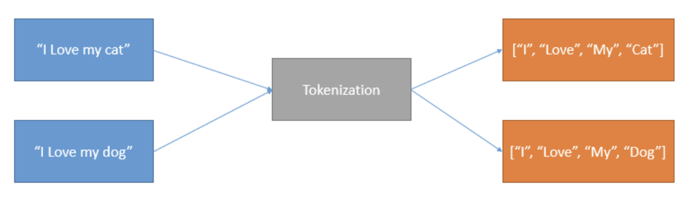
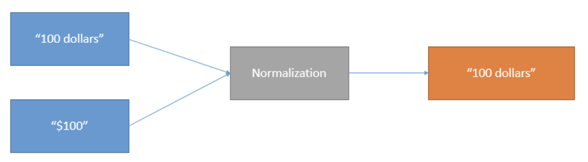
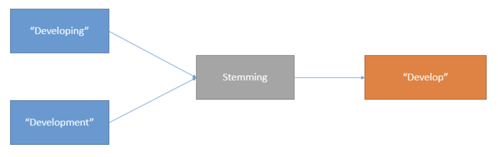

The first step is textual data collection when working on an NLP project. You source the data from databases or scrape it from informal settings like blog posts, social media, e-commerce websites, message boards, news groups, and wikis. Due to the unstructured nature of textual data, it can vary in format and quality. This can introduce noise that can impact the performance of the NLP models you are building.  

Machine learning (ML) practitioners spend most of their time cleaning data. The natural language processing (NLP) world usually calls this process text preprocessing. 

The main goal of text preprocessing is to break down the noisy text into a form that ML models can digest. It cleans and prepares textual data for further analysis and reporting. And it’s a vital step when building an NLP model using traditional ML methods because it improves the data quality, eventually improving the quality of the built model. 

In this chapter, you learn various strategies for preparing data so that your NLP models can achieve the best possible results. You usually don’t need to do this when using large language models (LLMs) like the ones we provide, but it’s good to know.

### Cleaning Textual Data

This section briefly overviews several well-known methods used to clean textual data.

#### Tokenization

Tokenization in NLP is the process of breaking down a piece of text into smaller chunks, called tokens, such as words, phrases, symbols, or other meaningful elements. It’s a fundamental step in most NLP tasks, as it helps to standardize text and make it more manageable for further analysis.

Suppose you have textual data with two sentences: “I love my cat” and “I love my dog.” When passed through the tokenization process, the diagram below represents the output.

#### Normalization

Textual data might have multiple words and symbols that share similar meanings. We may want to account for variations in spelling, inflection, or other linguistic features that have the same or similar interpretations? Normalization achieves this by standardizing text: it reduces the different variations of words/symbols with similar meanings, transforming them into a single term or canonical form. This process aims to minimize randomness to improve the quality of the text, reduce the vocabulary size, and improve the efficiency of text processing and the performance of the NLP model.

A few examples of text normalization include:

US and U.S.A can be represented as USA  
01/04/2023 and 1 April 2023 become 01-04-2023  
-50 euros, -50€ and minus 50€ becomes minus fifty euros

The diagram below demonstrates how the normalization process works.

#### Stop Word Removal

Words like “is” and “are” are abundant in textual data, appearing so frequently that they don’t need processing as thoroughly as nouns, other verbs, and adjectives. NLP refers to these as stop words, which usually don’t add meaning to the data. Stop word removal means removing these commonly used words from the text you want to process.

#### Stemming

ML practitioners use stemming to clean textual data by removing prefixes and suffixes from words. In linguistics and information retrieval fields, stemming means reducing inflected (or sometimes derived) words to their stem, base, or root form. The stem can be different from the word's root form. Related words are usually sufficient to map to the same stem, even if the stem isn't a valid root. 

The stemming process removes redundancy in the data. For example, assume that your data has this set of words, asked, asking, and ask. These words are different tenses of the root word ask. The stemming process transforms the words asked and asking into ask.

#### Lemmatization

Natural languages usually modify words to express different grammatical meanings. The modified words are the inflected forms. Lemmatization is used in NLP to transform various inflected forms of a word into its base or dictionary form. These base words are also known as the lemma. 

For example, textual data may have the following words: studying, studies, study. Lemmatization changes studying and studies into their dictionary form: study.

### Conclusion

In this chapter, you’ve learned several ways of preprocessing text data to text to only the essential word, helping you achieve the best results for your NLP models. Carry on to the next chapter to learn more about how to turn these text into numbers, or more specifically, into vectors (lists of numbers).
