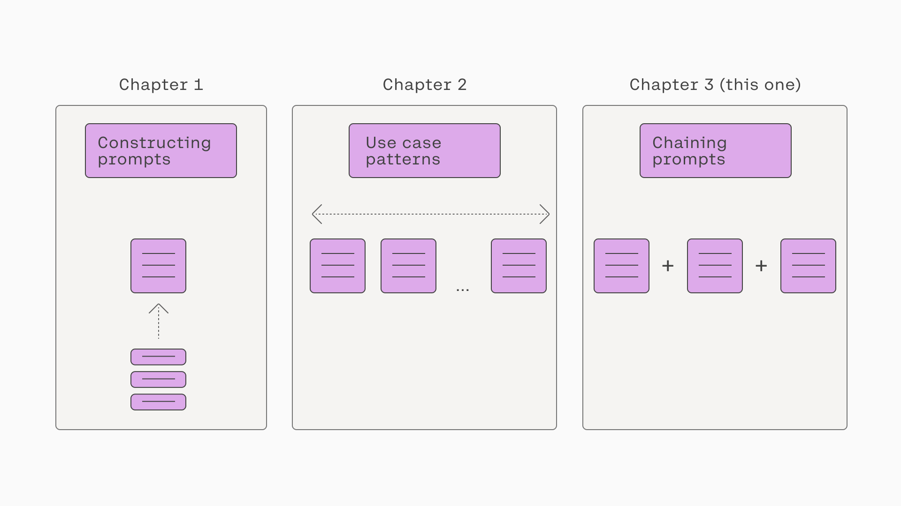
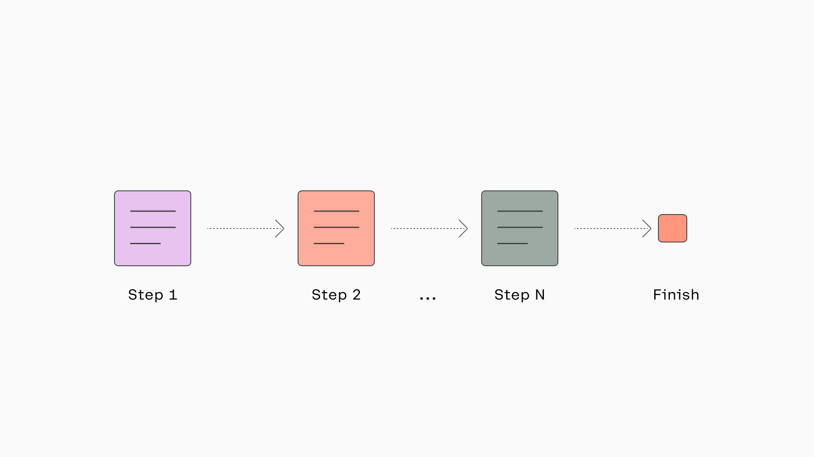
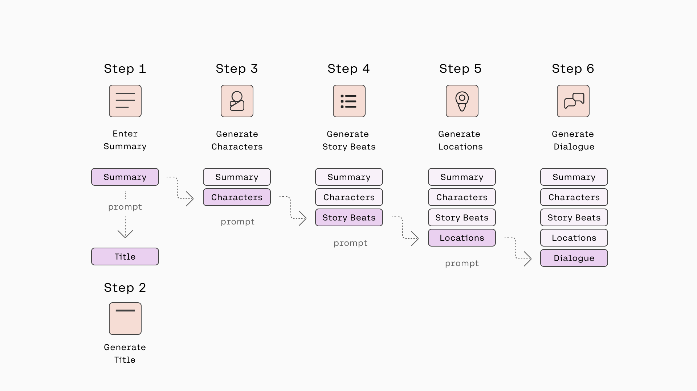
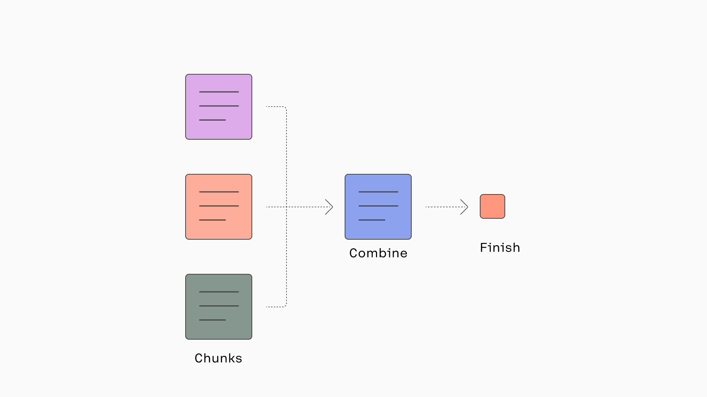
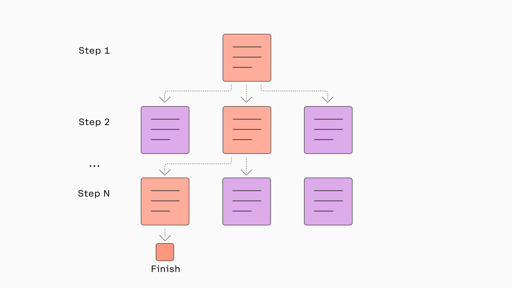
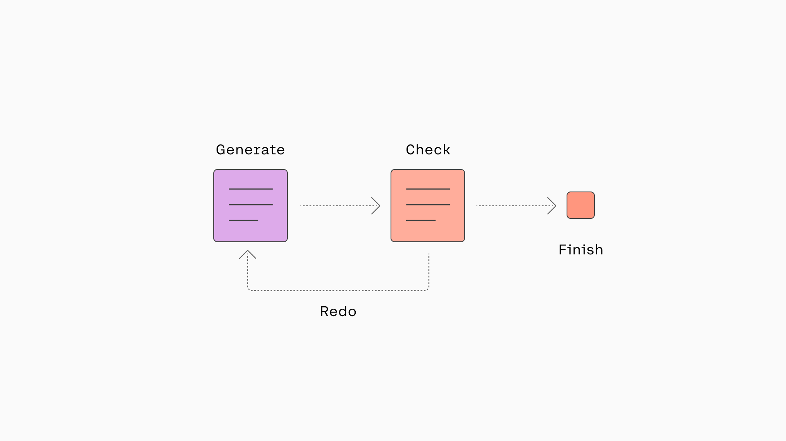

### Introduction

In the previous two chapters, we looked at various ways to prompt the Command model. One thing similar about all of those examples is that they utilize a single prompt to fulfill a particular task. However, there may be other tasks where this is insufficient, and we instead have to chain a few prompts together to complete a task successfully.

We can think of the previous two chapters as looking at prompts as a single unit, and this chapter will look at prompts as a combination of these units. The diagram below summarizes these three chapters.




Combining multiple prompts to accomplish a single goal will be the focus of this chapter. We’ll look at some ideas and patterns for chaining prompts, which could come in handy when building a generative AI application.

### Sequential

Let’s begin with probably the most common approach for chaining prompts – in a sequence.




The key idea is that if the task provided in a single prompt becomes too lengthy or complex and contains many different instructions, the response may not capture the details and granularity required. In this case, it would make sense to break this task into smaller subtasks that can be run one after the other. The response of one subtask becomes the prompt to the other subtask, and this chain continues until the overall task is complete.

Let's use story generation as an example. Suppose we have a task to generate a long story containing a dialog guided by a set of information – characters, story beats, and locations. Now, we could stuff all this information into a single prompt, but that might dilute the key details we want the dialog to contain.

Besides, we don’t want to write all these additional details in the first place because we’d like the model to generate them for us. What we want is to provide a short summary of what we want the story to be about, which becomes our sole prompt.

The diagram below summarizes the chains involved in generating the eventual dialog. First, a human enters a story summary, which becomes the prompt to generate a list of characters, which then becomes the prompt to generate the story beats, and so on, until we get to the dialog generation.




Another added benefit of chaining prompts in sequences instead of using one single prompt is that we can implement human checks at each point in the sequence, and if a response does not fulfill a certain standard, we can trigger a re-run. This makes it easy to do evaluation and quality control over a complex generative AI task – by doing them in stages.

### Parallel

A sequential chain of prompts is needed when the subtasks depend on each other. But when they are independent, we can run them in parallel instead.




Let’s say we are building an application that generates recipe ideas for a whole week and then generates a shopping list of ingredients for the user to buy. In this case, given a user input of, say, the number of meals or days, we can run the recipe generation step in parallel. The prompt might look something like the following:

```python
prompt = f'Suggest a simple and quick recipe for {meal}. Write in JSON containing these keys "Ingredients" and "Instructions"'
```

Next, we’ll repeat the recipe generation across all meals. Once complete, we can consolidate the ingredients from each meal into a single shopping list that the user can use immediately.

```python
prompt = f"""Consolidate the following ingredients into a single shopping list, without repetition:
{ingredients}"""
```

### Sampling

If a task involves logical reasoning, for example, in mathematical question answering, there may be more than one way to solve a given problem. In this case, we want to encourage the model to be more creative when exploring different solutions. But dialing up the creativity knob (i.e., “temperature”) also means that there’s a higher chance that the model will get the final answer wrong.

The solution is, instead of prompting the same question to the model once, we can repeat that multiple times and choose the response with the highest majority.


Let’s look at an example taken from a paper by [Wang et al., 2023](https://arxiv.org/abs/2203.11171?ref=txt.cohere.com) that introduces the concept of _self -consistency_.

First, revisiting [the previous chapter](https://txt.cohere.com/constructing-prompts/#chain-of-thought), we looked at the concept of _chain-of-thought prompting_ introduced by [Wei et. al, 2023](https://arxiv.org/abs/2201.11903?ref=txt.cohere.com), where a model is prompted in such a way that it is encouraged to do a reasoning step before giving the final response. In those settings, however, the model is typically encouraged to do “greedy decoding,” which means biasing towards the correct and safe path. This can be done by adjusting settings like the temperature value.

With self-consistency, we can build on the chain-of-thought approach by sampling from several paths instead of one. We also make the paths much more diverse by adjusting the settings towards being more “creative,” again using settings like temperature. We then do a majority vote out of all answers.

The diagram below illustrates the self-consistency concept. It shows an example of comparing the result of a single solution, using the greedy decoding approach, and a solution that samples from multiple generations, using a more diverse decoding approach. The former didn’t get the answer correct, and the latter did.


### Exploration

Building on the previous chain pattern, when a question is much more complex and requires more granular reasoning steps, it is helpful to break down the steps into pieces. At each step, we encourage the model to explore different solutions, vote for the best solution and only then continue to the next step.

This is also useful in creative applications like story writing. Making the model explore different story ideas is more interesting than constraining it to a single path, elevating the final output's quality.



Let’s use one concrete example from [Yao et al., 2023](https://arxiv.org/abs/2305.10601?ref=txt.cohere.com), which introduces the concept of _tree of thoughts_. The diagram below illustrates how this concept differs from direct input-output prompting, chain-of-thought, and self-consistency with chain-of-thought. At each step, the model generates several diverse solutions. A separate prompt is then used to evaluate these solutions and vote for the best solution. The process repeats until the final step is completed.  


Here’s one of the examples shown in the paper with a creative writing task. The diagram below shows the initial input containing a list of four seemingly unrelated sentences – each talking about handstands, the smell of space, sign language, and people’s perceptions. The task is to weave them into one coherent passage. It must contain four short paragraphs, each ending with the given sentence.


Since the task is quite challenging, it makes sense to break down the task into two: writing the plan and writing the actual passage based on the winning plan. At each step, the model generates a few solutions, and then another prompt is used to evaluate and vote for the best solution, guiding the direction of the next step.

A couple of writing plan options are shown in the screenshot, and the winning option is the one that suggests using self-help as the theme to weave the sentences into a coherent passage.

### Loop

In some applications, we may need to re-run a generation step, given what happens in a subsequent step. One example is when that subsequent step is used to check if the response generated meets specific criteria, such as quality and format. This is where the loop pattern becomes useful.



Let’s take a rephrasing task as an example. Say we have an application that takes a rude user comment and suggests a rephrasing that makes it more polite. Here, we want the LLM response to be polite and, at the same time, retain the original meaning of the comment.

The prompt, taking in the user input to be rephrased, might look something like the following:

```python
user_input = "I really don't have time for this nonsense."

prompt_rephrase = f"""Rephrase this user comment into something more polite:
User comment: You don't know what you're talking about.
Rephrased comment: I think there might be some inaccuracies in your statement.
User comment: {user_input}
Rephrased comment:"""
```

Here is an example response which rephrases the original user input:

```
I think we might need to set aside some time to discuss this properly.
```

Next, we create another prompt to check if the rephrased comment is similar enough to the original comment.

```python
prompt_check = f"""Below is a rude comment that has been rephrased into a polite version.
The rephrased comment must maintain a similar meaning to the original comment. Check if this is true. Answer with YES or NO.

Original comment: Shut up, you're always wrong.
Rephrased comment: Please be quiet, check your facts again.
Similar meaning: YES
Original comment: I can't stand you.
Rephrased comment: Let's discuss this.
Similar meaning: NO
Original comment: {user_input}
Rephrased comment: {user_input_rephrased}
Similar meaning:"""
```

And if the response is “NO,” we route the task back to the rephrasing prompt and repeat until we get a “YES” response.

### Performance Considerations

Prompt chaining is a powerful concept that makes complex use cases possible when a single prompt setup is insufficient. Having said that, prompt chaining should only be considered when it’s truly necessary. The overall performance considerations need to be taken into account.

One such consideration is latency. The longer the chain, the longer it takes to complete a task from start to finish. If an application is latency-sensitive, it makes sense to minimize the number of chains. The cost factor is another consideration when designing applications that rely on prompt chaining.

### Final Thoughts

In this chapter, we looked at several prompt-chaining patterns and examples of how they can be applied to the Command model.

This is a fascinating area of prompt engineering because it opens up so much room for creativity when solving problems with LLMs. Although it comes with some performance trade-offs, balancing these considerations presents an exciting challenge for building production-ready LLM-powered applications.

### Original Source

This material comes from the post: [Chaining Prompts for the Command Model](https://txt.cohere.com/chaining-prompts/).
