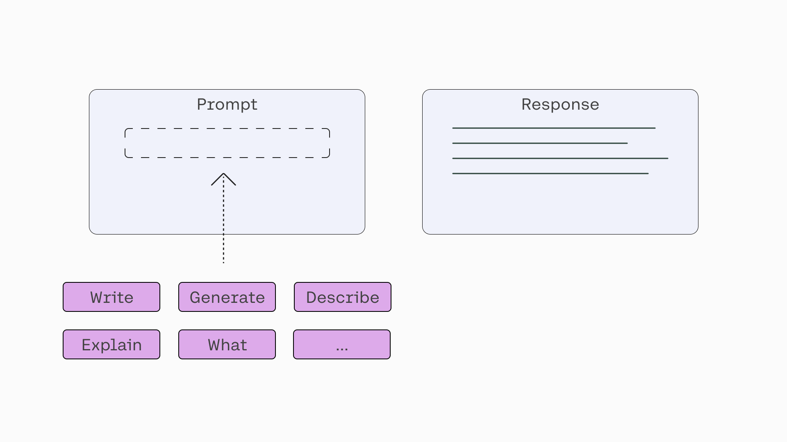
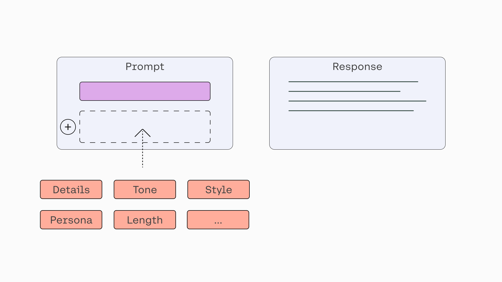
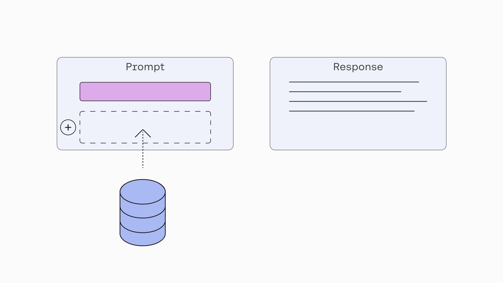
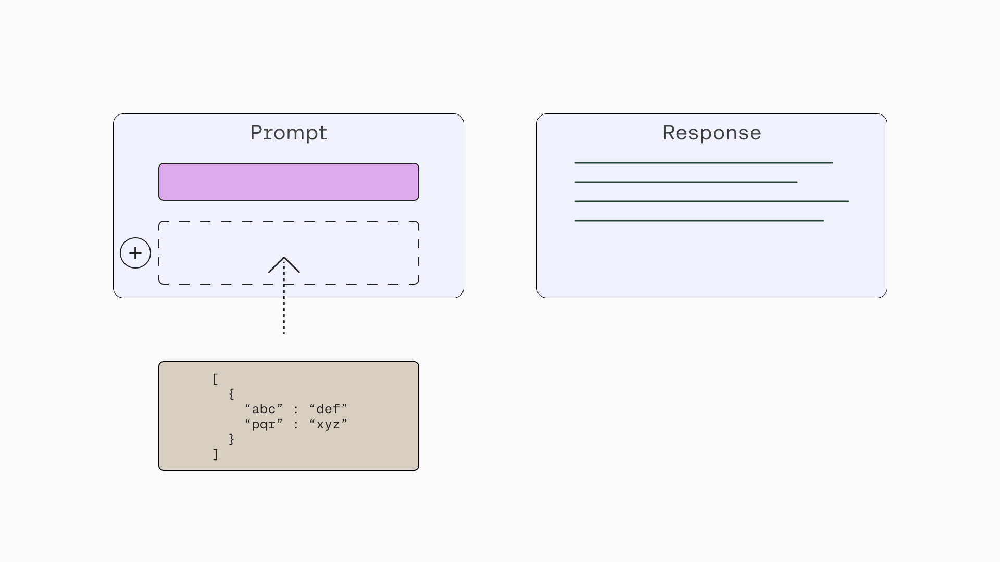
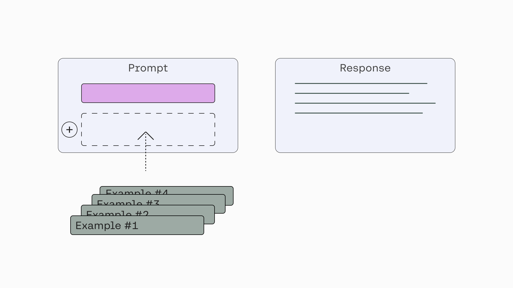
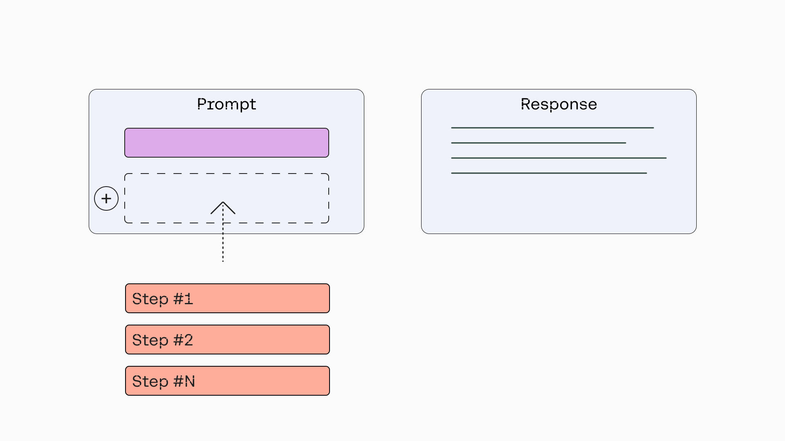
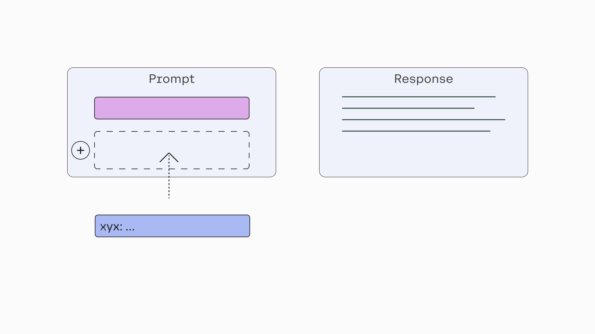

_We’ll use Cohere’s [Python SDK](/reference/about?ref=txt.cohere.com#python) for the code examples. Follow along in [this notebook](https://github.com/cohere-ai/cohere-developer-experience/blob/main/notebooks/llmu/Constructing_Prompt_Commands.ipynb)._

When working with large language models (LLMs), the prompt is the key to getting the desired response. A well-designed prompt will result in useful and accurate responses from a model and will considerably improve your experience interacting with it.

Prompts can be as simple as a one-liner, or they can be as complex as multiple layers of specific information. The more specific your command is, the more likely you will get exactly what you need from the model. We’ll look at some tips and ideas for constructing the commands in your prompt to help you get to your intended outcome. We’ll focus on the broad patterns without going into the long-tail list of techniques and tricks.

Need prompt ideas? Checkout [God Tier Prompts](https://www.godtierprompts.com), a community driven prompt leaderboard.

### Setup

First, let’s install the Cohere Python SDK, get the Cohere API key, and set up the client.

```
! pip install cohere

```

```python PYTHON
import cohere

# Get your API key: https://dashboard.cohere.com/api-keys
co = cohere.Client("COHERE_API_KEY")
```

Let’s also define a function to take a [prompt](https://txt.cohere.com/generative-ai-part-1/) and a [temperature value](https://txt.cohere.com/generative-ai-part-1/#being-creative-vs-predictable) and then call the [Generate endpoint](/reference/generate?ref=txt.cohere.com), which is how we can access the Command model.​​ Here, we select the model type to be \`command\`.

We set a default temperature value of 0, which nudges the response to be more predictable and less random. Throughout this article, you’ll see different temperature values being used in different situations. Increasing the temperature value tells the model to generate less predictable responses and instead be more “creative.”

This function prints the text response generated by the model.

```
def generate_text(prompt, temp=0):
  response = co.chat_stream(
    message=prompt,
    model="command-r",
    temperature=temp,
    preamble="")

  for event in response:
      if event.event_type == "text-generation":
          print(event.text, end='')

```

### Instruction




While prompts can morph into something very lengthy and complex, it doesn’t have to be that way all the time. At its core, prompting a Command model is about sending an instruction to a text generation model and getting a response back. Hence, the smallest unit of a perfectly complete prompt is a short line of instruction to the model.

Let’s say we want to generate a product description for a wireless headphone. Here’s an example prompt, where we create a variable for the user to input some text and merge that into the main prompt.

```python PYTHON
user_input = "a wireless headphone product named the CO-1T"
prompt = f"""Write a creative product description for {user_input}"""

generate_text(prompt, temp=0.5)
```

The model returns the following sample response, which does the job we asked for.

```
Looking for a wireless headphone option that won't break the bank? Look no further than the CO-1T! These sleek headphones offer crystal clear sound and a comfortable, snug fit. With their Bluetooth capabilities, you can enjoy your favorite tunes without any distractions, whether you're on the go or just relaxing at home. The CO-1T is also designed with a built-in microphone, making it easy to switch between listening to music and answering calls with minimal effort. But it doesn't stop there – these headphones have an incredible battery life that will last you all day long, so you don't have to worry about charging them constantly. Overall, the CO-1T offers a convenient, versatile, and affordable solution to all your wireless headphone needs. 

Meanwhile, the design is a stylish blend of black, gray, and silver that boasts a professional and modern look.

```

### Specifics



A simple and short prompt can get you started, but in most cases, you’ll need to add specificity to your instructions. A generic prompt will return a generic response, and in most cases, that’s not what we want. In the same way that specific instructions will help humans do our job well, a model needs to be supplied with specific details to guide its response.

Going back to the previous prompt, the generated product description was great, but what if we wanted it to include specific things, such as its features, who it is designed for, and so on? We can adjust the prompt to take more inputs from the user, like so:

```python PYTHON
user_input_product = "a wireless headphone product named the CO-1T"
user_input_keywords = '"bluetooth", "wireless", "fast charging"'
user_input_customer = (
    "a software developer who works in noisy offices"
)
user_input_describe = "benefits of this product"

prompt = f"""Write a creative product description for {user_input_product}, \
with the keywords {user_input_keywords} for {user_input_customer}, and describe {user_input_describe}."""

generate_text(prompt, temp=0.5)
```

In the example above, we pack the additional details of the prompt in a single paragraph. Alternatively, we can also compose it to be more structured, like so:

```python PYTHON
user_input_product = "a wireless headphone product named the CO-1T"
user_input_keywords = '"bluetooth", "wireless", "fast charging"'
user_input_customer = (
    "a software developer who works in noisy offices"
)
user_input_describe = "benefits of this product"

prompt = f"""Write a creative product description for {user_input_product}.
Keywords: {user_input_keywords}
Audience: {user_input_customer}
Describe: {user_input_describe}"""

generate_text(prompt, temp=0.5)
```

And here’s an example response. This time, the product description is tailored more specifically to our desired target customer, includes the key features that we specified, and sprinkles benefit statements throughout — all coming from the instruction we added to the prompt.

```
Are you a software developer struggling to focus in the hustle and bustle of noisy offices? The CO-1T wireless headphones are the ideal solution for you! With its Bluetooth connectivity and wireless design, you can enjoy uninterrupted music and podcast streaming from your devices, whether you're working or kicking back. 

One of the CO-1T's standout features is its fast charging capabilities, ensuring that you're never without your trusted noise-canceling companion. A quick recharge can provide you with a bustling day's worth of power, so you're never left lacking when inspiration (or your power bar) runs low. 

Designed with functionality and form in mind, the CO-1T delivers crisp and clear audio while its ergonomic design showcases a sleek and stylish look. Comfortable ear pads that won't irritate or pinch you guarantee comfort over long periods of use. 

Take control of your audio experience and stay focused on the tasks at hand with the CO-1T wireless headphones. Whether you're tuning out distractions or simply kicking back with some music, this Bluetooth headphone is the ideal companion for programmers and audiophiles alike.

```

There are many other angles to add specificity to a prompt. Here are some examples:

- **Style**: Telling the model to provide a response that follows a certain style or framework. For example, instead of asking the model to “Generate an ad copy for a wireless headphone product” in the generic sense, we ask it to follow a certain style, such as “Generate an ad copy for a wireless headphone product, following the AIDA Framework – Attention, Interest, Desire, Action.”
- **Tone**: Adding a line mentioning how the tone of a piece of text should be, such as professional, inspirational, fun, serious, and so on. For example, “Tone: casual”
- **Persona**: Telling the model to act like a certain persona helps to add originality and quality to the response. For example, “You are a world-class content marketer. Write a product description for…”
- **Length**: Telling the model to generate text with a specific length, be it in words, paragraphs, and others. This helps guide the model to be verbose, concise, or somewhere in between. For example, “Write in three paragraphs the benefits of …”

### Context



While LLMs excel in text generation tasks, they struggle in context-aware scenarios. Here’s an example. If you were to ask the model for the top qualities to look for in wireless headphones, it will duly generate a solid list of points. But if you were to ask it for the top qualities of the CO-1T headphone, it will not be able to provide an accurate response because it doesn’t know about it (CO-1T is a hypothetical product we just made up for illustration purposes).

In real applications, being able to add context to a prompt is key because this is what enables personalized generative AI for a team or company. It makes many use cases possible, such as intelligent assistants, customer support, and productivity tools, that retrieve the right information from a wide range of sources and add it to the prompt.

This is a whole topic on its own, but to provide some idea, [this demo](https://cohere.com/blog/search-cohere-langchain/#example-2-search-based-question-answering) shows an example of information retrieval in action. In this article though, we’ll assume that the right information is already retrieved and added to the prompt.

Here’s an example where we ask the model to list the features of the CO-1T wireless headphone without any additional context:

```python PYTHON
user_input = (
    "What are the key features of the CO-1T wireless headphone"
)
prompt = user_input

generate_text(prompt, temp=0)
```

This generates a response that the model makes up since it doesn’t have any information to refer to.

```
The CO-1T wireless headphone is a high-quality, comfortable, and durable headphone that is designed for use with a variety of devices. It features a sleek and modern design, a comfortable and secure fit, and a high-quality sound. The CO-1T is also equipped with a variety of features, including a built-in microphone, a multi-function button, and a rechargeable battery.

```

And here’s the same request to the model, this time with the product description of the product added as context.

```python PYTHON
context = """Think back to the last time you were working without any distractions in the office. That's right...I bet it's been a while. \
With the newly improved CO-1T noise-cancelling Bluetooth headphones, you can work in peace all day. Designed in partnership with \
software developers who work around the mayhem of tech startups, these headphones are finally the break you've been waiting for. With \
fast charging capacity and wireless Bluetooth connectivity, the CO-1T is the easy breezy way to get through your day without being \
overwhelmed by the chaos of the world."""

user_input = (
    "What are the key features of the CO-1T wireless headphone"
)

prompt = f"""{context}
Given the information above, answer this question: {user_input}"""

generate_text(prompt, temp=0)
```

Now, the model accurately lists the features of the model.

```
The CO-1T wireless headphones have noise-cancellation, fast charging capacity, and Bluetooth connectivity.

```

### Format



So far, we saw how to get the model to generate responses that follow certain styles or include specific information. But we can also get the model to generate responses in a certain format. Let’s look at a couple of them: markdown tables and JSON strings.

Here, the task is to extract information from a list of invoices. Instead of providing the information in plain text, we can prompt the model to generate a table that contains all the information required.

```python PYTHON
prompt = """Turn the following information into a table with columns Invoice Number, Merchant Name, and Account Number.
Bank Invoice: INVOICE #0521 MERCHANT ALLBIRDS ACC XXX3846
Bank Invoice: INVOICE #6781 MERCHANT SHOPPERS ACC XXX9877
Bank Invoice: INVOICE #0777 MERCHANT CN TOWER ACC XXX3846
"""

generate_text(prompt, temp=0)
```

The response will come in the form of a markdown table.

```
Here is a table formatted with the columns of Invoice Number, Merchant Name, and Account Number filling in the previous information:
| Invoice Number | Merchant Name | Account Number |
| --- | --- | --- |
| INVOICE #0521 | ALLBIRDS | XXX3846 |
| INVOICE #6781 | SHOPPERS | XXX9877 |
| INVOICE #0777 | CN TOWER | XXX3846 |

Let me know if you'd like me to make any modifications to this table or provide you with any further assistance!

```

Another useful format is JSON, which we can modify the prompt as follows.

```python PYTHON
prompt = """Turn the following information into a JSON string with the following keys: Invoice Number, Merchant Name, and Account Number.
Bank Invoice: INVOICE #0521 MERCHANT ALLBIRDS ACC XXX3846
Bank Invoice: INVOICE #6781 MERCHANT SHOPPERS ACC XXX9877
Bank Invoice: INVOICE #0777 MERCHANT CN TOWER ACC XXX3846
"""

generate_text(prompt, temp=0)
```

This returns the following response.

````
Certainly, here is the JSON format of the three bank invoices:
```json JSON
[
    {
        "invoice_number": "INVOICE #0521",
        "merchant_name": "ALLBIRDS",
        "account_number": "XXX3846"
    },
    {
        "invoice_number": "INVOICE #6781",
        "merchant_name": "SHOPPERS",
        "account_number": "XXX9877"
    },
    {
        "invoice_number": "INVOICE #0777",
        "merchant_name": "CN TOWER",
        "account_number": "XXX3846"
    }
]

````

### Examples



All our prompts so far use what is called _zero-shot prompting_, which means that we are providing instruction without any example. But in many cases, it is extremely helpful to provide examples to the model to guide its response. This is called _few-shot prompting_.

Few-shot prompting is especially useful when we want the model response to follow a certain style or format. Also, sometimes it is hard to explain what you want in an instruction, and easier to show examples.

Let’s use an example task, where a model should take a request coming from a human and rephrase it into the most accurate utterance that an AI virtual assistant should use. The example data is taken from [this paper](https://arxiv.org/abs/2011.01993?ref=txt.cohere.com) (Einolghozati, et al. 2020).

We’ll use this example request: “Send a message to Alison to ask if she can pick me up tonight to go to the concert together”. Given that request, we should expect the rephrased utterance to be something like: “Can you pick me up tonight to go to the concert together?”

First, let’s generate a response without giving the model an example. Here’s the prompt:

```python PYTHON
prompt = """Turn the following message to a virtual assistant into the correct action:
Send a message to Alison to ask if she can pick me up tonight to go to the concert together"""

generate_text(prompt, temp=0)
```

The response we get is not wrong, but it doesn’t follow the style that we need, which is a simple one-line rephrasing of the original request. Instead, it generates an email!

```
Ok, I will send a message to Alison asking if she can pick you up tonight to go to the concert together. Please provide me with the details of your inquiry so I can assist you better!

```

Now, let’s modify the prompt by adding a few examples of how we expect the output to be.

```python PYTHON
user_input = "Send a message to Alison to ask if she can pick me up tonight to go to the concert together"

prompt = f"""Turn the following message to a virtual assistant into the correct action:

Message: Ask my aunt if she can go to the JDRF Walk with me October 6th
Action: can you go to the jdrf walk with me october 6th

Message: Ask Eliza what should I bring to the wedding tomorrow
Action: what should I bring to the wedding tomorrow

Message: Send message to supervisor that I am sick and will not be in today
Action: I am sick and will not be in today

Message: {user_input}"""

generate_text(prompt, temp=0)
```

This time, the style of the response is exactly how we want it.

```
can you pick me up tonight to go to the concert together?

```

### Chain of Thought

One specific way to provide examples in a prompt is to show responses that include a reasoning step. This way, we are asking the model to “think” first rather than going straight to the response. In tasks involving mathematical questions, for example, there is a huge difference between directly giving the answer and adding a reasoning step in between.

This concept is called _chain of thought_ prompting, introduced by [Wei et al.](https://arxiv.org/abs/2201.11903?ref=txt.cohere.com) Let’s look at an example from the paper which illustrates this idea.

First let’s look at a prompt _without_ a chain of thought. It contains one example of a question followed by the answer, without any intermediate calculation step. It also contains the new question we want to answer.

```python PYTHON
prompt = f"""Q: Roger has 5 tennis balls. He buys 2 more cans of tennis balls. Each can has 3 tennis balls. \
How many tennis balls does he have now?
A: The answer is 11.
---
Q: The cafeteria had 23 apples. If they used 20 to make lunch and bought 6 more, how many apples do they have?
A: The answer is 9.
---
Q: A box has 10 balls and a half of the balls are red balls. How many red balls are in the box if 4 red balls are added?
A:"""

generate_text(prompt, temp=0)
```

We get the following response, which is an incorrect answer (12). And notice that the response gives the answer first, similar to the example shown.

```
The answer is 12. There are 5 balls that are red and 5 balls that are not red, and adding 4 red balls would make it 9 red and 6 not red.


```

Now, let’s repeat that, this time with a chain of thought. Now, the example answer contains a reasoning step, describing the calculation logic to get to the final answer, before giving the final answer.

```python PYTHON
prompt = f"""Q: Roger has 5 tennis balls. He buys 2 more cans of tennis balls. Each can has 3 tennis balls. \
How many tennis balls does he have now?
A: Roger started with 5 balls. 2 cans of 3 tennis balls each is 6 tennis balls. 5 + 6 = 11. \
The answer is 11.
---
Q: The cafeteria had 23 apples. If they used 20 to make lunch and bought 6 more, how many apples do they have?
A: The cafeteria started with 23 apples. They used 20 to make lunch, so they have 23 - 20 = 3 apples. They bought 6 more apples, so they have 3 + 6 = 9 apples. \
The answer is 9.
---
Q: A box has 12 balls and a half of the balls are red balls. How many red balls are in the box if 4 red balls are added?
A:"""

generate_text(prompt, temp=0)
```

And we get the correct answer this time (10), with the response following the style of the example given.

```
There are 12 / 2 = 6 red balls in the box. When 4 more red balls are added, the number of red balls becomes 6 + 4 = 10. The answer is 10.


```

### Steps




To steer the model toward generating higher-quality responses, it can be helpful to add instructions for the model to generate intermediate steps before generating the final output. The information generated during these steps helps enrich the model’s context before it generates the final response.

There could be another scenario where we specifically need the response to contain specific information. In this case, we can specify what we need in the prompt.

Let’s use an example of generating startup ideas. We can get the model to directly generate an idea for a given industry, like so:

```python PYTHON
user_input = "education"

prompt = (
    f"""Generate a startup idea for this industry: {user_input}"""
)

generate_text(prompt, temp=0.5)
```

This generates the following response, which is reasonable, but perhaps not exactly what we are looking for.

```
Here is a startup idea for the education industry:

"MathsMadeEasy" 

Description: 
"MathsMadeEasy" is an innovative K-12 ed-tech startup that aims to revolutionize the way young students learn mathematics. With a vision to eliminate math-related anxiety and foster a deep understanding of mathematical concepts, our platform offers a holistic learning experience that engages, empowers, and excites students on their mathematical journey. 

Approach & Features: 
1. Gamified Learning: MathsMadeEasy infuses gaming elements into its interactive math lessons, turning repetitions into fun challenges and keeping students motivated to achieve their goals. 

2. Personalized Learning: Using adaptive algorithms...

```

Alternatively, we can ask the model to generate information in steps, such as describing the problem to be solved and the target audience experiencing this problem.

```python PYTHON
user_input = "education"

prompt = f"""Generate a startup idea for this industry: {user_input}
First, describe the problem to be solved.
Next, describe the target audience of this startup idea.
Next, describe the startup idea and how it solves the problem for the target audience.
Next, provide a name for the given startup.

Use the following format:
Industry: <the given industry>
The Problem: <the given problem>
Audience: <the given target audience>
Startup Idea: <the given idea>
Startup Name: <the given name>"""

generate_text(prompt, temp=0.9)
```

This provides a richer description of the startup idea.

```
Industry: Education
The Problem: Many people today struggle to develop meaningful relationships where they can cultivate connections and get support for their educational needs. 

Audience: Recent college graduates and young professionals seeking community and educational support. 

Startup Idea: Online community forum and networking platform specifically curating mentorship and guidance on continuing education, relevant career skills, and personal development. 

Startup Name: "Nurture Nest"

Our platform offers a diverse range of discussion forums...

```

### Prefix


To ensure that the response follows a consistent format or style, sometimes we need to add a prefix or leading words to help guide the response. This is especially handy when the temperature value is high. In this scenario, we want the response to be creative but, at the same time, follow a certain format.

Let’s say we are generating the characteristics of football players for a given position, with one separate paragraph per characteristic. A prompt without any guiding prefix would look something like this:

```python PYTHON
user_input_position = "modern centre forward"

prompt = f"""Describe the ideal {user_input_position}. In particular, describe the following characteristics: \
pace, skill, and awareness."""

generate_text(prompt, temp=0.9)
```

And the response is a paragraph that lists down all the characteristics, but also with unnecessary text before that.

```
A centre forward is a player positioned in the centre of the attacking line in a football team, whose primary roles involve scoring goals and winning aerial battles. This runs contrary to a striker, who traditionally plays alongside a centre forward and focuses on scoring goals through solo efforts.

An ideal modern centre forward could depend on the manager's preferred style of play, but we can encapsulate the fundamental attributes of the position as follows: 

Pace: Modern football is incredibly fast-paced and demanding. As a result, centre forwards benefit immensely from having pace to generate scoring opportunities and escape tense situations with the opposing defence. This allows them to receive the ball behind the defensive line and create space for their teammates to exploit. Centre forwards who lack pace may find it difficult to impact the game effectively and often find themselves isolated from the rest of the team. 

Skill: Centre forwards typically benefit from having exceptional shooting accuracy and creativity when approaching the opponent's box. The ability to skillfully dribble, turn, and manipulate the ball in tight spaces allows them to create scoring opportunities for themselves or their teammates. This skill is particularly important as it encourages repeatability, enabling centre forwards to generate goalscoring opportunities throughout the course of a game. 

Awareness: A great centre...

```

But if we just added a prefix of the first characteristic (“Pace”) at the end of the prompt, it will give a signal to the model as to how the output should look like.

```python PYTHON
user_input_position = "modern centre forward"

prompt = f"""Describe the ideal {user_input_position}. In particular, describe the following characteristics: \
pace, skill, and awareness.

Pace:"""

response = generate_text(prompt, temp=0.9)
print(response)
```

Here’s an example response, which is much closer to what we are looking for:

```
When thinking of a player with great pace, one might think of players like Leroy Sane, or Kylian Mbappe. These players are able to effortlessly breeze past anyone on a football pitch with their remarkable speed, leaving defenders in the dust. Their pace opens up opportunities for themselves and their teammates, as they are able to create goal scoring opportunities or provide threatening passes into the box. This also helps them make tireless runs from deep, drawing defenders away from position and creating space for their teammates to operate. 

Skill:

A skilful player could be described as one who is masterful with the ball and possesses creativity and ingenuity. They are capable of performing clever dribbles and maneuvers to beat defenders with flair and style, creating opportunities for themselves or their teammates. Skill is a tool to overcome opposition defenders and create goalscoring opportunities for the forward and their team. Some notable skilful forwards include Lionel Messi, Neymar, and Riyad Mahrez. 

Awareness:

A player with good...

```

### Zero-Shot Chain of Thought

One specific way of adding prefixes to a prompt is such that it encourages the model to perform a reasoning step before generating the final answer.

Earlier, we saw that chain-of-thought prompting helps guide the model to perform reasoning by way of showing examples. But [Kojima et al.](https://arxiv.org/abs/2205.11916?ref=txt.cohere.com) show that there’s a way to apply chain-of-thought prompting without providing examples. This technique is called zero-shot chain of thought In contrast, the technique with examples discussed earlier is known as “few-shot chain of thought”.

The paper proposes adding a prefix that nudges the model to perform a reasoning step, specifically the phrase “Let’s think step by step”.

Here’s an example taken from the paper. First, we look at a prompt without the “Let’s think step by step” prefix.

```python PYTHON
prompt = f"""Q: A juggler can juggle 16 balls. Half of the balls are golf balls,
and half of the golf balls are blue. How many blue golf balls are
there?
A: The answer (arabic numerals) is"""

generate_text(prompt, temp=0)
```

It gives an incorrect answer.

```
8

```

Now, let’s add the “Let’s think step by step” prefix to the prompt.

```
prompt=f"""Q: A juggler can juggle 16 balls. Half of the balls are golf balls,
and half of the golf balls are blue. How many blue golf balls are
there?
A: Let’s think step by step."""

generate_text(prompt, temp=0)

```

And this time, the response contains a reasoning step before giving the final answer, which is the correct answer.

```
The juggler has 16 balls, and half are golf balls. That means there are 16 / 2 = 8 golf balls. Of those 8 golf balls, we want to know how many are blue. So there are 8 / 2 = 4 blue golf balls.
So, the answer is 4.

```

### Conclusion

In this article, we looked at some techniques for constructing prompts for the Command model. A prompt can be as simple as a single line of instruction, though the more specific the prompt is, the higher the level of quality and accuracy you can expect from the response. Each building block added a prompt provides a different type of lever to enhance the quality of the response.

### Further reading

Read more about crafting effective prompts and advanced prompt engineering techniques [in our documentation](/docs/prompt-engineering).
