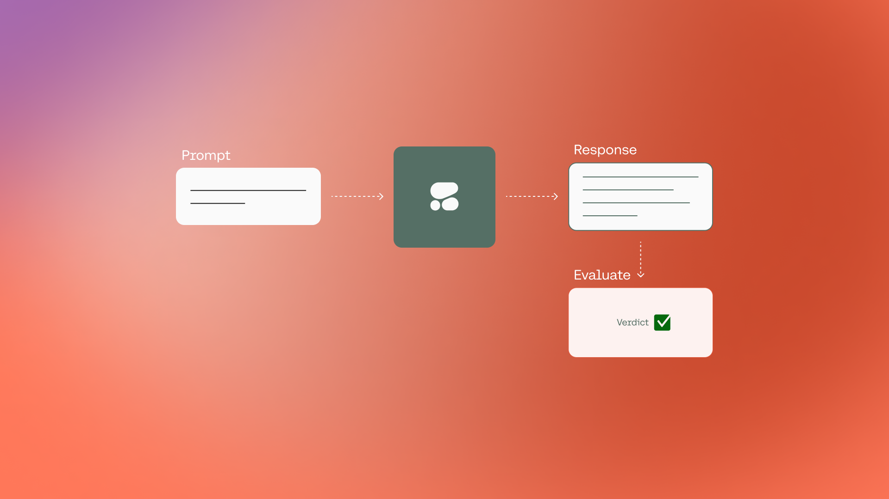
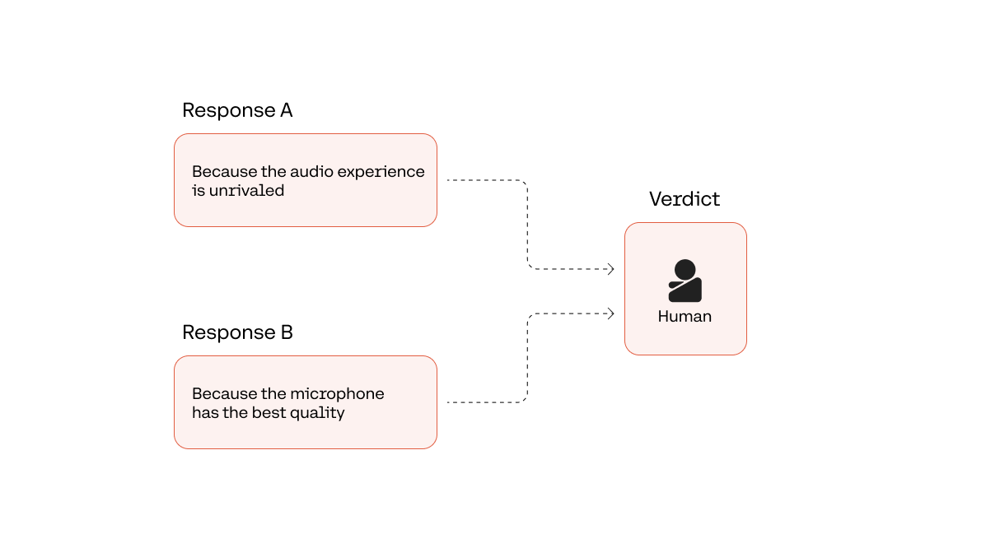
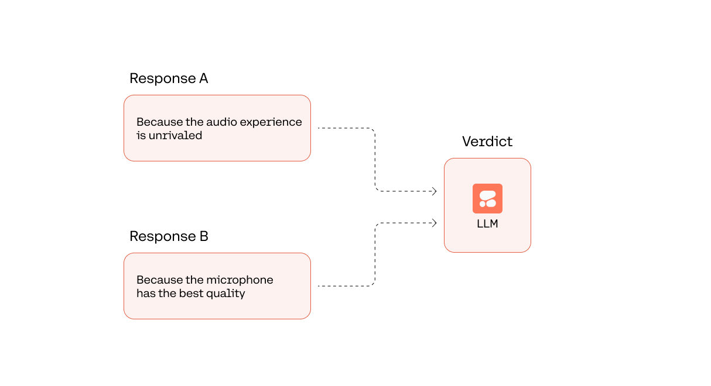
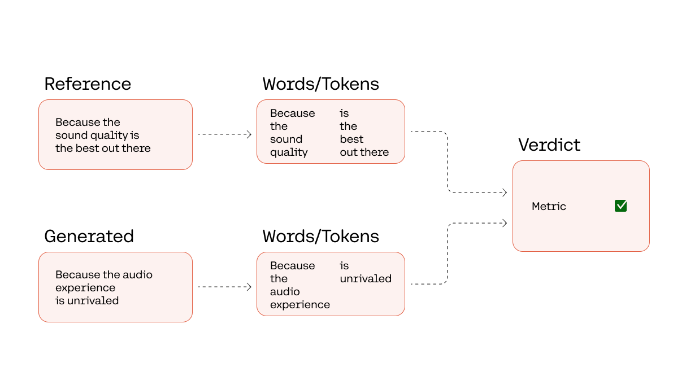

### Introduction

Large language models (LLMs) offer exciting new ways to build applications that leverage natural language as the interface. However, as impressive as this technology may be, it is crucial to evaluate the generated outputs of LLMs to ensure the quality of an application.

Evaluating LLM outputs is especially important because the outputs produced by these models are probabilistic – meaning the same prompt does not necessarily produce the same outputs every time. Evaluations provide a way to measure the quality level of the outputs, ensuring a great user experience.

In this chapter, we look at a few techniques for evaluating the outputs generated by an LLM.

### Real User Feedback

The gold standard for evaluation is gathering actual feedback from real application users. The best way to gain insights into an application’s quality and usefulness is by collecting feedback from users who interact with the application. In contrast, the rest of the methods we’ll discuss are all proxies for understanding real user experience and behaviors.

The specific tactics for gathering user feedback can come in different forms, for example:

- **Explicit feedback**: By implementing features to gather user feedback, such as thumbs up/down for an output, rating the output, and more
- **Implicit feedback**: By observing user behaviors, such as considering ignored outputs as negatives, analyzing time spent on the output, and more

This creates a flywheel for continuously improving an application. As more users start using the application, more data becomes available to inform the effectiveness of an application, providing signals on areas for improvement.

But, of course, the challenge is that this can happen only _after_ we deploy the application and users have been using it for a while. So, we must also perform evaluations before an application is deployed. For this, let’s look at alternative evaluation methods.

### Human Evaluation

The next best option is to have human annotators evaluate the outputs of an application in the pre-deployment stage. A typical evaluation approach requires building a test dataset, and evaluation is performed against this test dataset.




Let’s look at a question-answering example. Here, we have one test data point: the prompt asks a question about a headphone product given a user review. The evaluation task is to rate the response generated by the LLM.

```
Given the following user review, answer the question.

User review: The CO-1T is a great pair of headphones! The sound quality is the best out there, and I can hear every detail of my music.

Question: Why is the CO-1T a great wireless headphone?
```

And let’s suppose that this is the generated response.

```
"Because the audio experience is unrivaled"
```

There are several ways to approach evaluation for this response, as follows.

#### Reference

Here, the evaluator would compare each test data point against the ground truth of an ideal response.

With our example, the ideal response might be, “Because the sound quality is the best out there.” Based on this, the evaluator provides a Yes/No judgment on whether the generated response provides an accurate response.

But this approach requires the ground truth to be constructed beforehand. Given that no two use cases are quite the same, this means having to construct ground truth for each prompt and application. Moreover, the quality of the ground truth directly affects the evaluation outcome – if not constructed correctly, it can produce misleading results.

#### Scoring

Here, the evaluator would evaluate the generated response by assigning a score, such as a rating between 0 and 10. There is no ground truth as a reference, so it’s up to the evaluator to provide a verdict on the quality of an output.

The score can be a single score or a set of scores, and it can be broad or granular, depending on the use case. For example, a creative writing task might require more granular scoring for different output characteristics, such as fluency, interestingness, and conciseness.

An evaluation criterion can be a score along a scale, and it can also be a check against a flag. For example, a summarization task might require checking whether the output is consistent and does not generate content that doesn't exist in the actual document. A specialized task might require checking for specific rules, such as the number of syllables in a haiku.

#### A/B Testing

Here, the evaluator would be given a pair of LLM-generated responses and asked to rate the better response. This is useful for comparing an application’s quality over different time snapshots or different sets of configurations, such as prompts and parameters.

With our example, let’s suppose the evaluator is tasked to compare the following two responses to our user question above.

```
1. "Because the audio experience is unrivaled"
2. "Because the microphone has the best quality"
```

We can probably agree that the winning response should be the first one (“Because the audio experience is unrivaled") as it answers the question accurately, while the second response (“Because the microphone has the best quality”) talks about the microphone’s quality instead of the sound quality.

The challenge with human evaluation is that it cannot be scaled efficiently. The cost and time incurred are significantly higher than the alternative methods, which can be automated.

Another challenge is that human evaluation is subjective – the verdict from one evaluator may not be the same as another. The example above is relatively straightforward, but in more challenging tasks, there will be more ambiguity and room for interpretation about what makes a response good or bad. Many factors can influence an evaluator’s verdict, such as expertise, style, and biases, impacting the evaluation outcome.

### LLM-Generated Evaluation

An alternative to human evaluation is to have an LLM to evaluate the output. With the same setup as above, this is done by having a prompt instructing the LLM to provide the verdict of a generated answer against the reference.




Any human evaluation paradigms that we discussed (reference, scoring, and A/B testing) could be replicated using LLM-generated evaluation.

The example below uses the Command model to perform an A/B testing evaluation for the same question-answering task. The model's task is to choose the winning response between two responses to the question.

```python PYTHON
# Add text to evaluate
ref_answer = "Because the sound quality is the best out there"
gen_answers = [
    "Because the audio experience is unrivaled",
    "Because the microphone has the best quality",
]

# Run evaluation
for gen_answer in gen_answers:
    prompt = f"""User review: The CO-1T is a great pair of headphones! The sound quality is the \
    best out there, and I can hear every detail of my music.
    Question: Why is the CO-1T a great headphone?
    Answer #1: {gen_answers[0]}
    Answer #2: {gen_answers[1]}

    Given the question about the user review, state whether Answer #1 or Answer #2 provides \
    the more accurate answer."""

    response = (
        co.generate(prompt=prompt, max_tokens=50, temperature=0)
        .generations[0]
        .text
    )
    print(response)
```

The generated verdict is “Answer #1”, which is what we expect the winning response should be.

```
Answer #1
```

This approach is promising as it eliminates the cost and time constraints of human evaluation, but the jury is still out on whether it can surpass human evaluation in accuracy and quality. Its effectiveness on one task doesn’t guarantee that it will generalize to other tasks and domains, and the only way to know is by testing it on a specific application.

LLM-generated evaluation also faces the same subjectivity challenge as human evaluation. Many factors can affect a model’s evaluation outcome, such as the model’s overall capability, whether it’s being trained specifically to perform evaluations, the presence of training data that could introduce biases, and more.

### Word-Level Metrics

Another evaluation approach compares the reference and generated output at the word/token (or word/token group) level. Several evaluation metrics are available, such as [BLEU](https://en.wikipedia.org/wiki/BLEU?ref=txt.cohere.com&{query}), [ROUGE](https://en.wikipedia.org/wiki/ROUGE_(metric)?ref=txt.cohere.com&{query}), [Perplexity](https://en.wikipedia.org/wiki/Perplexity?ref=txt.cohere.com&{query}), and [BERTScore](https://arxiv.org/abs/1904.09675?ref=txt.cohere.com&{query}).




Let’s look at an example with [ROUGE](https://aclanthology.org/W04-1013.pdf?ref=txt.cohere.com&{query}), originally created for evaluating summaries. It measures the number of matching “n-grams” between the reference and generated text. An N-gram is a contiguous sequence of \`n\` items in a text, where \`n\` can be 1, 2, and so on. To keep it simple, we’ll use \`n=1\`, also called “unigrams.” For example, in the sentence “I love cats,” the unigrams are “I,” “love,” and “cats.”

We calculate the precision, recall, and F1-score of the n-grams of the question-answering task against a reference answer of “Because the sound quality is the best out there.”

- **Precision** is the ratio of the count of matching unigrams divided by the count of unigrams in the generated text
- **Recall** is the ratio of the count of matching unigrams divided by the count of unigrams in the reference text
- **F1-score** is calculated from precision and recall with the following formula: 2 \* (precision \* recall) / (precision + recall)

Here is an example using ROUGE:

```python PYTHON
from collections import Counter


def rouge_1(reference, candidate):
    # Turn into unigrams
    reference_words = reference.split()
    candidate_words = candidate.split()

    # Compute the number of overlapping words
    reference_count = Counter(reference_words)
    candidate_count = Counter(candidate_words)
    overlap = sum(
        min(candidate_count[w], reference_count[w])
        for w in candidate_count
    )

    # Compute precision, recall, and F1 score
    recall = overlap / len(reference_words)
    precision = overlap / len(candidate_words)
    f1 = 2 * (recall * precision) / (recall + precision)

    # Return resuls
    return {"recall": recall, "precision": precision, "f1": f1}


for idx, gen_answer in enumerate(gen_answers):
    result = rouge_1(ref_answer, gen_answer)
    print(f"Answer #{idx+1}")
    print(f"Precision: {result['precision']:.2f}")
    print(f"Recall: {result['recall']:.2f}")
    print(f"F1-Score: {result['f1']:.2f}")
    print("\n")
```

This gives the following outcome.

```
Answer #1
Precision: 0.50
Recall: 0.33
F1-Score: 0.40


Answer #2
Precision: 0.71
Recall: 0.56
F1-Score: 0.63
```

Here, the second generated answer scored higher than the first in precision, recall, and F1-score, which is not the expected outcome. This is because it has more unigram overlaps with the reference answer, for example, with the words “best” and “quality.”

This is an example where word-level metrics may fall short. They can be handy because they are easy to interpret and their implementation is fast and cheap, but they may not capture the overall meaning and accuracy when comparing two pieces of text.

### Conclusion

This chapter looked at a few techniques for evaluating LLM outputs, from human evaluations to automated ones.

There is a trade-off to be considered: on the one hand, automated evaluations are much more cost and time-efficient, which makes them practical options in some cases, such as in the early prototyping stages. On the other hand, human evaluations are still the gold standard for getting the strongest signal on an application's accuracy and usefulness.

It’s also worth noting that this chapter looks at evaluating LLM outputs in general without making any assumptions about the actual task. In practice, there are other approaches not mentioned here that better suit specific tasks, such as code execution or information extraction.

Ultimately, each evaluation approach has its potential pitfalls. An evaluation outcome can only be considered reliable if we have first understood and mitigated the associated limitations.

### Original Source

This material comes from the post: [Evaluating LLM Outputs](https://cohere.com/llmu/evaluating-llm-outputs/).

