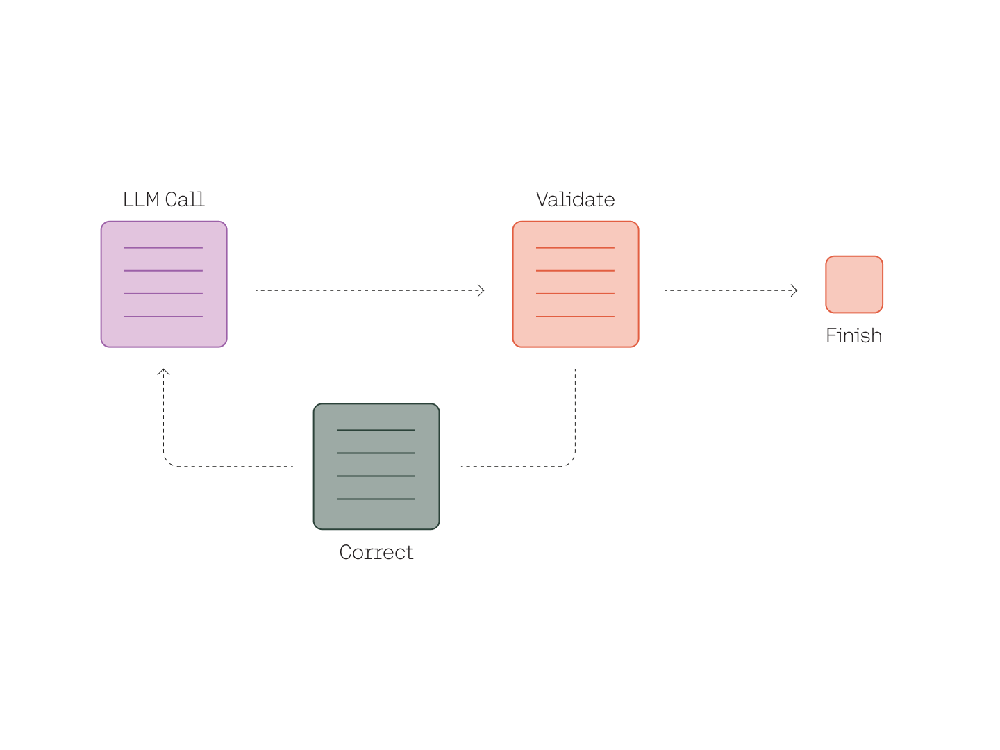
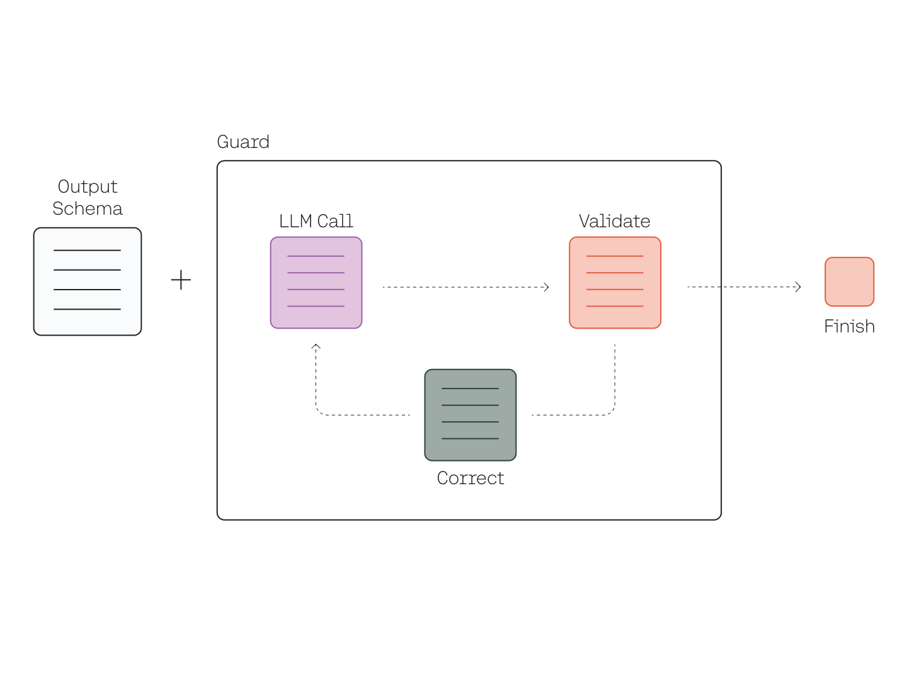

<br />

_This chapter was written in collaboration with the Guardrails AI team._

We’ll use [Cohere’s Python SDK](/reference/about?ref=txt.cohere.com&_gl=1*10s1b1q*_ga*Nzc0NDk3MTg1LjE2ODI5NTAxOTc.*_ga_CRGS116RZS*MTcxMzIzMTU0Ny41NTAuMS4xNzEzMjMxNTQ3LjYwLjAuMA..#python) for the code examples. Follow along in [this notebook](https://github.com/cohere-ai/notebooks/blob/main/notebooks/llmu/Validating_Large_Language_Model_Outputs.ipynb).

### Introduction

In previous chapters, we covered prompt engineering techniques to elicit the desired responses from a large language model (LLM).

However, one key property of LLMs that’s different from traditional software is that the output is probabilistic in nature. The same input (i.e., the prompt) may not always produce the same response. While this property makes it possible to build entirely new classes of natural language applications, it also means that those applications require a mechanism for validating their outputs.

Here’s an example. In [Chapter 1](/docs/constructing-prompts), we looked at a text extraction task of turning a list of bank invoices in a text document into a JSON object containing three fields: “Invoice Number,” “Merchant Name,” and “Account Number.” For brevity, we’ll turn it into a shorter version with the document containing just one invoice, as follows.

```python
prompt="""Turn the following information into a JSON string with the following keys: Invoice Number, Merchant Name, and Account Number.
Bank Invoice: INVOICE #0521 MERCHANT ALLBIRDS ACC XXX3846
"""
```

This produced an LLM response that followed exactly what we wanted, as shown below.

```json
  {
    "Invoice Number": "0521",
    "Merchant Name": "Allbirds",
    "Account Number": "XXXX3846"
  }
```

But how do we ensure we’ll get the same response every time? Perhaps another time, the output may miss some information, such as the returning incomplete information like this one.

```json
 {
    "Invoice Number": "0521"
 }
```

There are many other ways that a response may not match the expected structure. For example, what if the generated output contained fields we never specified? What if the document provided were more challenging to parse, causing an unclear response? What if we wanted to impose a rule that a field can only take up values within a specific range? In these cases and many others, we must add a step to validate the output.

In the rest of this chapter, we’ll look at LLM output validation and examples of how to implement it using an open-source package called Guardrails AI. This chapter comes with a [Google Colaboratory notebook](https://colab.research.google.com/github/cohere-ai/notebooks/blob/main/notebooks/Validating_Large_Language_Model_Outputs.ipynb?ref=txt.cohere.com).

### When Is Output Validation Needed

To build robust and production-ready LLM applications, the outputs need to be predictable. This helps to safeguard the application against unexpected behaviors and to ensure a reliable user experience. The following provides some example scenarios when output validation may be needed.

- **Structure compliance**: Some LLM applications require their output to go beyond just freeform text and instead follow a specific structure containing specific types of information. We looked at a toy example earlier of a text extraction task that requires a JSON output that follows a certain format. We can extend this to synthetic data generation cases, where the generated data must meet certain criteria.
- **Safe responses**: Due to their probabilistic nature, LLM applications require additional guardrails to ensure their outputs are safe, ethical, and privacy-preserving. For example, we may want to confirm that an output does not contain profanity. Alternatively, we may want to ensure that an output does not contain personally identifiable information (PII).
- **Semantic similarity**: In some applications, we may require the output to be similar enough to a target. For example, in text summarization tasks, we want to ensure that the summary does not deviate too far from the original document. For this, with the help of text embeddings, we want to validate that the summary and the document are similar enough semantically.
- **Valid choices**: We may also want the LLM to generate valid outputs per given definitions or constraints. For example, creating an LLM chess player will require the LLM output to generate only valid moves for a given board state. We could also validate that a generated piece of code is syntactically correct.
- **Quality assurance**: More generally, we may want to implement a validation step to ensure an LLM output meets a certain quality standard for a respective application’s use case and provides value to users.

We can bake these types of validation into an application by implementing a set of validation steps followed by an automated action to fix any gaps found. Let’s see how we can do this.

### Introduction to Guardrails AI

[Guardrails AI](http://guardrailsai.com/?ref=txt.cohere.com) is a Python package that enables developers to enhance the outputs of LLms by adding structural, type, and quality assurances. Guardrails helps developers with two key activities in a validation process:

- **Validation**: Performing output validation for LLMs in a similar style to the [Pydantic](https://docs.pydantic.dev/latest/?ref=txt.cohere.com) package, which is a data validation library for Python. Some examples are validating the structure of generated JSON output, identifying bias in generated text, and checking for bugs in generated code.
- **Correction**: Performing corrective actions based on the validation results, such as asking the LLM to re-generate the response or fixing the output directly.



Implementation-wise, the following steps are involved in incorporating Guardrails into an LLM application:

- **Create the output schema**: The `RAIL` spec contains the overall schema of the LLM output, the type info for each field, the quality criteria for each field, and the corrective action to be taken if the quality criteria are not met. It also contains the prompt template and any custom code for implementing the schema. Alternatively, the output schema can also be defined using Pydantic, which we’ll use in our example later.
- **Initialize a `Guard` object based on the schema**: The Guard class is the main entry point for using Guardrails. It is initialized using the output schema created in the previous step.
- **Wrap an LLM call with the `Guard` object**: The `gd.Guard` object wraps around an LLM API call to validate, structure, and correct the outputs.




Let’s look at an example of using Guardrails in a text extraction task. The task is to extract the information from a doctor’s note into a JSON object. The following is the doctor’s note.

```python
doctors_notes = """49 y/o Male with chronic macular rash to face & hair, worse in beard, eyebrows & nares.
Itchy, flaky, slightly scaly. Moderate response to OTC steroid cream"""
```

Specifically, we want our extracted information to contain the following fields:

- Patient's gender
- Patient's age
- A list of symptoms, each with a severity rating and an affected area
- A list of medications, each with information about the patient's response to the medication

#### Setup

First, let’s install the packages required: `cohere`, `guardrails-ai`, and `pydantic`.

```
pip install cohere guardrails-ai -q
```

We'll also need to download the validators required for this tutorial from [Guardrails Hub](https://www.guardrailsai.com/docs/hub/introduction), which is a place where you can find guardrails for common LLM validation use cases.

```
!guardrails hub install hub://guardrails/valid_range
!guardrails hub install hub://guardrails/valid_choices
```

Next, import the necessary packages and create a Cohere client.

```python
import cohere
import guardrails as gd
from guardrails.hub import ValidRange, ValidChoices
from pydantic import BaseModel, Field
from rich import print
from typing import List

# Create a Cohere client
co = cohere.Client(api_key="COHERE_API_KEY")
```

#### Define the Output Schema

Next, we define the output schema that defines what the LLM response should look like. As mentioned earlier, Guardrails provides an option to define the schema using Pydantic. We’ll use this option, and below is the schema we’ll use for the doctor notes extraction task.

```python
class Symptom(BaseModel):
    symptom: str = Field(..., description="Symptom that a patient is experiencing")
    affected_area: str = Field(
        ...,
        description="What part of the body the symptom is affecting",
        validators=[ValidChoices(["Head", "Face", "Neck", "Chest"], on_fail="reask")]
    )

class CurrentMed(BaseModel):
    medication: str = Field(..., description="Name of the medication the patient is taking")
    response: str = Field(..., description="How the patient is responding to the medication")


class PatientInfo(BaseModel):
    gender: str = Field(..., description="Patient's gender")
    age: int = Field(..., description="Patient's age", validators=[ValidRange(0, 100)])
    symptoms: List[Symptom] = Field(..., description="Symptoms that the patient is experiencing")
    current_meds: List[CurrentMed] = Field(..., description="Medications that the patient is currently taking")
```

In the schema, we defined a few “validators,” a Guardrails feature that lets us define the type of validation to perform. One example is `ValidChoices`, useful for situations where we want to enforce that a response can only be within a predefined list of items. In our example, in the `symptom` field, the value can only be one of head, neck, or chest. And if the generated response doesn’t fulfill this criteria, it will be re-prompted. This is shown by the `on_fail` setting that triggers a `reask`.

The [Guardrails documentation](https://docs.guardrailsai.com/concepts/validators/?ref=txt.cohere.com) provides more information about the types of validators in Guardrails.

#### Initialize a Guard Object Based on the Schema

Next, we initialize a `Guard` object based on the schema we have defined.

First, we define the base instruction prompt for the LLM as follows.

```python
PROMPT = """Given the following doctor's notes about a patient,
please extract a dictionary that contains the patient's information.

${doctors_notes}

${gr.complete_json_suffix_v2}
"""
```

Then, we initialize a `Guard` object from the `PatientInfo` Pydantic model.

```python
# Initialize a Guard object from the Pydantic model PatientInfo
guard = gd.Guard.from_pydantic(PatientInfo, prompt=PROMPT)
print(guard.base_prompt)
```

Guardrails then uses this information to construct the full prompt for the LLM, which looks like the following example.

```
Given the following doctor's notes about a patient,
please extract a dictionary that contains the patient's information.

${doctors_notes}


Given below is XML that describes the information to extract from this document and the tags to extract it into.

<output>
    <string name="gender" description="Patient's gender"/>
    <integer name="age" description="Patient's age" format="guardrails/valid_range: min=0 max=100"/>
    <list name="symptoms" description="Symptoms that the patient is experiencing">
        <object>
            <string name="symptom" description="Symptom that a patient is experiencing"/>
            <string name="affected_area" description="What part of the body the symptom is affecting" 
format="guardrails/valid_choices: choices=['Head', 'Face', 'Neck', 'Chest']"/>
        </object>
    </list>
    <list name="current_meds" description="Medications that the patient is currently taking">
        <object>
            <string name="medication" description="Name of the medication the patient is taking"/>
            <string name="response" description="How the patient is responding to the medication"/>
        </object>
    </list>
</output>


ONLY return a valid JSON object (no other text is necessary), where the key of the field in JSON is the `name` 
attribute of the corresponding XML, and the value is of the type specified by the corresponding XML's tag. The JSON
MUST conform to the XML format, including any types and format requests e.g. requests for lists, objects and 
specific types. Be correct and concise.

Here are examples of simple (XML, JSON) pairs that show the expected behavior:
- `<string name='foo' format='two-words lower-case' />` => `{'foo': 'example one'}`
- `<list name='bar'><string format='upper-case' /></list>` => `{"bar": ['STRING ONE', 'STRING TWO', etc.]}`
- `<object name='baz'><string name="foo" format="capitalize two-words" /><integer name="index" format="1-indexed" 
/></object>` => `{'baz': {'foo': 'Some String', 'index': 1}}`
```

#### Wrap an LLM Call with the Guard Object

We’re ready to run an LLM call using the Cohere `Generate` endpoint. For this, we wrap the LLM call with the `Guard` object. This means it will take care of the validation and reasking (if any) until the final generated output fulfills the defined schema.

```python
# Wrap the Cohere API call with the `guard` object
response = guard(
    co.chat,
    prompt_params={"doctors_notes": doctors_notes},
    model='command-r-plus',
    temperature=0,
)

# Print the validated output from the LLM
print(response.validated_output)
```

And we get the final validated output as follows.

```json
{
    'gender': 'Male',
    'age': 49,
    'symptoms': [{'symptom': 'Chronic macular rash, itchy, flaky, slightly scaly', 'affected_area': 'Face'}],
    'current_meds': [{'medication': 'OTC steroid cream', 'response': 'Moderate response'}]
}
```

Behind the scenes, Guardrails performs the validation step on the output against the schema, raises any errors if there are mismatches, and triggers a reask. We can trace the execution steps as follows.

```python
guard.history.last.tree
```

The LLM call first returned the following response. However, notice that the `affected_area` field returned `"Face & Head"`, which did not fall within the options we had defined earlier (any of `"Head", "Face", "Neck", or "Chest"`).

```json
 {                                                                           
     "gender": "Male",                                                       
     "age": 49,                                                              
     "symptoms": [                                                           
         {                                                                   
             "symptom": "Chronic macular rash, itchy, flaky, slightly scaly",
             "affected_area": "Face & Head"                                  
         }                                                                   
     ],                                                                      
     "current_meds": [                                                       
         {                                                                   
             "medication": "OTC steroid cream",                              
             "response": "Moderate response"                                 
         }                                                                   
     ]                                                                       
 }
```

Guardrails captured this discrepancy by raising a `FieldReAsk` object containing the incorrect value, the error message, and other additional information.

```json
{                                                                                                  
    'gender': 'Male',                                                                              
    'age': 49,                                                                                     
    'symptoms': [                                                                                  
        {                                                                                          
            'symptom': 'Chronic macular rash, itchy, flaky, slightly scaly',                       
            'affected_area': FieldReAsk(                                                           
                incorrect_value='Face & Head',                                                     
                fail_results=[                                                                     
                    FailResult(                                                                    
                        outcome='fail',                                                            
                        metadata=None,                                                             
                        error_message="Value Face & Head is not in choices ['Head', 'Face', 'Neck',
'Chest'].",                                                                                        
                        fix_value=None                                                             
                    )                                                                              
                ],                                                                                 
                path=['symptoms', 0, 'affected_area']                                              
            )                                                                                      
        }                                                                                          
    ],                                                                                             
    'current_meds': [                                                                              
        {'medication': 'OTC steroid cream', 'response': 'Moderate response'}                       
    ]                                                                                              
}
```

Based on this information, it triggered another LLM call to re-generate the response. Here is the full prompt.

```
I was given the following JSON response, which had problems due to incorrect values.                   
                                                                                                    
{                                                                                                      
  "gender": "Male",                                                                                    
  "age": 49,                                                                                           
   "symptoms": [                                                                                       
     {                                                                                                 
       "symptom": "Chronic macular rash, itchy, flaky, slightly scaly",                                
       "affected_area": {                                                                              
         "incorrect_value": "Face & Head",                                                             
         "error_messages": [                                                                           
           "Value Face & Head is not in choices ['Head', 'Face', 'Neck', 'Chest']."                    
         ]                                                                                             
       }                                                                                               
     }                                                                                                 
   ],                                                                                                  
   "current_meds": [                                                                                   
     {                                                                                                 
       "medication": "OTC steroid cream",                                                              
       "response": "Moderate response"                                                                 
     }                                                                                                 
   ]                                                                                                     
 }                                                                                                       
                                                                                                         
 Help me correct the incorrect values based on the given error messages.                                 
                                                                                                         
 Given below is XML that describes the information to extract from this document and the tags to extract 
 it into.                                                                                                
                                                                                                         
 <output>                                                                                                
     <string name="gender" description="Patient's gender"/>                                              
     <integer name="age" description="Patient's age" format="guardrails/valid_range: min=0 max=100"/>    
     <list name="symptoms" description="Symptoms that the patient is experiencing">                      
         <object>                                                                                        
             <string name="symptom" description="Symptom that a patient is experiencing"/>               
             <string name="affected_area" description="What part of the body the symptom is affecting"   
 format="guardrails/valid_choices: choices=['Head', 'Face', 'Neck', 'Chest']"/>                          
         </object>                                                                                       
     </list>                                                                                             
     <list name="current_meds" description="Medications that the patient is currently taking">           
         <object>                                                                                        
             <string name="medication" description="Name of the medication the patient is taking"/>      
             <string name="response" description="How the patient is responding to the medication"/>     
         </object>                                                                                       
     </list>                                                                                             
 </output>                                                                                               
                                                                                                         
                                                                                                         
 ONLY return a valid JSON object (no other text is necessary), where the key of the field in JSON is the 
 `name` attribute of the corresponding XML, and the value is of the type specified by the corresponding  
 XML's tag. The JSON MUST conform to the XML format, including any types and format requests e.g.        
 requests for lists, objects and specific types. Be correct and concise. If you are unsure anywhere,     
 enter `null`.    
```

Guardrails then generated the final validated output, which now completely fulfills the schema.

```json
{                                                                     
  "gender": "Male",                                                   
  "age": 49,                                                          
  "symptoms": [                                                       
    {                                                                 
      "symptom": "Chronic macular rash, itchy, flaky, slightly scaly",
      "affected_area": "Face"                                         
    }                                                                 
  ],                                                                  
  "current_meds": [                                                   
    {                                                                 
      "medication": "OTC steroid cream",                              
      "response": "Moderate response"                                 
    }                                                                 
  ]                                                                   
}
```

### Conclusion

In this chapter, we looked at LLM output validation and how to implement it using Guardrails AI. Output validation is key to ensuring a generative AI application is robust and predictable enough to be deployed confidently.

