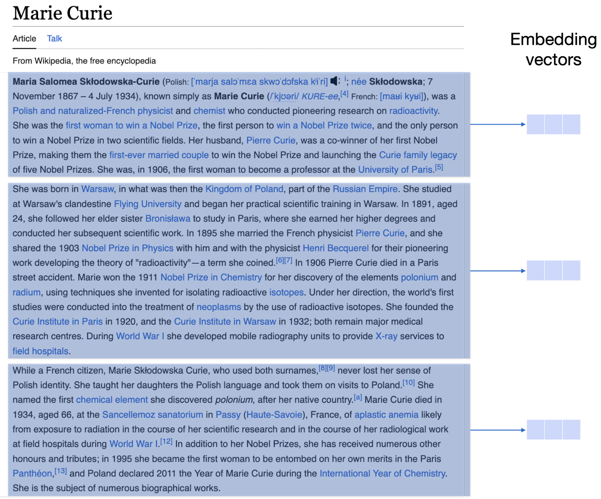

### Introduction

In the previous lesson you used keyword search to query Wikipedia, using two different queries:

- Who discovered penicillin?
- Who was the first person to win two Nobel prizes?

Keyword search did well with the first query, but not with the second one. The reason is that the second one has very popular words, which may appear in many documents that don’t necessarily contain the answer to the question. A way to obtain better results is to have the model ‘understand’ what the question is actually asking. This is where _semantic search_ comes into play. Semantic search is the ability to search by meaning -- not just keyword matching. Language models enable two of the main ways of semantic search: Dense retrieval, and reranking. The concepts of dense retrievals were illustrated in a chapter earlier in this module, so feel free to go back and take a look if you’d like a refresher. In this chapter, you'll see dense retrieval in action, with the same Wikipedia dataset and the same queries that you used for keyword search.

### Colab Notebook

This chapter uses the same [Colab notebook](https://colab.research.google.com/github/cohere-ai/cohere-developer-experience/blob/main/notebooks/llmu/End_To_End_Wikipedia_Search.ipynb) as the previous chapter, and we encourage you to follow it along as you read the chapter.

### Querying the Dataset Using Dense Retrieval

Dense retrieval uses a text embedding in order to search for documents that are similar to a query. If you’d like to learn more about embeddings, please take a look at the [embeddings chapter](/docs/text-embeddings). Embeddings assign a vector (long list of numbers) to each piece of text. One of the main properties in an embedding is that similar pieces of text go to similar vectors.

In short, dense retrieval consists of the following:

- Finding the embedding vector corresponding to the query
- Finding the embedding vectors corresponding to each of the responses (in this case, Wikipedia articles)
- Retrieving the response vectors that are closest to the query vector in the embedding


To use dense retrieval, we’ll first define the following function. Just like with keyword search, we’ll tell the vector database what properties we want from each retrieved document, and filter them to the English language (using results_lang).

```python PYTHON
def dense_retrieval(query, results_lang='en', num_results=10):

    nearText = {"concepts": [query]}
    properties = ["text", "title", "url", "views", "lang", "_additional
    {distance}"]

    # To filter by language
    where_filter = {
        "path": ["lang"],
        "operator": "Equal",
        "valueString": results_lang
        }
    response = (
        Client.query
        .get("Articles", properties)
        .with_near_text(nearText)
        .with_where(where_filter)
        .with_limit(num_results)
        .do()
    )

    result = response['data']['Get']['Articles']
    return result
```

### Chunking the Articles

This process of finding the closest documents to a query in an embedding will yield good results. However, articles may be very long and this could make things complicated. In order to have more granularity, we’ll split the articles by paragraph. This means that we’ll find the embedding vector corresponding to each paragraph of each article in the Wikipedia dataset. In that way, when the model retrieves the answer, it will actually output the paragraph that it found the most similar to the query, as well as the article in which this paragraph belongs.




**Back to Querying the Dataset**

Let’s review the two queries we used in the previous chapter.

- **Simple query:** “Who discovered penicillin?”
- **Hard query:** “What was the first person to win two Nobel prizes?”

Now, let’s look at the three top results for each query using dense retrieval. Recall that the responses here are at the paragraph level, so the model may sometimes retrieve the same article several times by outputting different paragraphs from the same article.

**Query 1:** “Who discovered penicillin?”

**Responses:**

- [Alexander Fleming](https://en.wikipedia.org/wiki?curid=1937): _“Sir Alexander Fleming (6 August 1881 - 11 March 1995) was a Scottish physician and microbiologist …”_
- [Penicillin](https://en.wikipedia.org/wiki?curid=23312): _“Penicillin was discovered in 1928 by Scottish scientist Alexander Fleming …”_
- [Penicillin](https://en.wikipedia.org/wiki?curid=23312): _“The term “penicillin” is defined as the natural product of “Penicillium” mould with antimicrobial activity. It was coined by Alexander Fleming ...”_

As you can see, dense retrieval did quite well by finding paragraphs that contain the exact answer. Now, let’s see how it did with the more complicated query.

**Query 2:** “Who was the first person to win two Nobel prizes?”

**Responses:**

- [Nobel prize in literature](<>): _“The Nobel prize in literature can be shared by two individuals …”_
- [Nobel prize](https://en.wikipedia.org/wiki?curid=23385442): _“Although posthumous nominations are not presently permitted, …”_
- [Nobel prize](https://en.wikipedia.org/wiki?curid=23385442): _“Few people have received two Nobel prizes. Marie Curie received the Physics prize …”_
- [Marie Curie](https://en.wikipedia.org/wiki?curid=20408): _“Marie Curie was the first woman to win a Nobel prize, the first person to win two Nobel prizes, …”_

As you can see, dense retrieval did much better than keyword search here. The second, third, and fourth results are in the correct documents (Nobel prize and Marie Curie), and in fact, the third and fourth results are in a paragraph which explicitly contains the answer. The reason for this is that the embedding captures the semantics of the text, and is able to see if two pieces of text have a similar meaning, even if they don’t necessarily share many words in common.

### Searching in Other Languages

As you may have noticed, the `dense_retrieval` function has a parameter called `results_lang` (see [code lab](https://colab.research.google.com/github/cohere-ai/cohere-developer-experience/blob/main/notebooks/End_To_End_Wikipedia_Search.ipynb#scrollTo=kbeNQtzAMagI&line=2&uniqifier=1)).  This parameter determines the language in which the search results are outputted. It is defaulted to English ('en') , but for this demo, it can also be set to German ('de'), French ('fr'), Spanish ('es'), Italian ('it'), Japanese ('ja'), Arabic ('ar'), (Simplified) Chinese ('zh'), Korean ('ko'), and Hindi ('hi'). However, the Cohere multilingual embedding handles [over 100 languages](https://cohere.com/blog/multilingual/).

For the first example, let's search for results to the English query "Who was the first person to win two Nobel prizes" in Arabic. The line of code is the following:

```
arabic_results = dense_retrieval(hard_query, results_lang='ar')
```

As you can see in the lab, the top 3 are the following:

- Nobel Prize [جائزة نوبل](https://ar.wikipedia.org/wiki?curid=1979)
- List of Nobel Laureates [قائمة الحاصلين على جائزة نوبل](https://ar.wikipedia.org/wiki?curid=1064904)
- Women in Society [امرأة](https://ar.wikipedia.org/wiki?curid=21220)

Now let's search for the French results to a query in Spanish. The query is "Quién descubrió la penicilina?" ("Who discovered penicillin?").

```
spanish_query = "Quien descubrio la penicilina?"
french_results = dense_retrieval(spanish_query, results_lang='fr')
```

The results are the following

- [Pénicilline](https://fr.wikipedia.org/wiki?curid=92634)
- [Pénicilline](https://fr.wikipedia.org/wiki?curid=92634)
- [Alexander Fleming](https://fr.wikipedia.org/wiki?curid=27093)

### Conclusion

Dense retrieval is a search method that uses a text embedding to find the semantically closest answers to a query. In our Wikipedia example, dense retrieval did quite well in the three queries. In the next chapter you’ll learn how to improve search results even further, with the Reranking method.

### Original Source

This material comes from the post [Using LLMs for Search with Dense Retrieval and Reranking](https://txt.cohere.com/using-llms-for-search/).
