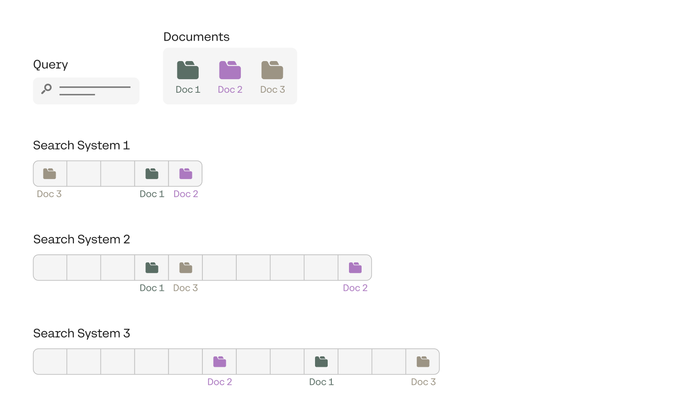
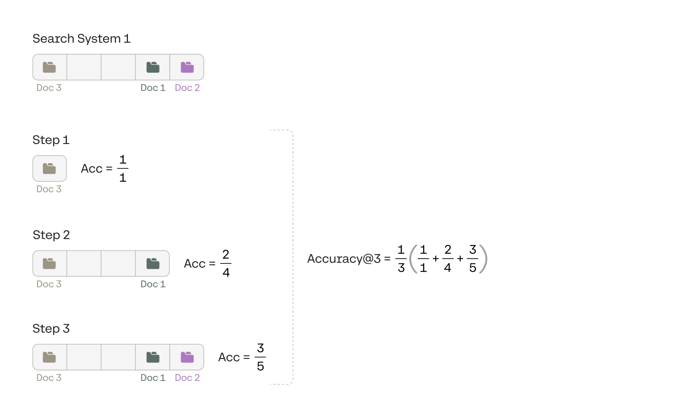
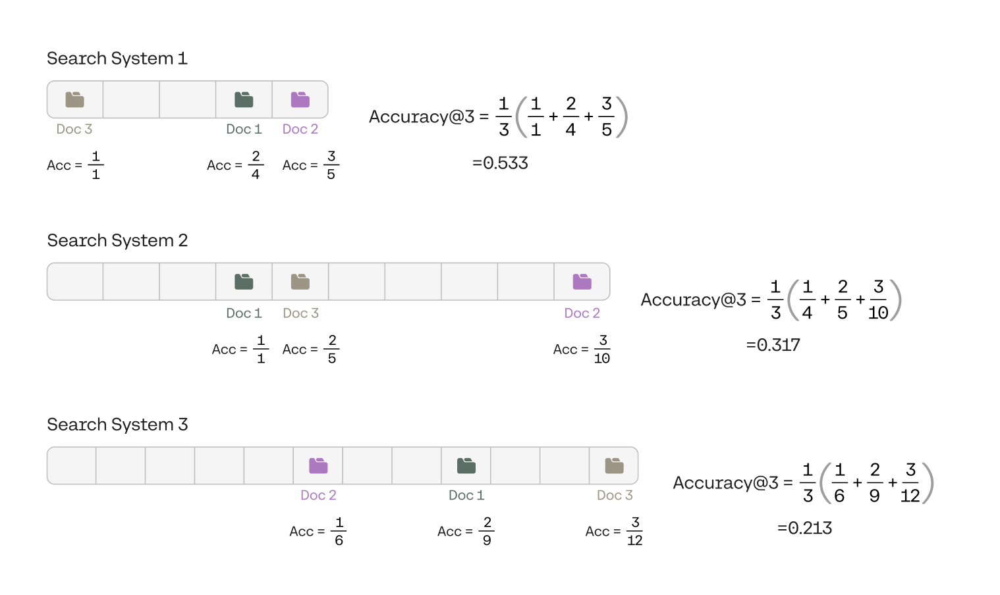

For any machine learning model, evaluation is as important as training. Classification (and regression) models are lucky in the sense that evaluation metrics for them are very straightforward, with metrics such as accuracy, precision, recall, and F1-score.

Recent advances in machine learning, such as generative models or search systems, have a slightly harder time being measured. This could be an attest to their multifunctionality, but it still needs to be addressed. In this article you will learn some of the most common ways to evaluate search systems, such as accuracy@k and NDCG@k.

### Accuracy@k

Let’s look at accuracy@k with a small example, for k=3. Imagine that we have a query, and a collection of documents. Our test set consists of 3 documents that are the most relevant to this query. Now, we have a large collection of documents, and we have three search systems, called Search System 1, 2, and 3. We’d like to evaluate these three search systems based on their performance on this query and the collection of documents. So we search for the query in the collection of documents using each of the search systems, and have them output the top documents that contain this query. For each of the systems, we make them output enough documents until the three documents in our test set appear.

The figure above shows the results.

- System 1 outputted the three documents in positions 1, 4, and 5.
- System 2 outputted them in positions 4, 5, and 10.
- System 3 outputted them in positions 6, 9, and 12.

From these results, clearly the best one is System 1, followed by System 2, and the worst one is System 3. However, as we mentioned at the beginning of this post, we’d like a metric to evaluate them. Here is where accuracy@k can come to our rescue.

To understand accuracy@k, imagine an ever-growing window that covers the documents. It starts with the first document, then it encompasses the second one, the third one, and so on. At each point, we calculate the accuracy of the search system, and by that, I mean the ratio between the number of documents in the test set, and the number of documents in the window. In our case it is called accuracy@3 because the test set contains 3 documents. We only consider this window at 3 (in general, k) stages, which is the first time it encompasses each one of the documents in the test set. Each time the window encompasses a new document in the test set, we calculate the accuracy of the system in that window. That is, the ratio between the number of documents in the test set inside the window, and the total number of documents in the window. The accuracy@3, then, is the average of the accuracies for each of the 3 (in general, k) accuracies we’ve already calculated. The calculation of accuracy@3 for System 1 can be seen in the image below.

Notice that the order of the documents in the test set doesn’t matter. In other words, we are not expecting the system to find the documents in the order 1, 2, and 3. If the system found document 3 first and then document 1, it is just as good. Below you can find the calculation for each of the three systems.

From the calculations, you can see that the accuracy@3 of the three systems are:

- System 1: 0.533
- System 2: 0.317
- System 3: 0.213

This confirms that indeed, System 1 was the best one, followed by System 2, and System 3 was the worst one, given the test set.

### Averaging Results

Normally, the test set wouldn’t correspond to just one query and a set of documents associated with this query. In order to get a full idea of how the system performs in different queries, a good test set would comprise of many queries, each one associated with a set of documents. In this case, we can evaluate accuracy@3 for each query (and its corresponding documents), and average them out. Thus we obtain the average accuracy@3. For example, say you have four different queries, each one with its corresponding documents, and you calculate the accuracy@3 for each query to be the following:

- Query 1: Accuracy@3 = 0.53
- Query 2: Accuracy@3 = 0.91
- Query 3: Accuracy@3 = 0.68
- Query 4: Accuracy@3 = 0.24

Then the Average accuracy@3 for this set of queries and their corresponding documents is the average of the above numbers, which is 0.59.

### Conclusion and Other Methods

In this chapter, you’ve learned a very useful way to evaluate search systems, called Accuracy@k. As you may imagine, there are other ways to evaluate them, and if you are interested in learning them, here are some links:

- [NDCG](https://en.wikipedia.org/wiki/Discounted_cumulative_gain) (Normalized Discounted Cumulative Gain)
